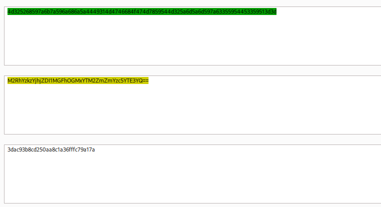

# Intercepting Web Requests

#### Questions

+ 1  Try intercepting the ping request on the server shown above, and change the post data similarly to what we did in this section. Change the command to read 'flag.txt'

Sửa payload thành

```
ip=1;cat flag.txt
```


# Intercepting Responses


# Repeating Requests

Chúng ta sẽ gửi request ban đầu sang repeater

Liệt kê ở thư mục gốc bạn sẽ thấy flag thứ 2


# Encoding/Decoding

Decode liên tục


# Proxying Tools


# Burp Intruder


# ZAP Fuzzer

Tôi vẫn dùng burpsuite thay cho ZAP


# ZAP Scanner

Tôi vẫn sẽ dùng Burpsuite cho tự động hóa


Liệt kê bạn sẽ thấy flag.txt nằm ở /, chỉ cần đọc nó


# Skills Assessment - Using Web Proxies

#### Questions


+ 2  The /lucky.php page has a button that appears to be disabled. Try to enable the button, and then click it to get the flag.

Mở dev tool, xóa trạng thái disabled, mỗi lần bấm lại phải cài tay lại từ đầu. Vậy chúng ta sẽ auto với BurpSuite


Dùng replace để loại bỏ disabled


Refresh lại trang và chúng ta có flag sau khi click


+ 2  The /admin.php page uses a cookie that has been encoded multiple times. Try to decode the cookie until you get a value with 31-characters. Submit the value as the answer.

Có đến 2 cookies ở đây, đừng lo, thử từng cái một nếu bạn không chắc, đối với mình, kinh nghiệm cho mình biết cái thứ 2 mới là cái cần decode.


Hex -> Url -> hash



Đếm xem đủ 31 char không :v


+ 5  Once you decode the cookie, you will notice that it is only 31 characters long, which appears to be an md5 hash missing its last character. So, try to fuzz the last character of the decoded md5 cookie with all alpha-numeric characters, while encoding each request with the encoding methods you identified above. (You may use the "alphanum-case.txt" wordlist from Seclist for the payload)

 Có lẽ cần 2 bước, đầu tiên chúng ta sẽ lấy full cookie 32 kí tự từ danh sách từ điển cho sẵn, đây là đoạn mã python3 sẽ chắp vá kí tự cuối cùng vào cookie còn thiếu:

```python
base_cookie='3dac93b8cd250aa8c1a36fffc79a17a'  
  
# print(len(base_cookie))  
  
with open('/usr/share/seclists/Fuzzing/alphanum-case.txt', 'r') as f:  
    with open('full_cookie.txt', 'w') as f2:  
        for line in f:  
            full_cookie = base_cookie + line.strip()  
            f2.write(full_cookie + '\n')
```

```zsh
python3 cookie.py
```


Tiếp theo bạn chỉ cần tải nó lên burpsuite sau đó ta chọn encode 2 lớp


Cuối cùng là lọc kết quả:


+ 2  You are using the 'auxiliary/scanner/http/coldfusion_locale_traversal' tool within Metasploit, but it is not working properly for you. You decide to capture the request sent by Metasploit so you can manually verify it and repeat it. Once you capture the request, what is the 'XXXXX' directory being called in '/XXXXX/administrator/..'?

