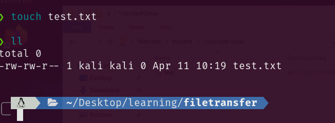
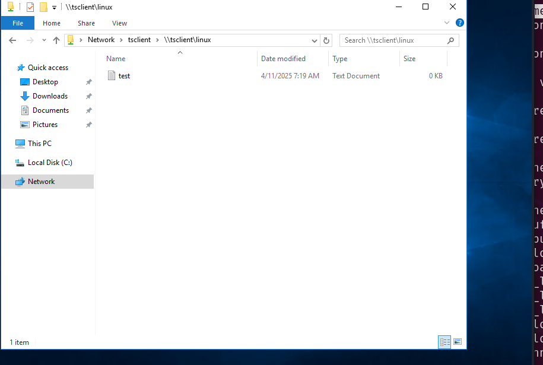

# Windows File Transfer Methods

- Download the file flag.txt from the web root using wget from the Pwnbox. Submit the contents of the file as your answer.
```zsh
❯ wget http://10.129.201.55/flag.txt
--2025-04-10 05:05:28--  http://10.129.201.55/flag.txt
Connecting to 10.129.201.55:80... connected.
HTTP request sent, awaiting response... 200 OK
Length: 32 [text/plain]
Saving to: ‘flag.txt’

flag.txt                                100%[============================================================================>]      32  --.-KB/s    in 0s      

2025-04-10 05:05:29 (1.62 MB/s) - ‘flag.txt’ saved [32/32]

                                                                                                                                                             
❯ cat flag.txt
b1a4ca918282fcd96004565521944a3b           
```
- Upload the attached file named upload_win.zip to the target using the method of your choice. Once uploaded, unzip the archive, and run "hasher upload_win.txt" from the command line. Submit the generated hash as your answer.
Trên máy VM:
```zsh
❯ wget https://academy.hackthebox.com/storage/modules/24/upload_win.zip
❯ python3 -m http.server 9999
Serving HTTP on 0.0.0.0 port 9999 (http://0.0.0.0:9999/) ...
```

```zsh
❯ xfreerdp3 /u:htb-student /p:'HTB_@cademy_stdnt!' /v:10.129.201.55
```

Trên máy Windows:
```powershell
(New-Object Net.WebClient).DownloadFile('http://10.10.14.131:9999/upload_win.zip','C:\Users\htb-student\Desktop\upload_win.zip')

hasher upload_win.zip
```

- Connect to the target machine via RDP and practice various file transfer operations (upload and download) with your attack host. Type "DONE" when finished.


# **Linux File Transfer Methods**

- Download the file flag.txt from the web root using Python from the Pwnbox. Submit the contents of the file as your answer.

```zsh
❯ curl -O http://10.129.185.40/flag.txt
  % Total    % Received % Xferd  Average Speed   Time    Time     Time  Current
                                 Dload  Upload   Total   Spent    Left  Speed
100    33  100    33    0     0     60      0 --:--:-- --:--:-- --:--:--    60
                                                                                                                                                             
❯ cat flag.txt
5d21cf3da9c0ccb94f709e2559f3ea50
```


Trên máy VM:
```zsh
❯ curl -O https://academy.hackthebox.com/storage/modules/24/upload_nix.zip
❯ sudo python3 -m http.server 80
```

SSH shell sang target
```zsh
❯ ssh htb-student@10.129.185.40
```
- Upload the attached file named upload_nix.zip to the target using the method of your choice. Once uploaded, SSH to the box, extract the file, and run "hasher extracted file" from the command line. Submit the generated hash as your answer.


Trên máy target:
```bash
htb-student@nix04:~$ curl -O http://10.10.14.131/upload_nix.zip
htb-student@nix04:~$ gunzip -S .zip upload_nix.zip
htb-student@nix04:~$ hasher upload_nix 
159cfe5c65054bbadb2761cfa359c8b0
```

# Miscellaneous File Transfer Methods

Trên máy VM:

```zsh
❯ xfreerdp3 /u:htb-student /p:'HTB_@cademy_stdnt!' /v:10.129.227.147 /drive:linux,/home/kali/Desktop/learning/filetransfer
```

Trên target vào `File Explorer -> Network -> tsclient`



